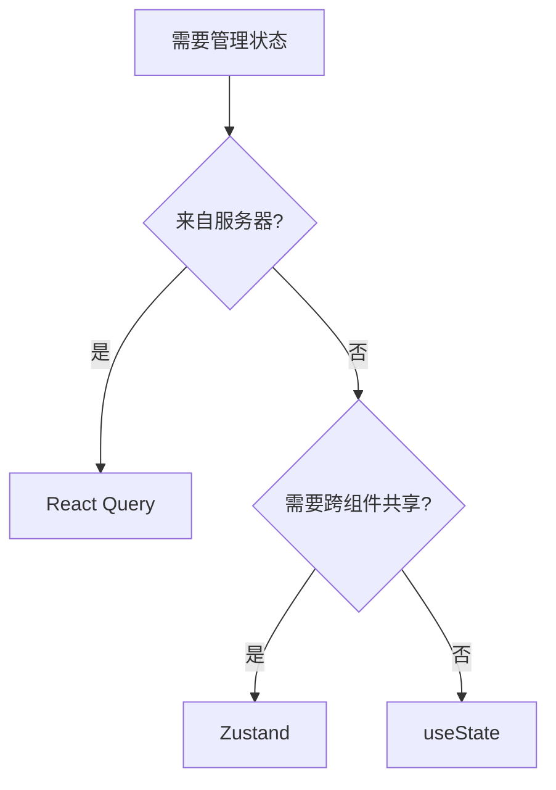

# React Native 状态管理

## 状态管理策略

```
┌─────────────────────────────────────────────────────────────────┐
│                      State Categories                            │
├─────────────────────────────────────────────────────────────────┤
│  Server State (React Query)                                      │
│  ├── API 响应数据                                                │
│  ├── 缓存管理                                                    │
│  └── 同步/刷新逻辑                                               │
├─────────────────────────────────────────────────────────────────┤
│  Client State (Zustand)                                          │
│  ├── 认证状态                                                    │
│  ├── 用户设置                                                    │
│  ├── 播放器状态                                                  │
│  └── 学习进度                                                    │
├─────────────────────────────────────────────────────────────────┤
│  UI State (React useState)                                       │
│  ├── 表单输入                                                    │
│  ├── 模态框状态                                                  │
│  └── 临时 UI 状态                                                │
└─────────────────────────────────────────────────────────────────┘
```

## Zustand Store 架构

### Store 结构模式

```
┌─────────────────────────────────────────────────────────────────┐
│                        Zustand Store                             │
├─────────────────────────────────────────────────────────────────┤
│  State                                                           │
│  ├── 数据字段                                                    │
│  └── 加载/错误状态                                               │
├─────────────────────────────────────────────────────────────────┤
│  Actions                                                         │
│  ├── 同步操作 (set)                                              │
│  └── 异步操作 (async)                                            │
├─────────────────────────────────────────────────────────────────┤
│  Middleware                                                      │
│  ├── persist (AsyncStorage)                                      │
│  ├── immer (不可变更新)                                          │
│  └── devtools (调试)                                             │
└─────────────────────────────────────────────────────────────────┘
```

### 全局 Store

#### authStore

```
┌─────────────────────────────────────────────────────────────────┐
│                        authStore                                 │
├─────────────────────────────────────────────────────────────────┤
│  State                                                           │
│  ├── user: User | null                                          │
│  ├── accessToken: string | null                                 │
│  ├── refreshToken: string | null                                │
│  ├── isAuthenticated: boolean                                   │
│  ├── isLoading: boolean                                         │
│  └── isGuestMode: boolean                                       │
├─────────────────────────────────────────────────────────────────┤
│  Actions                                                         │
│  ├── login(credentials)                                         │
│  ├── socialLogin(provider, token)                               │
│  ├── logout()                                                   │
│  ├── refreshToken()                                             │
│  ├── updateProfile(data)                                        │
│  └── setGuestMode(enabled)                                      │
├─────────────────────────────────────────────────────────────────┤
│  Persistence                                                     │
│  └── partialize: user, tokens, isGuestMode                      │
└─────────────────────────────────────────────────────────────────┘
```

#### settingsStore

```
┌─────────────────────────────────────────────────────────────────┐
│                       settingsStore                              │
├─────────────────────────────────────────────────────────────────┤
│  State                                                           │
│  ├── theme: 'light' | 'dark' | 'system'                         │
│  ├── language: 'en' | 'zh-Hans' | 'zh-Hant'                     │
│  ├── fontSize: number                                           │
│  ├── fontFamily: string                                         │
│  ├── lineSpacing: number                                        │
│  ├── notificationsEnabled: boolean                              │
│  ├── autoPlayNext: boolean                                      │
│  └── dailyGoalMinutes: number                                   │
├─────────────────────────────────────────────────────────────────┤
│  Actions                                                         │
│  ├── setTheme(theme)                                            │
│  ├── setLanguage(lang)                                          │
│  ├── setReaderSettings(settings)                                │
│  ├── setNotifications(enabled)                                  │
│  └── setDailyGoal(minutes)                                      │
├─────────────────────────────────────────────────────────────────┤
│  Persistence                                                     │
│  └── 全部持久化                                                   │
└─────────────────────────────────────────────────────────────────┘
```

### Feature Store

#### audioPlayerStore

```
┌─────────────────────────────────────────────────────────────────┐
│                     audioPlayerStore                             │
├─────────────────────────────────────────────────────────────────┤
│  State                                                           │
│  ├── currentBook: Book | null                                   │
│  ├── currentChapter: number                                     │
│  ├── isPlaying: boolean                                         │
│  ├── playbackSpeed: number (0.5 - 2.0)                          │
│  ├── position: number (ms)                                      │
│  ├── duration: number (ms)                                      │
│  ├── volume: number (0 - 1)                                     │
│  ├── sleepTimer: number | null                                  │
│  └── isLoading: boolean                                         │
├─────────────────────────────────────────────────────────────────┤
│  Actions                                                         │
│  ├── loadAudiobook(bookId)                                      │
│  ├── play() / pause() / stop()                                  │
│  ├── seekTo(position)                                           │
│  ├── setPlaybackSpeed(speed)                                    │
│  ├── setVolume(volume)                                          │
│  ├── setSleepTimer(minutes)                                     │
│  ├── nextChapter() / previousChapter()                          │
│  └── updatePosition(position)                                   │
├─────────────────────────────────────────────────────────────────┤
│  Persistence                                                     │
│  └── playbackSpeed, volume                                      │
└─────────────────────────────────────────────────────────────────┘
```

#### learningStore

```
┌─────────────────────────────────────────────────────────────────┐
│                      learningStore                               │
├─────────────────────────────────────────────────────────────────┤
│  State                                                           │
│  ├── todayMinutes: number                                       │
│  ├── todayWords: number                                         │
│  ├── streakDays: number                                         │
│  ├── sessionStartTime: Date | null                              │
│  ├── currentSessionMinutes: number                              │
│  └── weeklyStats: WeeklyStats[]                                 │
├─────────────────────────────────────────────────────────────────┤
│  Actions                                                         │
│  ├── startSession()                                             │
│  ├── endSession()                                               │
│  ├── updateProgress(minutes, words)                             │
│  ├── syncWithServer()                                           │
│  └── fetchWeeklyStats()                                         │
└─────────────────────────────────────────────────────────────────┘
```

## React Query 配置

### QueryClient 设置

```
┌─────────────────────────────────────────────────────────────────┐
│                    QueryClient Config                            │
├─────────────────────────────────────────────────────────────────┤
│  Default Options                                                 │
│  ├── queries:                                                   │
│  │   ├── staleTime: 5 * 60 * 1000 (5分钟)                       │
│  │   ├── cacheTime: 24 * 60 * 60 * 1000 (24小时)                │
│  │   ├── retry: 2                                               │
│  │   ├── refetchOnReconnect: true                               │
│  │   └── refetchOnWindowFocus: false                            │
│  └── mutations:                                                 │
│      └── retry: 1                                               │
└─────────────────────────────────────────────────────────────────┘
```

### Query Keys 结构

```
┌─────────────────────────────────────────────────────────────────┐
│                      Query Keys                                  │
├─────────────────────────────────────────────────────────────────┤
│  books                                                           │
│  ├── ['books', 'list', filters]                                 │
│  ├── ['books', 'detail', bookId]                                │
│  ├── ['books', 'search', query]                                 │
│  └── ['books', 'categories']                                    │
├─────────────────────────────────────────────────────────────────┤
│  library                                                         │
│  ├── ['library', 'books']                                       │
│  └── ['library', 'progress', bookId]                            │
├─────────────────────────────────────────────────────────────────┤
│  learning                                                        │
│  ├── ['learning', 'today']                                      │
│  ├── ['learning', 'weekly']                                     │
│  ├── ['learning', 'monthly']                                    │
│  └── ['learning', 'streak']                                     │
├─────────────────────────────────────────────────────────────────┤
│  vocabulary                                                      │
│  ├── ['vocabulary', 'saved']                                    │
│  ├── ['vocabulary', 'review']                                   │
│  └── ['vocabulary', 'stats']                                    │
├─────────────────────────────────────────────────────────────────┤
│  ai                                                              │
│  ├── ['ai', 'explain', text]                                    │
│  └── ['ai', 'translate', text, targetLang]                      │
└─────────────────────────────────────────────────────────────────┘
```

## 状态持久化

### 持久化策略

```
┌─────────────────────────────────────────────────────────────────┐
│                    Persistence Strategy                          │
├─────────────────────────────────────────────────────────────────┤
│  Secure Store (expo-secure-store)                               │
│  ├── Access Token                                               │
│  ├── Refresh Token                                              │
│  └── 敏感用户数据                                                │
├─────────────────────────────────────────────────────────────────┤
│  AsyncStorage                                                    │
│  ├── User Profile (非敏感)                                      │
│  ├── Settings                                                   │
│  ├── 播放器设置                                                  │
│  └── 学习进度                                                    │
├─────────────────────────────────────────────────────────────────┤
│  SQLite (expo-sqlite)                                            │
│  ├── 离线书籍数据                                                │
│  ├── 词汇列表                                                    │
│  └── 阅读进度历史                                                │
├─────────────────────────────────────────────────────────────────┤
│  React Query Cache                                               │
│  └── API 响应缓存 (内存)                                         │
└─────────────────────────────────────────────────────────────────┘
```

### Zustand persist 配置

```
┌─────────────────────────────────────────────────────────────────┐
│                    Persist Configuration                         │
├─────────────────────────────────────────────────────────────────┤
│  name: 'store-name'                                             │
│  storage: AsyncStorage Adapter                                  │
│  partialize: (state) => ({...})  // 选择性持久化                 │
│  onRehydrateStorage: () => {     // 恢复后回调                   │
│    return (state, error) => {}                                  │
│  }                                                              │
│  version: 1                      // 版本控制                     │
│  migrate: (state, version) => {} // 迁移逻辑                     │
└─────────────────────────────────────────────────────────────────┘
```

## 状态选择决策树



## 常用 Hooks

### useAuth

```
功能: 认证状态与操作
返回:
├── user: User | null
├── isAuthenticated: boolean
├── isLoading: boolean
├── login: (credentials) => Promise
├── logout: () => Promise
└── socialLogin: (provider) => Promise
```

### useTheme

```
功能: 主题状态与切换
返回:
├── theme: 'light' | 'dark'
├── colors: ThemeColors
├── isDark: boolean
└── setTheme: (theme) => void
```

### useAudiobook

```
功能: 有声书播放控制
返回:
├── currentBook: Book | null
├── isPlaying: boolean
├── progress: number
├── play: () => void
├── pause: () => void
├── seekTo: (position) => void
└── setSpeed: (speed) => void
```

### useLearningStats

```
功能: 学习统计查询
返回:
├── todayStats: TodayStats
├── weeklyStats: WeeklyStats[]
├── streak: number
├── isLoading: boolean
└── refetch: () => void
```
