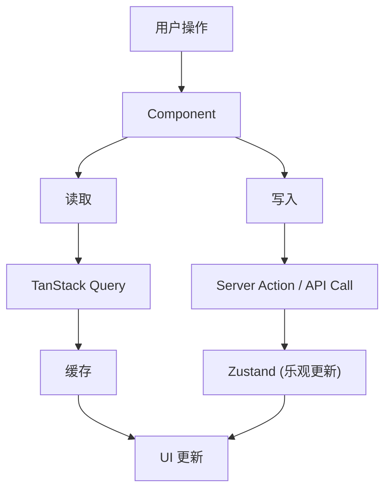
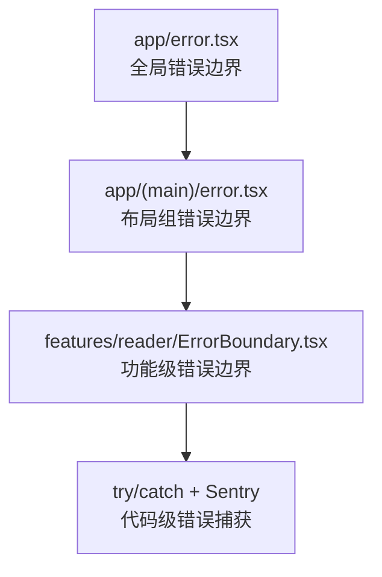

# Web 前端架构

> Next.js 16 App Router + 功能模块化设计

---

## 1. 架构概览

```
┌─────────────────────────────────────────────────────────────────┐
│                      Web 前端架构                                │
├─────────────────────────────────────────────────────────────────┤
│                                                                  │
│  ┌─────────────────────────────────────────────────────────┐    │
│  │                    Presentation Layer                    │    │
│  │  ┌───────────┐  ┌───────────┐  ┌───────────┐           │    │
│  │  │   Pages   │  │  Layouts  │  │Components │           │    │
│  │  │ (app/)    │  │ (RSC)     │  │  (ui/)    │           │    │
│  │  └─────┬─────┘  └─────┬─────┘  └─────┬─────┘           │    │
│  └────────┼──────────────┼──────────────┼──────────────────┘    │
│           │              │              │                        │
│  ┌────────┴──────────────┴──────────────┴──────────────────┐    │
│  │                    Feature Layer                         │    │
│  │  ┌─────────┐ ┌─────────┐ ┌─────────┐ ┌─────────┐       │    │
│  │  │ reader  │ │   ai    │ │ library │ │learning │       │    │
│  │  │         │ │         │ │         │ │         │       │    │
│  │  │actions/ │ │actions/ │ │actions/ │ │actions/ │       │    │
│  │  │components│ │components│ │components│ │components│       │    │
│  │  │hooks/   │ │hooks/   │ │hooks/   │ │hooks/   │       │    │
│  │  │stores/  │ │stores/  │ │stores/  │ │stores/  │       │    │
│  │  │types/   │ │types/   │ │types/   │ │types/   │       │    │
│  │  └─────────┘ └─────────┘ └─────────┘ └─────────┘       │    │
│  └─────────────────────────────────────────────────────────┘    │
│           │              │              │                        │
│  ┌────────┴──────────────┴──────────────┴──────────────────┐    │
│  │                    Data Layer                            │    │
│  │  ┌───────────┐  ┌───────────┐  ┌───────────┐           │    │
│  │  │  Zustand  │  │  TanStack │  │ Server    │           │    │
│  │  │  Stores   │  │  Query    │  │ Actions   │           │    │
│  │  └───────────┘  └───────────┘  └───────────┘           │    │
│  └─────────────────────────────────────────────────────────┘    │
│           │                                                      │
│  ┌────────┴────────────────────────────────────────────────┐    │
│  │                    Infrastructure                        │    │
│  │  ┌───────────┐  ┌───────────┐  ┌───────────┐           │    │
│  │  │  API      │  │  Storage  │  │  Auth     │           │    │
│  │  │  Client   │  │  (R2/IDB) │  │ (NextAuth)│           │    │
│  │  └───────────┘  └───────────┘  └───────────┘           │    │
│  └─────────────────────────────────────────────────────────┘    │
│                                                                  │
└─────────────────────────────────────────────────────────────────┘
```

---

## 2. 目录结构规范

### 2.1 功能模块结构

```
features/{module}/
├── actions/              # Server Actions
│   ├── index.ts
│   └── {action}.ts
├── components/           # 模块专属组件
│   ├── index.ts
│   └── {Component}.tsx
├── hooks/                # 模块专属 Hooks
│   ├── index.ts
│   └── use{Hook}.ts
├── stores/               # Zustand Store
│   ├── index.ts
│   └── {store}Store.ts
├── types/                # 类型定义
│   └── index.ts
└── utils/                # 工具函数
    └── index.ts
```

### 2.2 组件结构

```
components/
├── layout/               # 布局组件
│   ├── Header.tsx
│   ├── Sidebar.tsx
│   └── Footer.tsx
├── shared/               # 业务通用组件
│   ├── BookCard.tsx
│   └── LoadingState.tsx
└── ui/                   # 基础 UI 组件
    ├── button.tsx
    ├── dialog.tsx
    ├── dropdown-menu.tsx
    └── ... (23+ Radix 封装)
```

---

## 3. 路由架构

### 3.1 路由组织

```
app/
├── (auth)/               # 认证相关 (无主布局)
│   ├── _layout.tsx
│   ├── login/page.tsx
│   └── register/page.tsx
│
├── (main)/               # 主应用 (含侧边栏)
│   ├── _layout.tsx
│   ├── library/page.tsx
│   ├── explore/page.tsx
│   ├── learn/page.tsx
│   ├── vocabulary/page.tsx
│   ├── settings/page.tsx
│   ├── book/[id]/page.tsx
│   └── author/[id]/page.tsx
│
├── (reader)/             # 阅读器 (全屏)
│   ├── _layout.tsx
│   └── read/[id]/page.tsx
│
└── api/                  # API 路由
    └── auth/[...nextauth]/route.ts
```

### 3.2 路由组说明

| 路由组 | 布局 | 用途 |
|--------|------|------|
| (auth) | 无侧边栏，居中卡片 | 登录、注册 |
| (main) | 完整导航栏+侧边栏 | 主功能区 |
| (reader) | 全屏沉浸式 | 阅读器 |

---

## 4. 数据流架构

### 4.1 状态管理策略

```
┌─────────────────────────────────────────────────────────────────┐
│                    状态管理分层                                   │
├─────────────────────────────────────────────────────────────────┤
│                                                                  │
│  Server State (服务端状态)                                       │
│  └── TanStack Query                                             │
│      ├── 书籍列表、详情                                          │
│      ├── 用户信息                                                │
│      └── 自动缓存、重验证                                        │
│                                                                  │
│  Client State (客户端状态)                                       │
│  └── Zustand                                                    │
│      ├── 阅读器状态 (当前页、设置)                               │
│      ├── UI 状态 (侧边栏、弹窗)                                  │
│      └── 离线队列                                                │
│                                                                  │
│  Form State (表单状态)                                           │
│  └── React Hook Form + Zod                                      │
│      ├── 表单验证                                                │
│      └── 提交处理                                                │
│                                                                  │
│  URL State (URL 状态)                                           │
│  └── Next.js searchParams                                       │
│      ├── 筛选条件                                                │
│      └── 分页参数                                                │
│                                                                  │
└─────────────────────────────────────────────────────────────────┘
```

### 4.2 数据流向



---

## 5. 渲染策略

### 5.1 组件类型

| 类型 | 使用场景 | 示例 |
|------|----------|------|
| Server Component (RSC) | 静态内容、SEO 关键页面 | 书籍详情页 |
| Client Component | 交互式组件、状态管理 | 阅读器、表单 |
| Streaming | 大数据加载 | 书籍列表 |

### 5.2 渲染模式

```
┌─────────────────────────────────────────────────────────────────┐
│                    渲染模式选择                                   │
├─────────────────────────────────────────────────────────────────┤
│                                                                  │
│  Static (SSG)                                                   │
│  └── 首页、关于页、帮助文档                                      │
│                                                                  │
│  Dynamic (SSR)                                                  │
│  └── 用户相关页面 (需要认证)                                     │
│                                                                  │
│  Streaming                                                      │
│  └── 长列表页面 (使用 Suspense)                                  │
│                                                                  │
│  Client-only                                                    │
│  └── 阅读器 (重交互)                                             │
│                                                                  │
└─────────────────────────────────────────────────────────────────┘
```

---

## 6. API 通信

### 6.1 API 客户端封装

```
┌─────────────────────────────────────────────────────────────────┐
│                    API 通信架构                                  │
├─────────────────────────────────────────────────────────────────┤
│                                                                  │
│  lib/api/                                                       │
│  ├── client.ts          # Axios 实例配置                        │
│  ├── interceptors.ts    # 请求/响应拦截器                       │
│  ├── auth.ts            # 认证相关 API                          │
│  ├── books.ts           # 书籍相关 API                          │
│  ├── vocabulary.ts      # 词汇相关 API                          │
│  └── ai.ts              # AI 相关 API                           │
│                                                                  │
│  拦截器功能                                                      │
│  ├── 自动附加 Authorization Header                              │
│  ├── 统一错误处理                                                │
│  ├── Token 刷新                                                  │
│  └── 请求/响应日志                                               │
│                                                                  │
└─────────────────────────────────────────────────────────────────┘
```

### 6.2 Server Actions

```
┌─────────────────────────────────────────────────────────────────┐
│                    Server Actions 用法                           │
├─────────────────────────────────────────────────────────────────┤
│                                                                  │
│  适用场景                                                        │
│  ├── 表单提交                                                    │
│  ├── 数据变更 (增删改)                                           │
│  └── 敏感操作 (避免暴露 API Key)                                 │
│                                                                  │
│  不适用场景                                                      │
│  ├── 实时数据查询 (用 TanStack Query)                           │
│  └── 大文件上传 (用独立 API)                                     │
│                                                                  │
└─────────────────────────────────────────────────────────────────┘
```

---

## 7. 错误边界



---

## 8. 代码规范

### 8.1 命名规范

| 类型 | 规范 | 示例 |
|------|------|------|
| 组件文件 | PascalCase | `BookCard.tsx` |
| Hook 文件 | camelCase | `useBookReader.ts` |
| 工具函数 | camelCase | `formatDate.ts` |
| 类型文件 | camelCase | `book.types.ts` |
| 常量 | UPPER_SNAKE | `API_BASE_URL` |

### 8.2 导入顺序

```typescript
// 1. React/Next.js
import { useState, useEffect } from 'react';
import { useRouter } from 'next/navigation';

// 2. 第三方库
import { useQuery } from '@tanstack/react-query';
import { z } from 'zod';

// 3. 内部模块
import { Button } from '@/components/ui/button';
import { useAuthStore } from '@/features/auth/stores';

// 4. 类型
import type { Book } from '@/types';

// 5. 样式
import styles from './BookCard.module.css';
```

---

## 9. 相关文档

| 文档 | 说明 |
|------|------|
| [state-management.md](./state-management.md) | 状态管理详解 |
| [testing.md](./testing.md) | 测试策略 |
| [performance.md](./performance.md) | 性能优化 |

---

*最后更新: 2025-12-31*
