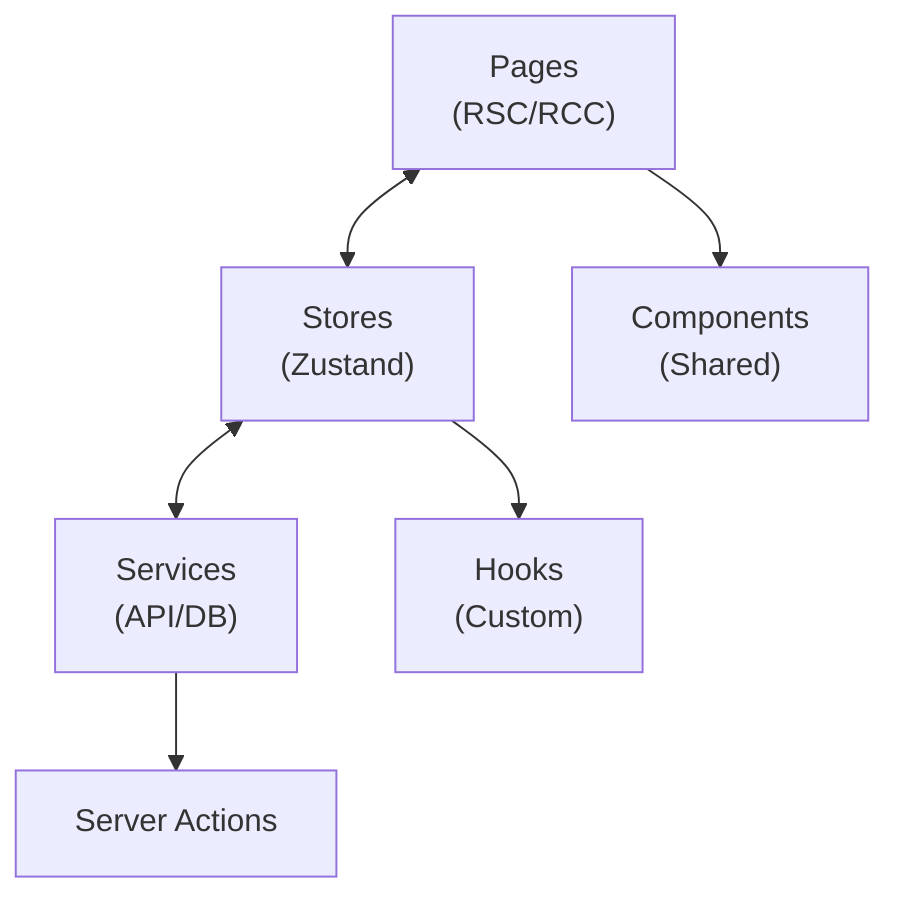

# Readmigo Web Client 实现方案

## 1. 概述

### 1.1 目标
开发功能与 iOS/Android 原生客户端 **100% 对齐** 的 Web 应用，提供跨平台一致的阅读体验，同时利用 Web 平台特性提供更便捷的访问方式。

### 1.2 产品定位
AI 原生英语原版书阅读学习应用，核心理念："Read any book. AI has your back."

### 1.3 技术选型理由

| 方案 | 优势 | 劣势 | 选择 |
|------|------|------|------|
| **Next.js 14+ (App Router)** | SSR/SSG、SEO 友好、RSC、强大生态 | 学习曲线稍陡 | ✅ 推荐 |
| Remix | 优秀的数据加载、渐进增强 | 生态较小 | 备选 |
| Vite + React | 轻量、构建快 | 无 SSR、SEO 差 | - |
| SvelteKit | 性能优秀 | 生态较小、团队熟悉度 | - |

---

## 2. 技术选型

### 2.1 开发环境

| 项目 | 配置 |
|------|------|
| **框架** | Next.js 14.2+ (App Router) |
| **语言** | TypeScript 5.x |
| **运行时** | Node.js 20+ / Edge Runtime |
| **样式** | Tailwind CSS 3.4+ |
| **包管理** | pnpm 9+ |
| **IDE** | VS Code + ESLint + Prettier |

### 2.2 架构模式



### 2.3 项目结构

```
readmigo-web/
├── app/                          # Next.js App Router
│   ├── (auth)/                   # 认证相关页面 (Route Group)
│   │   ├── login/
│   │   │   └── page.tsx
│   │   ├── signup/
│   │   │   └── page.tsx
│   │   └── layout.tsx
│   ├── (main)/                   # 主应用页面
│   │   ├── library/
│   │   │   └── page.tsx
│   │   ├── discover/
│   │   │   └── page.tsx
│   │   ├── learn/
│   │   │   └── page.tsx
│   │   ├── profile/
│   │   │   └── page.tsx
│   │   └── layout.tsx
│   ├── book/
│   │   ├── [id]/
│   │   │   └── page.tsx          # 书籍详情
│   │   └── [id]/read/
│   │       └── page.tsx          # 阅读器 (全屏)
│   ├── api/                      # API Routes
│   │   ├── auth/
│   │   └── webhooks/
│   ├── layout.tsx                # 根布局
│   ├── page.tsx                  # 首页/Landing
│   ├── globals.css
│   └── providers.tsx             # 客户端 Providers
│
├── src/
│   ├── features/                 # 功能模块
│   │   ├── auth/
│   │   │   ├── components/
│   │   │   ├── hooks/
│   │   │   ├── stores/
│   │   │   ├── actions/          # Server Actions
│   │   │   └── types/
│   │   ├── library/
│   │   ├── reader/
│   │   ├── ai/
│   │   ├── learning/
│   │   ├── audiobook/
│   │   ├── subscriptions/
│   │   ├── social/
│   │   ├── settings/
│   │   ├── search/
│   │   ├── messaging/
│   │   └── about/
│   │
│   ├── components/               # 共享组件
│   │   ├── ui/                   # 基础 UI (shadcn/ui)
│   │   │   ├── button.tsx
│   │   │   ├── card.tsx
│   │   │   ├── input.tsx
│   │   │   └── dialog.tsx
│   │   ├── layout/               # 布局组件
│   │   │   ├── header.tsx
│   │   │   ├── sidebar.tsx
│   │   │   └── footer.tsx
│   │   └── feedback/             # 反馈组件
│   │       ├── toast.tsx
│   │       └── loading.tsx
│   │
│   ├── hooks/                    # 全局 Hooks
│   │   ├── use-auth.ts
│   │   ├── use-theme.ts
│   │   └── use-media-query.ts
│   │
│   ├── stores/                   # Zustand 全局状态
│   │   ├── auth-store.ts
│   │   ├── settings-store.ts
│   │   └── index.ts
│   │
│   ├── lib/                      # 工具库
│   │   ├── api/
│   │   │   ├── client.ts         # Fetch 客户端
│   │   │   └── queries.ts        # React Query
│   │   ├── utils.ts              # 工具函数
│   │   └── constants.ts
│   │
│   ├── styles/                   # 样式
│   │   └── themes/
│   │
│   └── types/                    # 全局类型
│       ├── api.ts
│       └── index.ts
│
├── public/                       # 静态资源
│   ├── images/
│   ├── fonts/
│   └── icons/
│
├── messages/                     # i18n 翻译文件
│   ├── en.json
│   ├── zh-CN.json
│   └── zh-TW.json
│
├── next.config.js
├── tailwind.config.ts
├── tsconfig.json
├── package.json
└── README.md
```

---

## 3. 核心依赖库

---

## 4. 状态管理架构

---

## 5. API 服务层

---

## 6. 路由与页面

---

## 7. 模块功能对照

### 7.1 模块优先级

| 优先级 | 模块 | 说明 | 状态 |
|--------|------|------|------|
| P0 | Auth | 认证授权 | 待实现 |
| P0 | Onboarding | 新用户引导 | 待实现 |
| P0 | Library | 书架管理 | 待实现 |
| P0 | Reader | 阅读器 | 待实现 |
| P0 | AI | AI 辅助功能 | 待实现 |
| P1 | Learning | 词汇学习 | 待实现 |
| P1 | Audiobook | 有声书 | 待实现 |
| P1 | Subscriptions | 订阅支付 | 待实现 |
| P1 | Settings | 应用设置 | 待实现 |
| P1 | Search | 搜索功能 | 待实现 |
| P2 | Social | 社交功能 | 待实现 |
| P2 | Messaging | 客服消息 | 待实现 |
| P2 | Guest Mode | 访客模式 | 待实现 |
| P2 | i18n | 国际化 | 待实现 |
| P2 | About | 关于页面 | 待实现 |

### 7.2 与原生平台对齐

| 功能 | iOS | Android | React Native | Web |
|------|-----|---------|--------------|-----|
| 登录方式 | Apple/Google | Google/Apple | expo-auth-session | NextAuth.js |
| 支付 | StoreKit 2 | Play Billing | RevenueCat | Stripe |
| 推送 | APNs | FCM | expo-notifications | Web Push API |
| 阅读器 | WKWebView | WebView | react-native-webview | EPUB.js |
| 数据库 | Core Data | Room | expo-sqlite | IndexedDB/API |
| 键值存储 | Keychain | EncryptedSharedPreferences | expo-secure-store | localStorage |
| 主题 | SwiftUI | Material 3 | 自定义 Theme | Tailwind + CSS Variables |

---

## 8. 阅读器实现

---

## 9. SEO 与性能优化

---

## 10. 部署架构

---

## 11. 测试策略

---

## 12. 实现路线图

### Phase 1: 核心功能 (Week 1-3)
- [ ] 项目初始化和基础架构
- [ ] 认证模块 (Google/Email Sign-In)
- [ ] 书架和书籍详情
- [ ] 基础阅读器 (EPUB.js)

### Phase 2: AI 功能 (Week 4-5)
- [ ] AI 解释面板
- [ ] 句子简化
- [ ] 翻译功能
- [ ] 词汇保存

### Phase 3: 学习系统 (Week 6-7)
- [ ] 词汇本
- [ ] 闪卡复习
- [ ] 学习统计
- [ ] 每日目标

### Phase 4: 订阅与社交 (Week 8-9)
- [ ] Stripe 集成
- [ ] 订阅管理
- [ ] 社交功能
- [ ] 分享功能

### Phase 5: 优化与发布 (Week 10-11)
- [ ] 性能优化
- [ ] SEO 优化
- [ ] 有声书支持
- [ ] 多语言支持
- [ ] 生产部署

---

## 相关文档

- [modules/README.md](./modules/) - 模块规范目录
- [design-system-implementation.md](./design-system-implementation.md) - 设计系统实现
- [web-deployment.md](../../../05-operations/deployment/platforms/web-deployment.md) - 部署指南

---

**最后更新**: 2024-12-26
**文档版本**: 1.0
