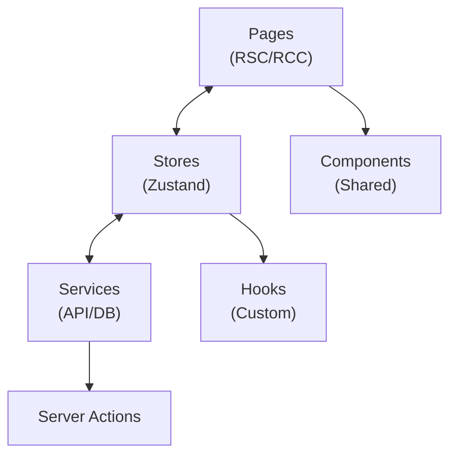

# Readmigo Web Client 实现方案

## 1. 概述

### 1.1 目标
开发功能与 iOS/Android 原生客户端 **100% 对齐** 的 Web 应用，提供跨平台一致的阅读体验，同时利用 Web 平台特性提供更便捷的访问方式。

### 1.2 产品定位
AI 原生英语原版书阅读学习应用，核心理念："Read any book. AI has your back."

### 1.3 技术选型理由

| 方案 | 优势 | 劣势 | 选择 |
|------|------|------|------|
| **Next.js 14+ (App Router)** | SSR/SSG、SEO 友好、RSC、强大生态 | 学习曲线稍陡 | ✅ 推荐 |
| Remix | 优秀的数据加载、渐进增强 | 生态较小 | 备选 |
| Vite + React | 轻量、构建快 | 无 SSR、SEO 差 | - |
| SvelteKit | 性能优秀 | 生态较小、团队熟悉度 | - |

---

## 2. 技术选型

### 2.1 开发环境

| 项目 | 配置 |
|------|------|
| **框架** | Next.js 14.2+ (App Router) |
| **语言** | TypeScript 5.x |
| **运行时** | Node.js 20+ / Edge Runtime |
| **样式** | Tailwind CSS 3.4+ |
| **包管理** | pnpm 9+ |
| **IDE** | VS Code + ESLint + Prettier |

### 2.2 架构模式



### 2.3 项目结构

```
readmigo-web/
├── app/                          # Next.js App Router
│   ├── (auth)/                   # 认证相关页面 (Route Group)
│   │   ├── login/
│   │   │   └── page.tsx
│   │   ├── signup/
│   │   │   └── page.tsx
│   │   └── layout.tsx
│   ├── (main)/                   # 主应用页面
│   │   ├── library/
│   │   │   └── page.tsx
│   │   ├── discover/
│   │   │   └── page.tsx
│   │   ├── learn/
│   │   │   └── page.tsx
│   │   ├── profile/
│   │   │   └── page.tsx
│   │   └── layout.tsx
│   ├── book/
│   │   ├── [id]/
│   │   │   └── page.tsx          # 书籍详情
│   │   └── [id]/read/
│   │       └── page.tsx          # 阅读器 (全屏)
│   ├── api/                      # API Routes
│   │   ├── auth/
│   │   └── webhooks/
│   ├── layout.tsx                # 根布局
│   ├── page.tsx                  # 首页/Landing
│   ├── globals.css
│   └── providers.tsx             # 客户端 Providers
│
├── src/
│   ├── features/                 # 功能模块
│   │   ├── auth/
│   │   │   ├── components/
│   │   │   ├── hooks/
│   │   │   ├── stores/
│   │   │   ├── actions/          # Server Actions
│   │   │   └── types/
│   │   ├── library/
│   │   ├── reader/
│   │   ├── ai/
│   │   ├── learning/
│   │   ├── audiobook/
│   │   ├── subscriptions/
│   │   ├── social/
│   │   ├── settings/
│   │   ├── search/
│   │   ├── messaging/
│   │   └── about/
│   │
│   ├── components/               # 共享组件
│   │   ├── ui/                   # 基础 UI (shadcn/ui)
│   │   │   ├── button.tsx
│   │   │   ├── card.tsx
│   │   │   ├── input.tsx
│   │   │   └── dialog.tsx
│   │   ├── layout/               # 布局组件
│   │   │   ├── header.tsx
│   │   │   ├── sidebar.tsx
│   │   │   └── footer.tsx
│   │   └── feedback/             # 反馈组件
│   │       ├── toast.tsx
│   │       └── loading.tsx
│   │
│   ├── hooks/                    # 全局 Hooks
│   │   ├── use-auth.ts
│   │   ├── use-theme.ts
│   │   └── use-media-query.ts
│   │
│   ├── stores/                   # Zustand 全局状态
│   │   ├── auth-store.ts
│   │   ├── settings-store.ts
│   │   └── index.ts
│   │
│   ├── lib/                      # 工具库
│   │   ├── api/
│   │   │   ├── client.ts         # Fetch 客户端
│   │   │   └── queries.ts        # React Query
│   │   ├── utils.ts              # 工具函数
│   │   └── constants.ts
│   │
│   ├── styles/                   # 样式
│   │   └── themes/
│   │
│   └── types/                    # 全局类型
│       ├── api.ts
│       └── index.ts
│
├── public/                       # 静态资源
│   ├── images/
│   ├── fonts/
│   └── icons/
│
├── messages/                     # i18n 翻译文件
│   ├── en.json
│   ├── zh-CN.json
│   └── zh-TW.json
│
├── next.config.js
├── tailwind.config.ts
├── tsconfig.json
├── package.json
└── README.md
```

---

## 3. 核心依赖库

### 3.1 Next.js 核心

```json
{
  "dependencies": {
    "next": "^14.2.0",
    "react": "^18.3.0",
    "react-dom": "^18.3.0"
  }
}
```

### 3.2 样式与 UI

```json
{
  "dependencies": {
    "tailwindcss": "^3.4.0",
    "tailwindcss-animate": "^1.0.7",
    "@tailwindcss/typography": "^0.5.0",
    "class-variance-authority": "^0.7.0",
    "clsx": "^2.1.0",
    "tailwind-merge": "^2.2.0",
    "@radix-ui/react-dialog": "^1.0.0",
    "@radix-ui/react-dropdown-menu": "^2.0.0",
    "@radix-ui/react-popover": "^1.0.0",
    "@radix-ui/react-tabs": "^1.0.0",
    "@radix-ui/react-toast": "^1.1.0",
    "@radix-ui/react-tooltip": "^1.0.0",
    "lucide-react": "^0.400.0",
    "framer-motion": "^11.0.0"
  }
}
```

### 3.3 状态管理

```json
{
  "dependencies": {
    "zustand": "^5.0.0",
    "immer": "^10.0.0",
    "@tanstack/react-query": "^5.0.0"
  }
}
```

### 3.4 认证

```json
{
  "dependencies": {
    "next-auth": "^5.0.0-beta.0",
    "@auth/core": "^0.30.0"
  }
}
```

### 3.5 阅读器

```json
{
  "dependencies": {
    "epubjs": "^0.3.93",
    "react-reader": "^2.0.0"
  }
}
```

### 3.6 国际化

```json
{
  "dependencies": {
    "next-intl": "^3.15.0"
  }
}
```

### 3.7 表单与验证

```json
{
  "dependencies": {
    "react-hook-form": "^7.51.0",
    "zod": "^3.23.0",
    "@hookform/resolvers": "^3.3.0"
  }
}
```

### 3.8 支付

```json
{
  "dependencies": {
    "@stripe/stripe-js": "^3.0.0",
    "@stripe/react-stripe-js": "^2.6.0",
    "stripe": "^15.0.0"
  }
}
```

### 3.9 开发工具

```json
{
  "devDependencies": {
    "@types/node": "^20.0.0",
    "@types/react": "^18.3.0",
    "typescript": "^5.4.0",
    "eslint": "^9.0.0",
    "eslint-config-next": "^14.2.0",
    "prettier": "^3.3.0",
    "prettier-plugin-tailwindcss": "^0.6.0",
    "@testing-library/react": "^15.0.0",
    "@testing-library/jest-dom": "^6.0.0",
    "vitest": "^1.6.0",
    "@vitejs/plugin-react": "^4.0.0"
  }
}
```

---

## 4. 状态管理架构

### 4.1 Zustand Store 设计

```typescript
// src/stores/auth-store.ts

import { create } from 'zustand';
import { persist, createJSONStorage } from 'zustand/middleware';
import { immer } from 'zustand/middleware/immer';

interface User {
  id: string;
  email: string;
  name: string;
  avatar?: string;
  subscriptionTier: 'free' | 'premium';
}

interface AuthState {
  user: User | null;
  accessToken: string | null;
  isAuthenticated: boolean;
  isLoading: boolean;
  isGuestMode: boolean;
}

interface AuthActions {
  setUser: (user: User) => void;
  setToken: (token: string) => void;
  logout: () => void;
  enterGuestMode: () => void;
  setLoading: (loading: boolean) => void;
}

export const useAuthStore = create<AuthState & AuthActions>()(
  persist(
    immer((set) => ({
      // State
      user: null,
      accessToken: null,
      isAuthenticated: false,
      isLoading: true,
      isGuestMode: false,

      // Actions
      setUser: (user) =>
        set((state) => {
          state.user = user;
          state.isAuthenticated = true;
          state.isGuestMode = false;
        }),

      setToken: (token) =>
        set((state) => {
          state.accessToken = token;
        }),

      logout: () =>
        set((state) => {
          state.user = null;
          state.accessToken = null;
          state.isAuthenticated = false;
          state.isGuestMode = false;
        }),

      enterGuestMode: () =>
        set((state) => {
          state.isGuestMode = true;
          state.isAuthenticated = false;
        }),

      setLoading: (loading) =>
        set((state) => {
          state.isLoading = loading;
        }),
    })),
    {
      name: 'auth-storage',
      storage: createJSONStorage(() => localStorage),
      partialize: (state) => ({
        user: state.user,
        accessToken: state.accessToken,
        isAuthenticated: state.isAuthenticated,
      }),
    }
  )
);
```

### 4.2 Settings Store

```typescript
// src/stores/settings-store.ts

import { create } from 'zustand';
import { persist, createJSONStorage } from 'zustand/middleware';

type ThemeMode = 'light' | 'dark' | 'system';
type ReaderTheme = 'light' | 'dark' | 'sepia';
type Language = 'en' | 'zh-CN' | 'zh-TW';

interface SettingsState {
  // App Settings
  themeMode: ThemeMode;
  language: Language;

  // Reader Settings
  readerTheme: ReaderTheme;
  fontSize: number;
  fontFamily: string;
  lineSpacing: number;
  textAlignment: 'left' | 'justify';

  // Learning Settings
  dailyGoal: number;
}

interface SettingsActions {
  setThemeMode: (mode: ThemeMode) => void;
  setLanguage: (lang: Language) => void;
  setReaderSettings: (settings: Partial<SettingsState>) => void;
  setDailyGoal: (goal: number) => void;
  resetSettings: () => void;
}

const defaultSettings: SettingsState = {
  themeMode: 'system',
  language: 'en',
  readerTheme: 'light',
  fontSize: 18,
  fontFamily: 'system',
  lineSpacing: 1.6,
  textAlignment: 'left',
  dailyGoal: 20,
};

export const useSettingsStore = create<SettingsState & SettingsActions>()(
  persist(
    (set) => ({
      ...defaultSettings,

      setThemeMode: (mode) => set({ themeMode: mode }),
      setLanguage: (lang) => set({ language: lang }),
      setReaderSettings: (settings) => set((state) => ({ ...state, ...settings })),
      setDailyGoal: (goal) => set({ dailyGoal: goal }),
      resetSettings: () => set(defaultSettings),
    }),
    {
      name: 'settings-storage',
      storage: createJSONStorage(() => localStorage),
    }
  )
);
```

### 4.3 React Query 配置

```typescript
// src/lib/api/query-client.ts

import { QueryClient } from '@tanstack/react-query';

export const queryClient = new QueryClient({
  defaultOptions: {
    queries: {
      staleTime: 5 * 60 * 1000, // 5 minutes
      gcTime: 24 * 60 * 60 * 1000, // 24 hours
      retry: 2,
      refetchOnWindowFocus: false,
    },
    mutations: {
      retry: 1,
    },
  },
});
```

---

## 5. API 服务层

### 5.1 Fetch 客户端

```typescript
// src/lib/api/client.ts

import { useAuthStore } from '@/stores/auth-store';
import { useSettingsStore } from '@/stores/settings-store';

const BASE_URL = process.env.NEXT_PUBLIC_API_URL || 'https://api.readmigo.app';

interface FetchOptions extends RequestInit {
  params?: Record<string, string>;
}

class ApiClient {
  private baseUrl: string;

  constructor(baseUrl: string) {
    this.baseUrl = baseUrl;
  }

  private async request<T>(
    endpoint: string,
    options: FetchOptions = {}
  ): Promise<T> {
    const { params, ...fetchOptions } = options;

    const url = new URL(`${this.baseUrl}/api/v1${endpoint}`);
    if (params) {
      Object.entries(params).forEach(([key, value]) => {
        url.searchParams.append(key, value);
      });
    }

    const token = useAuthStore.getState().accessToken;
    const language = useSettingsStore.getState().language;

    const headers: HeadersInit = {
      'Content-Type': 'application/json',
      'Accept-Language': language,
      ...options.headers,
    };

    if (token) {
      headers['Authorization'] = `Bearer ${token}`;
    }

    const response = await fetch(url.toString(), {
      ...fetchOptions,
      headers,
    });

    if (!response.ok) {
      if (response.status === 401) {
        useAuthStore.getState().logout();
      }
      throw new Error(`API Error: ${response.status}`);
    }

    return response.json();
  }

  get<T>(endpoint: string, options?: FetchOptions): Promise<T> {
    return this.request<T>(endpoint, { ...options, method: 'GET' });
  }

  post<T>(endpoint: string, data?: unknown, options?: FetchOptions): Promise<T> {
    return this.request<T>(endpoint, {
      ...options,
      method: 'POST',
      body: JSON.stringify(data),
    });
  }

  put<T>(endpoint: string, data?: unknown, options?: FetchOptions): Promise<T> {
    return this.request<T>(endpoint, {
      ...options,
      method: 'PUT',
      body: JSON.stringify(data),
    });
  }

  delete<T>(endpoint: string, options?: FetchOptions): Promise<T> {
    return this.request<T>(endpoint, { ...options, method: 'DELETE' });
  }
}

export const apiClient = new ApiClient(BASE_URL);
```

### 5.2 React Query Hooks

```typescript
// src/features/library/hooks/use-books.ts

import { useQuery, useMutation, useQueryClient } from '@tanstack/react-query';
import { apiClient } from '@/lib/api/client';
import type { Book, BookDetail, UserBook } from '../types';

// 获取书籍列表
export function useBooks(params?: { category?: string; difficulty?: number }) {
  return useQuery({
    queryKey: ['books', params],
    queryFn: async () => {
      const response = await apiClient.get<{ data: Book[] }>('/books', {
        params: params as Record<string, string>,
      });
      return response.data;
    },
  });
}

// 获取书籍详情
export function useBookDetail(bookId: string) {
  return useQuery({
    queryKey: ['book', bookId],
    queryFn: async () => {
      const response = await apiClient.get<{ data: BookDetail }>(`/books/${bookId}`);
      return response.data;
    },
    enabled: !!bookId,
  });
}

// 获取用户书架
export function useUserLibrary() {
  return useQuery({
    queryKey: ['userLibrary'],
    queryFn: async () => {
      const response = await apiClient.get<{ data: UserBook[] }>('/user/library');
      return response.data;
    },
  });
}

// 添加到书架
export function useAddToLibrary() {
  const queryClient = useQueryClient();

  return useMutation({
    mutationFn: async (bookId: string) => {
      return apiClient.post('/user/library', { bookId });
    },
    onSuccess: () => {
      queryClient.invalidateQueries({ queryKey: ['userLibrary'] });
    },
  });
}

// 更新阅读进度
export function useUpdateReadingProgress() {
  const queryClient = useQueryClient();

  return useMutation({
    mutationFn: async ({
      bookId,
      progress,
      cfi,
    }: {
      bookId: string;
      progress: number;
      cfi: string;
    }) => {
      return apiClient.put(`/user/library/${bookId}/progress`, {
        progress,
        cfi,
      });
    },
    onSuccess: (_, variables) => {
      queryClient.invalidateQueries({ queryKey: ['userLibrary'] });
      queryClient.invalidateQueries({ queryKey: ['book', variables.bookId] });
    },
  });
}
```

---

## 6. 路由与页面

### 6.1 根布局

```typescript
// app/layout.tsx

import type { Metadata } from 'next';
import { Inter, Noto_Serif } from 'next/font/google';
import { Providers } from './providers';
import './globals.css';

const inter = Inter({
  subsets: ['latin'],
  variable: '--font-inter',
});

const notoSerif = Noto_Serif({
  subsets: ['latin'],
  variable: '--font-serif',
});

export const metadata: Metadata = {
  title: {
    default: 'Readmigo - AI English Reading',
    template: '%s | Readmigo',
  },
  description: 'Read any book. AI has your back. AI-powered English reading and learning platform.',
  keywords: ['english', 'reading', 'books', 'vocabulary', 'learning', 'ai'],
  authors: [{ name: 'Readmigo' }],
  openGraph: {
    type: 'website',
    locale: 'en_US',
    url: 'https://readmigo.app',
    siteName: 'Readmigo',
    title: 'Readmigo - AI English Reading',
    description: 'Read any book. AI has your back.',
    images: [
      {
        url: '/og-image.png',
        width: 1200,
        height: 630,
        alt: 'Readmigo',
      },
    ],
  },
  twitter: {
    card: 'summary_large_image',
    title: 'Readmigo - AI English Reading',
    description: 'Read any book. AI has your back.',
    images: ['/og-image.png'],
  },
};

export default function RootLayout({
  children,
}: {
  children: React.ReactNode;
}) {
  return (
    <html lang="en" suppressHydrationWarning>
      <body className={`${inter.variable} ${notoSerif.variable} font-sans`}>
        <Providers>{children}</Providers>
      </body>
    </html>
  );
}
```

### 6.2 Providers

```typescript
// app/providers.tsx

'use client';

import { QueryClientProvider } from '@tanstack/react-query';
import { ReactQueryDevtools } from '@tanstack/react-query-devtools';
import { ThemeProvider } from 'next-themes';
import { SessionProvider } from 'next-auth/react';
import { Toaster } from '@/components/ui/toaster';
import { queryClient } from '@/lib/api/query-client';

export function Providers({ children }: { children: React.ReactNode }) {
  return (
    <SessionProvider>
      <QueryClientProvider client={queryClient}>
        <ThemeProvider
          attribute="class"
          defaultTheme="system"
          enableSystem
          disableTransitionOnChange
        >
          {children}
          <Toaster />
        </ThemeProvider>
        <ReactQueryDevtools initialIsOpen={false} />
      </QueryClientProvider>
    </SessionProvider>
  );
}
```

### 6.3 主应用布局

```typescript
// app/(main)/layout.tsx

import { redirect } from 'next/navigation';
import { auth } from '@/lib/auth';
import { Header } from '@/components/layout/header';
import { Sidebar } from '@/components/layout/sidebar';

export default async function MainLayout({
  children,
}: {
  children: React.ReactNode;
}) {
  const session = await auth();

  // 未登录且不是访客模式，重定向到登录
  // 注意：访客模式需要在客户端检查
  if (!session) {
    // 在客户端检查 guestMode
  }

  return (
    <div className="min-h-screen bg-background">
      <Header user={session?.user} />
      <div className="flex">
        <Sidebar />
        <main className="flex-1 p-6">{children}</main>
      </div>
    </div>
  );
}
```

### 6.4 认证保护中间件

```typescript
// middleware.ts

import { NextResponse } from 'next/server';
import type { NextRequest } from 'next/server';
import { auth } from '@/lib/auth';

const publicPaths = ['/', '/login', '/signup', '/about', '/privacy', '/terms'];
const guestAllowedPaths = ['/library', '/discover', '/book'];

export async function middleware(request: NextRequest) {
  const session = await auth();
  const { pathname } = request.nextUrl;

  // 公开路径直接通过
  if (publicPaths.includes(pathname)) {
    return NextResponse.next();
  }

  // 已登录用户直接通过
  if (session) {
    return NextResponse.next();
  }

  // 检查是否是访客允许的路径
  const isGuestAllowed = guestAllowedPaths.some((path) =>
    pathname.startsWith(path)
  );

  // 访客模式检查需要在客户端进行
  // 这里只做基本的重定向
  if (!isGuestAllowed) {
    return NextResponse.redirect(new URL('/login', request.url));
  }

  return NextResponse.next();
}

export const config = {
  matcher: ['/((?!api|_next/static|_next/image|favicon.ico).*)'],
};
```

---

## 7. 模块功能对照

### 7.1 模块优先级

| 优先级 | 模块 | 说明 | 状态 |
|--------|------|------|------|
| P0 | Auth | 认证授权 | 待实现 |
| P0 | Onboarding | 新用户引导 | 待实现 |
| P0 | Library | 书架管理 | 待实现 |
| P0 | Reader | 阅读器 | 待实现 |
| P0 | AI | AI 辅助功能 | 待实现 |
| P1 | Learning | 词汇学习 | 待实现 |
| P1 | Audiobook | 有声书 | 待实现 |
| P1 | Subscriptions | 订阅支付 | 待实现 |
| P1 | Settings | 应用设置 | 待实现 |
| P1 | Search | 搜索功能 | 待实现 |
| P2 | Social | 社交功能 | 待实现 |
| P2 | Messaging | 客服消息 | 待实现 |
| P2 | Guest Mode | 访客模式 | 待实现 |
| P2 | i18n | 国际化 | 待实现 |
| P2 | About | 关于页面 | 待实现 |

### 7.2 与原生平台对齐

| 功能 | iOS | Android | React Native | Web |
|------|-----|---------|--------------|-----|
| 登录方式 | Apple/Google | Google/Apple | expo-auth-session | NextAuth.js |
| 支付 | StoreKit 2 | Play Billing | RevenueCat | Stripe |
| 推送 | APNs | FCM | expo-notifications | Web Push API |
| 阅读器 | WKWebView | WebView | react-native-webview | EPUB.js |
| 数据库 | Core Data | Room | expo-sqlite | IndexedDB/API |
| 键值存储 | Keychain | EncryptedSharedPreferences | expo-secure-store | localStorage |
| 主题 | SwiftUI | Material 3 | 自定义 Theme | Tailwind + CSS Variables |

---

## 8. 阅读器实现

### 8.1 EPUB.js 阅读器

```typescript
// src/features/reader/components/epub-reader.tsx

'use client';

import { useEffect, useRef, useCallback, useState } from 'react';
import ePub, { Book, Rendition, Contents } from 'epubjs';
import { useReaderStore } from '../stores/reader-store';
import { cn } from '@/lib/utils';

interface EpubReaderProps {
  url: string;
  initialCfi?: string;
  onTextSelect: (text: string, cfi: string) => void;
  onProgressChange: (progress: number, cfi: string) => void;
  onReady?: () => void;
}

export function EpubReader({
  url,
  initialCfi,
  onTextSelect,
  onProgressChange,
  onReady,
}: EpubReaderProps) {
  const containerRef = useRef<HTMLDivElement>(null);
  const bookRef = useRef<Book | null>(null);
  const renditionRef = useRef<Rendition | null>(null);

  const { fontSize, fontFamily, theme, lineSpacing } = useReaderStore();
  const [isLoading, setIsLoading] = useState(true);

  // 初始化阅读器
  useEffect(() => {
    if (!containerRef.current) return;

    const book = ePub(url);
    bookRef.current = book;

    const rendition = book.renderTo(containerRef.current, {
      width: '100%',
      height: '100%',
      spread: 'none',
      flow: 'paginated',
    });
    renditionRef.current = rendition;

    // 生成位置信息
    book.ready.then(() => {
      return book.locations.generate(1024);
    }).then(() => {
      setIsLoading(false);
      onReady?.();

      // 跳转到初始位置
      if (initialCfi) {
        rendition.display(initialCfi);
      } else {
        rendition.display();
      }
    });

    // 监听位置变化
    rendition.on('relocated', (location: any) => {
      const progress = book.locations.percentageFromCfi(location.start.cfi);
      onProgressChange(progress, location.start.cfi);
    });

    // 监听文字选择
    rendition.on('selected', (cfiRange: string, contents: Contents) => {
      const range = rendition.getRange(cfiRange);
      const text = range.toString();
      if (text.trim()) {
        onTextSelect(text, cfiRange);
      }
    });

    return () => {
      if (bookRef.current) {
        bookRef.current.destroy();
      }
    };
  }, [url, initialCfi, onTextSelect, onProgressChange, onReady]);

  // 应用主题设置
  useEffect(() => {
    if (!renditionRef.current) return;

    const themes: Record<string, object> = {
      light: {
        body: {
          background: '#ffffff',
          color: '#1c1c1e',
        },
      },
      dark: {
        body: {
          background: '#1a1a1a',
          color: '#e0e0e0',
        },
      },
      sepia: {
        body: {
          background: '#f5e6d3',
          color: '#5d4037',
        },
      },
    };

    renditionRef.current.themes.register('custom', themes[theme]);
    renditionRef.current.themes.select('custom');
  }, [theme]);

  // 应用字体设置
  useEffect(() => {
    if (!renditionRef.current) return;

    renditionRef.current.themes.fontSize(`${fontSize}px`);
    renditionRef.current.themes.override('line-height', `${lineSpacing}`);

    if (fontFamily !== 'system') {
      renditionRef.current.themes.font(fontFamily);
    }
  }, [fontSize, fontFamily, lineSpacing]);

  // 翻页方法
  const nextPage = useCallback(() => {
    renditionRef.current?.next();
  }, []);

  const prevPage = useCallback(() => {
    renditionRef.current?.prev();
  }, []);

  const goToCfi = useCallback((cfi: string) => {
    renditionRef.current?.display(cfi);
  }, []);

  // 键盘导航
  useEffect(() => {
    const handleKeyDown = (e: KeyboardEvent) => {
      if (e.key === 'ArrowRight' || e.key === ' ') {
        nextPage();
      } else if (e.key === 'ArrowLeft') {
        prevPage();
      }
    };

    window.addEventListener('keydown', handleKeyDown);
    return () => window.removeEventListener('keydown', handleKeyDown);
  }, [nextPage, prevPage]);

  return (
    <div className="relative h-full w-full">
      {isLoading && (
        <div className="absolute inset-0 flex items-center justify-center bg-background">
          <div className="h-8 w-8 animate-spin rounded-full border-4 border-primary border-t-transparent" />
        </div>
      )}
      <div
        ref={containerRef}
        className={cn(
          'h-full w-full',
          isLoading && 'invisible'
        )}
        onClick={(e) => {
          const rect = containerRef.current?.getBoundingClientRect();
          if (!rect) return;
          const x = e.clientX - rect.left;
          if (x < rect.width / 3) {
            prevPage();
          } else if (x > (rect.width * 2) / 3) {
            nextPage();
          }
        }}
      />
    </div>
  );
}
```

### 8.2 阅读器页面

```typescript
// app/book/[id]/read/page.tsx

'use client';

import { useState, useCallback } from 'react';
import { useParams } from 'next/navigation';
import { EpubReader } from '@/features/reader/components/epub-reader';
import { ReaderToolbar } from '@/features/reader/components/reader-toolbar';
import { AIPanel } from '@/features/ai/components/ai-panel';
import { useBookDetail } from '@/features/library/hooks/use-books';
import { useUpdateReadingProgress } from '@/features/library/hooks/use-books';

export default function ReaderPage() {
  const { id } = useParams<{ id: string }>();
  const { data: book } = useBookDetail(id);
  const updateProgress = useUpdateReadingProgress();

  const [showToolbar, setShowToolbar] = useState(false);
  const [selectedText, setSelectedText] = useState<{
    text: string;
    cfi: string;
  } | null>(null);
  const [showAIPanel, setShowAIPanel] = useState(false);

  const handleTextSelect = useCallback((text: string, cfi: string) => {
    setSelectedText({ text, cfi });
    setShowAIPanel(true);
  }, []);

  const handleProgressChange = useCallback(
    (progress: number, cfi: string) => {
      // 防抖更新进度
      updateProgress.mutate({ bookId: id, progress, cfi });
    },
    [id, updateProgress]
  );

  if (!book) {
    return <div>Loading...</div>;
  }

  return (
    <div className="fixed inset-0 bg-background">
      {/* 阅读器 */}
      <EpubReader
        url={book.epubUrl}
        initialCfi={book.lastReadCfi}
        onTextSelect={handleTextSelect}
        onProgressChange={handleProgressChange}
      />

      {/* 工具栏 */}
      <ReaderToolbar
        visible={showToolbar}
        book={book}
        onToggle={() => setShowToolbar(!showToolbar)}
      />

      {/* AI 面板 */}
      <AIPanel
        open={showAIPanel}
        text={selectedText?.text || ''}
        onClose={() => setShowAIPanel(false)}
      />
    </div>
  );
}
```

---

## 9. SEO 与性能优化

### 9.1 SEO 最佳实践

```typescript
// app/book/[id]/page.tsx

import { Metadata } from 'next';
import { notFound } from 'next/navigation';
import { getBookById } from '@/lib/api/books';

interface Props {
  params: { id: string };
}

export async function generateMetadata({ params }: Props): Promise<Metadata> {
  const book = await getBookById(params.id);

  if (!book) {
    return {
      title: 'Book Not Found',
    };
  }

  return {
    title: book.title,
    description: book.description,
    openGraph: {
      title: book.title,
      description: book.description,
      images: [book.coverUrl],
      type: 'book',
      authors: [book.author],
    },
  };
}

export default async function BookDetailPage({ params }: Props) {
  const book = await getBookById(params.id);

  if (!book) {
    notFound();
  }

  return (
    // 页面内容
  );
}
```

### 9.2 性能优化

```typescript
// next.config.js

/** @type {import('next').NextConfig} */
const nextConfig = {
  // 图片优化
  images: {
    remotePatterns: [
      {
        protocol: 'https',
        hostname: 'cdn.readmigo.app',
      },
    ],
    formats: ['image/avif', 'image/webp'],
  },

  // 实验性功能
  experimental: {
    optimizePackageImports: ['lucide-react', '@radix-ui/react-icons'],
  },

  // 压缩
  compress: true,

  // 输出优化
  output: 'standalone',

  // 安全头
  async headers() {
    return [
      {
        source: '/(.*)',
        headers: [
          {
            key: 'X-Frame-Options',
            value: 'DENY',
          },
          {
            key: 'X-Content-Type-Options',
            value: 'nosniff',
          },
          {
            key: 'Referrer-Policy',
            value: 'origin-when-cross-origin',
          },
        ],
      },
    ];
  },
};

module.exports = nextConfig;
```

---

## 10. 部署架构

### 10.1 Cloudflare Pages 部署

```yaml
# .github/workflows/deploy.yml

name: Deploy to Cloudflare Pages

on:
  push:
    branches: [main]
  pull_request:
    branches: [main]

jobs:
  deploy:
    runs-on: ubuntu-latest
    permissions:
      contents: read
      deployments: write

    steps:
      - uses: actions/checkout@v4

      - name: Setup pnpm
        uses: pnpm/action-setup@v3
        with:
          version: 9

      - name: Setup Node.js
        uses: actions/setup-node@v4
        with:
          node-version: '20'
          cache: 'pnpm'

      - name: Install dependencies
        run: pnpm install --frozen-lockfile

      - name: Build
        run: pnpm build
        env:
          NEXT_PUBLIC_API_URL: ${{ secrets.API_URL }}

      - name: Deploy to Cloudflare Pages
        uses: cloudflare/pages-action@v1
        with:
          apiToken: ${{ secrets.CLOUDFLARE_API_TOKEN }}
          accountId: ${{ secrets.CLOUDFLARE_ACCOUNT_ID }}
          projectName: readmigo-web
          directory: .next
          gitHubToken: ${{ secrets.GITHUB_TOKEN }}
```

### 10.2 环境变量

```bash
# .env.local (开发环境)
NEXT_PUBLIC_API_URL=http://localhost:8787
NEXT_PUBLIC_STRIPE_PUBLISHABLE_KEY=pk_test_xxx
AUTH_SECRET=your-auth-secret
AUTH_GOOGLE_ID=your-google-client-id
AUTH_GOOGLE_SECRET=your-google-client-secret

# .env.production (生产环境)
NEXT_PUBLIC_API_URL=https://api.readmigo.app
NEXT_PUBLIC_STRIPE_PUBLISHABLE_KEY=pk_live_xxx
AUTH_SECRET=your-production-secret
AUTH_GOOGLE_ID=your-google-client-id
AUTH_GOOGLE_SECRET=your-google-client-secret
```

---

## 11. 测试策略

### 11.1 单元测试

```typescript
// src/features/auth/__tests__/auth-store.test.ts

import { describe, it, expect, beforeEach } from 'vitest';
import { useAuthStore } from '../stores/auth-store';

describe('AuthStore', () => {
  beforeEach(() => {
    useAuthStore.setState({
      user: null,
      accessToken: null,
      isAuthenticated: false,
      isGuestMode: false,
    });
  });

  it('should set user and mark as authenticated', () => {
    const store = useAuthStore.getState();

    store.setUser({
      id: '1',
      email: 'test@example.com',
      name: 'Test User',
      subscriptionTier: 'free',
    });

    expect(useAuthStore.getState().isAuthenticated).toBe(true);
    expect(useAuthStore.getState().user?.email).toBe('test@example.com');
  });

  it('should clear state on logout', () => {
    const store = useAuthStore.getState();

    store.setUser({
      id: '1',
      email: 'test@example.com',
      name: 'Test User',
      subscriptionTier: 'free',
    });
    store.logout();

    expect(useAuthStore.getState().isAuthenticated).toBe(false);
    expect(useAuthStore.getState().user).toBeNull();
  });
});
```

### 11.2 组件测试

```typescript
// src/components/ui/__tests__/button.test.tsx

import { describe, it, expect, vi } from 'vitest';
import { render, screen, fireEvent } from '@testing-library/react';
import { Button } from '../button';

describe('Button', () => {
  it('renders correctly', () => {
    render(<Button>Click me</Button>);
    expect(screen.getByText('Click me')).toBeInTheDocument();
  });

  it('calls onClick when clicked', () => {
    const onClick = vi.fn();
    render(<Button onClick={onClick}>Click me</Button>);

    fireEvent.click(screen.getByText('Click me'));
    expect(onClick).toHaveBeenCalledTimes(1);
  });

  it('is disabled when disabled prop is true', () => {
    const onClick = vi.fn();
    render(<Button onClick={onClick} disabled>Click me</Button>);

    fireEvent.click(screen.getByText('Click me'));
    expect(onClick).not.toHaveBeenCalled();
  });
});
```

---

## 12. 实现路线图

### Phase 1: 核心功能 (Week 1-3)
- [ ] 项目初始化和基础架构
- [ ] 认证模块 (Google/Email Sign-In)
- [ ] 书架和书籍详情
- [ ] 基础阅读器 (EPUB.js)

### Phase 2: AI 功能 (Week 4-5)
- [ ] AI 解释面板
- [ ] 句子简化
- [ ] 翻译功能
- [ ] 词汇保存

### Phase 3: 学习系统 (Week 6-7)
- [ ] 词汇本
- [ ] 闪卡复习
- [ ] 学习统计
- [ ] 每日目标

### Phase 4: 订阅与社交 (Week 8-9)
- [ ] Stripe 集成
- [ ] 订阅管理
- [ ] 社交功能
- [ ] 分享功能

### Phase 5: 优化与发布 (Week 10-11)
- [ ] 性能优化
- [ ] SEO 优化
- [ ] 有声书支持
- [ ] 多语言支持
- [ ] 生产部署

---

## 相关文档

- [modules/README.md](./modules/) - 模块规范目录
- [design-system-implementation.md](./design-system-implementation.md) - 设计系统实现
- [web-deployment.md](../../../05-operations/deployment/platforms/web-deployment.md) - 部署指南

---

**最后更新**: 2024-12-26
**文档版本**: 1.0
