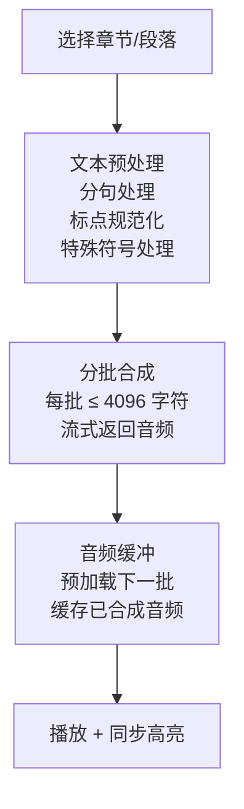
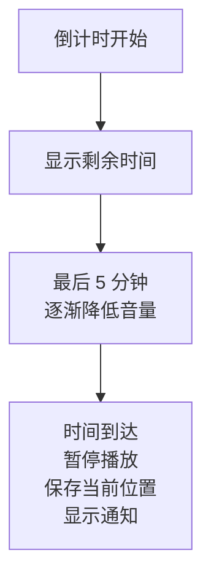

# Web 有声书模块

> TTS 朗读、音频播放、同步阅读

---

## 1. 模块概述

```
┌─────────────────────────────────────────────────────────────────┐
│                      有声书模块架构                              │
├─────────────────────────────────────────────────────────────────┤
│                                                                  │
│  features/audiobook/                                            │
│  ├── components/                                                │
│  │   ├── AudioPlayer.tsx      音频播放器                        │
│  │   ├── PlayerControls.tsx   播放控制                          │
│  │   ├── SpeedControl.tsx     速度控制                          │
│  │   ├── ChapterList.tsx      章节列表                          │
│  │   ├── SleepTimer.tsx       睡眠定时器                        │
│  │   └── SyncHighlight.tsx    同步高亮                          │
│  ├── hooks/                                                     │
│  │   ├── useAudioPlayer.ts    播放器 Hook                       │
│  │   ├── useTTS.ts            TTS Hook                          │
│  │   ├── useSync.ts           文本同步                          │
│  │   └── useMediaSession.ts   媒体会话                          │
│  ├── stores/                                                    │
│  │   └── audiobookStore.ts    播放状态                          │
│  └── utils/                                                     │
│      └── tts-service.ts       TTS 服务                          │
│                                                                  │
└─────────────────────────────────────────────────────────────────┘
```

---

## 2. 功能概览

### 2.1 音频来源

| 来源 | 说明 |
|------|------|
| TTS 合成 | AI 语音合成 |
| 有声书音频 | 专业录制音频 |
| 本地音频 | 用户自备音频 |

### 2.2 功能矩阵

```
┌─────────────────────────────────────────────────────────────────┐
│                    功能矩阵                                      │
├─────────────────────────────────────────────────────────────────┤
│                                                                  │
│           │  TTS   │ 有声书  │ 本地音频 │                       │
│  ─────────┼────────┼─────────┼──────────┤                       │
│  播放控制  │   ✅   │   ✅    │   ✅     │                       │
│  速度调节  │   ✅   │   ✅    │   ✅     │                       │
│  文本同步  │   ✅   │   ⚠️    │   ❌     │                       │
│  章节导航  │   ✅   │   ✅    │   ⚠️     │                       │
│  睡眠定时  │   ✅   │   ✅    │   ✅     │                       │
│  离线播放  │   ⚠️   │   ✅    │   ✅     │                       │
│  后台播放  │   ✅   │   ✅    │   ✅     │                       │
│                                                                  │
│  ✅ 完整支持  ⚠️ 有限支持  ❌ 不支持                            │
│                                                                  │
└─────────────────────────────────────────────────────────────────┘
```

---

## 3. TTS 服务

### 3.1 TTS 引擎

| 引擎 | 说明 | 质量 |
|------|------|------|
| OpenAI TTS | 云端 AI 语音 | 高 |
| Edge TTS | 微软边缘语音 | 中高 |
| Web Speech API | 浏览器原生 | 中 |

### 3.2 TTS 流程



### 3.3 语音设置

| 设置 | 选项 |
|------|------|
| 语音 | 多种声音可选 |
| 速度 | 0.5x - 2.0x |
| 音调 | 低/中/高 |
| 语言 | 英语 (美式/英式) |

---

## 4. 播放控制

### 4.1 基础控制

| 控制 | 功能 |
|------|------|
| 播放/暂停 | 切换播放状态 |
| 上一句/下一句 | 句子级导航 |
| 上一章/下一章 | 章节级导航 |
| 进度条 | 拖动定位 |

### 4.2 播放器 UI

```
┌─────────────────────────────────────────────────────────────────┐
│                    播放器布局                                    │
├─────────────────────────────────────────────────────────────────┤
│                                                                  │
│  迷你播放器 (底部浮动)                                           │
│  ┌─────────────────────────────────────────────────────────┐    │
│  │ [封面] 书名 - 章节名     ▶ ⏸ ⏭    1.0x  🌙           │    │
│  │ ────────────────────●─────────────── 12:34 / 45:00    │    │
│  └─────────────────────────────────────────────────────────┘    │
│                                                                  │
│  展开播放器                                                      │
│  ┌─────────────────────────────────────────────────────────┐    │
│  │                                                          │    │
│  │                    [书籍封面]                            │    │
│  │                                                          │    │
│  │                  书名                                    │    │
│  │                  章节名                                  │    │
│  │                                                          │    │
│  │  ────────────────────●─────────────────                 │    │
│  │  12:34                              45:00                │    │
│  │                                                          │    │
│  │         ⏮   ⏪   ▶   ⏩   ⏭                           │    │
│  │                                                          │    │
│  │  [速度]  [定时器]  [章节]  [设置]                        │    │
│  └─────────────────────────────────────────────────────────┘    │
│                                                                  │
└─────────────────────────────────────────────────────────────────┘
```

---

## 5. 文本同步

### 5.1 同步方式

| 方式 | 说明 |
|------|------|
| 句子级同步 | 高亮当前句子 |
| 单词级同步 | 高亮当前单词 |
| 段落级同步 | 自动滚动到当前段落 |

### 5.2 同步实现

```
┌─────────────────────────────────────────────────────────────────┐
│                    文本同步机制                                   │
├─────────────────────────────────────────────────────────────────┤
│                                                                  │
│  TTS 同步                                                        │
│  ├── 合成时生成时间戳                                            │
│  ├── 播放时匹配文本位置                                          │
│  └── 实时更新高亮                                                │
│                                                                  │
│  有声书同步                                                      │
│  ├── 预置时间轴文件                                              │
│  ├── 或 AI 自动对齐                                             │
│  └── 可能有偏移需校准                                            │
│                                                                  │
│  显示效果                                                        │
│  ├── 当前句子高亮背景                                            │
│  ├── 自动滚动到可视区                                            │
│  └── 平滑过渡动画                                                │
│                                                                  │
└─────────────────────────────────────────────────────────────────┘
```

---

## 6. 睡眠定时

### 6.1 定时选项

| 选项 | 说明 |
|------|------|
| 15 分钟 | 短时小憩 |
| 30 分钟 | 中等时长 |
| 45 分钟 | 较长时间 |
| 60 分钟 | 一小时 |
| 章节结束 | 当前章节播放完 |
| 自定义 | 用户设置时间 |

### 6.2 定时行为



---

## 7. 媒体会话

### 7.1 Media Session API

| 功能 | 说明 |
|------|------|
| 锁屏控制 | 锁屏界面显示控制 |
| 系统通知 | 通知栏播放控制 |
| 蓝牙控制 | 蓝牙耳机按键支持 |
| 画中画 | 小窗播放 (可选) |

### 7.2 元数据显示

```
┌─────────────────────────────────────────────────────────────────┐
│                    媒体会话元数据                                 │
├─────────────────────────────────────────────────────────────────┤
│                                                                  │
│  显示内容                                                        │
│  ├── 书籍标题                                                    │
│  ├── 作者名                                                      │
│  ├── 当前章节                                                    │
│  └── 封面图片                                                    │
│                                                                  │
│  支持操作                                                        │
│  ├── play / pause                                               │
│  ├── previoustrack / nexttrack                                  │
│  ├── seekbackward / seekforward                                 │
│  └── stop                                                       │
│                                                                  │
└─────────────────────────────────────────────────────────────────┘
```

---

## 8. 配额与计费

### 8.1 TTS 配额

| 用户类型 | 每月配额 |
|----------|----------|
| 免费用户 | 10,000 字符 |
| 订阅用户 | 500,000 字符 |
| 高级用户 | 无限制 |

### 8.2 计费规则

| 引擎 | 计费方式 |
|------|----------|
| OpenAI TTS | 按字符计费 |
| Edge TTS | 免费 (有限额) |
| Web Speech | 免费 |

---

## 9. 相关文档

| 文档 | 说明 |
|------|------|
| [reader.md](./reader.md) | 阅读器集成 |
| [offline.md](./offline.md) | 离线缓存 |
| [../performance.md](../performance.md) | 性能优化 |

---

*最后更新: 2025-12-31*
