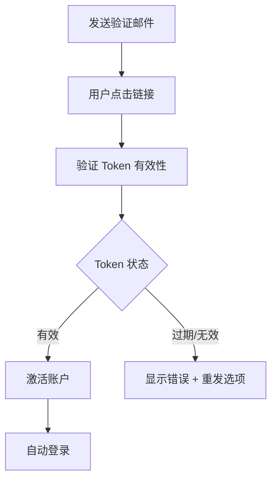
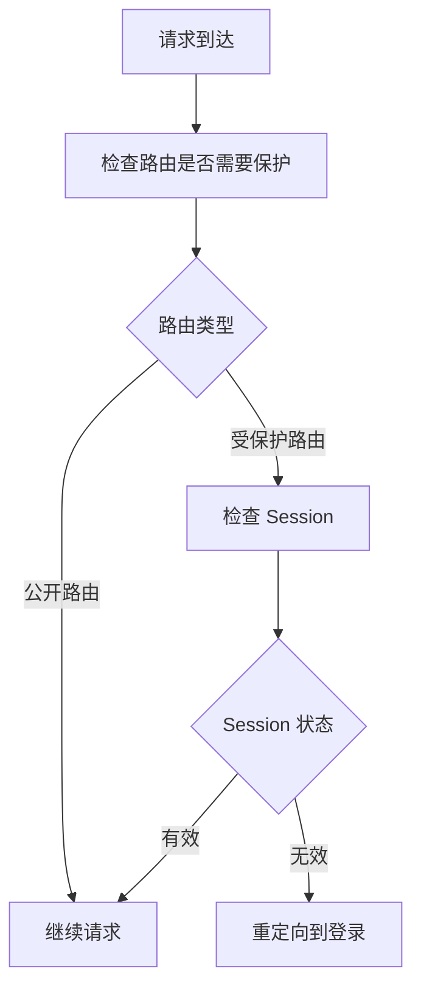

# Web 认证模块

> NextAuth.js + OAuth + 邮箱登录

---

## 1. 模块概述

```
┌─────────────────────────────────────────────────────────────────┐
│                      认证模块架构                                │
├─────────────────────────────────────────────────────────────────┤
│                                                                  │
│  features/auth/                                                 │
│  ├── components/                                                │
│  │   ├── LoginForm.tsx        登录表单                          │
│  │   ├── RegisterForm.tsx     注册表单                          │
│  │   ├── OAuthButtons.tsx     OAuth 按钮                        │
│  │   ├── ForgotPassword.tsx   忘记密码                          │
│  │   └── VerifyEmail.tsx      邮箱验证                          │
│  ├── hooks/                                                     │
│  │   ├── useAuth.ts           认证状态 Hook                     │
│  │   ├── useSession.ts        会话 Hook                         │
│  │   └── useProtectedRoute.ts 路由保护                          │
│  ├── stores/                                                    │
│  │   └── authStore.ts         认证状态                          │
│  └── actions/                                                   │
│      ├── login.ts             登录 Action                       │
│      ├── register.ts          注册 Action                       │
│      └── logout.ts            登出 Action                       │
│                                                                  │
└─────────────────────────────────────────────────────────────────┘
```

---

## 2. 认证方式

### 2.1 支持的认证方式

| 方式 | 说明 | 状态 |
|------|------|------|
| 邮箱密码 | 传统注册登录 | ✅ |
| Google OAuth | Google 账号登录 | ✅ |
| Apple OAuth | Apple 账号登录 | ✅ |
| 魔法链接 | 邮箱无密码登录 | ✅ |

### 2.2 认证流程

```
┌─────────────────────────────────────────────────────────────────┐
│                    认证流程概览                                   │
├─────────────────────────────────────────────────────────────────┤
│                                                                  │
│  邮箱密码登录                                                    │
│  ├── 输入邮箱密码                                                │
│  ├── 服务端验证                                                  │
│  ├── 创建 Session                                               │
│  └── 返回 JWT Token                                             │
│                                                                  │
│  OAuth 登录                                                     │
│  ├── 点击 OAuth 按钮                                            │
│  ├── 跳转 OAuth 提供商                                          │
│  ├── 用户授权                                                    │
│  ├── 回调处理                                                    │
│  ├── 创建/关联用户                                               │
│  └── 返回 Session                                               │
│                                                                  │
│  魔法链接                                                        │
│  ├── 输入邮箱                                                    │
│  ├── 发送验证链接                                                │
│  ├── 用户点击链接                                                │
│  ├── 验证 Token                                                 │
│  └── 自动登录                                                    │
│                                                                  │
└─────────────────────────────────────────────────────────────────┘
```

---

## 3. NextAuth.js 配置

### 3.1 Provider 配置

| Provider | 配置项 |
|----------|--------|
| Credentials | 邮箱密码验证 |
| Google | Client ID + Secret |
| Apple | Service ID + Secret |
| Email | SMTP 配置 |

### 3.2 会话配置

```
┌─────────────────────────────────────────────────────────────────┐
│                    会话配置                                      │
├─────────────────────────────────────────────────────────────────┤
│                                                                  │
│  策略: JWT                                                      │
│                                                                  │
│  Token 内容                                                     │
│  ├── sub: 用户 ID                                               │
│  ├── email: 邮箱                                                │
│  ├── name: 用户名                                               │
│  ├── picture: 头像 URL                                          │
│  └── role: 用户角色                                             │
│                                                                  │
│  Token 生命周期                                                  │
│  ├── 有效期: 30 天                                              │
│  ├── 更新窗口: 7 天前                                           │
│  └── 自动刷新: 是                                               │
│                                                                  │
└─────────────────────────────────────────────────────────────────┘
```

---

## 4. 安全措施

### 4.1 密码策略

| 规则 | 要求 |
|------|------|
| 最小长度 | 8 字符 |
| 复杂度 | 包含字母和数字 |
| 历史检查 | 不能与最近 5 次相同 |
| 加密 | bcrypt (cost 12) |

### 4.2 安全防护

```
┌─────────────────────────────────────────────────────────────────┐
│                    安全防护措施                                   │
├─────────────────────────────────────────────────────────────────┤
│                                                                  │
│  暴力破解防护                                                    │
│  ├── 登录限流: 5 次/分钟/IP                                     │
│  ├── 账户锁定: 10 次失败后锁定 30 分钟                           │
│  └── 验证码: 3 次失败后显示                                     │
│                                                                  │
│  会话安全                                                        │
│  ├── CSRF Token                                                 │
│  ├── Secure Cookie (HTTPS Only)                                │
│  ├── HttpOnly Cookie                                            │
│  └── SameSite=Lax                                              │
│                                                                  │
│  数据保护                                                        │
│  ├── 密码哈希存储                                                │
│  ├── 敏感数据加密                                                │
│  └── Token 签名验证                                             │
│                                                                  │
└─────────────────────────────────────────────────────────────────┘
```

---

## 5. 注册流程

### 5.1 注册步骤

| 步骤 | 说明 |
|------|------|
| 1 | 填写邮箱、密码 |
| 2 | 同意服务条款 |
| 3 | 提交注册 |
| 4 | 发送验证邮件 |
| 5 | 用户验证邮箱 |
| 6 | 完成注册 |

### 5.2 邮箱验证



> Token 有效期: 24 小时 | 重发限制: 1 次/分钟

---

## 6. 密码重置

### 6.1 重置流程

| 步骤 | 说明 |
|------|------|
| 1 | 点击"忘记密码" |
| 2 | 输入注册邮箱 |
| 3 | 发送重置邮件 |
| 4 | 点击重置链接 |
| 5 | 设置新密码 |
| 6 | 重置完成 |

### 6.2 安全限制

```
┌─────────────────────────────────────────────────────────────────┐
│                    密码重置限制                                   │
├─────────────────────────────────────────────────────────────────┤
│                                                                  │
│  请求限制                                                        │
│  ├── 每个邮箱: 3 次/小时                                        │
│  └── 每个 IP: 10 次/小时                                        │
│                                                                  │
│  Token 限制                                                     │
│  ├── 有效期: 1 小时                                             │
│  ├── 单次使用                                                    │
│  └── 使用后旧 Token 失效                                        │
│                                                                  │
│  密码要求                                                        │
│  ├── 不能与当前密码相同                                          │
│  └── 满足密码策略                                                │
│                                                                  │
└─────────────────────────────────────────────────────────────────┘
```

---

## 7. 路由保护

### 7.1 保护策略

| 路由 | 保护级别 |
|------|----------|
| /library | 需登录 |
| /read/* | 需登录 |
| /settings | 需登录 |
| /admin/* | 需管理员 |
| /explore | 公开 |
| / | 公开 |

### 7.2 中间件实现



---

## 8. 用户状态

### 8.1 Auth Store

| 状态 | 说明 |
|------|------|
| user | 当前用户信息 |
| isAuthenticated | 是否已认证 |
| isLoading | 加载状态 |
| error | 错误信息 |

### 8.2 会话管理

```
┌─────────────────────────────────────────────────────────────────┐
│                    会话状态管理                                   │
├─────────────────────────────────────────────────────────────────┤
│                                                                  │
│  客户端                                                          │
│  ├── useSession(): 获取会话状态                                  │
│  ├── signIn(): 登录                                             │
│  ├── signOut(): 登出                                            │
│  └── getSession(): 获取最新会话                                  │
│                                                                  │
│  服务端                                                          │
│  ├── getServerSession(): 获取服务端会话                          │
│  └── auth(): App Router 认证助手                                │
│                                                                  │
│  会话同步                                                        │
│  ├── 跨标签页同步                                                │
│  └── 自动刷新 Token                                             │
│                                                                  │
└─────────────────────────────────────────────────────────────────┘
```

---

## 9. 相关文档

| 文档 | 说明 |
|------|------|
| [../error-handling.md](../error-handling.md) | 错误处理 |
| [../../../../05-operations/deployment/platforms/web-deployment.md](../../../../05-operations/deployment/platforms/web-deployment.md) | 环境配置 |
| [../monitoring.md](../monitoring.md) | 安全监控 |

---

*最后更新: 2025-12-31*
