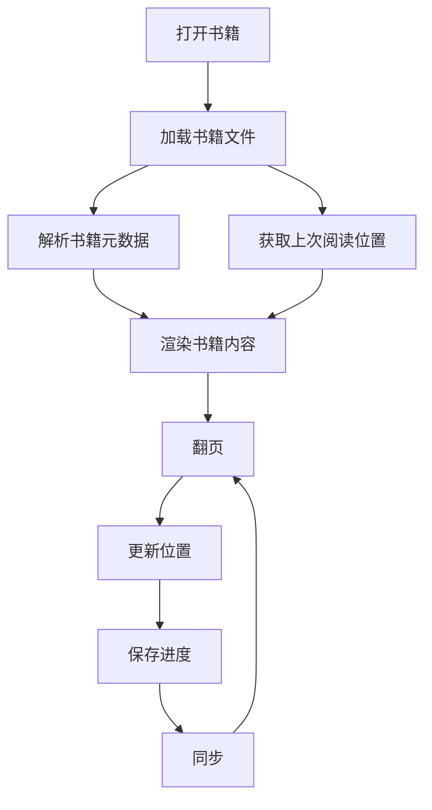

# Web 阅读器模块

> EPUB/PDF/MOBI/TXT 多格式阅读器

---

## 1. 模块概述

```
┌─────────────────────────────────────────────────────────────────┐
│                      阅读器模块架构                              │
├─────────────────────────────────────────────────────────────────┤
│                                                                  │
│  features/reader/                                               │
│  ├── components/                                                │
│  │   ├── Reader.tsx           主阅读器组件                      │
│  │   ├── ReaderToolbar.tsx    顶部工具栏                        │
│  │   ├── ReaderContent.tsx    内容渲染区                        │
│  │   ├── ReaderSidebar.tsx    侧边栏 (目录/书签)                │
│  │   ├── ReaderSettings.tsx   阅读设置面板                      │
│  │   ├── PageNavigation.tsx   翻页控制                          │
│  │   └── TextSelection.tsx    文本选择菜单                      │
│  ├── hooks/                                                     │
│  │   ├── useReader.ts         阅读器主 Hook                     │
│  │   ├── useProgress.ts       进度管理                          │
│  │   ├── useBookmarks.ts      书签管理                          │
│  │   ├── useHighlights.ts     高亮管理                          │
│  │   └── useGestures.ts       手势识别                          │
│  ├── stores/                                                    │
│  │   └── readerStore.ts       阅读器状态                        │
│  └── utils/                                                     │
│      ├── epub-parser.ts       EPUB 解析                         │
│      ├── pdf-renderer.ts      PDF 渲染                          │
│      └── position.ts          位置计算                          │
│                                                                  │
└─────────────────────────────────────────────────────────────────┘
```

---

## 2. 支持格式

### 2.1 格式支持矩阵

| 格式 | 库 | 功能支持 |
|------|-----|----------|
| EPUB | epubjs | 完整支持 |
| PDF | react-pdf | 完整支持 |
| MOBI | mobi-parser (自研) | 基础支持 |
| TXT | 原生 | 基础支持 |

### 2.2 格式特性

```
┌─────────────────────────────────────────────────────────────────┐
│                    格式特性对比                                   │
├─────────────────────────────────────────────────────────────────┤
│                                                                  │
│         │  EPUB  │  PDF   │  MOBI  │  TXT   │                   │
│  ───────┼────────┼────────┼────────┼────────┤                   │
│  翻页   │   ✅   │   ✅   │   ✅   │   ✅   │                   │
│  目录   │   ✅   │   ✅   │   ✅   │   ❌   │                   │
│  书签   │   ✅   │   ✅   │   ✅   │   ✅   │                   │
│  高亮   │   ✅   │   ⚠️   │   ✅   │   ✅   │                   │
│  搜索   │   ✅   │   ✅   │   ✅   │   ✅   │                   │
│  字体   │   ✅   │   ❌   │   ✅   │   ✅   │                   │
│  排版   │   ✅   │   ❌   │   ✅   │   ✅   │                   │
│  图片   │   ✅   │   ✅   │   ✅   │   ❌   │                   │
│                                                                  │
│  ✅ 完整支持  ⚠️ 有限支持  ❌ 不支持                            │
│                                                                  │
└─────────────────────────────────────────────────────────────────┘
```

---

## 3. 核心功能

### 3.1 阅读设置

| 设置项 | 选项 | 默认值 |
|--------|------|--------|
| 主题 | 白天/夜间/护眼 | 跟随系统 |
| 字体 | 系统/衬线/无衬线 | 系统 |
| 字号 | 12-28px | 18px |
| 行距 | 1.2-2.0 | 1.6 |
| 页边距 | 小/中/大 | 中 |
| 翻页模式 | 左右/上下/滚动 | 左右 |

### 3.2 交互功能

```
┌─────────────────────────────────────────────────────────────────┐
│                    交互功能矩阵                                   │
├─────────────────────────────────────────────────────────────────┤
│                                                                  │
│  文本选择                                                        │
│  ├── 查词 (AI 解释)                                             │
│  ├── 翻译 (AI 翻译)                                             │
│  ├── 添加高亮                                                    │
│  ├── 添加笔记                                                    │
│  └── 复制文本                                                    │
│                                                                  │
│  导航功能                                                        │
│  ├── 目录跳转                                                    │
│  ├── 进度跳转                                                    │
│  ├── 书签跳转                                                    │
│  └── 搜索跳转                                                    │
│                                                                  │
│  手势操作                                                        │
│  ├── 左右滑动翻页                                                │
│  ├── 上下滑动 (滚动模式)                                        │
│  ├── 双指缩放                                                    │
│  └── 单击显示工具栏                                              │
│                                                                  │
└─────────────────────────────────────────────────────────────────┘
```

---

## 4. 状态管理

### 4.1 Reader Store

| 状态 | 类型 | 说明 |
|------|------|------|
| book | Book | 当前书籍 |
| chapter | Chapter | 当前章节 |
| progress | number | 阅读进度 (0-100) |
| location | CFI/Page | 当前位置 |
| settings | ReaderSettings | 阅读设置 |
| isLoading | boolean | 加载状态 |

### 4.2 数据流



---

## 5. 进度同步

### 5.1 同步策略

| 场景 | 策略 |
|------|------|
| 翻页 | 防抖 1 秒后本地保存 |
| 关闭 | 立即保存 + 同步服务端 |
| 后台 | 定时同步 (30 秒) |
| 恢复 | 检查服务端最新位置 |

### 5.2 冲突处理

```
┌─────────────────────────────────────────────────────────────────┐
│                    进度冲突处理                                   │
├─────────────────────────────────────────────────────────────────┤
│                                                                  │
│  检测冲突                                                        │
│  └── 本地位置 vs 服务端位置                                      │
│                                                                  │
│  冲突类型                                                        │
│  ├── 服务端更新: 提示是否跳转                                    │
│  ├── 本地更新: 自动同步服务端                                    │
│  └── 同时更新: 使用较新的位置                                    │
│                                                                  │
│  用户选择                                                        │
│  ├── 跳转到最新位置                                              │
│  ├── 保持当前位置                                                │
│  └── 不再提示                                                    │
│                                                                  │
└─────────────────────────────────────────────────────────────────┘
```

---

## 6. 性能优化

### 6.1 渲染优化

| 优化项 | 说明 |
|--------|------|
| 预渲染 | 预渲染前后各 1 页 |
| 懒加载 | 章节延迟加载 |
| 虚拟化 | 长章节虚拟滚动 |
| 图片 | 懒加载 + 压缩 |

### 6.2 内存管理

```
┌─────────────────────────────────────────────────────────────────┐
│                    内存管理策略                                   │
├─────────────────────────────────────────────────────────────────┤
│                                                                  │
│  章节管理                                                        │
│  ├── 保留当前章节 + 前后各 1 章                                  │
│  └── 其他章节释放 DOM                                            │
│                                                                  │
│  图片管理                                                        │
│  ├── 可视区域内图片加载                                          │
│  └── 离开视口后释放                                              │
│                                                                  │
│  缓存管理                                                        │
│  ├── 解析结果缓存                                                │
│  └── LRU 策略清理                                                │
│                                                                  │
└─────────────────────────────────────────────────────────────────┘
```

---

## 7. 键盘快捷键

| 快捷键 | 功能 |
|--------|------|
| ← / → | 上一页 / 下一页 |
| Space | 下一页 |
| Home / End | 跳转到开头 / 结尾 |
| B | 添加书签 |
| T | 切换目录 |
| S | 打开设置 |
| F | 全屏切换 |
| Esc | 退出阅读器 |

---

## 8. 相关文档

| 文档 | 说明 |
|------|------|
| [ai.md](./ai.md) | AI 功能集成 |
| [offline.md](./offline.md) | 离线阅读 |
| [../performance.md](../performance.md) | 性能优化 |

---

*最后更新: 2025-12-31*
