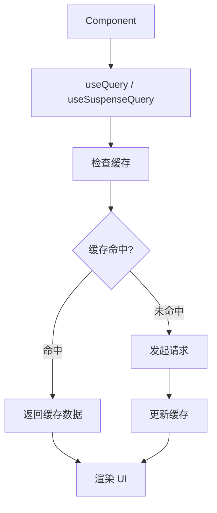
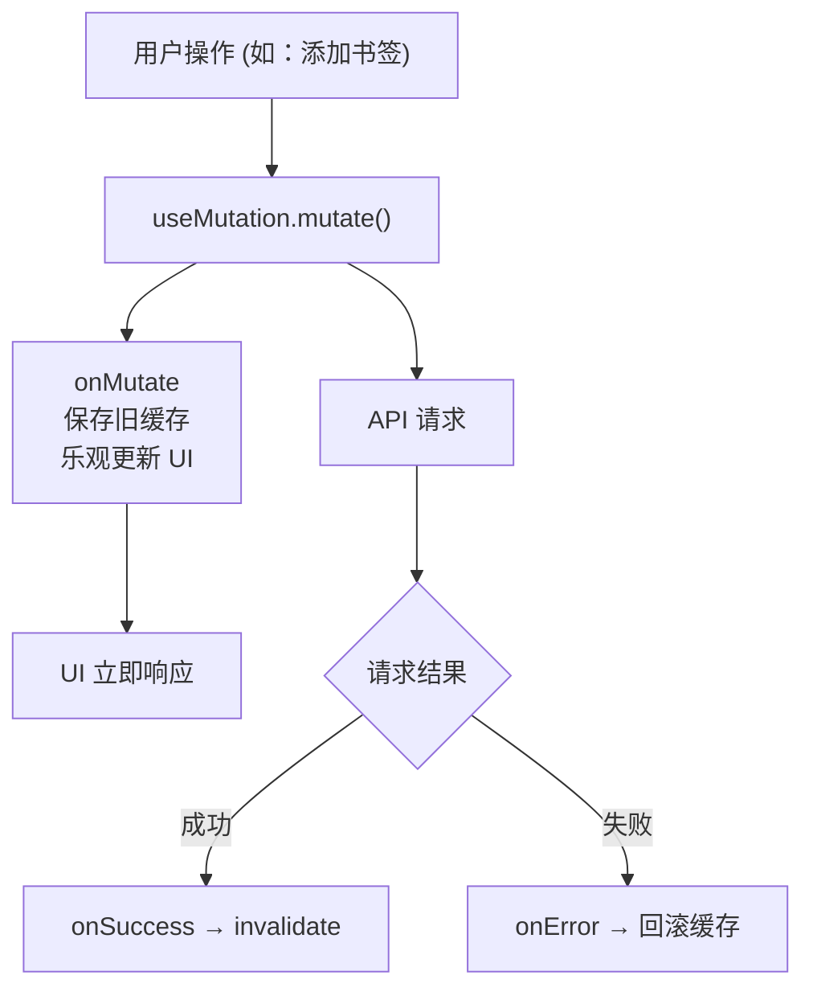
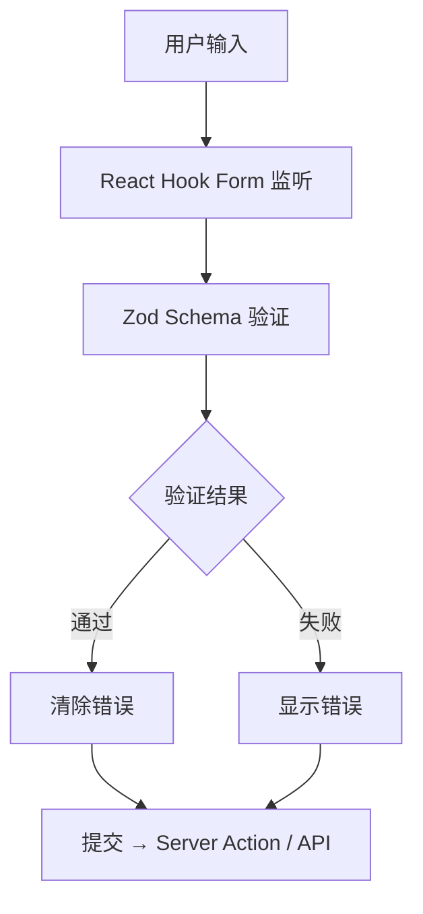
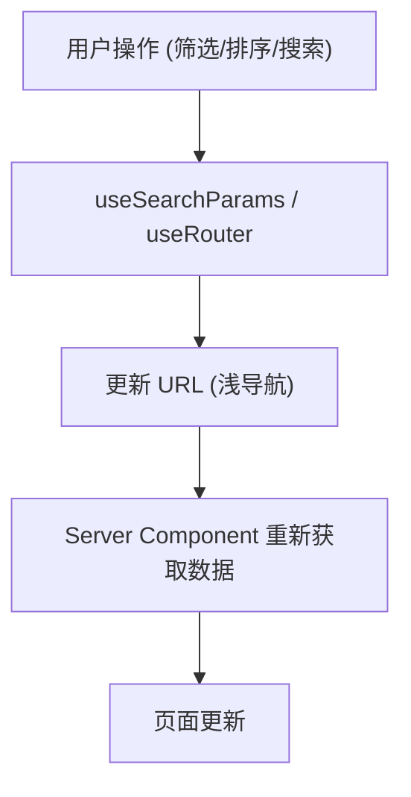

# Web 状态管理

> Zustand + TanStack Query + React Hook Form

---

## 1. 状态分类

```
┌─────────────────────────────────────────────────────────────────┐
│                    状态管理策略                                   │
├─────────────────────────────────────────────────────────────────┤
│                                                                  │
│  Server State (服务端状态)                                       │
│  └── TanStack Query v5                                          │
│      ├── 数据获取、缓存、同步                                    │
│      ├── 自动后台刷新                                            │
│      ├── 乐观更新                                                │
│      └── 离线支持                                                │
│                                                                  │
│  Client State (客户端状态)                                       │
│  └── Zustand                                                    │
│      ├── UI 状态 (弹窗、侧边栏)                                  │
│      ├── 阅读器状态 (进度、设置)                                 │
│      ├── 用户偏好                                                │
│      └── 离线队列                                                │
│                                                                  │
│  Form State (表单状态)                                           │
│  └── React Hook Form + Zod                                      │
│      ├── 表单值管理                                              │
│      ├── 验证逻辑                                                │
│      └── 提交处理                                                │
│                                                                  │
│  URL State (URL 状态)                                           │
│  └── Next.js searchParams                                       │
│      ├── 筛选条件                                                │
│      ├── 分页参数                                                │
│      └── 排序选项                                                │
│                                                                  │
└─────────────────────────────────────────────────────────────────┘
```

---

## 2. Zustand Store 设计

### 2.1 Store 架构

```
features/{module}/stores/
├── index.ts              # 导出聚合
├── {module}Store.ts      # 主 Store
└── selectors.ts          # Selector 函数
```

### 2.2 Store 规范

| 规范 | 说明 |
|------|------|
| 命名 | `use{Module}Store` |
| 持久化 | 仅用户偏好类数据 |
| DevTools | 开发环境启用 |
| 拆分 | 按功能模块独立 Store |

### 2.3 核心 Store 列表

| Store | 用途 | 持久化 |
|-------|------|--------|
| useAuthStore | 认证状态 | Token 持久化 |
| useReaderStore | 阅读器状态 | 进度、设置 |
| useLibraryStore | 书架状态 | 排序偏好 |
| useUIStore | UI 状态 | 主题偏好 |
| useOfflineStore | 离线队列 | IndexedDB |

---

## 3. TanStack Query 配置

### 3.1 Query Client 配置

```
┌─────────────────────────────────────────────────────────────────┐
│                    Query Client 默认配置                         │
├─────────────────────────────────────────────────────────────────┤
│                                                                  │
│  缓存策略                                                        │
│  ├── staleTime: 5 分钟 (数据新鲜时间)                           │
│  ├── gcTime: 30 分钟 (垃圾回收时间)                             │
│  └── refetchOnWindowFocus: true                                 │
│                                                                  │
│  重试策略                                                        │
│  ├── retry: 3                                                   │
│  ├── retryDelay: exponential backoff                           │
│  └── networkMode: 'offlineFirst'                               │
│                                                                  │
│  DevTools                                                       │
│  └── 开发环境启用 ReactQueryDevtools                            │
│                                                                  │
└─────────────────────────────────────────────────────────────────┘
```

### 3.2 Query Key 规范

| 格式 | 示例 |
|------|------|
| 列表 | `['books', filters]` |
| 详情 | `['book', bookId]` |
| 嵌套 | `['book', bookId, 'chapters']` |

### 3.3 常用 Query Hooks

| Hook | 用途 |
|------|------|
| useBooks | 书籍列表 |
| useBook | 书籍详情 |
| useChapters | 章节列表 |
| useVocabulary | 词汇列表 |
| useReadingProgress | 阅读进度 |

---

## 4. 数据流模式

### 4.1 读取流程



### 4.2 写入流程 (乐观更新)



---

## 5. 表单状态管理

### 5.1 React Hook Form 配置

| 配置项 | 值 | 说明 |
|--------|-----|------|
| mode | 'onBlur' | 失焦时验证 |
| reValidateMode | 'onChange' | 修改时重新验证 |
| resolver | zodResolver | Zod 验证集成 |

### 5.2 表单验证流程



---

## 6. URL 状态管理

### 6.1 使用场景

| 场景 | URL 参数 |
|------|----------|
| 书籍筛选 | `?category=fiction&language=en` |
| 分页 | `?page=2&limit=20` |
| 排序 | `?sort=title&order=asc` |
| 搜索 | `?q=keyword` |

### 6.2 URL 状态同步



> 特点: 可书签/分享 | 支持浏览器前进后退 | SEO 友好

---

## 7. 持久化策略

### 7.1 存储选择

| 数据类型 | 存储位置 | 说明 |
|----------|----------|------|
| Token | HTTP-only Cookie | 安全存储 |
| 用户偏好 | localStorage | 主题、语言 |
| 阅读进度 | IndexedDB | 大量数据 |
| 离线书籍 | IndexedDB | 文件缓存 |
| 临时状态 | sessionStorage | 会话级别 |

### 7.2 Zustand 持久化

| 配置 | 说明 |
|------|------|
| name | Storage key 名称 |
| storage | createJSONStorage 适配器 |
| partialize | 选择性持久化 |
| version | 迁移版本号 |

---

## 8. 性能优化

### 8.1 选择器优化

| 策略 | 说明 |
|------|------|
| 细粒度选择器 | 只订阅需要的状态 |
| shallow 比较 | 避免对象引用变化 |
| 派生状态 | useMemo 缓存计算 |

### 8.2 Query 优化

| 策略 | 说明 |
|------|------|
| placeholderData | 显示占位数据 |
| keepPreviousData | 分页切换时保持数据 |
| select | 转换/筛选响应数据 |
| enabled | 条件性查询 |

---

## 9. 相关文档

| 文档 | 说明 |
|------|------|
| [architecture.md](./architecture.md) | 前端架构 |
| [testing.md](./testing.md) | 状态测试 |
| [performance.md](./performance.md) | 性能优化 |

---

*最后更新: 2025-12-31*
