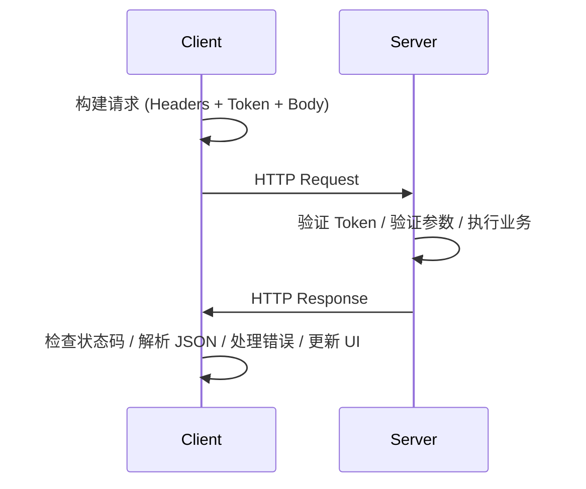

# API 契约规范

## 概述

核心原则: RESTful 设计、JSON 数据格式、版本化 API (/api/v1)

## 基础 URL

| 环境 | URL |
|------|-----|
| 生产环境 | https://readmigo-api.fly.dev/api/v1 |
| Staging | https://readmigo-api-staging.fly.dev/api/v1 |
| Debug | https://readmigo-api-debugging.fly.dev/api/v1 |

## 请求头

### 必需请求头

| Header | Value |
|--------|-------|
| Content-Type | application/json |
| Accept | application/json |
| Accept-Language | en / zh-Hans / zh-Hant / ja / ko / es / hi / ar / pt / fr / de |

### 认证请求头

| Header | Value |
|--------|-------|
| Authorization | Bearer {access_token} |

### 追踪请求头

| Header | Value | 说明 |
|--------|-------|------|
| X-Platform | ios / android / web | 客户端平台 |
| X-Bundle-Id | com.readmigo.app | 应用包名 |
| X-App-Version | 1.0.0 | 应用版本 |
| X-Correlation-Id | {uuid} | 请求关联 ID |
| X-Custom-Lang | zh-Hans | 自定义语言 (优先级高于 Accept-Language) |

### HTTP 方法

| Method | 用途 |
|--------|------|
| GET | 获取资源 |
| POST | 创建资源 / 执行操作 |
| PUT | 完整更新资源 |
| PATCH | 部分更新资源 |
| DELETE | 删除资源 |

## HTTP 状态码

### 成功状态码

| Code | 含义 |
|------|------|
| 200 | 请求成功 |
| 201 | 资源创建成功 |
| 204 | 删除成功 (无内容返回) |

### 客户端错误

| Code | 含义 |
|------|------|
| 400 | 请求参数错误 |
| 401 | 未认证 / Token 过期 |
| 403 | 权限不足 |
| 404 | 资源不存在 |
| 409 | 资源冲突 |
| 422 | 业务验证失败 |
| 429 | 请求频率超限 |

### 服务端错误

| Code | 含义 |
|------|------|
| 500 | 服务器内部错误 |
| 502 | 网关错误 |
| 503 | 服务暂不可用 |

## 错误代码

### 认证错误

| Code | 说明 |
|------|------|
| AUTH_INVALID_TOKEN | 无效的访问令牌 |
| AUTH_TOKEN_EXPIRED | 访问令牌已过期 |
| AUTH_REFRESH_EXPIRED | 刷新令牌已过期 |
| AUTH_INVALID_CREDS | 用户名或密码错误 |
| AUTH_USER_NOT_FOUND | 用户不存在 |
| AUTH_EMAIL_EXISTS | 邮箱已被注册 |

### 业务错误

| Code | 说明 |
|------|------|
| VALIDATION_ERROR | 参数验证失败 |
| RESOURCE_NOT_FOUND | 资源不存在 |
| QUOTA_EXCEEDED | 配额超限 |
| SUBSCRIPTION_REQUIRED | 需要订阅 |
| FEATURE_LOCKED | 功能未解锁 |

### AI 相关错误

| Code | 说明 |
|------|------|
| AI_QUOTA_EXCEEDED | AI 功能配额用尽 |
| AI_TEXT_TOO_LONG | 文本过长 |
| AI_SERVICE_ERROR | AI 服务暂时不可用 |

## 数据格式

| 类型 | 格式 | 示例 |
|------|------|------|
| 日期时间 | ISO 8601 (UTC) | 2024-01-15T08:30:00.000Z |
| UUID | UUID v4 | 550e8400-e29b-41d4-a716-446655440000 |
| 百分比 | 0-100 整数 | 75 表示 75% |
| 语言代码 | BCP 47 | en, zh-Hans, zh-Hant, ja, ko |

## 版本控制

- 版本策略: URL 路径版本 /api/v{version}
- 当前版本: v1

## 请求/响应流程

