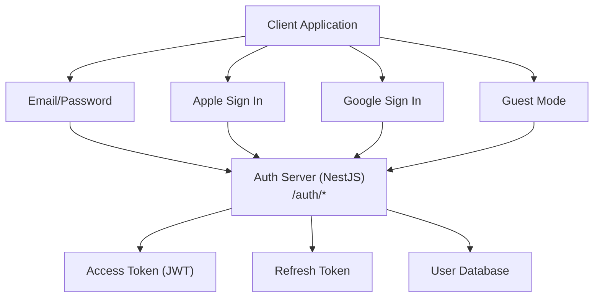
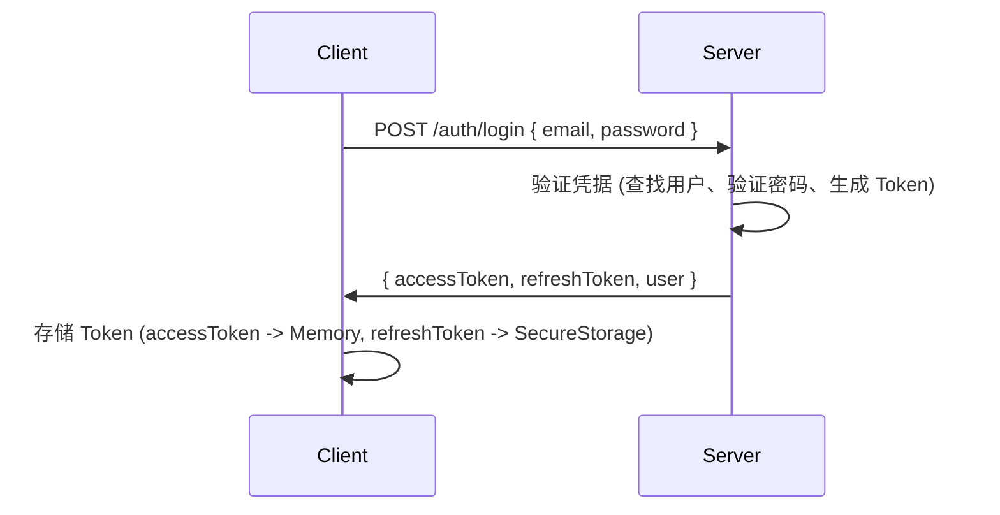
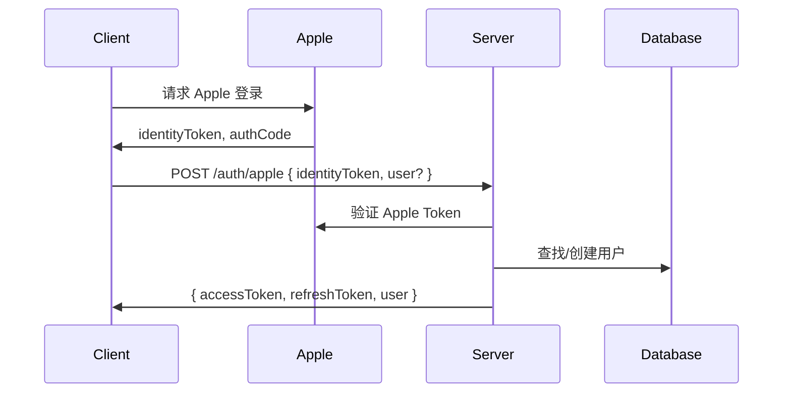
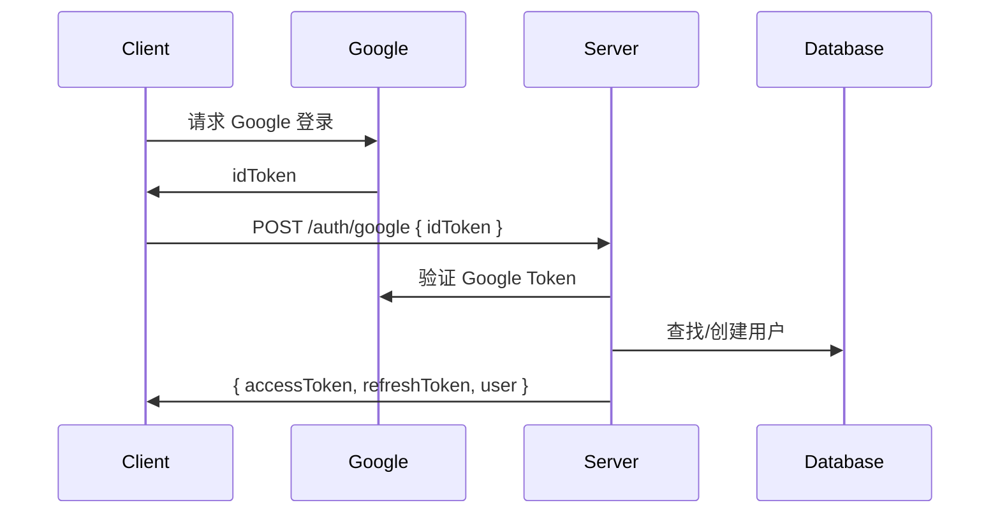
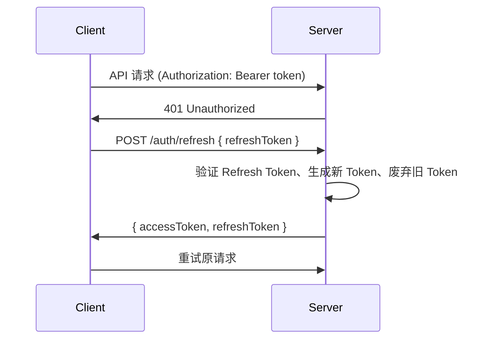

# 认证授权流程

## 概述

支持方式:
- 邮箱/密码登录
- Apple Sign In
- Google Sign In
- 访客模式 (Guest)

## 认证架构

## Token 机制

| Token 类型 | 格式 | 有效期 | 用途 | 存储位置 |
|-----------|------|--------|------|----------|
| Access Token | JWT | 短期 | API 请求认证 | 内存 / Secure Storage |
| Refresh Token | Opaque | 长期 | 刷新 Access Token | Secure Storage / Keychain |

**Access Token Payload 包含**: sub (用户 ID), iat (签发时间), exp (过期时间)

**Refresh Token 特性**: 一次性使用 (Rotation), 服务端存储支持撤销

## API 端点

| Endpoint | Method | 描述 | 认证 |
|----------|--------|------|------|
| /auth/register | POST | 邮箱注册 | 无需 |
| /auth/login | POST | 邮箱登录 | 无需 |
| /auth/apple | POST | Apple 登录 | 无需 |
| /auth/google | POST | Google 登录 | 无需 |
| /auth/guest | POST | 访客登录 | 无需 |
| /auth/refresh | POST | 刷新 Token | 无需 |
| /auth/upgrade | POST | 访客升级为正式账户 | Bearer Token |
| /auth/logout | POST | 登出 | Bearer Token |
| /auth/forgot-password | POST | 忘记密码 | 无需 |
| /auth/reset-password | POST | 重置密码 | 无需 |
| /auth/verify-email | POST | 验证邮箱 | 无需 |
| /auth/resend-verification | POST | 重发验证邮件 | 无需 |

## 邮箱密码登录流程

## Apple Sign In 流程

首次登录时 Apple 返回的 user 信息 (email, fullName) 只传递一次，需在客户端传给服务器保存。

## Google Sign In 流程

## Token 刷新流程

## 访客模式

- 无需注册即可体验
- 数据关联到设备
- 功能受限
- 可通过 POST /auth/upgrade 升级为正式账户 (邮箱/Apple/Google)

升级时迁移数据: 阅读进度、词汇列表、学习统计

## 设备管理

设备通过独立的 `/devices` 模块管理，每台设备记录:

| 字段 | 说明 |
|------|------|
| deviceId | 设备唯一标识 |
| platform | IOS / ANDROID / WEB |
| deviceModel | 设备型号 |
| appVersion | 应用版本 |
| isPrimary | 是否为主设备 |
| isLoggedOut | 是否已远程登出 |
| lastActiveAt | 最后活跃时间 |

## 登出流程

**单设备登出**: POST /auth/logout，服务端废弃对应 Token，客户端清除本地 Token

## 安全措施

| 类别 | 措施 |
|------|------|
| 传输安全 | HTTPS 强制, TLS 1.2+ |
| 存储安全 | iOS: Keychain, Android: EncryptedSharedPreferences |
| Token 安全 | 短期 Access Token, Refresh Token Rotation, 可撤销 |
| 密码策略 | 最小 8 字符, bcrypt 加密存储 |

## 各平台实现

| 平台 | Apple Sign In | Google Sign In | Token 存储 | 认证管理 |
|------|-------------|---------------|-----------|---------|
| iOS | AuthenticationServices | GoogleSignIn SDK | Keychain | AuthManager |
| Android | - | Credential Manager | EncryptedSharedPreferences | AuthRepository |
| React Native | expo-apple-authentication | expo-auth-session | expo-secure-store | authStore (Zustand) |
