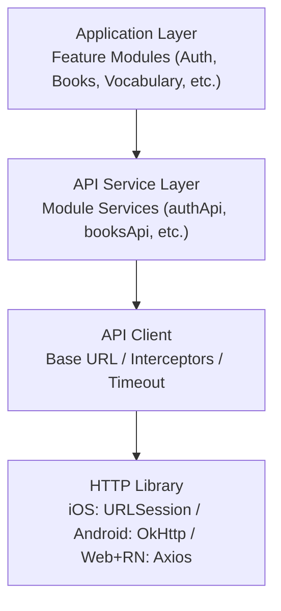
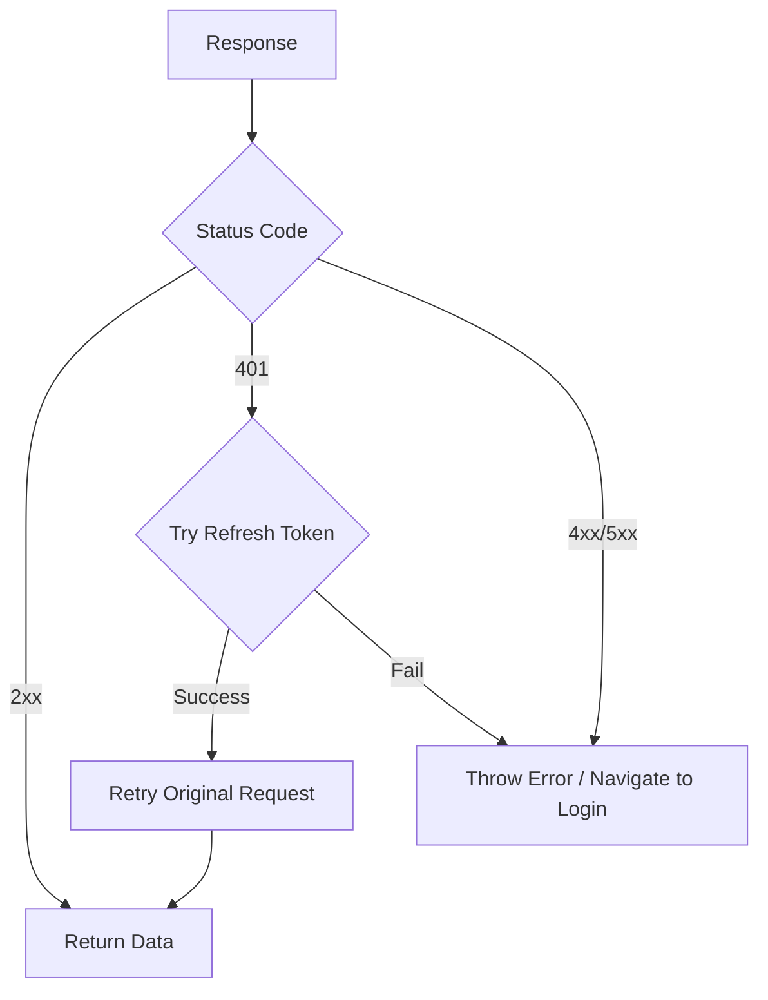

# 客户端集成指南

## 概述

本文档描述各平台如何集成后端 API，包括 API 客户端配置、Token 管理、错误处理和通用模式。

## API 客户端架构

## 平台特定配置

| 平台 | HTTP 库 | JSON 解析 | Token 存储 | 并发模型 |
|------|---------|----------|-----------|---------|
| iOS (Swift) | URLSession | Codable | Keychain | async/await |
| Android (Kotlin) | OkHttp + Retrofit | Moshi | EncryptedSharedPreferences | Coroutines + Flow |
| React Native | Axios | 原生 JSON | expo-secure-store | Zustand + React Query |

## 请求拦截器

每个请求发出前依次添加:

1. **Auth Header** - Authorization: Bearer {accessToken}
2. **Language Header** - Accept-Language: {userLanguage}
3. **Platform Headers** - X-Platform / X-App-Version / X-Bundle-Id
4. **Correlation ID** - X-Correlation-Id: {uuid}

## 响应拦截器

## Token 刷新流程

关键点:
- 使用锁/标志防止并发刷新
- 队列化等待中的请求
- 刷新成功后重试所有排队请求
- 刷新失败时清除状态并跳转登录

## 错误处理

### 错误类型

| 错误类型 | 说明 | 处理方式 |
|---------|------|---------|
| NetworkError | 网络连接失败 | 显示重试按钮 |
| TimeoutError | 请求超时 | 显示重试按钮 |
| UnauthorizedError | 401 未认证 | 尝试刷新 Token / 跳转登录 |
| ForbiddenError | 403 权限不足 | 显示无权限提示 |
| NotFoundError | 404 资源不存在 | 显示 404 页面 |
| ValidationError | 422 参数验证失败 | 表单字段显示错误 |
| ServerError | 500 服务器错误 | 显示服务器错误提示 |
| QuotaExceeded | 配额超限 | 显示升级提示 |

### 用户提示

| 错误码 | 用户提示 |
|--------|---------|
| AUTH_INVALID_TOKEN | 请重新登录 |
| AUTH_EMAIL_EXISTS | 该邮箱已被注册 |
| VALIDATION_ERROR | 请检查输入内容 |
| QUOTA_EXCEEDED | 今日次数已用完 |
| NETWORK_ERROR | 网络连接失败，请重试 |
| SERVER_ERROR | 服务暂时不可用，请稍后重试 |

## 缓存策略

### 离线缓存

| 平台 | 方案 |
|------|------|
| iOS | URLCache + Core Data |
| Android | Room + OkHttp Cache |
| React Native | AsyncStorage + React Query Persist |

离线优先数据: 用户书架、已下载书籍内容、词汇列表、阅读进度 (同步队列)

## 数据同步

### 阅读进度同步
- 本地优先: 立即更新 UI
- 后台同步: 防抖后上传
- 冲突解决: 以较新的 lastReadAt 为准
- 离线队列: 存储待同步变更

### 词汇同步
- 创建/删除: 立即同步
- 复习结果: 实时上传
- 冲突: 合并取最新

## 环境配置

| 变量名 | 说明 |
|--------|------|
| API_BASE_URL | API 基础 URL |
| SENTRY_DSN | Sentry 错误追踪 |
