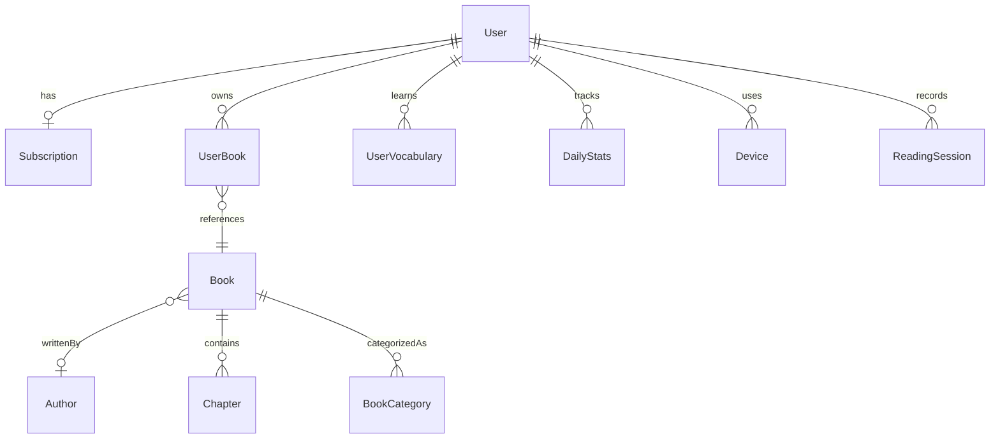

# 数据模型规范

## 概述

核心实体: User, Book, Subscription, UserBook, ReadingProgress, Vocabulary, DailyStats, Device

## 实体关系图

## User (用户)

### 基本信息

| Field | Type | Description |
|-------|------|-------------|
| id | UUID | 用户唯一标识 |
| email | String? | 邮箱地址 (唯一, 访客无邮箱) |
| appleId | String? | Apple 登录标识 |
| googleId | String? | Google 登录标识 |
| passwordHash | String? | 密码哈希 (邮箱注册用户) |
| emailVerified | Boolean | 邮箱是否已验证 |
| displayName | String? | 显示名称 |
| avatarUrl | String? | 头像 URL |
| role | Enum | USER / ADMIN |

### 学习设置

| Field | Type | Description |
|-------|------|-------------|
| englishLevel | Enum | BEGINNER / INTERMEDIATE / ADVANCED |
| dailyGoalMinutes | Int | 每日目标 (分钟, 默认 15) |
| nativeLanguage | String | 母语 (默认 zh-CN) |
| preferredLanguage | String | UI 语言偏好 (默认 zh-Hans) |
| learningPurpose | String? | 学习目的 |

### 时间戳

| Field | Type | Description |
|-------|------|-------------|
| createdAt | DateTime | 创建时间 |
| updatedAt | DateTime | 更新时间 |
| lastActiveAt | DateTime? | 最后活跃时间 |

## Book (书籍)

### 基本信息

| Field | Type | Description |
|-------|------|-------------|
| id | UUID | 书籍唯一标识 |
| title | String | 书名 |
| authorId | UUID? | 作者 ID (关联 Author 表) |
| description | String? | 书籍简介 |
| language | String | 语言代码 (默认 en) |
| languageVariant | String? | 语言变体 (zh-Hans, zh-Hant 等) |
| coverUrl | String? | 封面图片 URL |
| coverThumbUrl | String? | 封面缩略图 URL |

### 内容信息

| Field | Type | Description |
|-------|------|-------------|
| epubUrl | String | EPUB 文件 URL |
| wordCount | Int? | 总词数 |
| chapterCount | Int? | 章节数 |
| estimatedReadingMinutes | Int? | 预计阅读时长 |
| genres | String[] | 分类标签 |
| subjects | String[] | 主题标签 |

### 难度信息

| Field | Type | Description |
|-------|------|-------------|
| difficultyScore | Float? | 难度分数 |
| fleschScore | Float? | Flesch 可读性分数 |
| cefrLevel | String? | CEFR 等级 (A1-C2) |

### 中文书籍特有字段

| Field | Type | Description |
|-------|------|-------------|
| characterCount | Int? | 汉字数 |
| hskLevel | Int? | HSK 等级 (1-9) |
| pinyinEnabled | Boolean | 是否支持拼音标注 |
| dynasty | String? | 朝代 (古籍) |

### 质量标记

| Field | Type | Description |
|-------|------|-------------|
| isClassic | Boolean | 是否经典作品 |
| isAwardWinner | Boolean | 是否获奖作品 |
| editorialScore | Float? | 编辑评分 (0-10) |
| doubanRating | Float? | 豆瓣评分 (0-10) |
| goodreadsRating | Float? | Goodreads 评分 (0-5) |

### 元数据

| Field | Type | Description |
|-------|------|-------------|
| status | Enum | PENDING / PROCESSING / ACTIVE / INACTIVE / ERROR |
| source | Enum | STANDARD_EBOOKS / GUTENBERG / INTERNET_ARCHIVE / USER_UPLOAD / CTEXT / WIKISOURCE_ZH / GUTENBERG_ZH / SHUGE |
| publishedAt | DateTime? | 出版日期 |
| createdAt | DateTime | 创建时间 |
| updatedAt | DateTime | 更新时间 |

## Subscription (订阅)

| Field | Type | Description |
|-------|------|-------------|
| id | UUID | 订阅唯一标识 |
| userId | UUID | 用户 ID (唯一) |
| planType | Enum | FREE / PRO / PREMIUM |
| status | Enum | ACTIVE / EXPIRED / CANCELLED / GRACE_PERIOD / TRIAL / TRIAL_EXPIRED |
| source | Enum | NONE / APPLE_IAP / GOOGLE_PLAY / STRIPE / PROMO_CODE / ADMIN_GRANT |
| startedAt | DateTime | 开始时间 |
| expiresAt | DateTime? | 过期时间 |
| cancelledAt | DateTime? | 取消时间 |
| trialStartedAt | DateTime? | 试用开始时间 |
| trialEndsAt | DateTime? | 试用结束时间 |
| trialUsed | Boolean | 是否已使用过试用 |

支持 Apple IAP、Google Play、Stripe 三种支付渠道，每种渠道有独立的字段记录交易信息。

另支持管理员授权 (grantedBy, grantReason, grantExpiresAt) 和促销码。

## Device (设备)

| Field | Type | Description |
|-------|------|-------------|
| id | UUID | 设备唯一标识 |
| deviceId | String | 设备标识符 (唯一) |
| userId | UUID? | 用户 ID |
| platform | Enum | IOS / ANDROID / WEB |
| deviceModel | String? | 设备型号 |
| deviceName | String? | 用户自定义设备名称 |
| osVersion | String? | 系统版本 |
| appVersion | String? | 应用版本 |
| pushToken | String? | 推送通知 Token |
| isPrimary | Boolean | 是否为主设备 |
| isLoggedOut | Boolean | 是否已远程登出 |
| lastActiveAt | DateTime | 最后活跃时间 |

## VerificationToken (验证 Token)

| Field | Type | Description |
|-------|------|-------------|
| id | String | ULID 格式 |
| userId | UUID | 用户 ID |
| type | Enum | EMAIL_VERIFY / PASSWORD_RESET |
| expiresAt | DateTime | 过期时间 |
| usedAt | DateTime? | 使用时间 |

## Vocabulary (词汇)

通过 UserVocabulary 模型管理，关联用户和来源书籍，包含学习状态和间隔重复数据。

## LearningStats (学习统计)

通过 DailyStats 和 ReadingSession 模型记录每日学习数据和阅读会话。

## Annotations (批注系统)

包含三种类型:
- **Highlight** - 文本高亮
- **Annotation** - 批注 / 笔记
- **Bookmark** - 书签
