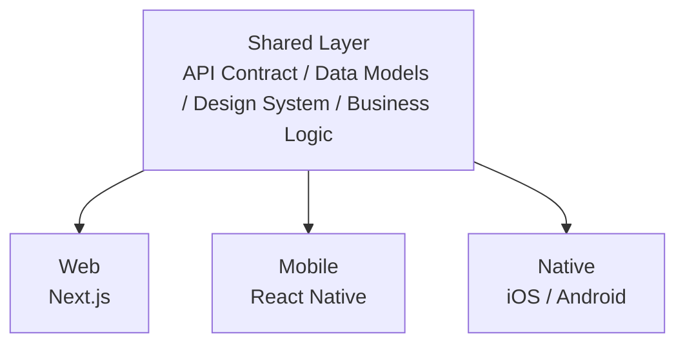

# 跨平台共享文档

## 概述

本目录包含 ReadMigo 所有客户端平台共享的技术规范和设计文档。

## 文档结构

| 文件 | 描述 |
|------|------|
| api-contract.md | API 契约规范 |
| authentication.md | 认证授权流程 |
| data-models.md | 数据模型规范 |
| subscription-system.md | 订阅系统设计 |
| learning-algorithms.md | 学习算法文档 |
| design-system.md | 设计系统规范 |
| api-endpoints.md | API 端点参考 |
| client-integration.md | 客户端集成指南 |
| internationalization.md | 国际化指南 |
| analytics.md | 数据分析与追踪 |

## 平台覆盖

## 核心模块

| 模块 | 功能 |
|------|------|
| 用户与认证 | 邮箱/密码登录、社交登录 (Apple, Google)、访客模式、Token 管理 |
| 内容与阅读 | 电子书阅读、有声书、阅读进度同步、书签与标注、双语阅读 |
| 学习与词汇 | AI 解释、词汇管理、间隔重复、学习统计 |
| 订阅与变现 | 订阅等级 (FREE / PRO / PREMIUM)、功能限制、支付验证 |
| 社区功能 | 城邦 (Agora) 帖子、作者聊天 |

## API 服务器

| 环境 | URL |
|------|-----|
| 生产环境 | https://readmigo-api.fly.dev/api/v1 |
| Staging | https://readmigo-api-staging.fly.dev/api/v1 |
| Debug | https://readmigo-api-debugging.fly.dev/api/v1 |

## 技术栈概览

| 层级 | 技术选型 |
|------|----------|
| 后端框架 | NestJS (TypeScript) |
| 数据库 | PostgreSQL (Neon) |
| ORM | Prisma |
| 缓存 | Redis |
| 文件存储 | Cloudflare R2 |
| 部署 | Fly.io |
| 监控 | Sentry |

## 快速导航

| 文档 | 描述 | 适用场景 |
|------|------|----------|
| [API 契约](./api-contract.md) | 请求/响应格式规范 | 后端/前端开发 |
| [认证授权](./authentication.md) | 登录/Token/权限流程 | 所有平台开发 |
| [数据模型](./data-models.md) | 核心实体定义 | 数据库/API 设计 |
| [订阅系统](./subscription-system.md) | 付费功能设计 | 产品/支付集成 |
| [学习算法](./learning-algorithms.md) | 间隔重复/统计算法 | 学习功能开发 |
| [设计系统](./design-system.md) | 颜色/字体/组件 | UI/UX 设计 |
| [API 端点](./api-endpoints.md) | 完整端点列表 | API 集成 |
| [客户端集成](./client-integration.md) | 各平台接入指南 | 客户端开发 |
| [国际化](./internationalization.md) | 多语言支持 | 本地化 |
| [数据分析](./analytics.md) | 事件追踪规范 | 数据分析 |
