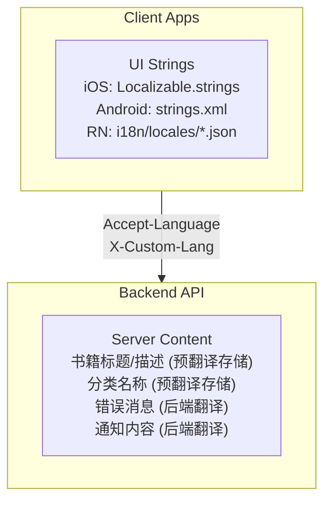
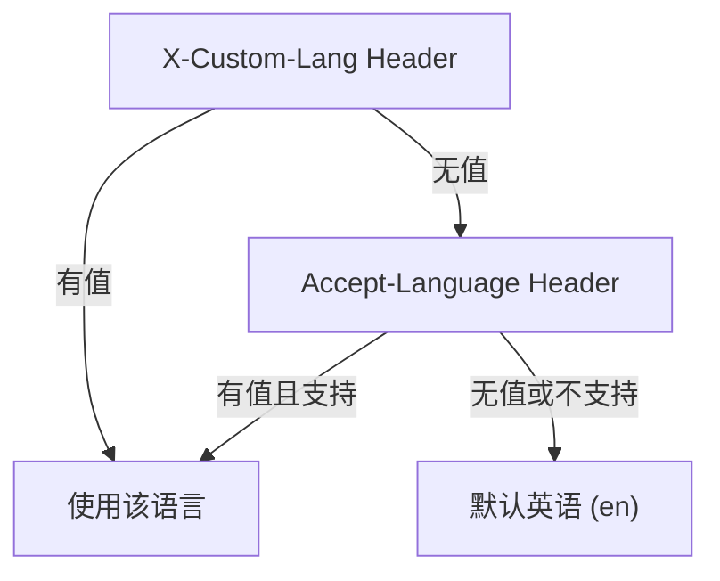
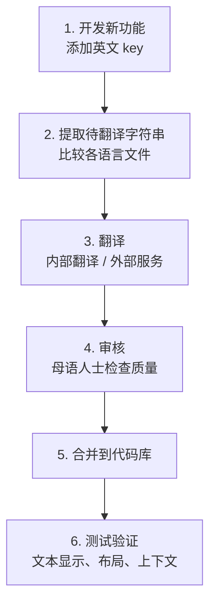

# 国际化指南

## 概述

应用支持多语言 UI 和内容翻译系统。

### UI 语言

当前支持的 UI 语言:

| 语言 | 代码 |
|------|------|
| English | en |
| 简体中文 | zh-Hans |
| 繁体中文 | zh-Hant |
| 日本語 | ja |
| 한국어 | ko |

### 章节翻译语言

后端 API 支持的章节翻译 locale (10 种):

| 语言 | 代码 |
|------|------|
| 简体中文 | zh-Hans |
| 繁体中文 | zh-Hant |
| 西班牙语 | es |
| 印地语 | hi |
| 阿拉伯语 | ar |
| 葡萄牙语 | pt |
| 日语 | ja |
| 韩语 | ko |
| 法语 | fr |
| 德语 | de |

## 国际化架构

## 语言检测

### 检测优先级

注意: X-Custom-Lang 优先级高于 Accept-Language (已在后端 locale middleware 中实现)。

### 语言代码映射

后端使用 LOCALE_MAPPINGS 将各种变体标准化:

| 系统语言代码 | 映射到 |
|------------|--------|
| en, en-US, en-GB, en-AU | en |
| zh, zh-CN, zh-SG, zh-Hans-CN | zh-Hans |
| zh-TW, zh-HK, zh-MO, zh-Hant-TW, zh-Hant-HK | zh-Hant |
| ja, ja-JP | ja |
| ko, ko-KR | ko |
| es, es-ES, es-MX | es |
| ar, ar-SA | ar |
| 其他 | en (回退) |

## 可本地化实体

后端 LocalizationService 支持以下实体类型的翻译:

| 实体类型 | 可翻译字段 |
|---------|-----------|
| book | title, description |
| author | name, bio, birthPlace, era, writingStyle, literaryPeriod |
| genre | name, description |
| booklist | title, description |
| quote | text |
| category | name, description |
| medal | name, description, designStory |
| discoverTab | name |

翻译数据存储在 Translation 表中，通过 entityType + entityId + locale 关联。

## 翻译字符串组织

### 命名空间 (Namespace)

| 命名空间 | 内容 | 示例 key |
|---------|------|---------|
| common | 通用文本 | cancel, confirm, save, delete, loading, retry |
| auth | 认证相关 | login, register, logout, email, password |
| reader | 阅读器 | chapter, progress, bookmark, highlight |
| library | 书架 | myBooks, reading, completed |
| vocabulary | 词汇 | words, review, mastery |
| learning | 学习 | streak, goal, stats |
| settings | 设置 | language, theme, account |
| subscription | 订阅 | free, pro, premium, upgrade |
| errors | 错误消息 | network, server, auth |

## 平台实现

### iOS (Swift)

- 框架: Foundation + SwiftUI 原生本地化
- 文件: {lang}.lproj/Localizable.strings
- 使用: String(localized: "key")

### Android (Kotlin)

- 框架: Android Resources
- 文件: values-{lang}/strings.xml
- 使用: getString(R.string.key) / stringResource(R.string.key)

### React Native

- 框架: i18next + react-i18next
- 文件: src/i18n/locales/{lang}.json
- 使用: const { t } = useTranslation(); t('namespace:key')

## 动态内容本地化

### 服务端本地化策略

| 内容类型 | 本地化方式 |
|---------|-----------|
| 书籍标题/描述 | 预翻译存储在 Translation 表，API 根据 locale 返回 |
| 分类名称 | 预翻译存储在 Translation 表 |
| 作者信息 | 预翻译存储在 Translation 表 |
| 错误消息 | 后端根据 Accept-Language 返回本地化消息 |
| 章节翻译 | 存储在 Cloudflare R2，按需获取 |

## 复数形式

### 复数规则

| 语言 | 规则 |
|------|------|
| 英语 (en) | one / other (如 "1 book" vs "2 books") |
| 中文 (zh-Hans/zh-Hant) | 无复数变化 |
| 日语 (ja) | 无复数变化 |
| 韩语 (ko) | 无复数变化 |
| 西班牙语 (es) | one / other |
| 阿拉伯语 (ar) | zero / one / two / few / many / other |

## 日期时间格式

### 日期格式

| 语言 | 短日期 | 长日期 |
|------|--------|--------|
| en | 12/31/2024 | December 31, 2024 |
| zh-Hans | 2024/12/31 | 2024年12月31日 |
| zh-Hant | 2024/12/31 | 2024年12月31日 |
| ja | 2024/12/31 | 2024年12月31日 |
| ko | 2024. 12. 31. | 2024년 12월 31일 |

### 相对时间

| 语言 | 刚刚 | 5分钟前 | 昨天 |
|------|------|--------|------|
| en | just now | 5 min ago | yesterday |
| zh-Hans | 刚刚 | 5分钟前 | 昨天 |
| zh-Hant | 剛剛 | 5分鐘前 | 昨天 |
| ja | たった今 | 5分前 | 昨日 |
| ko | 방금 | 5분 전 | 어제 |

## 数字格式

| 语言 | 千位分隔 | 小数点 | 货币 |
|------|---------|--------|------|
| en | 1,234.56 | . | $1,234.56 |
| zh-Hans | 1,234.56 | . | ¥1,234.56 |
| zh-Hant | 1,234.56 | . | NT$1,234 |
| ja | 1,234.56 | . | ¥1,234 |
| ko | 1,234.56 | . | ₩1,234 |

## RTL 支持

阿拉伯语 (ar) 已在支持的翻译 locale 中，但客户端 RTL 布局支持尚未完全实现。

需要考虑:
- 布局镜像
- 文本对齐
- 图标方向
- 滑动手势方向

## 翻译工作流

## 最佳实践

**字符串编写:**
- 使用语义化的 key (如 "auth.login.button" 而非 "button1")
- 使用插值而非拼接 (如 "Welcome {{name}}")
- 提供上下文注释便于翻译者理解
- 预留空间 (德语等文本长度可能是英语的 1.3-1.5 倍)
- 不要硬编码用户可见文本
- 不要在代码中做语法假设

**测试检查项:**
- 切换语言后 UI 正确显示
- 长文本不会截断或溢出
- 日期时间格式正确
- 数字格式正确
- 复数形式正确
- 动态内容正确本地化
