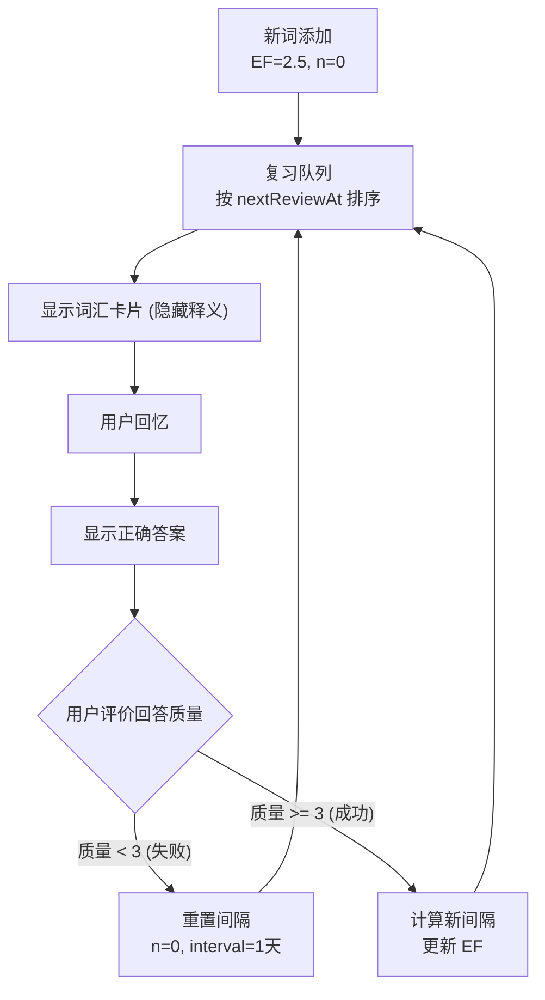

# 学习算法文档

## 概述

核心算法:
- 间隔重复 (Spaced Repetition) - SM-2 算法
- 掌握度计算 (Mastery Calculation)
- 难度评估 (Difficulty Assessment)
- 推荐算法 (Recommendation)
- 每日目标 (Daily Goal)

## 间隔重复算法 (SM-2)

基于 SuperMemo 2 (SM-2) 算法，根据回答质量动态调整复习间隔。

### 关键参数

| 参数 | 说明 | 范围 |
|------|------|------|
| EF (Easiness Factor) | 简易度因子 | 1.3 - 2.5 |
| n (repetitions) | 复习次数 | 0+ |
| I(n) | 第 n 次复习的间隔天数 | 1+ |
| q (quality) | 回答质量 | 0-5 |

### 间隔计算规则

| 条件 | 间隔 |
|------|------|
| I(1) - 第一次复习 | 1 天 |
| I(2) - 第二次复习 | 6 天 |
| I(n) - n > 2 | I(n-1) x EF (四舍五入) |

EF 更新公式: EF' = EF + (0.1 - (5 - q) x (0.08 + (5 - q) x 0.02))

约束: EF 最小值 1.3

### 回答质量与状态映射

| 质量 (q) | 处理方式 | 词汇状态 |
|---------|---------|---------|
| < 3 (失败) | 重置 repetitions = 0, interval = 1 天 | LEARNING |
| >= 3 (成功) | 按公式计算新间隔 | interval >= 21 天时为 MASTERED，否则 LEARNING |

### 词汇状态 (VocabStatus)

| 状态 | 说明 |
|------|------|
| NEW | 新词 (初始状态) |
| LEARNING | 学习中 |
| MASTERED | 已掌握 (间隔 >= 21 天) |

### 初始值

| 参数 | 初始值 |
|------|--------|
| easeFactor | 2.5 |
| intervalDays | 1 |
| repetitions | 0 |

## 间隔重复流程

## 间隔示例

假设 EF = 2.5，连续回答质量 >= 3:

| 复习次数 | 间隔 | 累计天数 |
|---------|------|---------|
| 1 | 1 天 | 1 |
| 2 | 6 天 | 7 |
| 3 | 15 天 | 22 |
| 4 | 38 天 | 60 |
| 5 | 95 天 | 155 |
| 6 | 238 天 | 393 |

## 掌握度计算

掌握度 = (correctCount / reviewCount) x 100 x stabilityFactor

stabilityFactor = min(1, n / 5) -- 复习 5 次以上才达到稳定

### 掌握度等级

| 范围 | 等级 |
|------|------|
| 0-20% | 新词 / 完全不熟 |
| 21-40% | 模糊认识 |
| 41-60% | 基本掌握 |
| 61-80% | 较好掌握 |
| 81-100% | 完全掌握 |

### 掌握度影响

- 影响复习优先级 (低掌握度优先)
- 影响每日目标计算
- 影响学习统计展示
- 影响词汇卡片排序

## 难度评估算法

### 书籍难度评估

基于 Flesch-Kincaid 可读性公式，分数范围 0-100 (越高越简单)。

难度分数 = 100 - Flesch Score

### 难度分数映射

| Flesch Score | 难度分数 | 难度等级 | CEFR 参考 |
|-------------|---------|---------|----------|
| 90-100 | 10-20 | 非常简单 | A1 |
| 80-89 | 21-35 | 简单 | A2 |
| 70-79 | 36-50 | 较简单 | A2-B1 |
| 60-69 | 51-65 | 标准 | B1 |
| 50-59 | 66-75 | 较难 | B1-B2 |
| 30-49 | 76-85 | 困难 | B2 |
| 0-29 | 86-100 | 非常困难 | C1-C2 |

### 用户水平与难度匹配

| 用户水平 | 推荐难度范围 |
|---------|------------|
| BEGINNER | 0-40 |
| INTERMEDIATE | 30-70 |
| ADVANCED | 60-100 |

推荐书籍时优先选择用户水平范围内的书籍。

## 每日目标算法

### 可配置目标

| 目标类型 | 可选值 | 默认值 |
|---------|--------|--------|
| 每日阅读时长 | 5 / 10 / 15 / 20 / 30 分钟 | 15 分钟 |
| 每日词汇目标 | 5 / 10 / 15 / 20 个 | 10 个 |

### 目标完成判定

满足任一条件即视为达成每日目标:
- readingMinutes >= dailyGoalMinutes
- (wordsLearned + wordsReviewed) >= goalWords

## 学习统计

### DailyStats 模型

每日统计记录 (按 userId + date 唯一):

| 字段 | 类型 | 说明 |
|------|------|------|
| readingMinutes | Int | 阅读分钟数 |
| pagesRead | Int | 阅读页数 |
| booksFinished | Int | 完成书籍数 |
| wordsLearned | Int | 新学词汇数 |
| wordsReviewed | Int | 复习词汇数 |
| reviewAccuracy | Float? | 复习正确率 |
| aiInteractions | Int | AI 交互次数 |

### 统计聚合

**周统计**
- 总阅读分钟数
- 总新学词汇数
- 总复习词汇数
- 活跃天数
- 日均阅读分钟数

**月统计**
- 总阅读分钟数
- 总新学词汇数
- 完成书籍数
- 日均活跃情况

## 推荐算法

### 推荐因素

| 因素 | 权重 | 说明 |
|------|------|------|
| 难度匹配 | 40% | 用户英语水平对应推荐难度范围 |
| 兴趣匹配 | 35% | 历史阅读类型偏好 + 显式兴趣标签 |
| 新鲜度 | 15% | 新上架书籍加成 + 未读过的作者加成 |
| 热门度 | 10% | 全局阅读人数 + 近期阅读趋势 |

### 推荐公式

score = difficultyScore x 0.4 + interestScore x 0.35 + freshnessScore x 0.15 + popularityScore x 0.1

### 过滤条件

- 排除已在用户书架中的书籍
- 排除已完成的书籍
- 难度在用户可接受范围内
