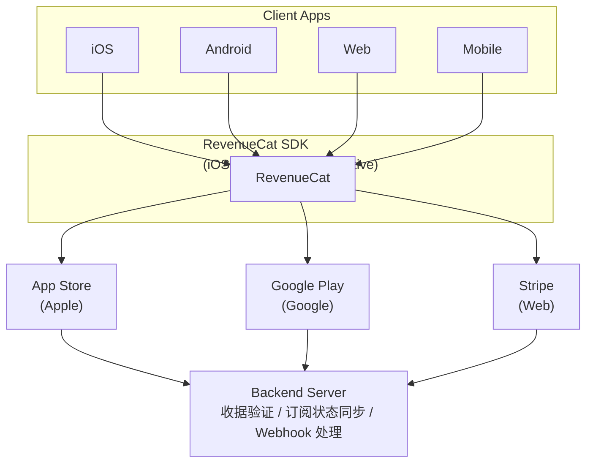

# 订阅系统设计

## 概述

```
┌─────────────────────────────────────────────────────────────────┐
│                   Subscription System                            │
├─────────────────────────────────────────────────────────────────┤
│  核心功能                                                        │
│  ├── 订阅等级管理                                               │
│  ├── 功能权限控制                                               │
│  ├── 支付处理 (IAP)                                             │
│  └── 收据验证                                                   │
└─────────────────────────────────────────────────────────────────┘
```

## 订阅架构



## 订阅等级

```
┌─────────────────────────────────────────────────────────────────┐
│                   Subscription Tiers                             │
├─────────────────────────────────────────────────────────────────┤
│                                                                  │
│  ┌─────────────────────────────────────────────────────────┐    │
│  │                      FREE                                │    │
│  │  ─────────────────────────────────────────────────────  │    │
│  │  价格: $0                                                │    │
│  │                                                          │    │
│  │  功能:                                                   │    │
│  │  ├── 基础阅读功能                                        │    │
│  │  ├── 每日 20 次 AI 解释                                  │    │
│  │  ├── 每日 10 次翻译                                      │    │
│  │  ├── 每日 5 次简化                                       │    │
│  │  ├── 有限词汇保存 (100 个)                               │    │
│  │  ├── 基础学习统计                                        │    │
│  │  └── 包含广告                                            │    │
│  └─────────────────────────────────────────────────────────┘    │
│                                                                  │
│  ┌─────────────────────────────────────────────────────────┐    │
│  │                  PREMIUM MONTHLY                         │    │
│  │  ─────────────────────────────────────────────────────  │    │
│  │  价格: $9.99/月                                          │    │
│  │  产品 ID: com.readmigo.premium.monthly                   │    │
│  │                                                          │    │
│  │  功能:                                                   │    │
│  │  ├── 所有 FREE 功能                                      │    │
│  │  ├── 无限 AI 解释/翻译/简化                              │    │
│  │  ├── 无限词汇保存                                        │    │
│  │  ├── 高级学习统计                                        │    │
│  │  ├── 离线阅读                                            │    │
│  │  ├── 无广告                                              │    │
│  │  ├── 有声书功能                                          │    │
│  │  └── 优先客服支持                                        │    │
│  └─────────────────────────────────────────────────────────┘    │
│                                                                  │
│  ┌─────────────────────────────────────────────────────────┐    │
│  │                  PREMIUM ANNUAL                          │    │
│  │  ─────────────────────────────────────────────────────  │    │
│  │  价格: $79.99/年 (节省 33%)                              │    │
│  │  产品 ID: com.readmigo.premium.annual                    │    │
│  │                                                          │    │
│  │  功能:                                                   │    │
│  │  ├── 所有 PREMIUM MONTHLY 功能                           │    │
│  │  └── 年度报告生成                                        │    │
│  └─────────────────────────────────────────────────────────┘    │
│                                                                  │
└─────────────────────────────────────────────────────────────────┘
```

## 功能权限矩阵

```
┌─────────────────────────────────────────────────────────────────┐
│                  Feature Permission Matrix                       │
├─────────────────────────────────────────────────────────────────┤
│                                                                  │
│  ┌────────────────────────┬────────┬──────────┬──────────┐      │
│  │  功能                  │  FREE  │ MONTHLY  │  ANNUAL  │      │
│  ├────────────────────────┼────────┼──────────┼──────────┤      │
│  │  基础阅读              │   ✓    │    ✓     │    ✓     │      │
│  │  阅读进度同步          │   ✓    │    ✓     │    ✓     │      │
│  │  书签功能              │   ✓    │    ✓     │    ✓     │      │
│  │  基础统计              │   ✓    │    ✓     │    ✓     │      │
│  ├────────────────────────┼────────┼──────────┼──────────┤      │
│  │  AI 解释               │ 20/天  │   无限   │   无限   │      │
│  │  AI 翻译               │ 10/天  │   无限   │   无限   │      │
│  │  AI 简化               │  5/天  │   无限   │   无限   │      │
│  ├────────────────────────┼────────┼──────────┼──────────┤      │
│  │  词汇保存              │  100个 │   无限   │   无限   │      │
│  │  间隔重复              │   ✓    │    ✓     │    ✓     │      │
│  │  词汇导出              │   ✗    │    ✓     │    ✓     │      │
│  ├────────────────────────┼────────┼──────────┼──────────┤      │
│  │  高级统计              │   ✗    │    ✓     │    ✓     │      │
│  │  学习报告              │   ✗    │    ✓     │    ✓     │      │
│  │  年度报告              │   ✗    │    ✗     │    ✓     │      │
│  ├────────────────────────┼────────┼──────────┼──────────┤      │
│  │  有声书                │   ✗    │    ✓     │    ✓     │      │
│  │  离线阅读              │   ✗    │    ✓     │    ✓     │      │
│  │  无广告                │   ✗    │    ✓     │    ✓     │      │
│  └────────────────────────┴────────┴──────────┴──────────┘      │
│                                                                  │
└─────────────────────────────────────────────────────────────────┘
```

## AI 配额管理

```
┌─────────────────────────────────────────────────────────────────┐
│                    AI Quota Management                           │
├─────────────────────────────────────────────────────────────────┤
│                                                                  │
│  配额规则                                                        │
│  ┌─────────────────────────────────────────────────────────┐    │
│  │                                                          │    │
│  │  FREE 用户配额                                           │    │
│  │  ├── explain: 20 次/天                                   │    │
│  │  ├── translate: 10 次/天                                 │    │
│  │  └── simplify: 5 次/天                                   │    │
│  │                                                          │    │
│  │  PREMIUM 用户配额                                        │    │
│  │  └── 所有功能无限制                                      │    │
│  │                                                          │    │
│  │  重置时间                                                │    │
│  │  └── 每日 UTC 00:00                                      │    │
│  │                                                          │    │
│  └─────────────────────────────────────────────────────────┘    │
│                                                                  │
│  配额检查流程                                                    │
│  ┌─────────────────────────────────────────────────────────┐    │
│  │                                                          │    │
│  │  ┌───────────────┐                                      │    │
│  │  │  AI Request   │                                      │    │
│  │  └───────┬───────┘                                      │    │
│  │          │                                               │    │
│  │          ▼                                               │    │
│  │  ┌───────────────────┐                                  │    │
│  │  │ Check Subscription│                                  │    │
│  │  └─────────┬─────────┘                                  │    │
│  │            │                                             │    │
│  │    ┌───────┴───────┐                                    │    │
│  │    │               │                                     │    │
│  │    ▼               ▼                                     │    │
│  │  Premium         Free                                    │    │
│  │    │               │                                     │    │
│  │    │               ▼                                     │    │
│  │    │       ┌───────────────┐                            │    │
│  │    │       │ Check Quota   │                            │    │
│  │    │       └───────┬───────┘                            │    │
│  │    │               │                                     │    │
│  │    │       ┌───────┴───────┐                            │    │
│  │    │       │               │                             │    │
│  │    │       ▼               ▼                             │    │
│  │    │   Has Quota      No Quota                          │    │
│  │    │       │               │                             │    │
│  │    │       │               ▼                             │    │
│  │    │       │       ┌─────────────┐                      │    │
│  │    │       │       │Show Paywall │                      │    │
│  │    │       │       └─────────────┘                      │    │
│  │    │       │                                             │    │
│  │    ▼       ▼                                             │    │
│  │  ┌─────────────────┐                                    │    │
│  │  │  Execute AI     │                                    │    │
│  │  │  Decrement Quota│                                    │    │
│  │  └─────────────────┘                                    │    │
│  │                                                          │    │
│  └─────────────────────────────────────────────────────────┘    │
│                                                                  │
└─────────────────────────────────────────────────────────────────┘
```

## 购买流程

```
┌─────────────────────────────────────────────────────────────────┐
│                    Purchase Flow                                 │
├─────────────────────────────────────────────────────────────────┤
│                                                                  │
│  iOS/Android 购买流程                                            │
│  ┌─────────────────────────────────────────────────────────┐    │
│  │                                                          │    │
│  │  ┌─────────┐     ┌───────────┐     ┌─────────┐          │    │
│  │  │  Client │     │ RevenueCat│     │  Store  │          │    │
│  │  └────┬────┘     └─────┬─────┘     └────┬────┘          │    │
│  │       │                │                │                │    │
│  │       │  1. 获取产品   │                │                │    │
│  │       │───────────────▶│                │                │    │
│  │       │                │  2. 加载产品   │                │    │
│  │       │                │───────────────▶│                │    │
│  │       │                │◀───────────────│                │    │
│  │       │◀───────────────│                │                │    │
│  │       │                │                │                │    │
│  │       │  3. 显示 Paywall                │                │    │
│  │       │                │                │                │    │
│  │       │  4. 发起购买   │                │                │    │
│  │       │───────────────▶│                │                │    │
│  │       │                │  5. 处理支付   │                │    │
│  │       │                │───────────────▶│                │    │
│  │       │                │                │                │    │
│  │       │                │  6. 返回收据   │                │    │
│  │       │                │◀───────────────│                │    │
│  │       │                │                │                │    │
│  │       │  7. 验证收据   │                │                │    │
│  │       │                │─────────┐      │                │    │
│  │       │                │         │      │                │    │
│  │       │                │◀────────┘      │                │    │
│  │       │                │                │                │    │
│  │       │  8. 更新权限   │                │                │    │
│  │       │◀───────────────│                │                │    │
│  │       │                │                │                │    │
│  │       │  9. 同步后端   │                │                │    │
│  │       │────────────────────────────────▶│                │    │
│  │       │                │                │                │    │
│  │                                                          │    │
│  └─────────────────────────────────────────────────────────┘    │
│                                                                  │
└─────────────────────────────────────────────────────────────────┘
```

## 收据验证

```
┌─────────────────────────────────────────────────────────────────┐
│                   Receipt Verification                           │
├─────────────────────────────────────────────────────────────────┤
│                                                                  │
│  Apple 收据验证                                                  │
│  ┌─────────────────────────────────────────────────────────┐    │
│  │                                                          │    │
│  │  方式: Server-to-Server Notifications                    │    │
│  │                                                          │    │
│  │  流程:                                                   │    │
│  │  1. App Store 发送通知到后端                             │    │
│  │  2. 后端验证通知签名                                     │    │
│  │  3. 解析 JWS (JSON Web Signature)                        │    │
│  │  4. 更新用户订阅状态                                     │    │
│  │                                                          │    │
│  │  通知类型:                                               │    │
│  │  ├── INITIAL_BUY: 首次购买                               │    │
│  │  ├── DID_RENEW: 续订成功                                 │    │
│  │  ├── DID_FAIL_TO_RENEW: 续订失败                         │    │
│  │  ├── DID_CHANGE_RENEWAL_STATUS: 自动续订状态变更         │    │
│  │  ├── EXPIRED: 订阅过期                                   │    │
│  │  ├── GRACE_PERIOD_EXPIRED: 宽限期过期                    │    │
│  │  └── REFUND: 退款                                        │    │
│  │                                                          │    │
│  └─────────────────────────────────────────────────────────┘    │
│                                                                  │
│  Google Play 收据验证                                            │
│  ┌─────────────────────────────────────────────────────────┐    │
│  │                                                          │    │
│  │  方式: Real-time Developer Notifications                 │    │
│  │                                                          │    │
│  │  流程:                                                   │    │
│  │  1. Google Play 发送 Pub/Sub 消息                        │    │
│  │  2. 后端解析通知内容                                     │    │
│  │  3. 调用 Google Play Developer API 验证                  │    │
│  │  4. 更新用户订阅状态                                     │    │
│  │                                                          │    │
│  └─────────────────────────────────────────────────────────┘    │
│                                                                  │
└─────────────────────────────────────────────────────────────────┘
```

## 订阅状态管理

```
┌─────────────────────────────────────────────────────────────────┐
│                Subscription State Management                     │
├─────────────────────────────────────────────────────────────────┤
│                                                                  │
│  状态流转                                                        │
│  ┌─────────────────────────────────────────────────────────┐    │
│  │                                                          │    │
│  │                    ┌─────────┐                          │    │
│  │                    │  FREE   │                          │    │
│  │                    └────┬────┘                          │    │
│  │                         │ 购买订阅                       │    │
│  │                         ▼                                │    │
│  │                    ┌─────────┐                          │    │
│  │         ┌──────────│  TRIAL  │──────────┐               │    │
│  │         │          └────┬────┘          │               │    │
│  │         │               │               │               │    │
│  │         │ 试用结束      │ 转为正式      │ 取消          │    │
│  │         │ (未付费)      │               │               │    │
│  │         │               ▼               │               │    │
│  │         │          ┌─────────┐          │               │    │
│  │         │          │ ACTIVE  │◀─────────┤               │    │
│  │         │          └────┬────┘          │               │    │
│  │         │               │               │               │    │
│  │         │       ┌───────┼───────┐       │               │    │
│  │         │       │       │       │       │               │    │
│  │         │       ▼       ▼       ▼       ▼               │    │
│  │         │   续订成功  续订失败  取消  退款              │    │
│  │         │       │       │       │       │               │    │
│  │         │       │       ▼       │       │               │    │
│  │         │       │  ┌─────────┐  │       │               │    │
│  │         │       │  │ GRACE   │  │       │               │    │
│  │         │       │  │ PERIOD  │  │       │               │    │
│  │         │       │  └────┬────┘  │       │               │    │
│  │         │       │       │       │       │               │    │
│  │         │       └───┬───┴───┬───┘       │               │    │
│  │         │           │       │           │               │    │
│  │         │           ▼       ▼           │               │    │
│  │         │       修复支付  宽限期过期     │               │    │
│  │         │           │       │           │               │    │
│  │         │           │       ▼           ▼               │    │
│  │         │           │  ┌─────────┐  ┌─────────┐        │    │
│  │         └───────────┼─▶│ EXPIRED │  │CANCELLED│        │    │
│  │                     │  └─────────┘  └─────────┘        │    │
│  │                     │       │               │           │    │
│  │                     │       └───────┬───────┘           │    │
│  │                     │               │                   │    │
│  │                     │               ▼ 重新订阅          │    │
│  │                     └───────────────────────────────────┘    │
│  │                                                          │    │
│  └─────────────────────────────────────────────────────────┘    │
│                                                                  │
└─────────────────────────────────────────────────────────────────┘
```

## 试用期管理

```
┌─────────────────────────────────────────────────────────────────┐
│                   Trial Period Management                        │
├─────────────────────────────────────────────────────────────────┤
│                                                                  │
│  试用规则                                                        │
│  ┌─────────────────────────────────────────────────────────┐    │
│  │  时长: 7 天                                              │    │
│  │  条件: 首次订阅用户                                      │    │
│  │  功能: 完整 Premium 功能                                 │    │
│  │  限制: 每个 Apple ID / Google 账号仅一次                 │    │
│  └─────────────────────────────────────────────────────────┘    │
│                                                                  │
│  试用结束处理                                                    │
│  ┌─────────────────────────────────────────────────────────┐    │
│  │                                                          │    │
│  │  ┌───────────────┐                                      │    │
│  │  │ Trial Ending  │                                      │    │
│  │  └───────┬───────┘                                      │    │
│  │          │                                               │    │
│  │          ▼                                               │    │
│  │  ┌───────────────────────────────────────────────┐      │    │
│  │  │ 提前 3 天发送推送提醒                          │      │    │
│  │  └───────────────────────────────────────────────┘      │    │
│  │          │                                               │    │
│  │          ▼                                               │    │
│  │  ┌───────────────────────────────────────────────┐      │    │
│  │  │ 提前 1 天发送最后提醒                          │      │    │
│  │  └───────────────────────────────────────────────┘      │    │
│  │          │                                               │    │
│  │          ▼                                               │    │
│  │  ┌───────────────────┐                                  │    │
│  │  │   Trial Ended     │                                  │    │
│  │  └─────────┬─────────┘                                  │    │
│  │            │                                             │    │
│  │    ┌───────┴───────┐                                    │    │
│  │    │               │                                     │    │
│  │    ▼               ▼                                     │    │
│  │  转为付费       降级为 FREE                              │    │
│  │                                                          │    │
│  └─────────────────────────────────────────────────────────┘    │
│                                                                  │
└─────────────────────────────────────────────────────────────────┘
```

## Paywall 设计

```
┌─────────────────────────────────────────────────────────────────┐
│                     Paywall Design                               │
├─────────────────────────────────────────────────────────────────┤
│                                                                  │
│  触发场景                                                        │
│  ┌─────────────────────────────────────────────────────────┐    │
│  │  ├── AI 配额用尽                                         │    │
│  │  ├── 尝试使用 Premium 功能                               │    │
│  │  ├── 词汇保存达到上限                                    │    │
│  │  ├── 设置页面点击升级                                    │    │
│  │  └── 有声书页面                                          │    │
│  └─────────────────────────────────────────────────────────┘    │
│                                                                  │
│  Paywall 布局                                                    │
│  ┌─────────────────────────────────────────────────────────┐    │
│  │                                                          │    │
│  │  ┌─────────────────────────────────────────────────┐    │    │
│  │  │              [关闭按钮]                          │    │    │
│  │  │                                                  │    │    │
│  │  │              ✨ Unlock Premium                   │    │    │
│  │  │                                                  │    │    │
│  │  │  ────────────────────────────────────────────   │    │    │
│  │  │                                                  │    │    │
│  │  │  ✓ 无限 AI 解释和翻译                           │    │    │
│  │  │  ✓ 无限词汇保存                                 │    │    │
│  │  │  ✓ 有声书功能                                   │    │    │
│  │  │  ✓ 离线阅读                                     │    │    │
│  │  │  ✓ 无广告体验                                   │    │    │
│  │  │                                                  │    │    │
│  │  │  ────────────────────────────────────────────   │    │    │
│  │  │                                                  │    │    │
│  │  │  ┌─────────────────────────────────────────┐   │    │    │
│  │  │  │  年度 (推荐)           $79.99/年        │   │    │    │
│  │  │  │  节省 33%              7 天免费试用     │   │    │    │
│  │  │  └─────────────────────────────────────────┘   │    │    │
│  │  │                                                  │    │    │
│  │  │  ┌─────────────────────────────────────────┐   │    │    │
│  │  │  │  月度                  $9.99/月         │   │    │    │
│  │  │  └─────────────────────────────────────────┘   │    │    │
│  │  │                                                  │    │    │
│  │  │          [开始免费试用]                         │    │    │
│  │  │                                                  │    │    │
│  │  │  恢复购买 | 服务条款 | 隐私政策                 │    │    │
│  │  │                                                  │    │    │
│  │  └─────────────────────────────────────────────────┘    │    │
│  │                                                          │    │
│  └─────────────────────────────────────────────────────────┘    │
│                                                                  │
└─────────────────────────────────────────────────────────────────┘
```

## RevenueCat 集成

```
┌─────────────────────────────────────────────────────────────────┐
│                  RevenueCat Integration                          │
├─────────────────────────────────────────────────────────────────┤
│                                                                  │
│  配置                                                            │
│  ┌─────────────────────────────────────────────────────────┐    │
│  │  API Keys                                                │    │
│  │  ├── iOS: appl_xxxxxxxxxxxx                              │    │
│  │  ├── Android: goog_xxxxxxxxxxxx                          │    │
│  │  └── Public: shared across platforms                     │    │
│  │                                                          │    │
│  │  Entitlements                                            │    │
│  │  └── "premium": Premium 功能权限                         │    │
│  │                                                          │    │
│  │  Products                                                │    │
│  │  ├── com.readmigo.premium.monthly                        │    │
│  │  └── com.readmigo.premium.annual                         │    │
│  │                                                          │    │
│  │  Offerings                                               │    │
│  │  └── "default": 默认套餐展示                             │    │
│  │                                                          │    │
│  └─────────────────────────────────────────────────────────┘    │
│                                                                  │
│  核心功能                                                        │
│  ┌─────────────────────────────────────────────────────────┐    │
│  │                                                          │    │
│  │  getOfferings()                                          │    │
│  │  └── 获取可购买产品列表                                  │    │
│  │                                                          │    │
│  │  purchasePackage(package)                                │    │
│  │  └── 发起购买                                            │    │
│  │                                                          │    │
│  │  restorePurchases()                                      │    │
│  │  └── 恢复购买                                            │    │
│  │                                                          │    │
│  │  getCustomerInfo()                                       │    │
│  │  └── 获取用户订阅状态                                    │    │
│  │                                                          │    │
│  │  checkEntitlement("premium")                             │    │
│  │  └── 检查用户是否有 Premium 权限                         │    │
│  │                                                          │    │
│  └─────────────────────────────────────────────────────────┘    │
│                                                                  │
└─────────────────────────────────────────────────────────────────┘
```

## API 端点

```
┌─────────────────────────────────────────────────────────────────┐
│                  Subscription API Endpoints                      │
├─────────────────────────────────────────────────────────────────┤
│                                                                  │
│  ┌────────────────────────────────────────────────────────────┐ │
│  │  Endpoint                    │ Method │ Description        │ │
│  ├──────────────────────────────┼────────┼────────────────────┤ │
│  │  /subscriptions/status       │ GET    │ 获取订阅状态       │ │
│  │  /subscriptions/verify       │ POST   │ 验证收据           │ │
│  │  /subscriptions/webhook/apple│ POST   │ Apple 通知回调     │ │
│  │  /subscriptions/webhook/google│ POST  │ Google 通知回调    │ │
│  │  /ai/quota                   │ GET    │ 获取 AI 配额       │ │
│  └──────────────────────────────┴────────┴────────────────────┘ │
│                                                                  │
└─────────────────────────────────────────────────────────────────┘
```
