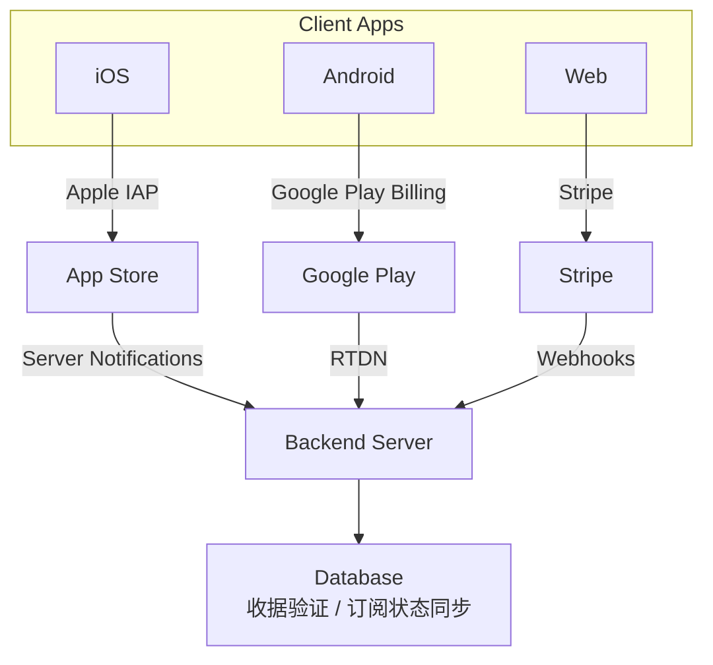
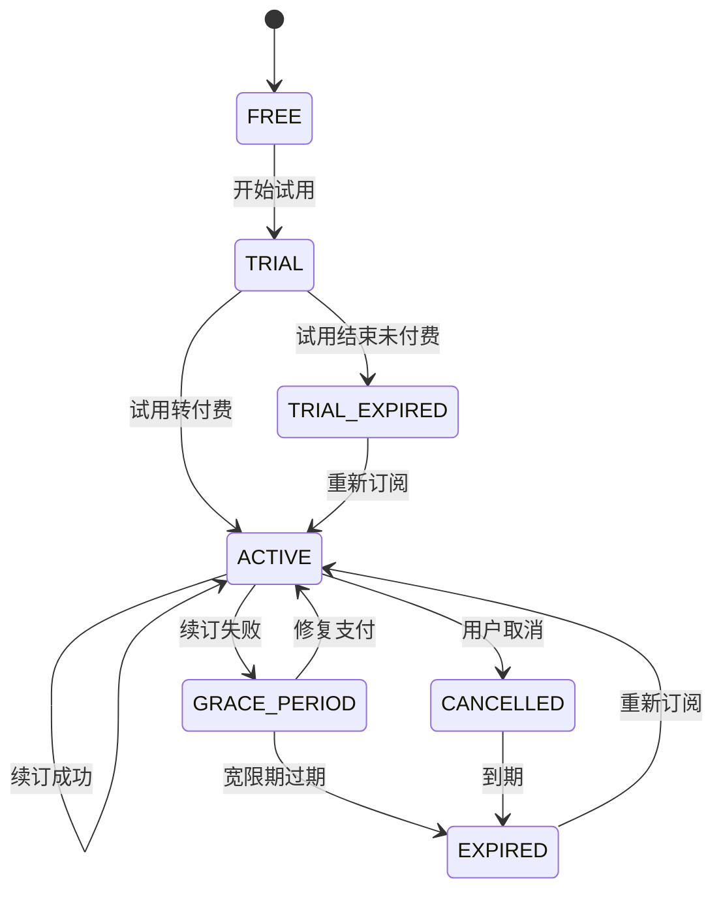
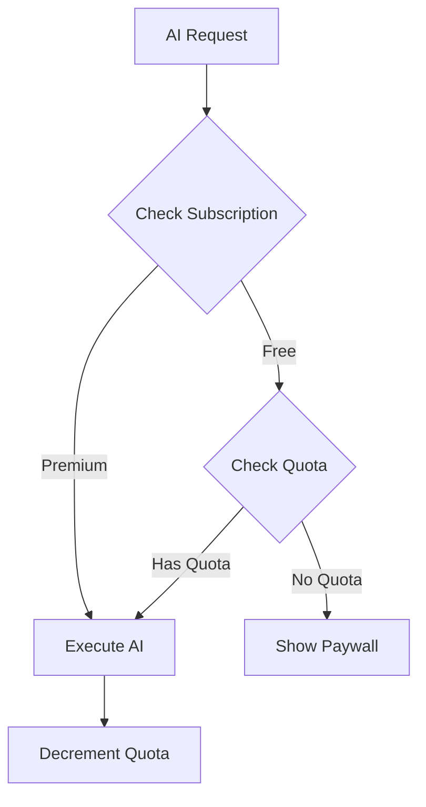

# 订阅系统设计

## 概述

核心功能: 订阅等级管理、功能权限控制、支付处理 (Apple IAP / Google Play / Stripe)、收据验证

## 订阅架构

注意: 实际实现直接对接 Apple/Google/Stripe，未使用 RevenueCat。

## 订阅等级

| 等级 | 价格 | 说明 |
|------|------|------|
| FREE | $0 | 基础功能，有配额限制 |
| PRO | 待定 | 中级功能 |
| PREMIUM | 待定 | 全部功能 |

## 订阅来源

| Source | 说明 |
|--------|------|
| NONE | 默认 (FREE 用户) |
| APPLE_IAP | App Store 内购 |
| GOOGLE_PLAY | Google Play 订阅 |
| STRIPE | Web 端 Stripe 支付 |
| PROMO_CODE | 促销码 |
| ADMIN_GRANT | 管理员授权 |

## 订阅状态

| Status | 说明 |
|--------|------|
| ACTIVE | 有效 |
| EXPIRED | 已过期 |
| CANCELLED | 已取消 |
| GRACE_PERIOD | 宽限期 (续订失败) |
| TRIAL | 试用中 |
| TRIAL_EXPIRED | 试用已过期 |

## 订阅状态流转

## 试用期管理

- 时长: 7 天
- 条件: 首次订阅用户 (trialUsed = false)
- 功能: 完整 Premium 功能
- 限制: 每个用户仅一次

试用结束处理:
1. 提前 3 天发送推送提醒
2. 提前 1 天最后提醒
3. 到期后转为付费或降级为 FREE

## API 端点

| Endpoint | Method | 描述 |
|----------|--------|------|
| /subscriptions/status | GET | 获取订阅状态 |
| /subscriptions/verify | POST | 验证 Apple App Store 收据 |
| /subscriptions/restore | POST | 恢复 Apple 购买 |
| /subscriptions/trial/eligibility | GET | 检查试用资格 |
| /subscriptions/trial/status | GET | 获取试用状态 |
| /subscriptions/trial/start | POST | 开始试用 |
| /subscriptions/google/verify | POST | 验证 Google Play 购买 |
| /subscriptions/google/restore | POST | 恢复 Google 购买 |
| /subscriptions/google/acknowledge | POST | 确认 Google 购买 |
| /subscriptions/stripe/create-checkout | POST | 创建 Stripe 结账会话 |
| /subscriptions/stripe/create-portal | POST | 创建 Stripe 客户门户 |
| /subscriptions/stripe/status | GET | 获取 Stripe 订阅状态 |

## Webhook 端点

| Endpoint | Method | 描述 |
|----------|--------|------|
| /subscriptions/webhook/apple | POST | Apple Server Notification 回调 |
| /subscriptions/webhook/google | POST | Google Play RTDN 回调 |
| /subscriptions/webhook/stripe | POST | Stripe Webhook 回调 |

## 收据验证

### Apple

- 方式: App Store Server API + Server-to-Server Notifications (v2)
- 通知类型: INITIAL_BUY, DID_RENEW, DID_FAIL_TO_RENEW, EXPIRED, GRACE_PERIOD_EXPIRED, REFUND 等

### Google Play

- 方式: Real-time Developer Notifications (RTDN) + Google Play Developer API
- 流程: Pub/Sub 消息 -> 解析 -> API 验证 -> 更新状态

### Stripe

- 方式: Stripe Webhooks
- 处理: checkout.session.completed, invoice.paid, customer.subscription.updated 等事件

## AI 配额管理

FREE 用户每日配额由后端按 UTC 00:00 重置。
