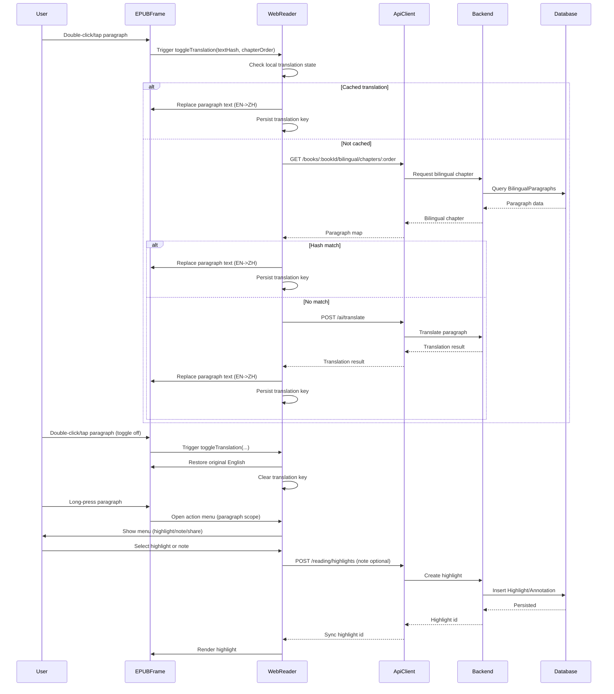

# Web Reader Instant Bilingual Flow (Reflow Replace)

## Summary

Web reader only. Default English. Double-click toggles paragraph translation (EN <-> ZH). Long-press opens the action menu (highlight, notes, share). Translation state is persisted across chapters and refreshes. Chinese display uses direct text replacement, which allows natural reflow.

## Goals

- Default English display with minimal UI noise.
- Double-click (or double-tap) toggles translation for a paragraph.
- Long-press opens the action menu; if no selection, actions apply to the whole paragraph.
- Translation state persists across chapters and page refresh.
- Avoid layout hacks; allow natural reflow to show full Chinese text.

## Non-Goals

- No paragraph interleaving mode.
- No sentence-level alignment.
- No vibration feedback (web only).

## Interaction Design

### Gestures

- Double-click (desktop) or double-tap (touch): toggle translation for the paragraph.
- Long-press (no drag, no selection): open action menu (highlight, notes, share, etc.).
- Selection is higher priority than long-press; if selection starts, cancel long-press.

### Translation Toggle Rules

- If paragraph is currently English: replace with Chinese.
- If paragraph is currently Chinese: restore English.
- If paragraph is translated and user invokes long-press menu, restore English before applying highlight/notes.

## Rendering Strategy (Reflow Replace)

- Replace the paragraph text content with Chinese (no overlay).
- Allow layout reflow; no line clamping or truncation.
- Add a short fade animation (80-120ms opacity) for the swap.

## Paragraph Eligibility

Only paragraphs that are safe to replace are eligible:

- Allowed tags: `p`, `blockquote`, `figcaption`.
- Excluded if any child node matches: `img`, `svg`, `table`, `pre`, `code`, `iframe`.

Unsupported paragraphs remain English and ignore double-click translation.

## Data Sources

- Primary: `GET /books/:bookId/bilingual/chapters/:order` (bilingual pipeline data).
- Fallback: `POST /ai/translate` for on-demand translation.

## End-to-End Design (Translation)

### Storage (DB + Files)

- Bilingual pipeline outputs to database tables:
  - `BilingualBook`, `BilingualParagraph` (see `packages/database/prisma/schema.prisma`).
- No server-side translation cache is required for this flow. Client persists translated paragraph keys.

### APIs

- `GET /books/:bookId/bilingual/chapters/:order` for bilingual paragraph data.
- `POST /ai/translate` for AI fallback translation.

### Clients

- Web (`apps/web`):
  - epub.js renders XHTML; DOM scanning maps paragraphs to `textHash`.
  - Translation toggles use bilingual data first, AI fallback if needed.
  - Translation state is persisted in `localStorage` (via reader store).
- iOS (design parity):
  - Use `WKWebView` with injected script to match web gestures and paragraph mapping.
  - Call the same APIs as web for bilingual/AI translation.
  - Persist translated keys in `UserDefaults` (or local cache) using the same key format.

### UI & Interaction

- Default English display in reader.
- Double-click/tap toggles translation per paragraph (EN <-> ZH).
- Long-press opens menu for highlight/notes/share; if no selection, acts on the whole paragraph.

## Paragraph Mapping

- Extract `textContent` from eligible nodes.
- Normalize text (trim, collapse whitespace, normalize quotes/dashes).
- Compute `textHash` and map to bilingual paragraphs by hash.
- If no exact match, skip translation to avoid misalignment.

## Persistence

- Persist translated paragraph keys per book.
- Key format: `${bookId}:${chapterOrder}:${textHash}`.
- Storage: `localStorage` (via zustand persist or dedicated cache module).
- On chapter render, scan eligible paragraphs and apply translation for persisted keys.
- Cap storage per book (e.g., 1000 entries) with LRU eviction.

## End-to-End Design (Highlight & Notes)

### UI Flow

- Long-press opens the action menu.
- If there is no selection, the action applies to the whole paragraph.
- Highlight colors and notes are saved using the reader store.

### APIs

- `POST /reading/highlights` creates a highlight (supports optional `note`).
- `PATCH /reading/highlights/:id` updates color/note.
- `DELETE /reading/highlights/:id` removes the highlight.

### Backend Persistence

- Highlights are stored in the `Highlight` table.
- Notes are stored via `Annotation` records (linked to highlights).
- Both models live in `packages/database/prisma/schema.prisma`.

## Sequence Diagram

## Event State Machine (High Level)

States:
- `idle`
- `doubleTapPending`
- `longPressPending`
- `translated`
- `menuOpen`
- `selecting`

Transitions:
- `pointerdown` -> `longPressPending`
- `pointermove` over threshold -> cancel long-press
- `selectionchange` -> `selecting` (cancel long-press)
- `dblclick`/`doubleTap` -> toggle `translated` state for target paragraph
- `longPressTimeout` -> `menuOpen`
- `pointerup`/`pointercancel` -> return to `idle`

## Non-Standard Content Handling

- Images, tables, code blocks, and complex layouts are not translated.
- `figcaption` is eligible for translation.

## Performance

- Bind handlers per chapter iframe via epub.js `rendition.hooks.content.register`.
- Cache bilingual chapter data in memory to avoid repeated fetches.
- Cache translations by `textHash` for instant toggles.

## Risks and Tradeoffs

- Reflow means paragraph heights change; acceptable by design.
- Some paragraphs may not match bilingual data due to EPUB structure; fallback to AI or skip.

## Acceptance Criteria

- Default English display.
- Double-click/tap toggles translation per paragraph.
- Long-press opens action menu; if no selection, apply to full paragraph.
- Translated paragraph states persist across chapters and refresh.
- No crashes or selection regressions in the reader.

## Related Files

- `docs/04-development/web/instant-bilingual-flow-web.md`
- `apps/web/src/features/reader/components/epub-reader.tsx`
- `apps/web/src/features/reader/components/selection-popup.tsx`
- `apps/web/src/features/reader/stores/reader-store.ts`
- `apps/web/src/features/reader/types/index.ts`
- `apps/web/src/features/reader/utils/translation-hash.ts`
- `packages/database/prisma/schema.prisma`
