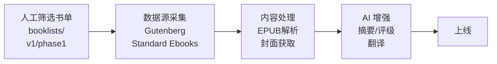
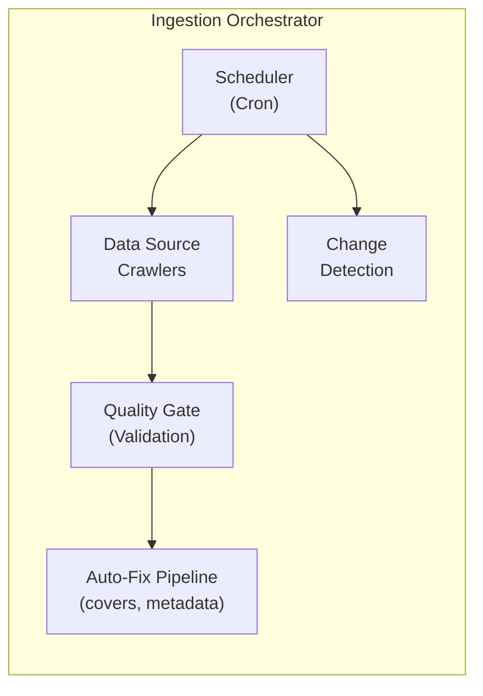
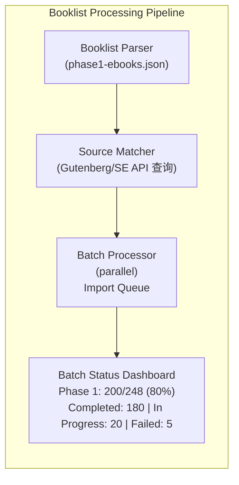
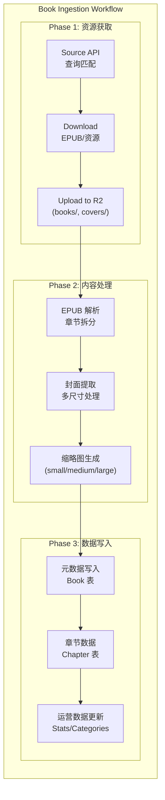
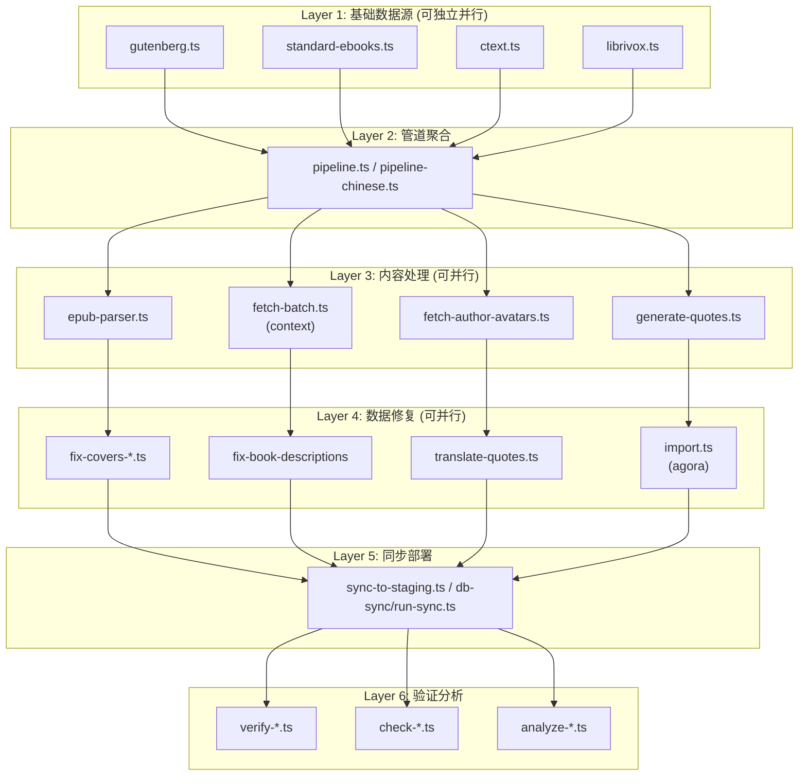
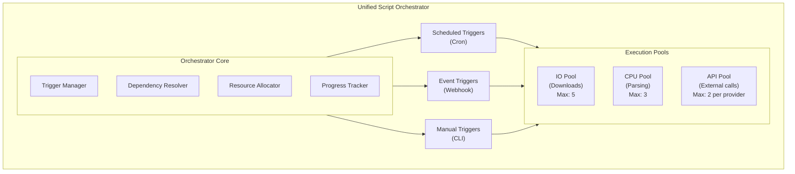
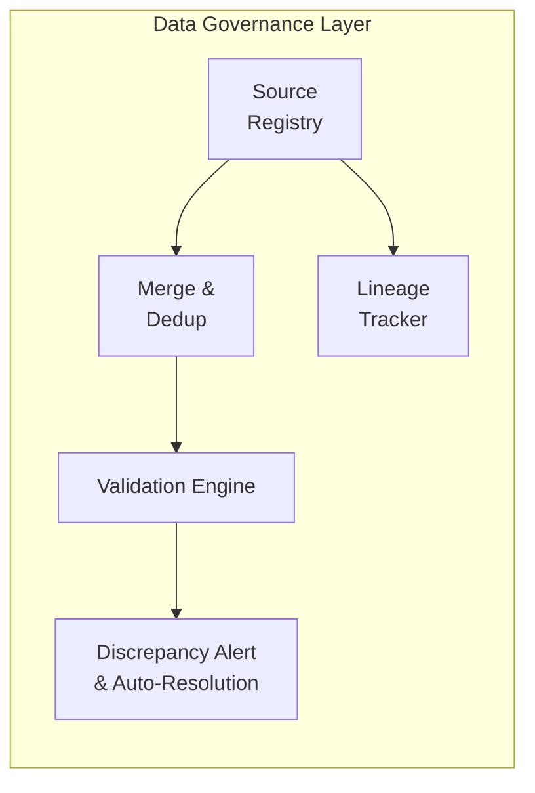
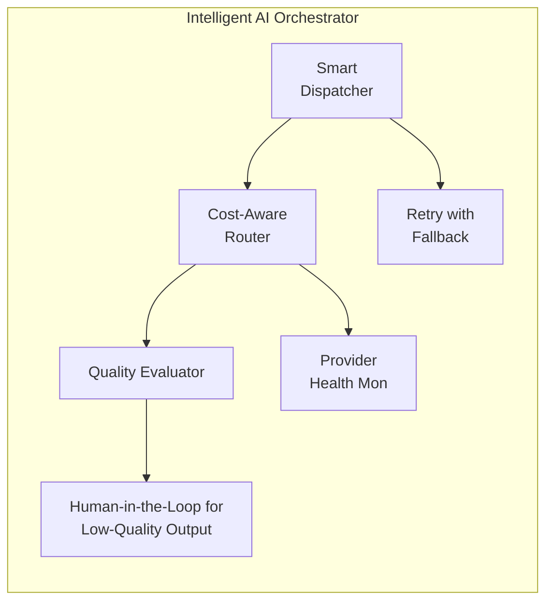
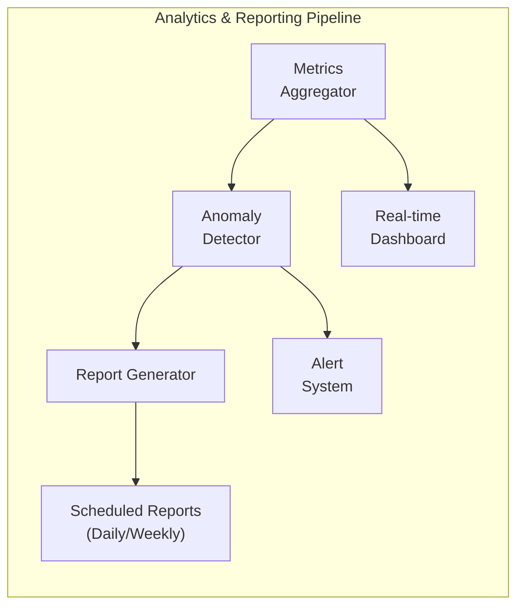

# Workflow 效率优化评估

## 概述

本文档评估 Readmigo 项目如何通过 Workflow 自动化提升处理效率、节省人力，涵盖四个核心领域：

1. 数据采集端
2. Source of Truth (Automation Tools)
3. AI Agent
4. Report / Analyzed Data

---

## 一、现状总览

| 领域 | 现状描述 | 自动化程度 | 痛点 |
|------|----------|-----------|------|
| 数据采集 | 110+ 手动脚本，依赖人工触发 | 20% | 重复劳动、易遗漏 |
| Source of Truth | 分散在多个数据源，无统一校验 | 20% | 数据不一致、追溯困难 |
| AI Agent | Bull MQ 队列系统，4 个处理器 | 80% | 缺乏自愈、成本优化 |
| Report/Analytics | 基础 Stats 模块，缺乏自动报告 | 20% | 手动统计、无告警 |

---

## 二、数据采集端

### 2.1 当前数据流程



**输入源结构：**

| 文件 | 位置 | 说明 |
|------|------|------|
| phase1-ebooks.json | data/booklists/v1/ | 书籍列表 (248 本去重) |
| phase1-authors.json | data/booklists/v1/ | 作者列表 |

**书单数据格式：**

| 字段 | 说明 | 示例 |
|------|------|------|
| title | 英文书名 | Pride and Prejudice |
| author | 作者名 | Jane Austen |
| chineseTitle | 中文书名 | 傲慢与偏见 |
| section | 优先级分类 | 1.1 P0 核心必选 |

### 2.2 现状问题

| 问题 | 影响 |
|------|------|
| 书单到采集全手动 | 每批次需人工执行多个脚本 |
| 110+ 独立脚本无统一调度 | 依赖人工记忆触发顺序 |
| Gutenberg/Standard Ebooks 手动匹配 | 书单书籍找源费时 |
| 封面修复需多次执行 (v1-v4) | 重复劳动 |
| 无批次状态追踪 | 不知道哪些书已完成 |

### 2.3 目标架构



### 2.4 组件说明

| 组件 | 功能 | 预期效果 |
|------|------|---------|
| Booklist Processor | 解析书单 JSON，生成采集任务 | 消除手动拆分 |
| Source Matcher | 自动匹配 Gutenberg/SE 资源 | 减少 90% 查找时间 |
| Quality Gate | 自动检测缺失封面、元数据 | 减少 60% 排查时间 |
| Batch Tracker | 追踪每批次进度和状态 | 可视化进度 |
| Auto-Fix Pipeline | 自动尝试修复常见问题 | 减少 70% 修复工作 |

### 2.5 书单处理流程优化



### 2.6 数据源匹配策略

| 数据源 | 匹配优先级 | 匹配方式 | 说明 |
|--------|-----------|---------|------|
| Standard Ebooks | 1 (最高) | Title + Author | 质量最佳 |
| Project Gutenberg | 2 | Title + Author | 覆盖广 |
| Internet Archive | 3 | Title fuzzy match | 补充来源 |
| 手动上传 | 4 | 人工指定 | 特殊情况 |

### 2.7 完整采集流程



**资源存储位置 (R2):**

| 资源类型 | R2 路径 | 说明 |
|----------|---------|------|
| EPUB 文件 | books/{bookId}/book.epub | 原始电子书 |
| 原始封面 | covers/{bookId}/original.jpg | 最大尺寸 |
| 大缩略图 | covers/{bookId}/large.jpg | 列表展示 |
| 中缩略图 | covers/{bookId}/medium.jpg | 卡片展示 |
| 小缩略图 | covers/{bookId}/small.jpg | 缩略预览 |

**数据库更新内容:**

| 表 | 更新内容 |
|-----|---------|
| Book | 书名、作者、描述、ISBN、字数等元数据 |
| Chapter | 章节标题、顺序、内容路径 |
| Author | 作者信息 (如新作者) |
| Category | 分类关联 |
| BookStats | 初始统计数据 |
| ImportBatch | 导入批次记录 |

---

## 三、现有脚本盘点

### 3.1 脚本总览

**总计：147 个脚本文件**

| 类型 | 数量 | 占比 |
|------|------|------|
| TypeScript (.ts) | 127 | 86.4% |
| SQL (.sql) | 15 | 10.2% |
| JavaScript (.js) | 1 | 0.7% |

**代码总量：** ~48,000 行

### 3.2 按功能分类

#### A. 书籍数据导入 (Book Ingestion) - 46 个

| 子类别 | 脚本 | 说明 |
|--------|------|------|
| 管道脚本 | pipeline.ts, pipeline-chinese.ts | 主导入管道 |
| 数据源 | gutenberg.ts, standard-ebooks.ts, ctext.ts, wikisource-zh.ts, librivox.ts | 各数据源爬取 |
| 处理器 | epub-parser.ts, mobi-parser.ts, html-cleaner.ts, difficulty-analyzer.ts | 内容处理 |
| 下载同步 | gutenberg-full-download.ts, sync-to-staging.ts, sync-audiobook-r2.ts | 资源获取 |
| 数据修复 | fix-single-book.ts, fix-chapter-content.ts | 问题修复 |

#### B. 封面处理 - 23 个

| 子类别 | 脚本 | 说明 |
|--------|------|------|
| 批量修复 | fix-covers-v2/v3/v4.ts, batch-update-covers.ts | 迭代修复 |
| 来源修复 | fix-covers-googlebooks.ts, fix-covers-openlibrary.ts | 按来源修复 |
| 检查诊断 | check-cover-issues.ts, verify-cover-update.ts | 质量检查 |

#### C. Agora 数据工具 - 11 个

| 子类别 | 脚本 | 说明 |
|--------|------|------|
| 生成导入 | generate-quotes.ts, import.ts | 金句生成和导入 |
| 翻译处理 | translate-quotes.ts, merge-translations.ts | 多语言处理 |
| 头像迁移 | fetch-author-avatars.ts, migrate-avatars-to-r2.ts | 作者头像 |

#### D. 书籍背景采集 - 6 个

| 脚本 | 说明 |
|------|------|
| fetch-single.ts | 单本书背景获取 |
| fetch-batch.ts | 批量书背景获取 |
| import-to-db.ts | 导入数据库 |
| wikipedia-fetcher.ts | Wikipedia 信息抓取 |

#### E. 翻译和本地化 - 10+ 个

| 子类别 | 脚本 | 说明 |
|--------|------|------|
| TS 脚本 | translate-book-descriptions.ts, translation-populate.ts | 翻译处理 |
| SQL 批量 | batch-context-translations-1~10.sql | 分批翻译导入 |

#### F. 数据库同步 - 3 个

| 脚本 | 说明 |
|------|------|
| run-sync.ts | 数据库同步 CLI |
| sync-manager.ts | 同步管理器核心 |
| anonymization-rules.ts | 数据匿名化规则 |

#### G. Staging 部署 - 7 个

| 脚本 | 说明 |
|------|------|
| init-staging-structure.ts | 初始化 staging 结构 |
| sync-booklist-to-staging.ts | 书单同步到 staging |
| complete-phase1-staging.ts | 完成 Phase1 同步 |

#### H. 分析诊断 - 12 个

| 脚本 | 说明 |
|------|------|
| analyze-all-books-optimization.ts | 全书优化分析 |
| diagnose-shakespeare.ts | 莎士比亚诊断 |
| check-low-wordcount-books.ts | 低词数书籍检查 |
| verify-book-id.ts | 书籍 ID 验证 |

### 3.3 脚本依赖关系



### 3.4 脚本执行频率分类

| 频率 | 脚本类型 | 数量 | 示例 |
|------|---------|------|------|
| 一次性 | 初始化/迁移 | ~30 | init-staging-structure.ts, import-authors.ts |
| 定期 (日/周) | 同步/监控 | ~50 | fetch-batch.ts, sync-discover-tabs.ts |
| 按需 | 修复/诊断 | ~50 | fix-covers-*.ts, diagnose-*.ts |
| 工具 | 辅助/测试 | ~17 | test-*.ts, compare-*.ts |

### 3.5 可并行执行的脚本组

| 组别 | 脚本 | 说明 |
|------|------|------|
| 数据源爬取组 | gutenberg.ts, standard-ebooks.ts, ctext.ts, librivox.ts | 完全独立 |
| 封面修复组 | fix-covers-googlebooks.ts, fix-covers-openlibrary.ts | 不同来源 |
| 翻译批次组 | batch-context-translations-1~10.sql | 数据不冲突 |
| 分析诊断组 | analyze-*.ts, check-*.ts | 只读操作 |

### 3.6 关键瓶颈点

| 瓶颈 | 影响脚本 | 原因 |
|------|---------|------|
| 外部 API 限速 | gutenberg.ts, wikipedia-fetcher.ts | 第三方限制 |
| 大文件处理 | epub-parser.ts, sync-audiobook-r2.ts | IO 密集 |
| 数据库并发 | 所有写入脚本 | 表锁冲突 |
| AI API | generate-quotes.ts, translate-*.ts | 成本和限速 |

---

## 四、统一调度方案

### 4.1 调度架构设计



### 4.2 触发方式设计

| 触发类型 | 使用场景 | 实现方式 |
|----------|---------|---------|
| Scheduled | 定期同步、日报生成 | GitHub Actions Cron |
| Event | 新书单提交、PR 合并 | GitHub Webhooks |
| Manual | 修复任务、一次性导入 | CLI 命令 |
| Chained | 依赖任务完成后自动触发 | Bull MQ Job Events |

### 4.3 任务编排定义

#### Pipeline: 新书单导入

```
Pipeline: book-ingestion-phase
├── Stage 1: 数据获取 (并行)
│   ├── Task: match-from-gutenberg     [IO Pool]
│   ├── Task: match-from-se            [IO Pool]
│   └── Task: match-from-archive       [IO Pool]
│
├── Stage 2: 内容处理 (并行，按书分片)
│   ├── Task: parse-epub               [CPU Pool]
│   ├── Task: extract-covers           [CPU Pool]
│   └── Task: generate-thumbnails      [CPU Pool]
│
├── Stage 3: 数据增强 (并行)
│   ├── Task: fetch-book-context       [API Pool - Wikipedia]
│   ├── Task: fetch-author-info        [API Pool - Wikidata]
│   └── Task: generate-ai-summary      [API Pool - AI]
│
├── Stage 4: 数据写入 (串行，避免锁)
│   ├── Task: write-books
│   ├── Task: write-chapters
│   └── Task: write-metadata
│
└── Stage 5: 验证同步
    ├── Task: validate-data
    └── Task: sync-to-staging
```

#### Pipeline: 日常维护

```
Pipeline: daily-maintenance
├── Stage 1: 数据检查 (并行)
│   ├── Task: check-cover-issues
│   ├── Task: check-low-wordcount
│   └── Task: check-missing-data
│
├── Stage 2: 自动修复 (串行)
│   └── Task: auto-fix-issues (基于检查结果)
│
└── Stage 3: 报告生成
    └── Task: generate-daily-report
```

### 4.4 资源池配置

| 资源池 | 最大并发 | 适用脚本 | 限制原因 |
|--------|---------|---------|---------|
| IO Pool | 5 | 下载、上传 R2 | 带宽限制 |
| CPU Pool | 3 | EPUB 解析、图片处理 | CPU 密集 |
| DB Pool | 2 | 数据库写入 | 避免锁竞争 |
| API Pool - Wikipedia | 2 | wikipedia-fetcher.ts | API 限速 |
| API Pool - AI | 1 | AI 生成任务 | 成本控制 |

### 4.5 调度时间表

| 时间 (UTC) | 任务 | 资源需求 |
|-----------|------|---------|
| 00:00 | Daily DB Backup | 低 |
| 02:00 | Gutenberg 增量同步 | IO Pool |
| 03:00 | Standard Ebooks 同步 | IO Pool |
| 04:00 | Cover 质量检查 | CPU Pool |
| 05:00 | 自动修复任务 | 混合 |
| 06:00 | AI 数据增强 (低峰) | API Pool |
| 09:00 | Daily Report 生成 | 低 |
| 12:00 | Context 批量获取 | API Pool |

### 4.6 CLI 命令设计

```
# 查看任务状态
pnpm orchestrator status

# 手动触发 Pipeline
pnpm orchestrator run book-ingestion --booklist=data/booklists/v1/phase1-ebooks.json

# 触发单个任务
pnpm orchestrator task fix-covers --source=googlebooks

# 查看队列状态
pnpm orchestrator queue list

# 暂停/恢复调度
pnpm orchestrator pause daily-maintenance
pnpm orchestrator resume daily-maintenance

# 查看执行历史
pnpm orchestrator history --last=10
```

### 4.7 状态追踪 Dashboard

```
┌─────────────────────────────────────────────────────────────────────────┐
│                       Script Orchestrator Dashboard                      │
│                                                                          │
│  Active Pipelines                                                        │
│  ┌────────────────────────────────────────────────────────────────────┐ │
│  │ book-ingestion-phase1    ████████████████░░░░  80%  ETA: 2h        │ │
│  │ daily-maintenance        ████████████████████  100% ✓ Done         │ │
│  │ cover-fix-batch          ██████░░░░░░░░░░░░░░  30%  Running...     │ │
│  └────────────────────────────────────────────────────────────────────┘ │
│                                                                          │
│  Resource Usage                                                          │
│  ┌─────────────┐ ┌─────────────┐ ┌─────────────┐ ┌─────────────┐       │
│  │ IO Pool     │ │ CPU Pool    │ │ DB Pool     │ │ API Pool    │       │
│  │ ███░░ 3/5   │ │ ██░░░ 2/3   │ │ █░░░░ 1/2   │ │ █░░░░ 1/2   │       │
│  └─────────────┘ └─────────────┘ └─────────────┘ └─────────────┘       │
│                                                                          │
│  Recent Activity                                                         │
│  ┌────────────────────────────────────────────────────────────────────┐ │
│  │ 14:32  ✓ parse-epub completed (Pride and Prejudice)                │ │
│  │ 14:30  → fetch-context started (Jane Eyre)                         │ │
│  │ 14:28  ✗ fix-cover failed (Moby Dick) - retry scheduled            │ │
│  │ 14:25  ✓ sync-to-r2 completed (batch-42)                           │ │
│  └────────────────────────────────────────────────────────────────────┘ │
└─────────────────────────────────────────────────────────────────────────┘
```

### 4.8 错误处理策略

| 错误类型 | 处理策略 | 重试次数 | 回退方案 |
|----------|---------|---------|---------|
| 网络超时 | 指数退避重试 | 3 | 标记待处理 |
| API 限速 | 延迟队列 | 5 | 降级到备用 API |
| 解析失败 | 记录跳过 | 1 | 人工处理队列 |
| 数据库锁 | 随机延迟重试 | 3 | 告警通知 |
| AI 生成失败 | 切换 Provider | 2 | 标记人工审核 |

### 4.9 实现技术栈

| 组件 | 技术选型 | 说明 |
|------|---------|------|
| 调度引擎 | Bull MQ + Bull Board | 已有基础设施 |
| 定时触发 | GitHub Actions | CI/CD 集成 |
| 任务定义 | YAML Pipeline Config | 声明式配置 |
| 状态存储 | Redis | 高性能 |
| 监控 UI | Bull Board + 自定义 | 可视化 |

### 4.10 迁移计划

| 阶段 | 内容 | 涉及脚本数 |
|------|------|-----------|
| Phase 1 | 核心导入脚本纳入调度 | 15 |
| Phase 2 | 封面/翻译脚本纳入 | 25 |
| Phase 3 | 全部维护脚本纳入 | 40 |
| Phase 4 | 淘汰冗余脚本 | -20 |

---

## 五、Source of Truth (Automation Tools)

### 5.1 现状问题

| 问题 | 影响 |
|------|------|
| 数据分散于多个源 | 同一书籍可能有多个记录 |
| 无 "golden record" 验证 | 数据质量无法保证 |
| 环境同步依赖手动 db-sync | 环境数据不一致 |
| 缺乏数据血缘追踪 | 问题定位困难 |

### 5.2 目标架构



### 5.3 组件说明

| 组件 | 功能 | 预期效果 |
|------|------|---------|
| Source Registry | 记录每条数据来源及优先级 | 减少 90% 追溯时间 |
| Merge & Dedup | 跨数据源去重、合并最佳记录 | 消除 100% 手动合并 |
| Validation Engine | 自动校验必填字段、格式 | 减少 70% 排错时间 |
| Lineage Tracker | 数据变更历史追踪 | 减少 80% 问题定位时间 |

### 5.4 数据源优先级

| 优先级 | 数据源 | 说明 |
|--------|--------|------|
| 1 | Standard Ebooks | 最高质量，优先采用 |
| 2 | 手动维护数据 | 人工校对数据 |
| 3 | Project Gutenberg | 数量多但质量参差 |
| 4 | WikiSource | 补充来源 |
| 5 | 其他来源 | 最低优先级 |

---

## 六、AI Agent

### 6.1 现状优势

| 已有能力 | 状态 |
|----------|------|
| Bull MQ 队列系统 | 已建立 |
| 4 个专用处理器 (author/book/quote/batch) | 运行中 |
| 多 AI 提供商集成 | OpenAI/DeepSeek/Claude/Qwen |
| 数据缺口分析 | 已实现 |

### 6.2 现状问题

| 问题 | 影响 |
|------|------|
| 缺乏智能调度 | 无法平衡成本与速度 |
| 无自愈机制 | 失败任务需手动重试 |
| 缺乏 AI 输出质量评估 | 低质量内容可能上线 |
| 无 Provider 健康监控 | 某 Provider 故障影响全局 |

### 6.3 目标架构



### 6.4 组件说明

| 组件 | 功能 | 预期效果 |
|------|------|---------|
| Smart Dispatcher | 根据任务类型选择最优 AI | 降低成本 30-50% |
| Cost-Aware Router | 批量任务用便宜模型 | 降低成本 20% |
| Quality Evaluator | 自动评估输出质量分数 | 减少 60% QA 时间 |
| Retry with Fallback | 失败自动切换 Provider | 减少 90% 手动重试 |
| Provider Health Mon | 监控各 Provider 状态 | 避免全局故障 |

### 6.5 AI 任务路由策略

| 任务类型 | 推荐 Provider | 备选 | 原因 |
|----------|--------------|------|------|
| 书籍摘要 | DeepSeek | OpenAI | 成本低、质量可接受 |
| CEFR 评级 | OpenAI | DeepSeek | 准确性要求高 |
| 作者传记 | Claude | OpenAI | 文学性要求高 |
| 引文翻译 | Qwen | DeepSeek | 中文质量好 |
| 批量任务 | DeepSeek | - | 成本优先 |

---

## 七、Report / Analyzed Data

### 7.1 现状问题

| 问题 | 影响 |
|------|------|
| 仅有基础 Stats 模块 | 无法快速了解运营状况 |
| 无自动生成报告 | 每次需手动统计 |
| 缺乏异常检测告警 | 问题发现延迟 |
| Dashboard 数据需手动查看 | 被动监控 |

### 7.2 目标架构



### 7.3 组件说明

| 组件 | 功能 | 预期效果 |
|------|------|---------|
| Metrics Aggregator | 自动汇总运营指标 | 消除 100% 手动统计 |
| Anomaly Detector | 异常自动检测 | 减少 80% 问题发现时间 |
| Report Generator | 日报/周报自动生成 | 减少 90% 报告编写时间 |
| Alert System | Slack/Email 实时通知 | 减少 70% 监控巡检 |

### 7.4 报告类型规划

| 报告类型 | 频率 | 内容 | 接收人 |
|----------|------|------|--------|
| Daily Operations | 每日 | 导入数量、失败率、AI 使用量 | 运营 |
| Weekly Growth | 每周 | 用户增长、阅读数据、留存 | 产品 |
| Monthly Business Review | 每月 | 综合数据、趋势分析 | 管理层 |
| Real-time Alerts | 实时 | 错误率飙升、AI 配额告警 | 技术 |

### 7.5 告警规则建议

| 指标 | 阈值 | 告警级别 | 处理方式 |
|------|------|---------|---------|
| API 错误率 | > 5% | P1 | 立即通知 |
| AI 任务失败率 | > 10% | P2 | 1小时内处理 |
| 导入失败数 | > 50/天 | P2 | 当日处理 |
| AI 配额使用 | > 80% | P3 | 提前预警 |
| 数据缺口增长 | > 100/周 | P3 | 周度处理 |

---

## 八、实施优先级

### 8.1 优先级矩阵

| 优先级 | 项目 | 预期影响 | 复杂度 | 建议时间 |
|--------|------|---------|--------|---------|
| **P0** | AI Agent 自愈机制 | 减少 90% 手动重试 | 低 | Phase 1 |
| **P0** | 数据采集 Scheduler | 消除手动触发 | 中 | Phase 1 |
| **P1** | Quality Gate 验证 | 减少 70% 数据问题 | 中 | Phase 2 |
| **P1** | Daily Report Generator | 减少 100% 报告时间 | 低 | Phase 2 |
| **P2** | Smart AI Router | 降低 30% AI 成本 | 中 | Phase 3 |
| **P2** | Anomaly Detector | 早发现问题 | 中 | Phase 3 |
| **P3** | Data Lineage Tracker | 长期可维护性 | 高 | Phase 4 |
| **P3** | Source Registry | 数据治理基础 | 高 | Phase 4 |

### 8.2 实施路线图

```
Phase 1 (基础自动化)
├── AI Agent 自愈机制
│   ├── 失败任务自动重试
│   └── Provider 故障自动切换
└── 数据采集 Scheduler
    ├── GitHub Actions 定时任务
    └── 增量更新机制

Phase 2 (质量保障)
├── Quality Gate 验证
│   ├── 必填字段检查
│   └── 格式规范验证
└── Daily Report Generator
    ├── 运营日报
    └── Slack 推送

Phase 3 (智能优化)
├── Smart AI Router
│   ├── 成本感知路由
│   └── 质量评估
└── Anomaly Detector
    ├── 异常检测算法
    └── 告警通知

Phase 4 (数据治理)
├── Data Lineage Tracker
│   └── 变更历史追踪
└── Source Registry
    └── 数据源优先级管理
```

---

## 九、技术选型建议

### 9.1 工具栈对比

| 领域 | 当前方案 | 建议补充 | 原因 |
|------|---------|---------|------|
| 调度 | 无 | GitHub Actions Scheduled | 已有 CI/CD 基础 |
| 队列 | Bull MQ | 保持现有 | 运行稳定 |
| 监控 | Sentry | + Grafana | 可视化更强 |
| 告警 | 无 | Slack Webhooks | 团队已使用 |
| 报告 | 无 | 自建 + Notion API | 灵活可定制 |

### 9.2 GitHub Actions 调度示例

| 任务 | Cron 表达式 | 说明 |
|------|------------|------|
| Daily Report | `0 9 * * *` | 每日 9:00 UTC |
| Gutenberg Sync | `0 3 * * 0` | 每周日 3:00 UTC |
| SE Sync | `0 4 * * *` | 每日 4:00 UTC |
| Data Gap Check | `0 6 * * 1` | 每周一 6:00 UTC |

---

## 十、预期收益

### 10.1 效率提升

| 领域 | 当前人力投入 | 优化后投入 | 节省比例 |
|------|-------------|-----------|---------|
| 数据采集触发 | 手动 | 自动 | 100% |
| 失败任务处理 | 手动重试 | 自动重试 | 90% |
| 日常报告 | 手动统计 | 自动生成 | 90% |
| 数据质量排查 | 手动检查 | 自动检测 | 70% |

### 10.2 成本优化

| 项目 | 预期节省 |
|------|---------|
| AI 调用成本 | 20-30% |
| 人力成本 | 60-70% |
| 问题修复时间 | 50-60% |

---

## 十一、风险与缓解

| 风险 | 影响 | 缓解措施 |
|------|------|---------|
| 自动化过度 | 难以调试 | 保留手动触发入口 |
| AI 质量不稳定 | 内容质量下降 | 质量评估 + 人工审核 |
| 调度冲突 | 资源竞争 | 错峰调度 + 资源限制 |
| 告警疲劳 | 忽略真实问题 | 告警分级 + 阈值调优 |

---

## 十二、下一步行动

1. **确认优先级**：与团队讨论 P0/P1 项目的具体实施顺序
2. **技术评审**：评估 GitHub Actions vs Temporal.io 的选型
3. **原型开发**：从 AI Agent 自愈机制开始试点
4. **监控基础**：搭建 Grafana Dashboard 基础架构
5. **文档完善**：为每个 Phase 编写详细设计文档

---

## 参考文档

- [Backend Architecture](../../../03-architecture/api/backend-architecture.md)
- [Workers Deployment](../deployment/platforms/workers-deployment.md)
- [Monitoring](../monitoring/monitoring.md)
- [CI/CD Configuration](../deployment/cicd-configuration-plan.md)
