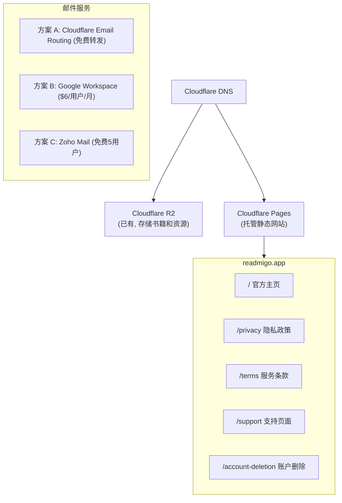

# App Store 上架 URL 及在线服务规划

> 应用上架 App Store / Google Play 所需的 URL 及托管方案设计

---

## 目录

1. [需求清单](#1-需求清单)
2. [URL 规划](#2-url-规划)
3. [托管方案对比](#3-托管方案对比)
4. [推荐方案详解](#4-推荐方案详解)
5. [页面内容规划](#5-页面内容规划)
6. [实施步骤](#6-实施步骤)
7. [维护策略](#7-维护策略)

---

## 1. 需求清单

### 1.1 必需 URL

| URL | 用途 | App Store | Google Play | 备注 |
|-----|------|-----------|-------------|------|
| **隐私政策** | 说明数据收集和使用 | 必须 | 必须 | 无法上架如缺失 |
| **服务条款** | 用户使用协议 | 推荐 | 推荐 | 强烈建议 |
| **支持页面** | 用户支持联系方式 | 必须 | 必须 | App Store 必填 |
| **账户删除说明** | 如何删除账户 | 必须(有账户) | 必须(有账户) | 2022年后强制 |

### 1.2 推荐 URL

| URL | 用途 | 优先级 | 备注 |
|-----|------|--------|------|
| **官方主页** | 产品介绍、品牌展示 | 高 | 提升可信度 |
| **常见问题 FAQ** | 自助答疑 | 中 | 减少客服压力 |
| **更新日志** | 版本更新记录 | 低 | 可选 |

### 1.3 邮箱需求

| 邮箱 | 用途 | 必需 |
|------|------|------|
| `support@readmigo.app` | 用户支持 | 是 |
| `privacy@readmigo.app` | 隐私相关咨询 | 是 |
| `legal@readmigo.app` | 法务相关 | 推荐 |
| `feedback@readmigo.app` | 用户反馈 | 可选 |

---

## 2. URL 规划

### 2.1 域名

**主域名**: `readmigo.app` ✅ 已注册

> 使用 `.app` 顶级域名，DNS 托管于 Cloudflare。

### 2.2 现有域名架构

项目已有以下域名配置：

| 子域名 | 用途 | 托管平台 | 状态 |
|--------|------|---------|------|
| `api.readmigo.app` | API 服务 | Fly.io | ✅ 已配置 |
| `cdn.readmigo.app` / `assets.readmigo.app` | 静态资源 CDN | Cloudflare R2 | ✅ 已配置 |
| `debug-api.readmigo.app` | 调试环境 API | Fly.io | 待配置 |
| `staging-api.readmigo.app` | 预发布环境 API | Fly.io | 待配置 |
| `dashboard.readmigo.app` | 管理后台 | - | 待配置 |
| `readmigo.app` | **官网 + 法律页面** | Cloudflare Pages | **待实施** |

### 2.3 待实施 URL 结构

```
https://readmigo.app/
├── /                          # 官方主页
├── /privacy                   # 隐私政策 (英文)
├── /privacy/zh                # 隐私政策 (中文)
├── /terms                     # 服务条款 (英文)
├── /terms/zh                  # 服务条款 (中文)
├── /support                   # 支持页面
├── /support/account-deletion  # 账户删除说明
├── /support/faq               # 常见问题 (可选)
└── /changelog                 # 更新日志 (可选)
```

### 2.4 语言版本

| 页面 | 英文 | 中文 | 其他语言 |
|------|------|------|---------|
| 隐私政策 | `/privacy` | `/privacy/zh` | 按需添加 |
| 服务条款 | `/terms` | `/terms/zh` | 按需添加 |
| 支持页面 | `/support` | `/support/zh` | 按需添加 |
| 主页 | `/` | `/?lang=zh` | 按需添加 |

---

## 3. 托管方案对比

### 3.1 方案概览

| 方案 | 成本 | 技术复杂度 | 专业度 | 维护成本 | 推荐场景 |
|------|------|-----------|--------|---------|---------|
| **Cloudflare Pages** | 免费 | 低 | 高 | 低 | 推荐方案 |
| GitHub Pages | 免费 | 低 | 中 | 低 | 备选 |
| Vercel | 免费(小规模) | 低 | 高 | 低 | 备选 |
| Netlify | 免费(小规模) | 低 | 高 | 低 | 备选 |
| 第三方法律SaaS | $10-50/月 | 极低 | 高 | 极低 | 快速上线 |
| 自建服务器 | $5-20/月 | 高 | 高 | 高 | 不推荐 |

### 3.2 方案详细对比

#### 方案 A: Cloudflare Pages (推荐)

**优点**:
- 免费无限流量和带宽
- 全球 CDN 加速
- 自动 HTTPS
- 与 Cloudflare R2 (已在用) 统一管理
- 支持自定义域名
- 构建速度快

**缺点**:
- 需要编写简单的静态页面

**成本**: 免费

#### 方案 B: GitHub Pages

**优点**:
- 完全免费
- 与代码仓库集成
- 自动部署

**缺点**:
- 需要公开仓库 (或 Pro 账户)
- 不如 Cloudflare 快

**成本**: 免费

#### 方案 C: 第三方法律 SaaS (Termly / Iubenda)

**优点**:
- 自动生成合规政策
- 自动更新法规变化
- 无需维护

**缺点**:
- 付费服务
- 品牌定制受限
- 外观不够统一

**成本**: $10-50/月

---

## 4. 推荐方案详解

### 4.1 推荐架构



### 4.2 技术栈选择

| 组件 | 选择 | 理由 |
|------|------|------|
| **托管平台** | Cloudflare Pages | 与现有 R2 统一、免费、快速 |
| **网站框架** | 纯静态 HTML/CSS | 简单、无依赖、加载快 |
| **样式方案** | Tailwind CSS (CDN) | 快速开发、响应式 |
| **多语言** | 目录结构 | `/zh/` 子目录 |
| **邮件服务** | Cloudflare Email Routing | 免费转发到现有邮箱 |

### 4.3 文件结构

```
website/
├── index.html                    # 官方主页
├── privacy.html                  # 隐私政策
├── terms.html                    # 服务条款
├── support.html                  # 支持页面
├── support/
│   └── account-deletion.html     # 账户删除说明
├── zh/
│   ├── privacy.html              # 中文隐私政策
│   ├── terms.html                # 中文服务条款
│   └── support.html              # 中文支持页面
├── assets/
│   ├── logo.svg                  # Logo
│   ├── app-store-badge.svg       # App Store 下载徽章
│   ├── google-play-badge.png     # Google Play 下载徽章
│   └── screenshots/              # 应用截图
└── _redirects                    # URL 重定向规则
```

---

## 5. 页面内容规划

### 5.1 官方主页

**目的**: 产品介绍、品牌展示、引导下载

**内容模块**:

```
1. Hero Section
   - 标语: "Read any book. AI has your back."
   - 简短介绍
   - 下载按钮 (App Store / Google Play)
   - 产品截图

2. 功能介绍
   - AI 单词解释
   - 句子简化
   - 翻译功能
   - 词汇学习

3. 书库展示
   - "200+ 经典名著"
   - 部分书籍封面展示

4. 页脚
   - 隐私政策链接
   - 服务条款链接
   - 支持链接
   - 社交媒体 (可选)
   - 版权信息
```

### 5.2 隐私政策页面

**内容**: 使用 `docs/09-reference/legal/privacy-policy.md` 已有内容

**补充事项**:
- [ ] 添加最后更新日期
- [ ] 添加公司地址 (目前是 `[Your Company Address]`)
- [ ] 添加 AI 服务提供商隐私政策链接
- [ ] 添加数据保护官联系方式 (GDPR 需要)

### 5.3 服务条款页面

**内容**: 使用 `docs/09-reference/legal/terms-of-service.md` 已有内容

**补充事项**:
- [ ] 添加最后更新日期
- [ ] 补充 `[Jurisdiction]` 管辖法律
- [ ] 添加争议解决机制

### 5.4 支持页面

**内容**:

```markdown
# 联系支持

## 联系方式
- Email: support@readmigo.app
- 响应时间: 1-2 个工作日

## 常见问题

### 账户相关
Q: 如何登录?
A: 使用 Sign in with Apple 或 Google 登录

Q: 如何删除账户?
A: 进入 设置 → 账户 → 删除账户，或联系 support@readmigo.app

### 订阅相关
Q: 如何取消订阅?
A: 进入 iPhone 设置 → Apple ID → 订阅，找到 Readmigo 取消

Q: 如何恢复购买?
A: 进入 设置 → 恢复购买

### 功能相关
Q: AI 功能有使用限制吗?
A: 免费版每天 10 次 AI 交互，订阅后无限制

Q: 支持离线阅读吗?
A: 下载的书籍支持离线阅读，AI 功能需要联网
```

### 5.5 账户删除页面

**内容**:

```markdown
# 账户删除

## 如何删除您的账户

### 方式 1: App 内删除 (推荐)
1. 打开 Readmigo App
2. 进入 "设置" → "账户"
3. 点击 "删除账户"
4. 确认删除

### 方式 2: 邮件申请
发送邮件至 support@readmigo.app，主题为 "账户删除请求"，包含:
- 注册邮箱地址
- 删除原因 (可选)

我们将在 7 个工作日内处理您的请求。

## 删除后会发生什么

### 将被删除的数据:
- 账户信息 (邮箱、昵称)
- 阅读进度
- 收藏的词汇
- AI 交互历史
- 订阅信息

### 保留的数据:
- 匿名化的使用统计 (用于产品改进)
- 法律要求保留的数据

### 注意事项:
- 账户删除不可撤销
- 如有活跃订阅，请先在 App Store 取消
- 删除账户不会自动退款

## 联系我们

如有疑问，请联系 privacy@readmigo.app
```

---

## 6. 实施步骤

### 阶段 1: 邮件配置

> 域名 `readmigo.app` 已注册，DNS 已托管于 Cloudflare。

**步骤 1.1: 配置邮件**
- 在 Cloudflare Dashboard 启用 Email Routing
- 创建以下转发规则:
  - `support@readmigo.app` → 个人/团队邮箱
  - `privacy@readmigo.app` → 个人/团队邮箱
  - `legal@readmigo.app` → 个人/团队邮箱

### 阶段 2: 创建官网

**步骤 2.1: 创建网站项目**
```bash
mkdir -p apps/website
cd apps/website
```

**步骤 2.2: 开发页面**
- 官方主页
- 隐私政策 (中/英)
- 服务条款 (中/英)
- 支持页面
- 账户删除页面

**步骤 2.3: 测试**
- 本地预览所有页面
- 检查响应式布局
- 检查链接正确性

### 阶段 3: 部署

**步骤 3.1: 创建 Cloudflare Pages 项目**
- 连接 Git 仓库
- 配置构建设置

**步骤 3.2: 配置自定义域名**
- 添加 `readmigo.app` 作为自定义域名
- 等待 SSL 证书生成

**步骤 3.3: 配置 URL 重定向**
```
# _redirects 文件
/privacy-policy    /privacy    301
/privacy-zh        /zh/privacy 301
/terms-of-service  /terms      301
```

### 阶段 4: 验证与上线

**步骤 4.1: 验证所有 URL**
- [ ] https://readmigo.app/ 可访问
- [ ] https://readmigo.app/privacy 可访问
- [ ] https://readmigo.app/terms 可访问
- [ ] https://readmigo.app/support 可访问
- [ ] https://readmigo.app/support/account-deletion 可访问
- [ ] 中文版本页面可访问
- [ ] HTTPS 证书有效
- [ ] 移动端显示正常

**步骤 4.2: 更新 App Store Connect**
- Privacy Policy URL: https://readmigo.app/privacy
- Terms of Service URL: https://readmigo.app/terms
- Support URL: https://readmigo.app/support
- Marketing URL: https://readmigo.app

**步骤 4.3: 更新 Google Play Console**
- 同上

---

## 7. 维护策略

### 7.1 定期更新

| 内容 | 更新频率 | 触发条件 |
|------|---------|---------|
| 隐私政策 | 按需 | 数据收集变化、法规变化 |
| 服务条款 | 按需 | 功能重大变化、政策变化 |
| 支持页面 | 按需 | FAQ 更新 |
| 主页 | 按需 | 版本更新、促销活动 |

### 7.2 版本控制

- 所有页面源码纳入 Git 版本控制
- 重大更新前保留历史版本
- 隐私政策和服务条款保留更新日期

### 7.3 监控

- 使用 Cloudflare Analytics 监控访问情况
- 定期检查所有链接可访问性
- 监控 SSL 证书有效期

---

## 8. 成本估算

### 8.1 一次性成本

| 项目 | 成本 | 备注 |
|------|------|------|
| 域名注册 | ~$15/年 | .app 域名 |
| 开发时间 | 4-8 小时 | 内部开发 |

### 8.2 持续成本

| 项目 | 成本 | 备注 |
|------|------|------|
| 域名续费 | ~$15/年 | |
| Cloudflare Pages | $0 | 免费 |
| Cloudflare Email Routing | $0 | 免费 |
| **总计** | **~$15/年** | |

---

## 9. 检查清单

### 上架前必须完成

- [ ] 域名已注册并配置 DNS
- [ ] 邮箱 support@readmigo.app 可接收邮件
- [ ] https://readmigo.app/privacy 可访问
- [ ] https://readmigo.app/terms 可访问
- [ ] https://readmigo.app/support 可访问
- [ ] 账户删除页面/流程可用
- [ ] 所有页面 HTTPS 正常
- [ ] 所有页面移动端适配

### 推荐完成

- [ ] 官方主页上线
- [ ] 中文版本页面
- [ ] FAQ 页面
- [ ] 下载徽章指向正确的商店链接

---

## 10. 附录

### 10.1 现有资源

| 资源 | 位置 | 状态 |
|------|------|------|
| 隐私政策 (英文) | `docs/09-reference/legal/privacy-policy.md` | 已完成 |
| 隐私政策 (中文) | `docs/09-reference/legal/privacy-policy-zh.md` | 已完成 |
| 服务条款 (英文) | `docs/09-reference/legal/terms-of-service.md` | 已完成 |
| 服务条款 (中文) | `docs/09-reference/legal/terms-of-service-zh.md` | 已完成 |
| App Store 提交指南 | `docs/04-development/platforms/ios/app-store-submission.md` | 已完成 |

### 10.2 参考链接

- [App Store Review Guidelines](https://developer.apple.com/app-store/review/guidelines/)
- [Google Play Developer Policy](https://play.google.com/about/developer-content-policy/)
- [Apple App Privacy Details](https://developer.apple.com/app-store/app-privacy-details/)
- [GDPR 合规指南](https://gdpr.eu/)
- [CCPA 合规指南](https://oag.ca.gov/privacy/ccpa)

### 10.3 App Store 链接格式

```
iOS App Store:
https://apps.apple.com/app/readmigo/id[APP_ID]

Google Play:
https://play.google.com/store/apps/details?id=com.readmigo.app
```

---

*文档版本: 1.0*
*创建日期: 2024年12月*
*作者: Claude Code*
