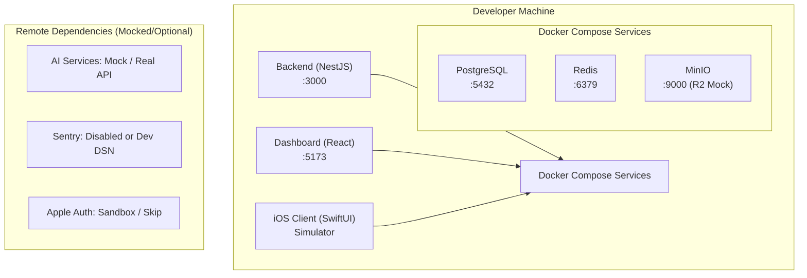
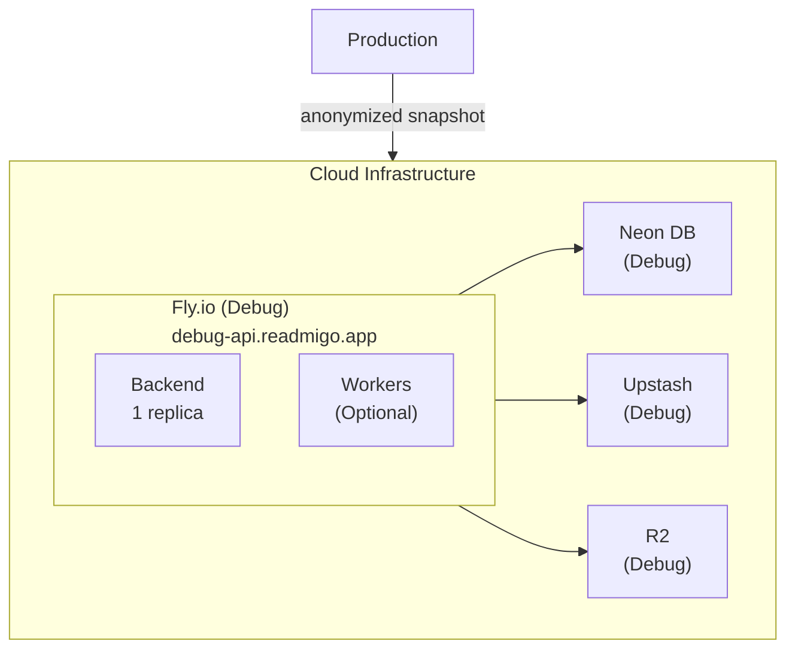
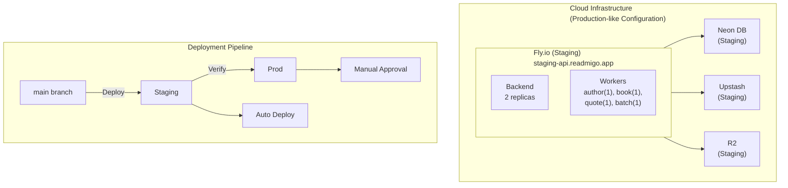
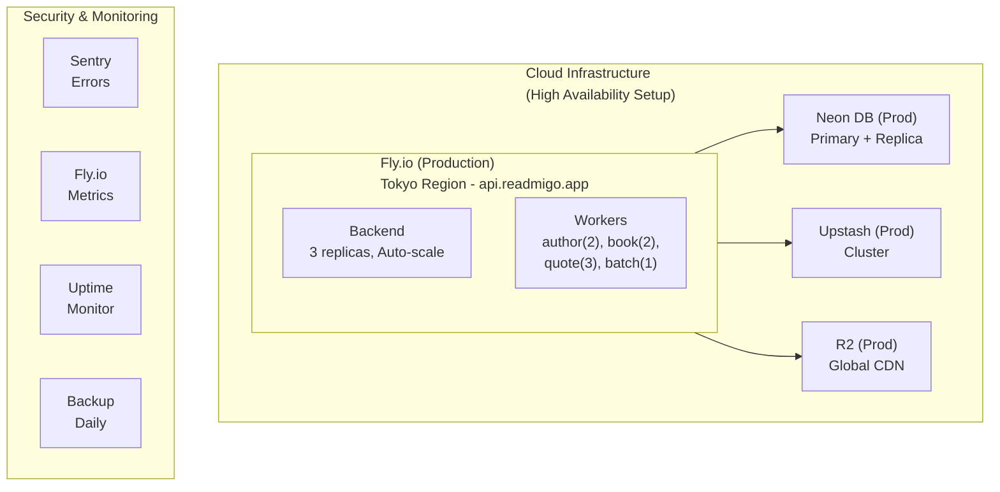
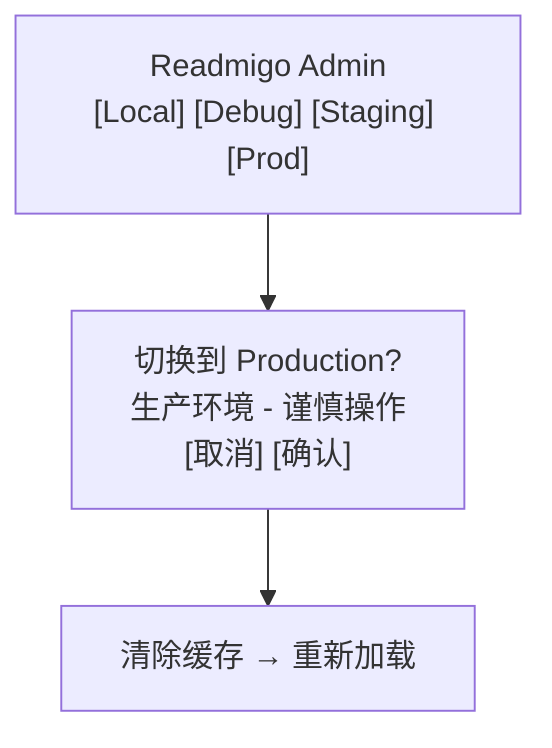

# Backend 环境配置详情

> 各环境详细设计、配置规范、客户端切换

---

## 1. 模块概述

```
┌─────────────────────────────────────────────────────────────────┐
│                    环境配置详情                                  │
├─────────────────────────────────────────────────────────────────┤
│                                                                  │
│  本文档内容                                                      │
│  ├── 各环境详细配置 (Local/Debugging/Staging/Production)        │
│  ├── 配置文件结构与验证                                          │
│  └── 客户端环境切换方案                                          │
│                                                                  │
│  相关文档                                                        │
│  ├── be-environment-overview.md (概述)                          │
│  └── environment-operations/backend-environment-operations.md (运维手册) │
│                                                                  │
└─────────────────────────────────────────────────────────────────┘
```

---

## 2. Local 环境 (本地开发)

**目标**: 低成本、快速迭代、全栈本地化

### 2.1 架构图



### 2.2 配置规范

| 配置项 | 值 | 说明 |
|--------|-----|------|
| `NODE_ENV` | development | 开发模式 |
| `ENVIRONMENT` | local | 环境标识 |
| `DATABASE_URL` | localhost:5432 | 本地 Docker |
| `REDIS_URL` | localhost:6379 | 本地 Docker |
| `AI_MOCK_ENABLED` | true/false | 可选 Mock |
| `LOG_LEVEL` | debug | 详细日志 |
| `SENTRY_ENABLED` | false | 禁用 |

### 2.3 数据管理策略

| 方案 | 说明 | 适用场景 |
|------|------|----------|
| **DB Snapshot** | 从其他环境导入快照 | 测试真实场景 |
| **Empty DB** | 空数据库 + 迁移 | 测试初始化流程 |

---

## 3. Debugging 环境 (功能调试)

**目标**: 提供完整真实数据，支持特定功能的深度调试

### 3.1 架构图



> Data Sync (Weekly/On-Demand):
> - User PII anonymized (email, name hashed)
> - Books, authors, categories: complete copy
> - Reading progress: preserved for testing
> - AI cache: preserved for cost saving

### 3.2 配置规范

| 配置项 | 值 | 说明 |
|--------|-----|------|
| `NODE_ENV` | development | 开发模式 |
| `ENVIRONMENT` | debugging | 环境标识 |
| `DATABASE_URL` | debug-db.neon.tech | 云端独立 |
| `REDIS_URL` | debug-redis.upstash.io | 云端独立 |
| `AI_MOCK_ENABLED` | false | 真实 API |
| `LOG_LEVEL` | debug | 详细日志 |
| `SENTRY_ENABLED` | true | 启用监控 |
| `DEBUG_MODE_ENABLED` | true | 调试特性 |

### 3.3 调试特性

| 端点 | 说明 |
|------|------|
| `GET /debug/context` | 查看请求上下文 |
| `POST /debug/impersonate/:userId` | 模拟用户 |
| `DELETE /debug/test-data` | 清理测试数据 |
| `POST /debug/reset-reading/:bookId` | 重置阅读进度 |

---

## 4. Staging 环境 (预发布)

**目标**: 生产级完整验证，确保发布质量

### 4.1 架构图



### 4.2 配置规范

| 配置项 | 值 | 说明 |
|--------|-----|------|
| `NODE_ENV` | production | 生产模式 |
| `ENVIRONMENT` | staging | 环境标识 |
| `DATABASE_URL` | staging-db.neon.tech | 云端独立 |
| `DATABASE_POOL_SIZE` | 10 | 连接池 |
| `AI_MOCK_ENABLED` | false | 真实 API |
| `AI_RATE_LIMIT` | 100 | 限流 |
| `LOG_LEVEL` | info | 信息级别 |
| `SENTRY_ENABLED` | true | 启用监控 |
| `SENTRY_TRACES_SAMPLE_RATE` | 0.5 | 采样率 |

### 4.3 验证清单

| 类别 | 检查项 |
|------|--------|
| **基础功能** | 健康检查、用户登录/注册、OAuth 登录 |
| **核心功能** | 书籍列表、详情页、阅读器、进度同步、词汇本、AI 解释 |
| **管理后台** | Dashboard 登录、数据管理、Feature Flag |
| **性能指标** | API P99 < 500ms、错误率 < 0.1%、内存正常 |

---

## 5. Production 环境 (生产)

**目标**: 服务稳定、数据安全、用户体验优先

### 5.1 架构图



> Data Protection:
> - Daily automated backups (30 days retention)
> - Point-in-time recovery enabled
> - Encryption at rest and in transit
> - Access audit logging
> - No direct database access (only via API)

### 5.2 配置规范

| 配置项 | 值 | 说明 |
|--------|-----|------|
| `NODE_ENV` | production | 生产模式 |
| `ENVIRONMENT` | production | 环境标识 |
| `DATABASE_URL` | prod-db.neon.tech | 主实例 |
| `DATABASE_POOL_SIZE` | 20 | 连接池 |
| `REDIS_CLUSTER_MODE` | true | 集群模式 |
| `AI_RATE_LIMIT` | 1000 | 限流 |
| `AI_CACHE_TTL` | 86400 | 缓存1天 |
| `LOG_LEVEL` | warn | 警告级别 |
| `RATE_LIMIT_ENABLED` | true | 启用限流 |
| `SENTRY_TRACES_SAMPLE_RATE` | 0.1 | 低采样 |

### 5.3 安全措施

| 措施 | 说明 |
|------|------|
| **禁用功能** | debug-endpoints, impersonation, test-data-cleanup, database-reset |
| **审计日志** | user.delete, book.delete, subscription.modify, admin.access |
| **IP 白名单** | Dashboard 访问限制 |
| **Rate Limiting** | API: 100/min, Auth: 10/5min, AI: 20/min |

---

## 6. 配置管理

### 6.1 配置层级

```
┌─────────────────────────────────────────────────────────────────┐
│                    CONFIGURATION HIERARCHY                       │
├─────────────────────────────────────────────────────────────────┤
│                                                                  │
│  Priority (High → Low):                                         │
│                                                                  │
│  1. Runtime Secrets (Fly Secrets / Env Vars)                   │
│     └── JWT_SECRET, API_KEYS, DATABASE_URL                     │
│                                                                  │
│  2. Environment File (.env.{environment})                       │
│     └── PORT, LOG_LEVEL, FEATURE_FLAGS                         │
│                                                                  │
│  3. Default Config (src/config/default.ts)                     │
│     └── Fallback values, shared constants                       │
│                                                                  │
│  4. Hardcoded Values                                            │
│     └── Compile-time constants                                  │
│                                                                  │
└─────────────────────────────────────────────────────────────────┘
```

### 6.2 配置文件结构

```
apps/backend/
├── .env                      # 当前开发者本地配置 (gitignore)
├── .env.example              # 配置模板
├── .env.local.example        # Local 环境模板
├── .env.debugging.example    # Debugging 环境模板
├── .env.staging.example      # Staging 环境模板
├── .env.production.example   # Production 环境模板（无敏感值）
└── src/
    └── config/
        ├── index.ts          # 配置入口
        ├── default.ts        # 默认配置
        ├── local.ts          # Local 特定配置
        ├── debugging.ts      # Debugging 特定配置
        ├── staging.ts        # Staging 特定配置
        ├── production.ts     # Production 特定配置
        └── validation.ts     # 配置验证 schema
```

---

## 7. 客户端环境切换

### 7.1 iOS 客户端

#### 切换方式

| 方式 | 说明 | 限制 |
|------|------|------|
| **浮动徽章** | 屏幕右上角环境标识，点击切换 | 仅 DEBUG 构建 |
| **设置页** | Settings → Developer Options → Environment | 仅 DEBUG 构建 |
| **摇一摇** | 摇晃设备打开切换面板 | 仅 DEBUG 构建 |

#### 环境配置

| 环境 | API URL | 徽章颜色 | 短名 |
|------|---------|----------|------|
| Local | localhost:3000 | 橙色 | DEV |
| Debugging | debug-api.readmigo.app | 青色 | DBG |
| Staging | staging-api.readmigo.app | 紫色 | STG |
| Production | api.readmigo.app | 绿色 | PROD |

### 7.2 Dashboard

#### 切换方式

| 方式 | 说明 |
|------|------|
| **AppBar 按钮** | 顶部导航栏环境切换按钮组 |
| **键盘快捷键** | Ctrl/Cmd + Shift + 1/2/3/4 |

#### 切换流程



---

## 8. 相关文档

| 文档 | 说明 |
|------|------|
| [be-environment-overview.md](be-environment-overview.md) | 环境隔离概述 |
| [backend-environment-operations.md](./environment-operations/backend-environment-operations.md) | 运维操作手册 |
| [QUICK-START.md](../../QUICK-START.md) | 本地开发快速开始 |
| [fly-io.md](./services/fly-io.md) | Fly.io 部署与架构 |

---

## 9. 实际基础设施配置

### 9.1 Neon PostgreSQL

| 环境 | Branch | Endpoint | 存储 |
|------|--------|----------|------|
| **Debugging** | debugging | `ep-small-queen-a1du4xmc` | ~1.67 GB |
| **Staging** | staging | `ep-shy-cloud-a1depd3i` | ~95 MB |

**连接字符串格式:**
```
postgresql://neondb_owner:<password>@<endpoint>.ap-southeast-1.aws.neon.tech/neondb?sslmode=require
```

### 9.2 Cloudflare R2

| 环境 | Bucket | Public URL |
|------|--------|------------|
| **Debugging** | `readmigo-debug` | `https://assets.readmigo.com` |
| **Staging** | `readmigo-staging` | `https://staging-assets.readmigo.com` |

**R2 Account ID:** `cbda5dcfa2fa6852a5d58673de8cd1e8`

---

*最后更新: 2026-01-02*
