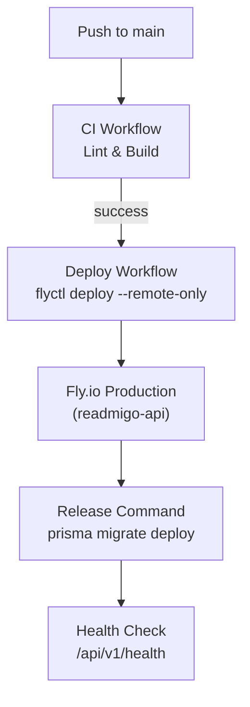
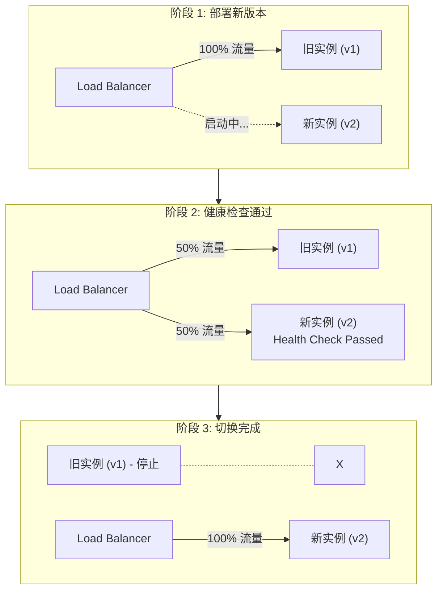

# CI/CD 配置

## 当前架构

Readmigo 采用 2 环境架构 (Local + Production)，CI/CD 由 GitHub Actions 自动完成。

---

## GitHub Actions 工作流

| 工作流 | 文件 | 触发条件 | 用途 |
|--------|------|----------|------|
| CI | `.github/workflows/ci.yml` | push/PR to main | Lint + Build |
| Deploy | `.github/workflows/deploy.yml` | CI 成功 (main) | 部署到 Fly.io |
| CodeQL | `.github/workflows/codeql.yml` | 定期 | 安全扫描 |

---

## 部署流程

---

## CI 流程详情

CI 是单个 Job "Lint & Build"，包含以下步骤:

| 步骤 | 说明 |
|------|------|
| Checkout | 检出代码 |
| Setup pnpm v9 | 安装包管理器 |
| Setup Node 20 | 安装 Node.js |
| Install | 安装依赖 |
| Generate Prisma | 生成 Prisma Client |
| Build workspace packages | 构建 @readmigo/database, @readmigo/shared |
| Lint | 运行 ESLint |
| Build | 构建后端应用 |

> 注: 测试步骤因 CI 内存限制已移除。

---

## Deploy 流程详情

Deploy 工作流在 CI 成功后自动触发:

| 步骤 | 说明 |
|------|------|
| Checkout | 检出代码 |
| Setup flyctl | 安装 Fly.io CLI |
| Deploy | `flyctl deploy --remote-only` |

部署使用项目根目录的 `fly.toml` (唯一的 Fly 配置文件)。

---

## 零停机部署

关键配置:
- 部署策略: rolling
- min_machines_running = 1 (始终保持至少 1 个实例运行)
- Release command 自动执行数据库迁移

---

## 数据库迁移安全策略

| 迁移类型 | 风险等级 | 安全模式 |
|----------|----------|----------|
| 添加可空字段 | 低 | 直接迁移 |
| 添加非空字段 | 中 | 先添加可空 + 默认值，后续版本设非空 |
| 删除字段 | 高 | 版本 N 停止使用，版本 N+1 删除 |
| 重命名字段 | 高 | 三步: 添加新字段 -> 迁移数据 -> 删除旧字段 |
| 修改字段类型 | 高 | 创建新字段，逐步迁移 |

---

## GitHub Secrets

| Secret 名称 | 用途 |
|-------------|------|
| `FLY_API_TOKEN` | Fly.io 部署 Token |

---

*最后更新: 2026-02-07*
