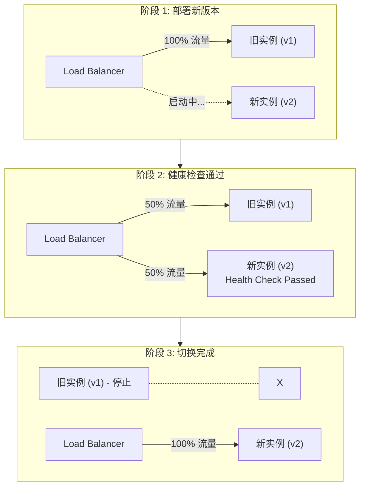

# CI/CD 配置文件详细计划

## 1. 零停机部署分析

### 1.1 部署期间服务可用性问题

**问题**：部署时是否会导致线上用户无法正常访问服务？

**答案**：使用正确配置后，**不会**导致服务中断。

### 1.2 Fly.io 零停机部署机制



> 关键配置:
> - min_machines_running = 1 (始终保持至少1个实例运行)
> - grace_period = "15s" (新实例启动后的等待时间)
> - health check 必须通过才切换流量

### 1.3 数据库迁移的零停机策略

```
┌─────────────────────────────────────────────────────────────────────────────────┐
│                        数据库迁移零停机策略                                        │
├─────────────────────────────────────────────────────────────────────────────────┤
│                                                                                  │
│   ⚠️  风险场景:                                                                  │
│   ┌────────────────────────────────────────────────────────────────────────┐    │
│   │  1. 删除字段/表 - 旧代码可能还在使用                                      │    │
│   │  2. 重命名字段 - 新旧代码不兼容                                           │    │
│   │  3. 修改字段类型 - 可能导致数据丢失                                       │    │
│   │  4. 添加非空字段 - 旧数据没有默认值                                       │    │
│   └────────────────────────────────────────────────────────────────────────┘    │
│                                                                                  │
│   ✅ 安全迁移模式:                                                               │
│                                                                                  │
│   添加字段 (安全):                                                               │
│   ┌────────────────────────────────────────────────────────────────────────┐    │
│   │  1. 添加可空字段或带默认值的字段                                          │    │
│   │  2. 部署新代码                                                           │    │
│   │  3. 填充数据 (如需要)                                                    │    │
│   │  4. 设置非空约束 (下个版本)                                               │    │
│   └────────────────────────────────────────────────────────────────────────┘    │
│                                                                                  │
│   删除字段 (两步):                                                               │
│   ┌────────────────────────────────────────────────────────────────────────┐    │
│   │  版本 N:   代码停止使用该字段                                             │    │
│   │  版本 N+1: 迁移脚本删除字段                                               │    │
│   └────────────────────────────────────────────────────────────────────────┘    │
│                                                                                  │
│   重命名字段 (三步):                                                             │
│   ┌────────────────────────────────────────────────────────────────────────┐    │
│   │  版本 N:   添加新字段，代码同时写入新旧字段                                │    │
│   │  版本 N+1: 迁移数据，代码只读写新字段                                     │    │
│   │  版本 N+2: 删除旧字段                                                    │    │
│   └────────────────────────────────────────────────────────────────────────┘    │
│                                                                                  │
└─────────────────────────────────────────────────────────────────────────────────┘
```

### 1.4 部署策略配置

```toml
# fly.toml 中的关键配置

[deploy]
  strategy = "rolling"      # 滚动部署 (默认)
  # strategy = "bluegreen"  # 蓝绿部署 (可选，更安全但需要更多资源)
  # strategy = "canary"     # 金丝雀发布 (可选)

[http_service]
  min_machines_running = 1  # 始终保持至少1个实例
  auto_stop_machines = true
  auto_start_machines = true

# 健康检查 - 确保新实例健康后才接收流量
[[services.http_checks]]
  interval = "10s"
  timeout = "5s"
  grace_period = "15s"    # 启动后等待时间
  method = "GET"
  path = "/api/v1/health"
```

---

## 2. 配置文件详细内容

### 2.1 Fly.io 配置文件

#### fly.debugging.toml

```toml
# Fly.io Configuration for Readmigo Debugging Environment
app = "readmigo-debug"
primary_region = "nrt"

[build]
  dockerfile = "Dockerfile"

[deploy]
  strategy = "rolling"

[env]
  NODE_ENV = "development"
  ENVIRONMENT = "debugging"
  PORT = "8080"
  LOG_LEVEL = "debug"
  SENTRY_ENVIRONMENT = "debugging"
  DEBUG_MODE_ENABLED = "true"
  DEFAULT_CHINESE_CONTENT = "true"

[http_service]
  internal_port = 8080
  force_https = true
  auto_stop_machines = true
  auto_start_machines = true
  min_machines_running = 0  # 可以完全停止以节省成本
  processes = ["app"]

  [http_service.concurrency]
    type = "requests"
    hard_limit = 100
    soft_limit = 80

[[vm]]
  cpu_kind = "shared"
  cpus = 1
  memory_mb = 512

[[services]]
  protocol = "tcp"
  internal_port = 8080

  [[services.ports]]
    port = 80
    handlers = ["http"]
    force_https = true

  [[services.ports]]
    port = 443
    handlers = ["tls", "http"]

  [[services.http_checks]]
    interval = "30s"
    timeout = "5s"
    grace_period = "15s"
    method = "GET"
    path = "/api/v1/health"
```

#### fly.staging.toml

```toml
# Fly.io Configuration for Readmigo Staging Environment
app = "readmigo-staging"
primary_region = "nrt"

[build]
  dockerfile = "Dockerfile"

[deploy]
  strategy = "rolling"

[env]
  NODE_ENV = "production"
  ENVIRONMENT = "staging"
  PORT = "8080"
  LOG_LEVEL = "info"
  SENTRY_ENVIRONMENT = "staging"
  DEBUG_MODE_ENABLED = "false"
  DEFAULT_CHINESE_CONTENT = "false"

[http_service]
  internal_port = 8080
  force_https = true
  auto_stop_machines = true
  auto_start_machines = true
  min_machines_running = 1  # 始终保持1个实例
  processes = ["app"]

  [http_service.concurrency]
    type = "requests"
    hard_limit = 200
    soft_limit = 150

[[vm]]
  cpu_kind = "shared"
  cpus = 1
  memory_mb = 1024

[[services]]
  protocol = "tcp"
  internal_port = 8080

  [[services.ports]]
    port = 80
    handlers = ["http"]
    force_https = true

  [[services.ports]]
    port = 443
    handlers = ["tls", "http"]

  [[services.tcp_checks]]
    interval = "15s"
    timeout = "2s"
    grace_period = "10s"

  [[services.http_checks]]
    interval = "15s"
    timeout = "5s"
    grace_period = "15s"
    method = "GET"
    path = "/api/v1/health"
```

#### fly.production.toml (基于现有 fly.toml 增强)

```toml
# Fly.io Configuration for Readmigo Production Environment
app = "readmigo-api"
primary_region = "nrt"

[build]
  dockerfile = "Dockerfile"

[deploy]
  strategy = "rolling"
  # 生产环境可考虑使用 bluegreen 更安全
  # strategy = "bluegreen"

[env]
  NODE_ENV = "production"
  ENVIRONMENT = "production"
  PORT = "8080"
  LOG_LEVEL = "warn"
  SENTRY_ENVIRONMENT = "production"

[http_service]
  internal_port = 8080
  force_https = true
  auto_stop_machines = true
  auto_start_machines = true
  min_machines_running = 1  # 生产环境始终保持运行
  processes = ["app"]

  [http_service.concurrency]
    type = "requests"
    hard_limit = 250
    soft_limit = 200

[[vm]]
  cpu_kind = "shared"
  cpus = 1
  memory_mb = 512

[[services]]
  protocol = "tcp"
  internal_port = 8080

  [[services.ports]]
    port = 80
    handlers = ["http"]
    force_https = true

  [[services.ports]]
    port = 443
    handlers = ["tls", "http"]

  [[services.tcp_checks]]
    interval = "15s"
    timeout = "2s"
    grace_period = "10s"

  [[services.http_checks]]
    interval = "30s"
    timeout = "5s"
    grace_period = "15s"
    method = "GET"
    path = "/api/v1/health"
```

---

### 2.2 GitHub Actions 工作流

#### .github/workflows/ci.yml

```yaml
name: CI

on:
  pull_request:
    branches: [main]
  push:
    branches: [main]

jobs:
  lint:
    name: Lint
    runs-on: ubuntu-latest
    steps:
      - name: Checkout
        uses: actions/checkout@v4

      - name: Setup pnpm
        uses: pnpm/action-setup@v2
        with:
          version: 9

      - name: Setup Node.js
        uses: actions/setup-node@v4
        with:
          node-version: 20
          cache: 'pnpm'

      - name: Install dependencies
        run: pnpm install --frozen-lockfile

      - name: Run lint
        run: pnpm lint

  typecheck:
    name: Type Check
    runs-on: ubuntu-latest
    steps:
      - name: Checkout
        uses: actions/checkout@v4

      - name: Setup pnpm
        uses: pnpm/action-setup@v2
        with:
          version: 9

      - name: Setup Node.js
        uses: actions/setup-node@v4
        with:
          node-version: 20
          cache: 'pnpm'

      - name: Install dependencies
        run: pnpm install --frozen-lockfile

      - name: Generate Prisma Client
        run: pnpm db:generate

      - name: Type check
        run: pnpm --filter @readmigo/backend exec tsc --noEmit

  test:
    name: Test
    runs-on: ubuntu-latest
    steps:
      - name: Checkout
        uses: actions/checkout@v4

      - name: Setup pnpm
        uses: pnpm/action-setup@v2
        with:
          version: 9

      - name: Setup Node.js
        uses: actions/setup-node@v4
        with:
          node-version: 20
          cache: 'pnpm'

      - name: Install dependencies
        run: pnpm install --frozen-lockfile

      - name: Generate Prisma Client
        run: pnpm db:generate

      - name: Run tests
        run: pnpm test

  build:
    name: Build
    runs-on: ubuntu-latest
    needs: [lint, typecheck, test]
    steps:
      - name: Checkout
        uses: actions/checkout@v4

      - name: Setup pnpm
        uses: pnpm/action-setup@v2
        with:
          version: 9

      - name: Setup Node.js
        uses: actions/setup-node@v4
        with:
          node-version: 20
          cache: 'pnpm'

      - name: Install dependencies
        run: pnpm install --frozen-lockfile

      - name: Generate Prisma Client
        run: pnpm db:generate

      - name: Build
        run: pnpm build
```

#### .github/workflows/deploy-staging.yml

```yaml
name: Deploy to Staging

on:
  push:
    branches: [main]
    paths:
      - 'apps/backend/**'
      - 'packages/**'
      - 'Dockerfile'
      - 'fly.staging.toml'
      - '.github/workflows/deploy-staging.yml'
  workflow_dispatch:

env:
  FLY_API_TOKEN: ${{ secrets.FLY_STAGING_TOKEN }}

jobs:
  ci:
    name: CI Checks
    uses: ./.github/workflows/ci.yml

  deploy:
    name: Deploy to Staging
    runs-on: ubuntu-latest
    needs: ci
    environment: staging

    steps:
      - name: Checkout
        uses: actions/checkout@v4

      - name: Setup Fly CLI
        uses: superfly/flyctl-action/setup-flyctl@master

      - name: Deploy to Staging
        run: flyctl deploy --config fly.staging.toml --remote-only

      - name: Run Database Migrations
        run: |
          flyctl ssh console --app readmigo-staging -C "cd /app && npx prisma migrate deploy"

      - name: Health Check
        run: |
          sleep 30
          response=$(curl -s -o /dev/null -w "%{http_code}" https://staging-api.readmigo.app/api/v1/health)
          if [ "$response" != "200" ]; then
            echo "Health check failed with status: $response"
            exit 1
          fi
          echo "Health check passed!"

      - name: Notify Success
        if: success()
        run: |
          echo "✅ Staging deployment successful!"
          echo "URL: https://staging-api.readmigo.app"

      - name: Notify Failure
        if: failure()
        run: |
          echo "❌ Staging deployment failed!"
```

#### .github/workflows/deploy-production.yml

```yaml
name: Deploy to Production

on:
  workflow_dispatch:
    inputs:
      confirm:
        description: 'Type "deploy" to confirm production deployment'
        required: true
      skip_backup:
        description: 'Skip database backup (not recommended)'
        type: boolean
        default: false

env:
  FLY_API_TOKEN: ${{ secrets.FLY_PRODUCTION_TOKEN }}

jobs:
  validate:
    name: Validate Deployment
    runs-on: ubuntu-latest
    steps:
      - name: Validate Confirmation
        if: github.event.inputs.confirm != 'deploy'
        run: |
          echo "❌ Deployment not confirmed. Please type 'deploy' to confirm."
          exit 1

      - name: Check Staging Health
        run: |
          response=$(curl -s -o /dev/null -w "%{http_code}" https://staging-api.readmigo.app/api/v1/health)
          if [ "$response" != "200" ]; then
            echo "❌ Staging is not healthy. Please fix staging before deploying to production."
            exit 1
          fi
          echo "✅ Staging health check passed"

  backup:
    name: Backup Database
    runs-on: ubuntu-latest
    needs: validate
    if: github.event.inputs.skip_backup != 'true'
    steps:
      - name: Create Neon Backup Branch
        run: |
          curl -X POST "https://console.neon.tech/api/v2/projects/${{ secrets.NEON_PROD_PROJECT_ID }}/branches" \
            -H "Authorization: Bearer ${{ secrets.NEON_API_KEY }}" \
            -H "Content-Type: application/json" \
            -d '{
              "branch": {
                "name": "backup-${{ github.run_id }}-${{ github.run_number }}"
              }
            }'
          echo "✅ Database backup created"

  deploy:
    name: Deploy to Production
    runs-on: ubuntu-latest
    needs: [validate, backup]
    if: always() && needs.validate.result == 'success' && (needs.backup.result == 'success' || needs.backup.result == 'skipped')
    environment: production  # 需要手动审批

    steps:
      - name: Checkout
        uses: actions/checkout@v4

      - name: Setup Fly CLI
        uses: superfly/flyctl-action/setup-flyctl@master

      - name: Deploy to Production
        run: flyctl deploy --config fly.production.toml --remote-only

      - name: Run Database Migrations
        run: |
          flyctl ssh console --app readmigo-api -C "cd /app && npx prisma migrate deploy"

      - name: Health Check
        run: |
          sleep 60
          for i in {1..5}; do
            response=$(curl -s -o /dev/null -w "%{http_code}" https://api.readmigo.app/api/v1/health)
            if [ "$response" == "200" ]; then
              echo "✅ Health check passed on attempt $i"
              exit 0
            fi
            echo "Health check attempt $i failed with status: $response"
            sleep 10
          done
          echo "❌ Health check failed after 5 attempts"
          exit 1

      - name: Notify Success
        if: success()
        run: |
          echo "✅ Production deployment successful!"
          echo "URL: https://api.readmigo.app"
          echo "Commit: ${{ github.sha }}"

  rollback-instructions:
    name: Rollback Instructions
    runs-on: ubuntu-latest
    needs: deploy
    if: failure()
    steps:
      - name: Print Rollback Instructions
        run: |
          echo "❌ Production deployment failed!"
          echo ""
          echo "To rollback, run:"
          echo "  flyctl releases rollback --app readmigo-api"
          echo ""
          echo "To restore database (if needed):"
          echo "  1. Go to Neon Console"
          echo "  2. Find branch: backup-${{ github.run_id }}-${{ github.run_number }}"
          echo "  3. Restore from that branch"
```

#### .github/workflows/deploy-debugging.yml

```yaml
name: Deploy to Debugging

on:
  push:
    branches: [debugging]
    paths:
      - 'apps/backend/**'
      - 'packages/**'
      - 'Dockerfile'
      - 'fly.debugging.toml'
  workflow_dispatch:

env:
  FLY_API_TOKEN: ${{ secrets.FLY_DEBUGGING_TOKEN }}

jobs:
  deploy:
    name: Deploy to Debugging
    runs-on: ubuntu-latest
    environment: debugging

    steps:
      - name: Checkout
        uses: actions/checkout@v4

      - name: Setup Fly CLI
        uses: superfly/flyctl-action/setup-flyctl@master

      - name: Deploy to Debugging
        run: flyctl deploy --config fly.debugging.toml --remote-only

      - name: Run Database Migrations
        run: |
          flyctl ssh console --app readmigo-debug -C "cd /app && npx prisma migrate deploy"

      - name: Health Check
        run: |
          sleep 30
          response=$(curl -s -o /dev/null -w "%{http_code}" https://debug-api.readmigo.app/api/v1/health)
          if [ "$response" != "200" ]; then
            echo "Health check failed with status: $response"
            exit 1
          fi
          echo "✅ Debugging deployment successful!"
```

#### .github/workflows/db-sync.yml

```yaml
name: Database Sync

on:
  schedule:
    # Staging: 每日凌晨 3 点 (UTC+8)
    - cron: '0 19 * * *'  # 19:00 UTC = 03:00 CST
  workflow_dispatch:
    inputs:
      target:
        description: 'Target environment'
        required: true
        type: choice
        options:
          - staging
          - debugging
      mode:
        description: 'Sync mode'
        required: true
        type: choice
        options:
          - full
          - content-only

jobs:
  sync-staging:
    name: Sync to Staging
    runs-on: ubuntu-latest
    if: github.event.schedule == '0 19 * * *' || github.event.inputs.target == 'staging'

    steps:
      - name: Checkout
        uses: actions/checkout@v4

      - name: Setup pnpm
        uses: pnpm/action-setup@v2
        with:
          version: 9

      - name: Setup Node.js
        uses: actions/setup-node@v4
        with:
          node-version: 20
          cache: 'pnpm'

      - name: Install dependencies
        run: pnpm install --frozen-lockfile

      - name: Run Database Sync
        run: |
          pnpm db:sync --from=production --to=staging --mode=${{ github.event.inputs.mode || 'full' }}
        env:
          DATABASE_URL_PRODUCTION: ${{ secrets.DATABASE_URL_PRODUCTION }}
          DATABASE_URL_STAGING: ${{ secrets.DATABASE_URL_STAGING }}
          ANONYMIZATION_SALT: ${{ secrets.ANONYMIZATION_SALT }}

  sync-debugging:
    name: Sync to Debugging
    runs-on: ubuntu-latest
    if: github.event.inputs.target == 'debugging'

    steps:
      - name: Checkout
        uses: actions/checkout@v4

      - name: Setup pnpm
        uses: pnpm/action-setup@v2
        with:
          version: 9

      - name: Setup Node.js
        uses: actions/setup-node@v4
        with:
          node-version: 20
          cache: 'pnpm'

      - name: Install dependencies
        run: pnpm install --frozen-lockfile

      - name: Run Database Sync
        run: |
          pnpm db:sync --from=production --to=debugging --mode=${{ github.event.inputs.mode || 'full' }}
        env:
          DATABASE_URL_PRODUCTION: ${{ secrets.DATABASE_URL_PRODUCTION }}
          DATABASE_URL_DEBUGGING: ${{ secrets.DATABASE_URL_DEBUGGING }}
          ANONYMIZATION_SALT: ${{ secrets.ANONYMIZATION_SALT }}
```

---

### 2.3 数据同步脚本

#### scripts/db-sync/anonymization-rules.ts

```typescript
import { faker } from '@faker-js/faker';
import { createHash } from 'crypto';

export interface AnonymizationRule {
  table: string;
  columns?: Record<string, AnonymizationStrategy>;
  exclude?: boolean;
}

type AnonymizationStrategy =
  | { type: 'hash'; salt?: string }
  | { type: 'fake'; generator: () => string }
  | { type: 'constant'; value: string }
  | { type: 'null' }
  | { type: 'preserve' };

export const anonymizationRules: AnonymizationRule[] = [
  // 用户表 - 核心敏感数据匿名化
  {
    table: 'users',
    columns: {
      id: { type: 'preserve' },
      email: { type: 'hash' },
      name: { type: 'fake', generator: () => faker.person.fullName() },
      apple_user_id: { type: 'hash' },
      google_user_id: { type: 'hash' },
      avatar_url: { type: 'constant', value: 'https://assets.readmigo.app/defaults/avatar.png' },
      created_at: { type: 'preserve' },
      updated_at: { type: 'preserve' },
    },
  },

  // 完全排除的敏感表
  { table: 'subscriptions', exclude: true },
  { table: 'subscription_transactions', exclude: true },
  { table: 'refresh_tokens', exclude: true },
  { table: 'audit_logs', exclude: true },
  { table: 'user_devices', exclude: true },

  // 内容表 - 完整保留
  { table: 'books', columns: { '*': { type: 'preserve' } } },
  { table: 'authors', columns: { '*': { type: 'preserve' } } },
  { table: 'categories', columns: { '*': { type: 'preserve' } } },
  { table: 'book_categories', columns: { '*': { type: 'preserve' } } },
  { table: 'quotes', columns: { '*': { type: 'preserve' } } },
  { table: 'book_lists', columns: { '*': { type: 'preserve' } } },
  { table: 'book_list_items', columns: { '*': { type: 'preserve' } } },
  { table: 'postcards', columns: { '*': { type: 'preserve' } } },
  { table: 'postcard_templates', columns: { '*': { type: 'preserve' } } },
  { table: 'app_versions', columns: { '*': { type: 'preserve' } } },
  { table: 'feature_flags', columns: { '*': { type: 'preserve' } } },

  // 用户活动数据 - 保留结构，关联匿名用户
  { table: 'reading_sessions', columns: { '*': { type: 'preserve' } } },
  { table: 'user_vocabulary', columns: { '*': { type: 'preserve' } } },
  { table: 'user_badges', columns: { '*': { type: 'preserve' } } },

  // AI 缓存 - 保留以节省成本
  { table: 'ai_cache', columns: { '*': { type: 'preserve' } } },
];

export function hashValue(value: string, salt?: string): string {
  const data = salt ? `${salt}:${value}` : value;
  return createHash('sha256').update(data).digest('hex').substring(0, 16);
}

export function anonymizeEmail(email: string, salt?: string): string {
  const hash = hashValue(email, salt);
  return `user_${hash}@anonymized.local`;
}
```

#### scripts/db-sync/sync-manager.ts

```typescript
import { execSync } from 'child_process';
import * as fs from 'fs';
import * as path from 'path';
import { anonymizationRules, anonymizeEmail, hashValue } from './anonymization-rules';

type Environment = 'production' | 'staging' | 'debugging' | 'local';
type SyncMode = 'full' | 'content-only';

interface SyncOptions {
  source: Environment;
  target: Environment;
  mode: SyncMode;
  dryRun?: boolean;
  verbose?: boolean;
}

export class DatabaseSyncManager {
  private sourceUrl: string;
  private targetUrl: string;
  private tempDir: string;

  constructor(private options: SyncOptions) {
    this.sourceUrl = this.getConnectionUrl(options.source);
    this.targetUrl = this.getConnectionUrl(options.target);
    this.tempDir = path.join('/tmp', `db-sync-${Date.now()}`);
  }

  private getConnectionUrl(env: Environment): string {
    const envVar = `DATABASE_URL_${env.toUpperCase()}`;
    const url = process.env[envVar];
    if (!url) {
      throw new Error(`Environment variable ${envVar} is not set`);
    }
    return url;
  }

  async sync(): Promise<void> {
    console.log(`\n🔄 Starting sync: ${this.options.source} → ${this.options.target}`);
    console.log(`   Mode: ${this.options.mode}`);
    console.log(`   Dry run: ${this.options.dryRun ? 'Yes' : 'No'}\n`);

    fs.mkdirSync(this.tempDir, { recursive: true });

    try {
      // Step 1: 导出源数据
      console.log('📤 Step 1: Exporting source database...');
      await this.exportDatabase();

      // Step 2: 匿名化处理
      console.log('🔐 Step 2: Applying anonymization...');
      await this.anonymizeData();

      // Step 3: 导入到目标
      if (!this.options.dryRun) {
        console.log('📥 Step 3: Importing to target database...');
        await this.importDatabase();
      } else {
        console.log('📥 Step 3: Skipped (dry run)');
      }

      // Step 4: 验证
      console.log('✅ Step 4: Verifying sync...');
      await this.verifySyncResult();

      console.log('\n✨ Sync completed successfully!\n');
    } finally {
      this.cleanup();
    }
  }

  private async exportDatabase(): Promise<void> {
    const excludeTables = anonymizationRules
      .filter((r) => r.exclude)
      .map((r) => `--exclude-table-data=${r.table}`)
      .join(' ');

    const contentOnlyTables =
      this.options.mode === 'content-only'
        ? anonymizationRules
            .filter((r) => !r.exclude && r.table !== 'users')
            .filter((r) =>
              ['books', 'authors', 'categories', 'quotes', 'book_lists'].includes(r.table),
            )
            .map((r) => `--table=${r.table}`)
            .join(' ')
        : '';

    const cmd = `pg_dump "${this.sourceUrl}" \
      --format=custom \
      --no-owner \
      --no-acl \
      ${excludeTables} \
      ${contentOnlyTables} \
      --file="${this.tempDir}/dump.sql"`;

    if (this.options.verbose) {
      console.log(`   Command: ${cmd}`);
    }

    execSync(cmd, { stdio: this.options.verbose ? 'inherit' : 'pipe' });
    console.log('   ✓ Export completed');
  }

  private async anonymizeData(): Promise<void> {
    const anonymizeSql = this.generateAnonymizationSql();
    const sqlPath = path.join(this.tempDir, 'anonymize.sql');
    fs.writeFileSync(sqlPath, anonymizeSql);

    console.log('   ✓ Anonymization SQL generated');

    if (this.options.verbose) {
      console.log('   SQL Preview:');
      console.log(anonymizeSql.substring(0, 500) + '...');
    }
  }

  private generateAnonymizationSql(): string {
    const salt = process.env.ANONYMIZATION_SALT || 'default-salt';
    const statements: string[] = [
      '-- Anonymization Script',
      '-- Generated at: ' + new Date().toISOString(),
      '',
    ];

    // Users 表匿名化
    statements.push(`
-- Anonymize users table
UPDATE users SET
  email = 'user_' || LEFT(MD5(email || '${salt}'), 12) || '@anonymized.local',
  name = 'User ' || LEFT(MD5(name || '${salt}'), 8),
  apple_user_id = CASE WHEN apple_user_id IS NOT NULL THEN LEFT(MD5(apple_user_id || '${salt}'), 32) ELSE NULL END,
  google_user_id = CASE WHEN google_user_id IS NOT NULL THEN LEFT(MD5(google_user_id || '${salt}'), 32) ELSE NULL END,
  avatar_url = 'https://assets.readmigo.app/defaults/avatar.png';
`);

    return statements.join('\n');
  }

  private async importDatabase(): Promise<void> {
    // 先恢复数据
    const restoreCmd = `pg_restore \
      --dbname="${this.targetUrl}" \
      --clean \
      --if-exists \
      --no-owner \
      --no-acl \
      "${this.tempDir}/dump.sql"`;

    try {
      execSync(restoreCmd, { stdio: this.options.verbose ? 'inherit' : 'pipe' });
    } catch (error) {
      // pg_restore 可能会有警告，不一定是错误
      console.log('   ⚠️  pg_restore completed with warnings');
    }

    // 执行匿名化
    const anonymizeCmd = `psql "${this.targetUrl}" -f "${this.tempDir}/anonymize.sql"`;
    execSync(anonymizeCmd, { stdio: this.options.verbose ? 'inherit' : 'pipe' });

    console.log('   ✓ Import and anonymization completed');
  }

  private async verifySyncResult(): Promise<void> {
    // 验证用户表已匿名化
    const checkCmd = `psql "${this.targetUrl}" -t -c "SELECT COUNT(*) FROM users WHERE email NOT LIKE '%@anonymized.local'"`;

    try {
      const result = execSync(checkCmd, { encoding: 'utf-8' }).trim();
      const nonAnonymizedCount = parseInt(result, 10);

      if (nonAnonymizedCount > 0) {
        throw new Error(`Found ${nonAnonymizedCount} non-anonymized user records!`);
      }

      console.log('   ✓ Anonymization verified: All user emails are anonymized');
    } catch (error) {
      if (this.options.mode === 'content-only') {
        console.log('   ℹ️  Skipped user verification (content-only mode)');
      } else {
        throw error;
      }
    }
  }

  private cleanup(): void {
    try {
      fs.rmSync(this.tempDir, { recursive: true, force: true });
      console.log('   ✓ Temporary files cleaned up');
    } catch {
      console.log('   ⚠️  Failed to clean up temporary files');
    }
  }
}
```

#### scripts/db-sync/run-sync.ts

```typescript
import { DatabaseSyncManager } from './sync-manager';

async function main() {
  const args = process.argv.slice(2);

  // 解析命令行参数
  const getArg = (name: string): string | undefined => {
    const arg = args.find((a) => a.startsWith(`--${name}=`));
    return arg?.split('=')[1];
  };

  const hasFlag = (name: string): boolean => {
    return args.includes(`--${name}`);
  };

  const source = getArg('from') as 'production' | undefined;
  const target = getArg('to') as 'staging' | 'debugging' | 'local' | undefined;
  const mode = (getArg('mode') || 'full') as 'full' | 'content-only';
  const dryRun = hasFlag('dry-run');
  const verbose = hasFlag('verbose');

  if (!source || !target) {
    console.error('Usage: pnpm db:sync --from=production --to=staging [--mode=full|content-only] [--dry-run] [--verbose]');
    process.exit(1);
  }

  if (source !== 'production') {
    console.error('Error: Source must be "production"');
    process.exit(1);
  }

  if (!['staging', 'debugging', 'local'].includes(target)) {
    console.error('Error: Target must be "staging", "debugging", or "local"');
    process.exit(1);
  }

  const manager = new DatabaseSyncManager({
    source,
    target,
    mode,
    dryRun,
    verbose,
  });

  try {
    await manager.sync();
  } catch (error) {
    console.error('❌ Sync failed:', error);
    process.exit(1);
  }
}

main();
```

---

### 2.4 Package.json 脚本更新

#### 根目录 package.json 添加

```json
{
  "scripts": {
    "db:sync": "tsx scripts/db-sync/run-sync.ts",
    "db:sync:content": "tsx scripts/db-sync/run-sync.ts --mode=content-only",
    "dev:debugging": "pnpm --filter @readmigo/backend dev:debugging"
  }
}
```

#### apps/backend/package.json 添加

```json
{
  "scripts": {
    "dev:debugging": "ENVIRONMENT=debugging nest start --watch",
    "start:debugging": "ENVIRONMENT=debugging nest start"
  }
}
```

---

## 3. GitHub Secrets 配置

需要在 GitHub 仓库设置中配置以下 Secrets:

| Secret 名称 | 用途 | 环境 |
|------------|------|------|
| `FLY_DEBUGGING_TOKEN` | Fly.io Debugging 部署 Token | debugging |
| `FLY_STAGING_TOKEN` | Fly.io Staging 部署 Token | staging |
| `FLY_PRODUCTION_TOKEN` | Fly.io Production 部署 Token | production |
| `DATABASE_URL_PRODUCTION` | Production 数据库连接串 | - |
| `DATABASE_URL_STAGING` | Staging 数据库连接串 | - |
| `DATABASE_URL_DEBUGGING` | Debugging 数据库连接串 | - |
| `NEON_PROD_PROJECT_ID` | Neon Production 项目 ID | production |
| `NEON_API_KEY` | Neon API Key | production |
| `ANONYMIZATION_SALT` | 数据匿名化盐值 | - |

---

## 4. GitHub Environments 配置

需要创建以下 Environments:

| Environment | 保护规则 |
|-------------|---------|
| debugging | 无 |
| staging | 无 |
| production | Required reviewers (至少1人审批) |

---

## 5. 实施顺序

1. **创建 Fly.io 配置文件** (fly.debugging.toml, fly.staging.toml, fly.production.toml)
2. **更新 GitHub Actions** (ci.yml, deploy-staging.yml, deploy-production.yml, deploy-debugging.yml)
3. **配置 GitHub Secrets 和 Environments**
4. **创建数据同步脚本**
5. **更新 package.json 脚本**
6. **测试部署流程**

---

请 review 以上配置文件详细计划。
