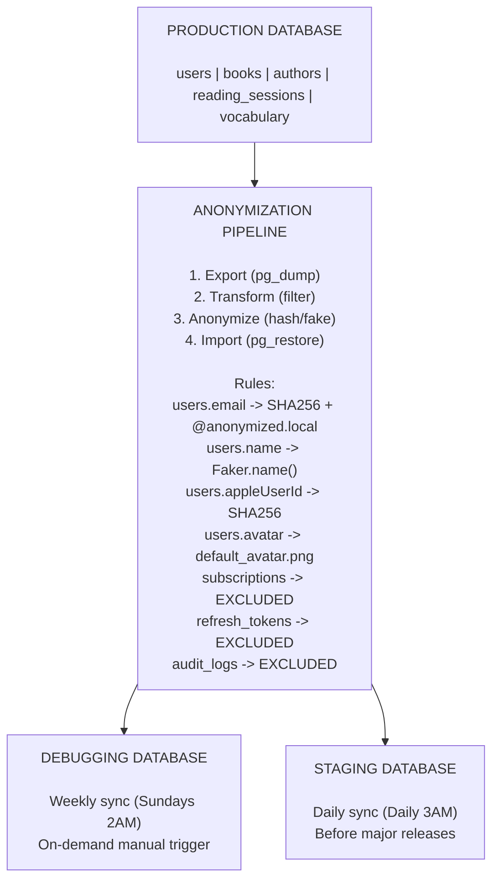

# Backend 环境运维手册

> 数据同步、监控、常用命令、核心原则实现

---

## 1. 模块概述

```
┌─────────────────────────────────────────────────────────────────┐
│                    环境运维手册                                  │
├─────────────────────────────────────────────────────────────────┤
│                                                                  │
│  本文档内容                                                      │
│  ├── 环境间数据同步                                              │
│  ├── 监控与可观测性                                              │
│  ├── 常用操作命令                                                │
│  ├── 核心原则实现详解                                            │
│  └── 环境切换操作指南                                            │
│                                                                  │
│  相关文档                                                        │
│  ├── ../be-environment-overview.md (概述)                       │
│  └── ../be-environment-configs.md (配置详情)                    │
│                                                                  │
└─────────────────────────────────────────────────────────────────┘
```

---

## 2. 环境间数据同步

### 2.1 数据同步架构



### 2.2 同步规则

| 表类型 | 处理方式 | 说明 |
|--------|----------|------|
| **完整复制** | books, authors, categories, quotes, book_lists | 内容数据完全保留 |
| **匿名化复制** | users, reading_sessions, user_vocabulary | 用户 PII 哈希处理 |
| **完全排除** | subscriptions, refresh_tokens, audit_logs, user_devices | 敏感信息不同步 |
| **保留缓存** | ai_cache | 节省 API 成本 |

### 2.3 匿名化字段

| 表 | 字段 | 处理方式 |
|-----|------|----------|
| users | email | `SHA256(email) + @anonymized.local` |
| users | name | `Faker.name()` |
| users | apple_user_id | `SHA256(value)` |
| users | google_user_id | `SHA256(value)` |
| users | avatar_url | `default_avatar.png` |

---

## 3. 监控与可观测性

### 3.1 环境标识

```
┌─────────────────────────────────────────────────────────────────┐
│                    OBSERVABILITY TAGS                            │
├─────────────────────────────────────────────────────────────────┤
│                                                                  │
│  每个请求/日志/指标包含:                                         │
│                                                                  │
│  ├── environment: local | debugging | staging | production      │
│  ├── service: readmigo-api                                      │
│  ├── version: 1.2.3                                             │
│  └── correlation_id: {environment}-{uuid}                       │
│                                                                  │
│  Response Headers:                                               │
│  ├── x-correlation-id: production-550e8400-e29b-41d4...        │
│  └── x-environment: production                                  │
│                                                                  │
└─────────────────────────────────────────────────────────────────┘
```

### 3.2 Sentry 配置

| 环境 | 采样率 | 说明 |
|------|--------|------|
| Local | 0 | 禁用 |
| Debugging | 0.5 | 50% 采样 |
| Staging | 0.5 | 50% 采样 |
| Production | 0.1 | 10% 采样 |

### 3.3 日志级别

| 环境 | 级别 | 输出内容 |
|------|------|----------|
| Local | debug | 所有详细日志 |
| Debugging | debug | 所有详细日志 |
| Staging | info | 信息及以上 |
| Production | warn | 警告及以上 |

---

## 4. 常用操作命令

### 4.1 环境管理

| 命令 | 说明 |
|------|------|
| `cp .env.local.example .env` | 切换本地开发配置 |
| `docker-compose up -d` | 启动本地服务 |
| `pnpm dev` | 启动开发服务器 |
| `pnpm run config:check` | 验证环境变量 |

### 4.2 数据同步

| 命令 | 说明 |
|------|------|
| `pnpm db:sync --from=production --to=staging --anonymize` | Production → Staging |
| `pnpm db:sync --from=production --to=debugging --anonymize --tables=books,authors` | Production → Debugging (部分表) |
| `pnpm db:sync --from=debugging --to=local --anonymize` | Debugging → Local |
| `pnpm db:sync:content --from=production --to=debugging` | 仅同步内容数据 |
| `pnpm db:seed:local` | 种子数据初始化 |
| `pnpm db:reset:local` | 重置本地数据库 |

### 4.3 部署操作

| 命令 | 说明 |
|------|------|
| `fly deploy --config fly.staging.toml` | 部署到 Staging |
| `fly deploy --config fly.production.toml` | 部署到 Production (需审批) |
| `fly releases rollback --app readmigo-api` | 回滚 Production |
| `fly status --app readmigo-api` | 查看部署状态 |
| `fly logs --app readmigo-api` | 查看实时日志 |

---

## 5. 基础设施配置

### 5.1 Neon PostgreSQL

```
┌─────────────────────────────────────────────────────────────────┐
│                    NEON DATABASE INSTANCES                       │
├─────────────────────────────────────────────────────────────────┤
│                                                                  │
│  Local (Docker)                                                  │
│  ├── Host: localhost:5432                                       │
│  ├── Database: readmigo_local                                   │
│  └── Pool Size: 5                                               │
│                                                                  │
│  Debugging (Neon Cloud)                                         │
│  ├── Host: ep-xxx-debugging.neon.tech                          │
│  ├── Database: readmigo_debug                                   │
│  ├── Pool Size: 10                                              │
│  └── Autoscaling: enabled, suspend after 5min                   │
│                                                                  │
│  Staging (Neon Cloud)                                           │
│  ├── Host: ep-xxx-staging.neon.tech                            │
│  ├── Database: readmigo_staging                                 │
│  └── Pool Size: 15                                              │
│                                                                  │
│  Production (Neon Cloud)                                        │
│  ├── Host: ep-xxx-production.neon.tech                         │
│  ├── Database: readmigo_prod                                    │
│  ├── Pool Size: 20                                              │
│  ├── Compute Units: 0.5-2 (autoscaling)                        │
│  └── Read Replicas: 1                                           │
│                                                                  │
└─────────────────────────────────────────────────────────────────┘
```

### 5.2 Upstash Redis

| 环境 | 实例名 | Key Prefix | TLS |
|------|--------|------------|-----|
| Local | Docker | `local:` | No |
| Debugging | readmigo-redis-debugging | `debug:` | Yes |
| Staging | readmigo-redis-staging | `stg:` | Yes |
| Production | readmigo-redis-production | `prod:` | Yes |

### 5.3 Cloudflare R2

| 环境 | Bucket 名 | Public URL |
|------|-----------|------------|
| Local | readmigo-local (MinIO) | localhost:9000 |
| Debugging | readmigo-assets-debugging | debug-assets.readmigo.app |
| Staging | readmigo-assets-staging | staging-assets.readmigo.app |
| Production | readmigo-assets-production | assets.readmigo.app |

---

## 6. 环境切换指南

### 6.1 当前实现状态

| 客户端 | 支持环境 | 切换方式 | 限制 |
|--------|----------|----------|------|
| iOS Client | local/debugging/staging/production | 设置页 + 浮动徽章 + 摇一摇 | 仅 DEBUG 构建 |
| Dashboard | local/debugging/staging/production | AppBar 切换器 + 快捷键 | 无限制 |
| Backend | 由部署配置决定 | 环境变量 | 不可运行时切换 |

### 6.2 iOS 环境切换

#### 方式一：浮动徽章

```
┌────────────────────────────────────┐
│ ┌─────┐                     [DEV]  │  ← 点击打开切换面板
│ │ App │                            │
│ │     │                            │
│ └─────┘                            │
└────────────────────────────────────┘
```

#### 方式二：摇一摇

在 DEBUG 构建中，摇晃设备可触发环境切换面板。

#### 方式三：设置页

Settings → Developer Options → Environment

### 6.3 Dashboard 环境切换

#### 方式一：AppBar 按钮

```
┌─────────────────────────────────────────────────────────────────┐
│  🏠 Readmigo Admin          [Local] [Debug] [Staging] [Prod]    │
└─────────────────────────────────────────────────────────────────┘
```

#### 方式二：键盘快捷键

| 快捷键 | 环境 |
|--------|------|
| Ctrl/Cmd + Shift + 1 | Local |
| Ctrl/Cmd + Shift + 2 | Debugging |
| Ctrl/Cmd + Shift + 3 | Staging |
| Ctrl/Cmd + Shift + 4 | Production |

---

## 7. 隔离验证

### 7.1 验证清单

| 检查项 | 验证方式 |
|--------|----------|
| 数据库连接独立 | 各环境连接测试 |
| Redis 实例独立 | Key 前缀验证 |
| R2 Bucket 独立 | 文件上传测试 |
| 无交叉连接 | 跨环境访问测试 (应失败) |
| API Key 隔离 | 各环境密钥验证 |

### 7.2 验证脚本

```bash
# 验证所有环境隔离
pnpm run verify:isolation

# 输出示例
# Checking local...
#   Database: ✓
#   Redis: ✓
#   R2: ✓
#
# Checking debugging...
#   Database: ✓
#   Redis: ✓
#   R2: ✓
#
# Verifying no cross-environment access...
# Isolation verification complete!
```

---

## 8. 故障排查

### 8.1 常见问题

| 问题 | 原因 | 解决方案 |
|------|------|----------|
| 数据库连接失败 | 环境变量未配置 | 检查 `.env` 文件 |
| Redis 连接超时 | TLS 配置错误 | 验证 URL 格式 (rediss://) |
| R2 上传失败 | Access Key 错误 | 验证 Cloudflare 凭证 |
| 环境切换无效 | 缓存未清理 | 重启应用并清理缓存 |

### 8.2 调试命令

| 命令 | 说明 |
|------|------|
| `pnpm db:status` | 检查数据库连接状态 |
| `pnpm redis:ping` | 测试 Redis 连接 |
| `pnpm r2:test` | 测试 R2 访问 |
| `fly ssh console --app readmigo-api` | SSH 到 Fly.io 实例 |

---

## 9. 相关文档

| 文档 | 说明 |
|------|------|
| [be-environment-overview.md](../be-environment-overview.md) | 环境隔离概述 |
| [be-environment-configs.md](../be-environment-configs.md) | 各环境配置详情 |
| [QUICK-START.md](../../../QUICK-START.md) | 本地开发快速开始 |
| [fly-io.md](../services/fly-io.md) | Fly.io 部署与架构 |
| [database.md](../../infrastructure/database.md) | 数据库运维与迁移（Prisma） |

---

*最后更新: 2025-12-31*
