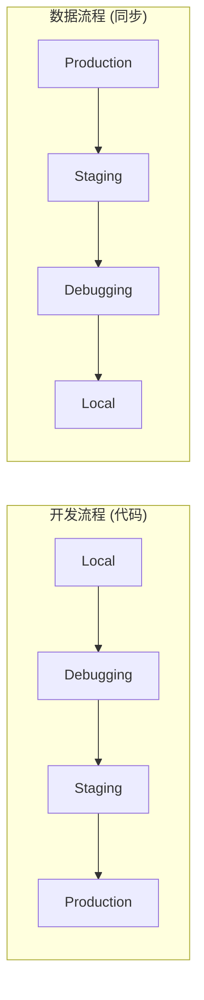
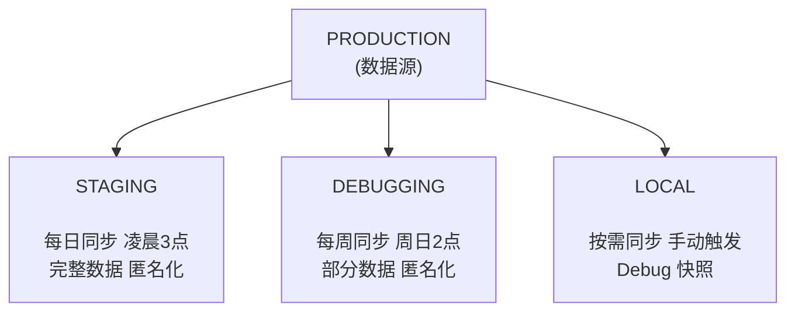
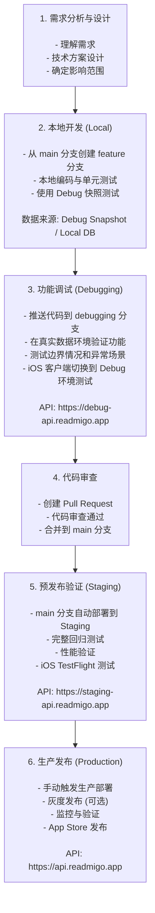
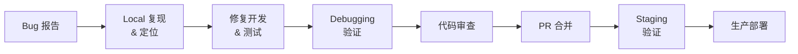
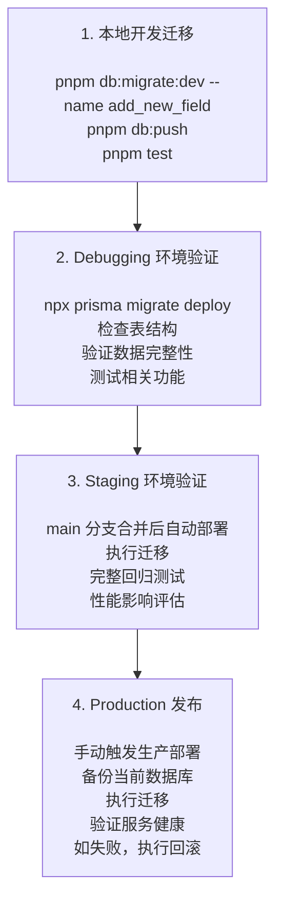
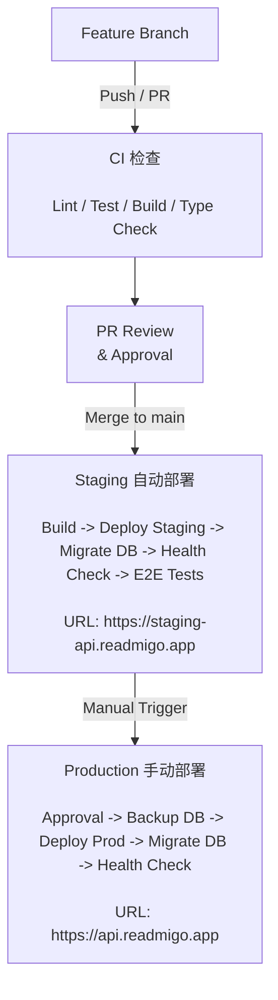
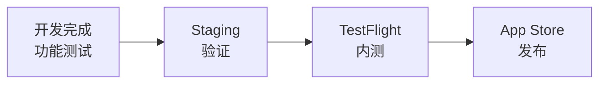

# 数据同步与发布工作流程

## 1. 概述

本文档定义 Readmigo 项目在不同环境间的数据同步策略、开发测试流程以及发布工作流程。

### 1.1 环境架构回顾



### 1.2 核心原则

| 原则 | 说明 |
|------|------|
| **代码向上流动** | Local → Debugging → Staging → Production |
| **数据向下流动** | Production → Staging → Debugging → Local |
| **数据匿名化** | 非生产环境必须使用匿名化数据 |
| **环境隔离** | 各环境数据库、Redis、存储完全独立 |

---

## 2. 数据同步策略

### 2.1 同步频率与范围



| 目标环境 | 数据源 | 同步频率 | 同步范围 | 触发方式 |
|----------|--------|----------|----------|----------|
| Staging | Production | 每日 | 完整数据 (匿名化) | 自动 (凌晨3点) |
| Debugging | Production | 每周 | 内容+部分用户数据 | 自动 (周日2点) / 手动 |
| Local | Debugging | 按需 | Debug 快照 | 手动 |

### 2.2 数据分类与处理策略

```
┌─────────────────────────────────────────────────────────────────────────────────┐
│                              数据分类处理                                         │
├─────────────────────────────────────────────────────────────────────────────────┤
│                                                                                  │
│   ┌─────────────────────────────────────────────────────────────────────────┐   │
│   │                        完整保留 (Content Data)                           │   │
│   │                                                                          │   │
│   │   books, authors, categories, quotes, book_lists, postcards,            │   │
│   │   postcard_templates, app_versions, feature_flags                       │   │
│   │                                                                          │   │
│   └─────────────────────────────────────────────────────────────────────────┘   │
│                                                                                  │
│   ┌─────────────────────────────────────────────────────────────────────────┐   │
│   │                        匿名化处理 (User Data)                            │   │
│   │                                                                          │   │
│   │   users:                                                                 │   │
│   │     - email      → SHA256(email) + @anonymized.local                    │   │
│   │     - name       → Faker 随机名                                          │   │
│   │     - appleUserId → SHA256(appleUserId)                                 │   │
│   │     - googleUserId → SHA256(googleUserId)                               │   │
│   │     - avatar     → 默认头像                                              │   │
│   │                                                                          │   │
│   │   reading_sessions, user_vocabulary, user_badges:                        │   │
│   │     - 保留结构和数据，关联已匿名化的用户                                    │   │
│   │                                                                          │   │
│   └─────────────────────────────────────────────────────────────────────────┘   │
│                                                                                  │
│   ┌─────────────────────────────────────────────────────────────────────────┐   │
│   │                        完全排除 (Sensitive Data)                         │   │
│   │                                                                          │   │
│   │   subscriptions, subscription_transactions, refresh_tokens,              │   │
│   │   password_reset_tokens, audit_logs, user_devices                       │   │
│   │                                                                          │   │
│   └─────────────────────────────────────────────────────────────────────────┘   │
│                                                                                  │
│   ┌─────────────────────────────────────────────────────────────────────────┐   │
│   │                        保留缓存 (Cache Data)                             │   │
│   │                                                                          │   │
│   │   ai_cache (保留以节省 AI 调用成本)                                        │   │
│   │                                                                          │   │
│   └─────────────────────────────────────────────────────────────────────────┘   │
│                                                                                  │
└─────────────────────────────────────────────────────────────────────────────────┘
```

### 2.3 同步命令

```bash
# Production → Staging (完整同步)
pnpm db:sync --from=production --to=staging --mode=full

# Production → Debugging (内容+用户数据)
pnpm db:sync --from=production --to=debugging --mode=full

# Production → Debugging (仅内容数据，快速)
pnpm db:sync --from=production --to=debugging --mode=content-only

# Debugging → Local (开发者本地)
pnpm db:sync --from=debugging --to=local --mode=full

# 重置本地数据库
pnpm db:reset:local
```

---

## 3. 开发工作流程

### 3.1 功能开发流程



### 3.2 Bug 修复流程



**紧急修复 (Hotfix)**: 跳过 Debugging，直接 Local -> Staging -> Production，需要额外审批。

### 3.3 数据库迁移流程



**破坏性迁移注意事项**:
- 删除字段/表必须分两步: 1) 停止使用 2) 下个版本删除
- 重命名字段必须分三步: 1) 添加新字段 2) 迁移数据 3) 删除旧字段
- 必须确保迁移可回滚

---

## 4. 发布工作流程

### 4.1 发布流水线



### 4.2 GitHub Actions 配置

```yaml
# .github/workflows/deploy.yml

name: Deploy

on:
  push:
    branches: [main]
  workflow_dispatch:
    inputs:
      environment:
        description: 'Deploy environment'
        required: true
        type: choice
        options:
          - staging
          - production

jobs:
  # CI 检查
  ci:
    runs-on: ubuntu-latest
    steps:
      - uses: actions/checkout@v4
      - uses: pnpm/action-setup@v2
      - uses: actions/setup-node@v4
        with:
          node-version: '20'
          cache: 'pnpm'

      - run: pnpm install
      - run: pnpm lint
      - run: pnpm build
      - run: pnpm test

  # Staging 部署 (main 分支自动)
  deploy-staging:
    needs: ci
    if: github.ref == 'refs/heads/main' && github.event_name == 'push'
    runs-on: ubuntu-latest
    environment: staging

    steps:
      - uses: actions/checkout@v4

      - name: Deploy to Staging
        run: fly deploy --config fly.staging.toml
        env:
          FLY_API_TOKEN: ${{ secrets.FLY_STAGING_TOKEN }}

      - name: Run Migrations
        run: fly ssh console -C "npx prisma migrate deploy" --app readmigo-staging
        env:
          FLY_API_TOKEN: ${{ secrets.FLY_STAGING_TOKEN }}

      - name: Health Check
        run: |
          sleep 30
          curl -f https://staging-api.readmigo.app/api/v1/health

      - name: Run E2E Tests
        run: pnpm test:e2e --env=staging

  # Production 部署 (手动触发)
  deploy-production:
    needs: ci
    if: github.event.inputs.environment == 'production'
    runs-on: ubuntu-latest
    environment: production  # 需要审批

    steps:
      - uses: actions/checkout@v4

      - name: Verify Staging Health
        run: curl -f https://staging-api.readmigo.app/api/v1/health

      - name: Backup Database
        run: |
          # 使用 Neon 备份 API
          curl -X POST "https://console.neon.tech/api/v2/projects/$NEON_PROJECT_ID/branches" \
            -H "Authorization: Bearer $NEON_API_KEY" \
            -d '{"name": "backup-before-deploy-${{ github.sha }}"}'
        env:
          NEON_PROJECT_ID: ${{ secrets.NEON_PROD_PROJECT_ID }}
          NEON_API_KEY: ${{ secrets.NEON_API_KEY }}

      - name: Deploy to Production
        run: fly deploy --config fly.production.toml
        env:
          FLY_API_TOKEN: ${{ secrets.FLY_PRODUCTION_TOKEN }}

      - name: Run Migrations
        run: fly ssh console -C "npx prisma migrate deploy" --app readmigo-api
        env:
          FLY_API_TOKEN: ${{ secrets.FLY_PRODUCTION_TOKEN }}

      - name: Health Check
        run: |
          sleep 60
          curl -f https://api.readmigo.app/api/v1/health

      - name: Notify Team
        uses: slackapi/slack-github-action@v1
        with:
          payload: |
            {
              "text": "✅ Production deployed: ${{ github.sha }}"
            }
        env:
          SLACK_WEBHOOK_URL: ${{ secrets.SLACK_WEBHOOK }}
```

### 4.3 发布检查清单

```
┌─────────────────────────────────────────────────────────────────────────────────┐
│                              发布检查清单                                         │
├─────────────────────────────────────────────────────────────────────────────────┤
│                                                                                  │
│   发布前检查 (Staging 验证):                                                     │
│   ┌────────────────────────────────────────────────────────────────────────┐    │
│   │  [ ] 所有 CI 检查通过                                                    │    │
│   │  [ ] Staging 部署成功                                                   │    │
│   │  [ ] Health check 通过                                                  │    │
│   │  [ ] E2E 测试通过                                                       │    │
│   │  [ ] 手动功能验证完成                                                   │    │
│   │  [ ] 性能指标正常 (P99 < 500ms)                                         │    │
│   │  [ ] 无新增 Sentry 错误                                                 │    │
│   │  [ ] 数据库迁移在 Staging 验证通过                                       │    │
│   └────────────────────────────────────────────────────────────────────────┘    │
│                                                                                  │
│   发布执行:                                                                      │
│   ┌────────────────────────────────────────────────────────────────────────┐    │
│   │  [ ] 确认发布时间 (避开高峰期)                                           │    │
│   │  [ ] 通知团队成员                                                       │    │
│   │  [ ] 数据库备份完成                                                     │    │
│   │  [ ] 触发 Production 部署                                               │    │
│   │  [ ] 等待审批通过                                                       │    │
│   │  [ ] 部署完成                                                           │    │
│   │  [ ] Health check 通过                                                  │    │
│   └────────────────────────────────────────────────────────────────────────┘    │
│                                                                                  │
│   发布后验证:                                                                    │
│   ┌────────────────────────────────────────────────────────────────────────┐    │
│   │  [ ] 核心功能验证                                                        │    │
│   │  [ ] 监控指标正常                                                       │    │
│   │  [ ] 错误率未上升                                                       │    │
│   │  [ ] 用户反馈无异常                                                     │    │
│   │  [ ] 更新版本日志                                                       │    │
│   │  [ ] 通知发布完成                                                       │    │
│   └────────────────────────────────────────────────────────────────────────┘    │
│                                                                                  │
│   回滚流程 (如需要):                                                             │
│   ┌────────────────────────────────────────────────────────────────────────┐    │
│   │  fly releases rollback --app readmigo-api                               │    │
│   │                                                                         │    │
│   │  如需数据库回滚:                                                        │    │
│   │  - 恢复 Neon 备份分支                                                   │    │
│   │  - 或执行反向迁移脚本                                                   │    │
│   └────────────────────────────────────────────────────────────────────────┘    │
│                                                                                  │
└─────────────────────────────────────────────────────────────────────────────────┘
```

---

## 5. iOS 客户端发布流程

### 5.1 版本管理



**版本号管理**:

| 命令 | 效果 |
|------|------|
| `pnpm version:patch` | 1.2.0 -> 1.2.1 |
| `pnpm version:minor` | 1.2.0 -> 1.3.0 |
| `pnpm version:major` | 1.2.0 -> 2.0.0 |
| `pnpm version:build` | build 45 -> 46 |

**环境对应**:

| Build | API |
|-------|-----|
| Debug Build | Debugging API (debug-api.readmigo.app) |
| TestFlight | Staging API (staging-api.readmigo.app) |
| App Store | Production API (api.readmigo.app) |

---

## 6. 常用命令速查

### 6.1 数据同步命令

```bash
# 完整同步 (Production → Staging)
pnpm db:sync --from=production --to=staging

# 内容同步 (快速)
pnpm db:sync:content --from=production --to=debugging

# 本地重置
pnpm db:reset:local

# 同步到本地
pnpm db:sync --from=debugging --to=local
```

### 6.2 部署命令

```bash
# Debugging 环境
fly deploy --config fly.debugging.toml

# Staging 环境
fly deploy --config fly.staging.toml

# Production 环境
fly deploy --config fly.production.toml

# 回滚
fly releases rollback --app readmigo-api

# 查看状态
fly status --app readmigo-api
fly logs --app readmigo-api
```

### 6.3 数据库命令

```bash
# 本地迁移
pnpm db:migrate:dev --name migration_name

# 部署迁移
pnpm db:migrate:deploy

# 生成 Prisma Client
pnpm db:generate

# 数据库 Studio
pnpm db:studio
```

---

## 7. 故障恢复流程

### 7.1 服务回滚

```bash
# 回滚到上一个版本
fly releases rollback --app readmigo-api

# 回滚到指定版本
fly releases rollback --app readmigo-api --version 10
```

### 7.2 数据库回滚

```bash
# 使用 Neon 时间点恢复
# 1. 登录 Neon Console
# 2. 选择项目 → Branches
# 3. 创建新分支，选择恢复时间点
# 4. 更新连接字符串指向新分支
```

### 7.3 紧急修复流程

```
1. 评估影响范围
2. 决定是回滚还是热修复
3. 如回滚：执行服务回滚 + 数据库回滚（如需要）
4. 如热修复：
   - 创建 hotfix 分支
   - 快速修复 + 测试
   - 直接部署到 Staging 验证
   - 部署到 Production
5. 事后复盘
```

---

请 review 以上文档，确认后我将更新执行计划。
