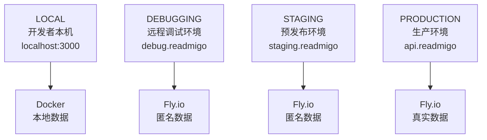

# Backend 环境隔离设计

> 本文档已拆分为多个独立文档，便于查阅和维护

---

## 文档索引

本大型文档 (原5000+行) 已拆分为以下三个专题文档:

| 文档 | 内容 | 适用场景 |
|------|------|----------|
| **[be-environment-overview.md](../be-environment-overview.md)** | 概述、架构、核心原则 | 快速了解环境隔离设计 |
| **[be-environment-configs.md](../be-environment-configs.md)** | 各环境详细配置、客户端切换 | 配置和开发参考 |
| **[backend-environment-operations.md](./backend-environment-operations.md)** | 数据同步、监控、运维命令 | 日常运维操作 |

---

## 快速导航

### 了解设计

→ [be-environment-overview.md](../be-environment-overview.md)
- 四层环境架构 (Local/Debugging/Staging/Production)
- 环境对比表
- 核心原则

### 配置开发

→ [be-environment-configs.md](../be-environment-configs.md)
- 各环境详细配置规范
- 配置文件结构
- iOS/Dashboard 环境切换

### 运维操作

→ [backend-environment-operations.md](./backend-environment-operations.md)
- 数据同步命令
- 部署操作
- 监控与故障排查

---

## 架构速览

---

*拆分日期: 2025-12-31*
*原文档行数: 5000+ 行*
