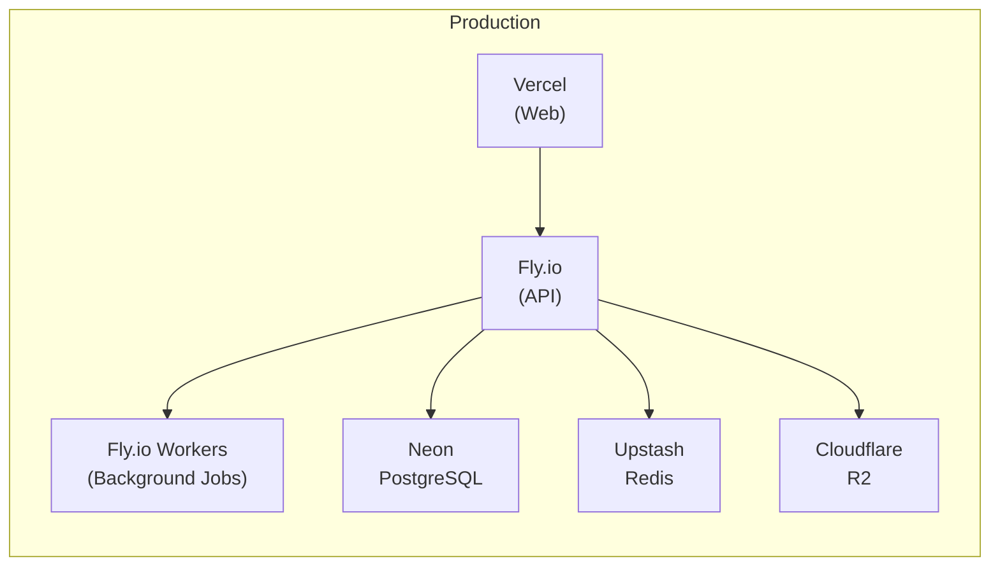
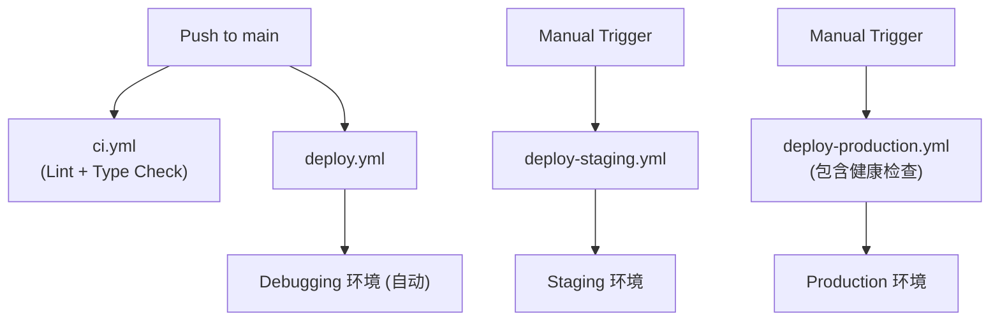

# 环境配置总览

本文档描述 Readmigo 项目的全栈环境配置。

## 环境拓扑

项目共有 **4 套环境**：

| 环境 | 用途 | 后端部署 | 前端部署 |
|-----|------|---------|---------|
| Local | 本地开发调试 | localhost:3000 | localhost:5173 |
| Debugging | 远程调试 | Fly.io (readmigo-debug) | - |
| Staging | 测试验证 | Fly.io (readmigo-staging) | Vercel Preview |
| Production | 正式生产 | Fly.io (readmigo-api) | Vercel Production |

## 基础设施架构

## 各环境详细配置

### 1. Local (本地开发)

| 组件 | 配置 |
|-----|------|
| 数据库 | PostgreSQL localhost:5432/readmigo_debug |
| 缓存 | Redis localhost:6379 (DB 1) |
| 存储 | Cloudflare R2 (readmigo-debug bucket) |
| API 地址 | http://localhost:3000/api/v1 |
| 日志级别 | debug |

启动方式：
- `docker-compose up` 启动数据库和 Redis
- `pnpm dev` 启动开发服务器

### 2. Debugging (远程调试)

| 组件 | 配置 |
|-----|------|
| 数据库 | 本地/远程 PostgreSQL |
| 缓存 | 本地 Redis |
| 部署平台 | Fly.io (readmigo-debug) |
| 区域 | nrt (东京) |
| API 地址 | https://debug-api.readmigo.app/api/v1 |
| 日志级别 | debug |
| Sentry 环境 | debugging |

### 3. Staging (测试验证)

| 组件 | 配置 |
|-----|------|
| 数据库 | Neon PostgreSQL |
| 缓存 | Upstash Redis |
| 部署平台 | Fly.io (readmigo-staging) |
| 区域 | nrt (东京) |
| 内存 | 1024 MB |
| API 地址 | https://staging-api.readmigo.app/api/v1 |
| 日志级别 | info |
| Sentry 环境 | staging |
| 请求限制 | 200/分钟 (soft) / 250/分钟 (hard) |

### 4. Production (正式生产)

| 组件 | 配置 |
|-----|------|
| 数据库 | Neon PostgreSQL (生产专用) |
| 缓存 | Upstash Redis (高可用) |
| 部署平台 | Fly.io (readmigo-api + readmigo-workers) |
| 区域 | nrt (东京) |
| 内存 | 512 MB |
| 自动扩展 | 启用 |
| API 地址 | https://api.readmigo.app/api/v1 |
| Web 地址 | https://web.readmigo.app |
| 日志级别 | warn |
| Sentry 环境 | production |
| 请求限制 | 200/分钟 (soft) / 250/分钟 (hard) |

## 第三方服务

### 数据存储

| 服务 | 用途 | 环境 |
|-----|------|------|
| Neon PostgreSQL | 主数据库 | Staging / Production |
| Upstash Redis | 缓存 & 队列 | Staging / Production |
| Cloudflare R2 | 对象存储 (书籍、封面等) | 所有环境 |

### AI 服务

| 服务 | 用途 |
|-----|------|
| DeepSeek | 默认 AI 服务 (批处理任务) |
| OpenAI | GPT 模型调用 |
| Anthropic | 文学分析 |
| 阿里云 DashScope | 中文内容处理 (Qwen) |

### 监控服务

| 服务 | 用途 |
|-----|------|
| Sentry | 错误追踪 |
| Fly.io Metrics | 性能监控 |

### 认证服务

| 服务 | 用途 |
|-----|------|
| Apple Sign In | iOS 用户认证 |
| Google Sign In | Android/Web 用户认证 |

## 部署流程

## 配置文件位置

| 文件 | 用途 |
|-----|------|
| fly.toml | Fly.io 主配置 |
| fly.production.toml | 生产环境配置 |
| fly.staging.toml | 测试环境配置 |
| fly.debugging.toml | 调试环境配置 |
| fly.workers.toml | 后台 Worker 配置 |
| docker-compose.yml | 本地开发环境 |
| .github/workflows/*.yml | CI/CD 工作流 |

## 环境变量配置文件

| 文件 | 用途 |
|-----|------|
| .env | 根目录调试配置 |
| apps/backend/.env | 后端开发配置 |
| apps/backend/.env.example | 后端配置模板 |
| apps/backend/.env.production.example | 后端生产配置模板 |
| apps/web/.env.local | 前端本地配置 |
| packages/database/.env | 数据库连接配置 |

## 资源配额对比

| 配置项 | Development | Debugging | Staging | Production |
|-------|-------------|-----------|---------|------------|
| CPU | 本地 | shared (1) | shared (1) | shared (1) |
| 内存 | 本地 | 512 MB | 1024 MB | 512 MB |
| 最小实例 | 1 | 1 | 1 | 1 |
| 自动扩展 | 否 | 否 | 是 | 是 |
| 健康检查 | 否 | 是 | 是 | 是 |

## 相关文档

- [后端环境隔离设计](./environment-operations/isolation-design.md)
- [CI/CD 配置计划](./cicd-configuration-plan.md)
- [数据同步与发布流程](./environment-operations/data-sync.md)
- [Workers 部署](./platforms/workers-deployment.md)
