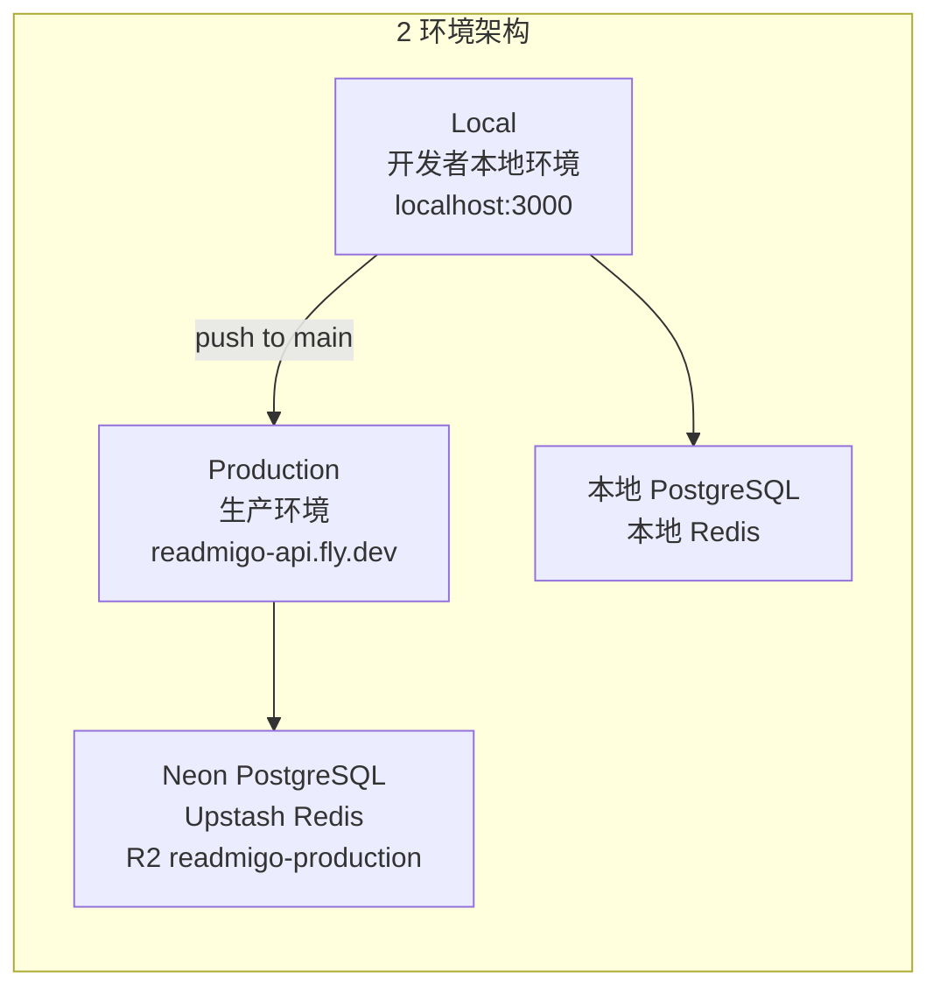
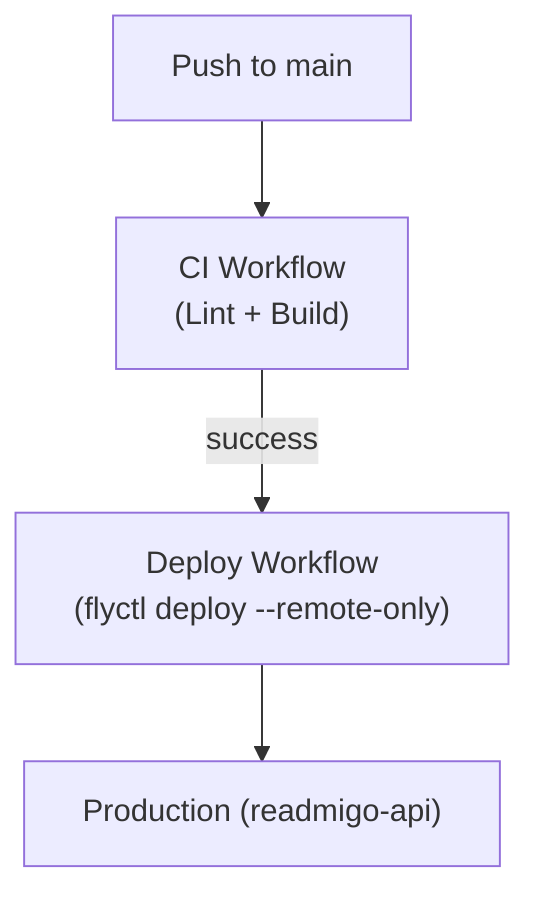

# Readmigo 环境配置

## 环境总览

Readmigo 项目采用 **2 环境架构**：Local + Production。

| 环境 | 用途 | Backend 位置 | 访问方式 |
|------|------|-------------|----------|
| **Local** | 本地开发调试 | 开发电脑 (localhost:3000) | `pnpm dev` |
| **Production** | 正式生产环境 | Fly.io (Tokyo nrt) | GitHub Actions 自动部署 |

> 项目曾使用 4 环境架构 (Local/Debug/Staging/Production)，于 2026-01 简化为 2 环境。

---

## 架构图

---

## Local Environment (本地开发)

开发者在本地机器上运行，用于日常开发和调试。

### Backend API

| 配置项 | 值 |
|--------|-----|
| 运行位置 | 开发电脑 (macOS) |
| 端口 | 3000 (默认) |
| 访问地址 | http://localhost:3000 |

### Database

| 配置项 | 值 |
|--------|-----|
| 类型 | PostgreSQL (Homebrew) |
| 运行位置 | localhost:5432 |
| 配置文件 | `.env` |

### Redis

| 配置项 | 值 |
|--------|-----|
| 运行位置 | localhost:6379 |

### File Storage

| 配置项 | 值 |
|--------|-----|
| 类型 | Cloudflare R2 |
| Bucket | readmigo-dev |

---

## Production Environment (生产环境)

正式生产环境，服务真实用户。

### Backend API

| 配置项 | 值 |
|--------|-----|
| 运行位置 | Fly.io (Tokyo - nrt) |
| App 名称 | readmigo-api |
| URL | https://readmigo-api.fly.dev |
| 配置 | fly.toml + Fly.io Secrets |
| VM | shared-cpu-2x, 2GB |
| 自动扩容 | 1+ machines (auto start/stop) |
| 部署策略 | rolling |
| 内部端口 | 8080 |
| 健康检查 | /api/v1/health |

### Database

| 配置项 | 值 |
|--------|-----|
| 类型 | Neon PostgreSQL |
| 区域 | ap-southeast-1 (Singapore) |

### Redis

| 配置项 | 值 |
|--------|-----|
| 类型 | Upstash Redis |

### File Storage

| 配置项 | 值 |
|--------|-----|
| 类型 | Cloudflare R2 |
| Bucket | readmigo-production |
| CDN URL | https://cdn.readmigo.app |

### iOS 客户端

| 配置项 | 值 |
|--------|-----|
| Bundle ID | com.readmigo.app |
| 分发方式 | App Store |
| API 地址 | https://readmigo-api.fly.dev |

---

## 基础设施对比表

| 配置项 | Local | Production |
|--------|-------|-----------|
| 运行位置 | localhost | Fly.io (nrt) |
| App 名称 | - | readmigo-api |
| VM | - | shared-cpu-2x, 2GB |
| 数据库 | Homebrew PostgreSQL | Neon PostgreSQL |
| Redis | localhost:6379 | Upstash Redis |
| R2 Bucket | readmigo-dev | readmigo-production |
| CDN | - | cdn.readmigo.app |

---

## 部署流程

CI/CD 由 GitHub Actions 自动完成，代码推送到 main 分支后自动部署。

---

## 环境变量配置

| 环境 | 配置位置 |
|------|----------|
| Local | `.env` 本地文件 |
| Production | Fly.io Secrets |

---

## Sentry 监控

| 配置项 | 值 |
|--------|-----|
| 环境标识 | production |

---

## 重要提醒

- Local 和 Production 数据完全隔离
- 绝对不要在 Local 使用 Production 的 DATABASE_URL
- Production 数据库包含真实用户数据，不要运行破坏性操作

---

*最后更新: 2026-02-07*
