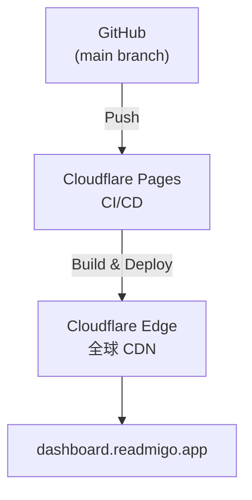

# Dashboard 部署指南

> 管理后台 (dashboard.readmigo.app) 部署文档

---

## 部署架构

---

## 项目信息

| 项目 | 值 |
|------|-----|
| 托管平台 | Cloudflare Pages |
| 框架 | React / Vite |
| 域名 | dashboard.readmigo.app |
| API 后端 | readmigo-api.fly.dev |
| SSL 证书 | Cloudflare 自动管理 |

---

## 部署流程

| 步骤 | 说明 |
|------|------|
| 1. 代码推送 | 推送到 main 分支 |
| 2. 自动构建 | Cloudflare Pages 检测更新并构建 |
| 3. 部署到边缘 | 静态文件分发到全球 CDN |
| 4. 验证 | 访问 dashboard.readmigo.app 验证 |

构建配置:

| 项目 | 值 |
|------|-----|
| 构建命令 | npm run build |
| 输出目录 | dist |
| 框架 | Vite |
| SPA 路由 | 所有路径重写到 index.html |

---

## 环境变量

| 变量 | 说明 |
|------|------|
| VITE_PRODUCTION_API_URL | 生产 API 地址 (readmigo-api.fly.dev) |

> 环境变量在 Cloudflare Pages 控制面板中配置。修改后需重新部署生效。

---

## 回滚方法

| 方法 | 说明 |
|------|------|
| Cloudflare Pages 回滚 | 在 Deployments 页面选择历史版本 Promote |
| Git 回滚 | git revert HEAD && git push origin main |

---

## 部署前检查清单

| 类别 | 检查项 |
|------|--------|
| 代码 | lint 无错误、build 构建成功、TypeScript 类型检查通过 |
| 功能 | 核心功能正常、API 连接正常 |
| 部署后 | 访问生产 URL 正常、登录功能正常 |

---

*最后更新: 2026-02-07*
