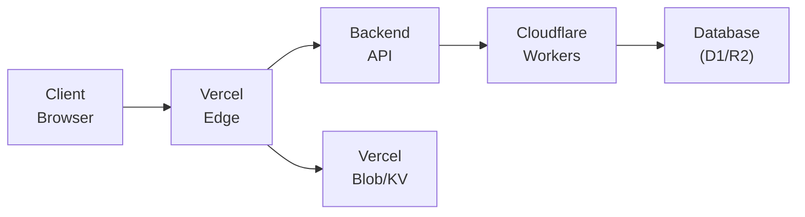

# Web 部署指南

> 本文档详细说明 Readmigo Web 客户端的部署流程，包括 Vercel 部署、环境配置、CI/CD 和监控设置。

## 1. 概述

### 1.1 部署架构



### 1.2 技术栈

| 组件 | 技术选型 |
|------|----------|
| 托管平台 | Vercel |
| CDN | Vercel Edge Network |
| 静态资源 | Vercel Blob |
| 缓存 | Vercel KV (Redis) |
| 域名管理 | Cloudflare |
| 监控 | Vercel Analytics + Sentry |
| CI/CD | GitHub Actions |

---

## 2. Vercel 部署配置

### 2.1 vercel.json

```json
{
  "$schema": "https://openapi.vercel.sh/vercel.json",
  "framework": "nextjs",
  "regions": ["hkg1", "sfo1"],
  "headers": [
    {
      "source": "/(.*)",
      "headers": [
        {
          "key": "X-Content-Type-Options",
          "value": "nosniff"
        },
        {
          "key": "X-Frame-Options",
          "value": "DENY"
        },
        {
          "key": "X-XSS-Protection",
          "value": "1; mode=block"
        },
        {
          "key": "Referrer-Policy",
          "value": "strict-origin-when-cross-origin"
        },
        {
          "key": "Permissions-Policy",
          "value": "camera=(), microphone=(), geolocation=()"
        }
      ]
    },
    {
      "source": "/api/(.*)",
      "headers": [
        {
          "key": "Cache-Control",
          "value": "no-store, max-age=0"
        }
      ]
    },
    {
      "source": "/_next/static/(.*)",
      "headers": [
        {
          "key": "Cache-Control",
          "value": "public, max-age=31536000, immutable"
        }
      ]
    }
  ],
  "rewrites": [
    {
      "source": "/api/backend/:path*",
      "destination": "https://api.readmigo.com/:path*"
    }
  ],
  "redirects": [
    {
      "source": "/home",
      "destination": "/",
      "permanent": true
    }
  ],
  "crons": [
    {
      "path": "/api/cron/sync-books",
      "schedule": "0 */6 * * *"
    },
    {
      "path": "/api/cron/cleanup-sessions",
      "schedule": "0 0 * * *"
    }
  ]
}
```

### 2.2 next.config.js

```javascript
// next.config.js

/** @type {import('next').NextConfig} */
const nextConfig = {
  // 输出模式
  output: 'standalone',

  // 实验性功能
  experimental: {
    serverActions: {
      bodySizeLimit: '2mb',
    },
    optimizePackageImports: ['lucide-react', '@radix-ui/react-icons'],
  },

  // 图片优化
  images: {
    remotePatterns: [
      {
        protocol: 'https',
        hostname: 'covers.readmigo.com',
        pathname: '/books/**',
      },
      {
        protocol: 'https',
        hostname: 'avatars.readmigo.com',
        pathname: '/users/**',
      },
      {
        protocol: 'https',
        hostname: 'www.gutenberg.org',
        pathname: '/cache/epub/**',
      },
    ],
    formats: ['image/avif', 'image/webp'],
    deviceSizes: [640, 750, 828, 1080, 1200, 1920],
    imageSizes: [16, 32, 48, 64, 96, 128, 256],
  },

  // Webpack 配置
  webpack: (config, { isServer }) => {
    // EPUB.js 需要的配置
    if (!isServer) {
      config.resolve.fallback = {
        ...config.resolve.fallback,
        fs: false,
        path: false,
      };
    }

    return config;
  },

  // 环境变量
  env: {
    NEXT_PUBLIC_APP_VERSION: process.env.npm_package_version,
  },

  // 重定向
  async redirects() {
    return [
      {
        source: '/app',
        destination: '/',
        permanent: true,
      },
    ];
  },

  // 请求头
  async headers() {
    return [
      {
        source: '/:path*',
        headers: [
          {
            key: 'X-DNS-Prefetch-Control',
            value: 'on',
          },
        ],
      },
    ];
  },
};

module.exports = nextConfig;
```

---

## 3. 环境变量

### 3.1 环境变量清单

```bash
# .env.example

# ============================================
# App Configuration
# ============================================
NEXT_PUBLIC_APP_URL=https://app.readmigo.com
NEXT_PUBLIC_APP_NAME=Readmigo
NEXT_PUBLIC_APP_ENV=production

# ============================================
# API Configuration
# ============================================
NEXT_PUBLIC_API_URL=https://api.readmigo.com
API_SECRET_KEY=your-api-secret-key

# ============================================
# Authentication (NextAuth.js)
# ============================================
NEXTAUTH_URL=https://app.readmigo.com
NEXTAUTH_SECRET=your-nextauth-secret-32-chars-min

# OAuth Providers
GOOGLE_CLIENT_ID=your-google-client-id
GOOGLE_CLIENT_SECRET=your-google-client-secret
APPLE_ID=your-apple-id
APPLE_SECRET=your-apple-secret

# ============================================
# Database (if using Vercel Postgres)
# ============================================
POSTGRES_URL=postgres://...
POSTGRES_PRISMA_URL=postgres://...
POSTGRES_URL_NON_POOLING=postgres://...

# ============================================
# Vercel KV (Redis)
# ============================================
KV_URL=redis://...
KV_REST_API_URL=https://...
KV_REST_API_TOKEN=your-kv-token
KV_REST_API_READ_ONLY_TOKEN=your-kv-read-only-token

# ============================================
# Vercel Blob Storage
# ============================================
BLOB_READ_WRITE_TOKEN=your-blob-token

# ============================================
# Payment (Stripe)
# ============================================
NEXT_PUBLIC_STRIPE_PUBLISHABLE_KEY=pk_live_...
STRIPE_SECRET_KEY=sk_live_...
STRIPE_WEBHOOK_SECRET=whsec_...

# ============================================
# AI Services
# ============================================
OPENAI_API_KEY=sk-...
ANTHROPIC_API_KEY=sk-ant-...

# ============================================
# Analytics & Monitoring
# ============================================
NEXT_PUBLIC_SENTRY_DSN=https://...@sentry.io/...
SENTRY_AUTH_TOKEN=your-sentry-auth-token
SENTRY_ORG=readmigo
SENTRY_PROJECT=web

# Vercel Analytics (自动配置)
NEXT_PUBLIC_VERCEL_ANALYTICS_ID=auto

# ============================================
# Feature Flags
# ============================================
NEXT_PUBLIC_ENABLE_AI=true
NEXT_PUBLIC_ENABLE_AUDIOBOOK=true
NEXT_PUBLIC_ENABLE_SOCIAL=true

# ============================================
# Third-party Services
# ============================================
# Push Notifications (Web Push)
NEXT_PUBLIC_VAPID_PUBLIC_KEY=your-vapid-public-key
VAPID_PRIVATE_KEY=your-vapid-private-key

# Email (Resend)
RESEND_API_KEY=re_...

# ============================================
# Development Only
# ============================================
# NEXT_PUBLIC_DEBUG_MODE=true
```

### 3.2 Vercel 环境变量设置

```bash
# 使用 Vercel CLI 设置环境变量

# 生产环境
vercel env add NEXTAUTH_SECRET production
vercel env add STRIPE_SECRET_KEY production
vercel env add OPENAI_API_KEY production

# 预览环境
vercel env add NEXTAUTH_SECRET preview
vercel env add STRIPE_SECRET_KEY preview --test # 使用测试密钥

# 开发环境
vercel env pull .env.local
```

### 3.3 环境变量验证

```typescript
// src/lib/env.ts

import { z } from 'zod';

const envSchema = z.object({
  // App
  NEXT_PUBLIC_APP_URL: z.string().url(),
  NEXT_PUBLIC_APP_ENV: z.enum(['development', 'preview', 'production']),

  // API
  NEXT_PUBLIC_API_URL: z.string().url(),
  API_SECRET_KEY: z.string().min(32),

  // Auth
  NEXTAUTH_URL: z.string().url(),
  NEXTAUTH_SECRET: z.string().min(32),
  GOOGLE_CLIENT_ID: z.string().optional(),
  GOOGLE_CLIENT_SECRET: z.string().optional(),

  // Stripe
  NEXT_PUBLIC_STRIPE_PUBLISHABLE_KEY: z.string().startsWith('pk_'),
  STRIPE_SECRET_KEY: z.string().startsWith('sk_'),
  STRIPE_WEBHOOK_SECRET: z.string().startsWith('whsec_'),

  // AI
  OPENAI_API_KEY: z.string().startsWith('sk-').optional(),
  ANTHROPIC_API_KEY: z.string().optional(),

  // Monitoring
  NEXT_PUBLIC_SENTRY_DSN: z.string().url().optional(),
});

export type Env = z.infer<typeof envSchema>;

// 验证环境变量
export function validateEnv(): Env {
  const parsed = envSchema.safeParse(process.env);

  if (!parsed.success) {
    console.error('Invalid environment variables:', parsed.error.flatten().fieldErrors);
    throw new Error('Invalid environment variables');
  }

  return parsed.data;
}

// 单例模式获取环境变量
let env: Env | undefined;

export function getEnv(): Env {
  if (!env) {
    env = validateEnv();
  }
  return env;
}
```

---

## 4. CI/CD 配置

### 4.1 GitHub Actions 工作流

```yaml
# .github/workflows/ci.yml

name: CI

on:
  push:
    branches: [main, develop]
  pull_request:
    branches: [main, develop]

env:
  NODE_VERSION: '20'
  PNPM_VERSION: '8'

jobs:
  lint:
    name: Lint
    runs-on: ubuntu-latest
    steps:
      - uses: actions/checkout@v4

      - uses: pnpm/action-setup@v2
        with:
          version: ${{ env.PNPM_VERSION }}

      - uses: actions/setup-node@v4
        with:
          node-version: ${{ env.NODE_VERSION }}
          cache: 'pnpm'

      - name: Install dependencies
        run: pnpm install --frozen-lockfile

      - name: Run ESLint
        run: pnpm lint

      - name: Run Prettier
        run: pnpm format:check

  typecheck:
    name: Type Check
    runs-on: ubuntu-latest
    steps:
      - uses: actions/checkout@v4

      - uses: pnpm/action-setup@v2
        with:
          version: ${{ env.PNPM_VERSION }}

      - uses: actions/setup-node@v4
        with:
          node-version: ${{ env.NODE_VERSION }}
          cache: 'pnpm'

      - name: Install dependencies
        run: pnpm install --frozen-lockfile

      - name: Run TypeScript compiler
        run: pnpm typecheck

  test:
    name: Test
    runs-on: ubuntu-latest
    steps:
      - uses: actions/checkout@v4

      - uses: pnpm/action-setup@v2
        with:
          version: ${{ env.PNPM_VERSION }}

      - uses: actions/setup-node@v4
        with:
          node-version: ${{ env.NODE_VERSION }}
          cache: 'pnpm'

      - name: Install dependencies
        run: pnpm install --frozen-lockfile

      - name: Run unit tests
        run: pnpm test

      - name: Upload coverage
        uses: codecov/codecov-action@v3
        with:
          token: ${{ secrets.CODECOV_TOKEN }}
          files: ./coverage/lcov.info

  e2e:
    name: E2E Tests
    runs-on: ubuntu-latest
    steps:
      - uses: actions/checkout@v4

      - uses: pnpm/action-setup@v2
        with:
          version: ${{ env.PNPM_VERSION }}

      - uses: actions/setup-node@v4
        with:
          node-version: ${{ env.NODE_VERSION }}
          cache: 'pnpm'

      - name: Install dependencies
        run: pnpm install --frozen-lockfile

      - name: Install Playwright browsers
        run: pnpm exec playwright install --with-deps

      - name: Run E2E tests
        run: pnpm test:e2e
        env:
          NEXT_PUBLIC_APP_URL: http://localhost:3000

      - name: Upload test results
        uses: actions/upload-artifact@v4
        if: failure()
        with:
          name: playwright-report
          path: playwright-report/

  build:
    name: Build
    runs-on: ubuntu-latest
    needs: [lint, typecheck, test]
    steps:
      - uses: actions/checkout@v4

      - uses: pnpm/action-setup@v2
        with:
          version: ${{ env.PNPM_VERSION }}

      - uses: actions/setup-node@v4
        with:
          node-version: ${{ env.NODE_VERSION }}
          cache: 'pnpm'

      - name: Install dependencies
        run: pnpm install --frozen-lockfile

      - name: Build application
        run: pnpm build
        env:
          NEXT_PUBLIC_APP_URL: ${{ vars.NEXT_PUBLIC_APP_URL }}
          NEXT_PUBLIC_API_URL: ${{ vars.NEXT_PUBLIC_API_URL }}

      - name: Upload build artifacts
        uses: actions/upload-artifact@v4
        with:
          name: build
          path: .next/
```

### 4.2 部署工作流

```yaml
# .github/workflows/deploy.yml

name: Deploy

on:
  push:
    branches: [main]
  workflow_dispatch:
    inputs:
      environment:
        description: 'Deployment environment'
        required: true
        default: 'preview'
        type: choice
        options:
          - preview
          - production

jobs:
  deploy-preview:
    name: Deploy Preview
    runs-on: ubuntu-latest
    if: github.event_name == 'push' || github.event.inputs.environment == 'preview'
    environment:
      name: preview
      url: ${{ steps.deploy.outputs.url }}
    steps:
      - uses: actions/checkout@v4

      - name: Deploy to Vercel
        id: deploy
        uses: amondnet/vercel-action@v25
        with:
          vercel-token: ${{ secrets.VERCEL_TOKEN }}
          vercel-org-id: ${{ secrets.VERCEL_ORG_ID }}
          vercel-project-id: ${{ secrets.VERCEL_PROJECT_ID }}
          scope: ${{ secrets.VERCEL_ORG_ID }}

      - name: Comment PR
        if: github.event_name == 'pull_request'
        uses: actions/github-script@v7
        with:
          script: |
            github.rest.issues.createComment({
              issue_number: context.issue.number,
              owner: context.repo.owner,
              repo: context.repo.repo,
              body: `🚀 Preview deployed: ${{ steps.deploy.outputs.url }}`
            })

  deploy-production:
    name: Deploy Production
    runs-on: ubuntu-latest
    if: github.event.inputs.environment == 'production'
    environment:
      name: production
      url: https://app.readmigo.com
    steps:
      - uses: actions/checkout@v4

      - name: Deploy to Vercel (Production)
        uses: amondnet/vercel-action@v25
        with:
          vercel-token: ${{ secrets.VERCEL_TOKEN }}
          vercel-org-id: ${{ secrets.VERCEL_ORG_ID }}
          vercel-project-id: ${{ secrets.VERCEL_PROJECT_ID }}
          vercel-args: '--prod'
          scope: ${{ secrets.VERCEL_ORG_ID }}

      - name: Purge CDN cache
        run: |
          curl -X POST "https://api.cloudflare.com/client/v4/zones/${{ secrets.CF_ZONE_ID }}/purge_cache" \
            -H "Authorization: Bearer ${{ secrets.CF_API_TOKEN }}" \
            -H "Content-Type: application/json" \
            --data '{"purge_everything":true}'

      - name: Notify Sentry of release
        uses: getsentry/action-release@v1
        env:
          SENTRY_AUTH_TOKEN: ${{ secrets.SENTRY_AUTH_TOKEN }}
          SENTRY_ORG: ${{ secrets.SENTRY_ORG }}
          SENTRY_PROJECT: ${{ secrets.SENTRY_PROJECT }}
        with:
          environment: production
```

### 4.3 版本发布工作流

```yaml
# .github/workflows/release.yml

name: Release

on:
  push:
    tags:
      - 'v*'

permissions:
  contents: write

jobs:
  release:
    name: Create Release
    runs-on: ubuntu-latest
    steps:
      - uses: actions/checkout@v4
        with:
          fetch-depth: 0

      - name: Generate changelog
        id: changelog
        uses: orhun/git-cliff-action@v2
        with:
          config: cliff.toml
          args: --latest --strip header

      - name: Create Release
        uses: softprops/action-gh-release@v1
        with:
          body: ${{ steps.changelog.outputs.content }}
          draft: false
          prerelease: ${{ contains(github.ref, 'beta') || contains(github.ref, 'alpha') }}

      - name: Trigger production deploy
        uses: peter-evans/repository-dispatch@v2
        with:
          event-type: release-deploy
          client-payload: '{"tag": "${{ github.ref_name }}"}'
```

---

## 5. 监控与分析

### 5.1 Sentry 配置

```typescript
// sentry.client.config.ts

import * as Sentry from '@sentry/nextjs';

Sentry.init({
  dsn: process.env.NEXT_PUBLIC_SENTRY_DSN,
  environment: process.env.NEXT_PUBLIC_APP_ENV,

  // 采样率
  tracesSampleRate: process.env.NODE_ENV === 'production' ? 0.1 : 1.0,
  replaysSessionSampleRate: 0.1,
  replaysOnErrorSampleRate: 1.0,

  // 集成
  integrations: [
    new Sentry.Replay({
      maskAllText: false,
      blockAllMedia: false,
    }),
  ],

  // 过滤敏感信息
  beforeSend(event) {
    // 移除用户敏感信息
    if (event.user) {
      delete event.user.email;
      delete event.user.ip_address;
    }
    return event;
  },

  // 忽略的错误
  ignoreErrors: [
    'ResizeObserver loop limit exceeded',
    'Non-Error promise rejection captured',
    /Loading chunk \d+ failed/,
  ],
});
```

```typescript
// sentry.server.config.ts

import * as Sentry from '@sentry/nextjs';

Sentry.init({
  dsn: process.env.NEXT_PUBLIC_SENTRY_DSN,
  environment: process.env.NEXT_PUBLIC_APP_ENV,
  tracesSampleRate: process.env.NODE_ENV === 'production' ? 0.1 : 1.0,

  // 服务端特定配置
  integrations: [
    new Sentry.Integrations.Http({ tracing: true }),
    new Sentry.Integrations.Prisma({ client: prisma }),
  ],
});
```

### 5.2 Vercel Analytics

```typescript
// src/app/layout.tsx

import { Analytics } from '@vercel/analytics/react';
import { SpeedInsights } from '@vercel/speed-insights/next';

export default function RootLayout({
  children,
}: {
  children: React.ReactNode;
}) {
  return (
    <html lang="en">
      <body>
        {children}
        <Analytics />
        <SpeedInsights />
      </body>
    </html>
  );
}
```

### 5.3 自定义事件追踪

```typescript
// src/lib/analytics.ts

import { track } from '@vercel/analytics';

export const analytics = {
  // 页面浏览
  pageView: (page: string, properties?: Record<string, unknown>) => {
    track('page_view', { page, ...properties });
  },

  // 书籍事件
  bookOpened: (bookId: string, title: string) => {
    track('book_opened', { bookId, title });
  },

  bookCompleted: (bookId: string, readingTime: number) => {
    track('book_completed', { bookId, readingTime });
  },

  // AI 事件
  aiExplainUsed: (wordCount: number) => {
    track('ai_explain_used', { wordCount });
  },

  aiTranslateUsed: (sourceLanguage: string, targetLanguage: string) => {
    track('ai_translate_used', { sourceLanguage, targetLanguage });
  },

  // 学习事件
  vocabularyAdded: (word: string, source: string) => {
    track('vocabulary_added', { word, source });
  },

  reviewSessionCompleted: (wordsReviewed: number, accuracy: number) => {
    track('review_session_completed', { wordsReviewed, accuracy });
  },

  // 订阅事件
  subscriptionStarted: (plan: string, price: number) => {
    track('subscription_started', { plan, price });
  },

  subscriptionCancelled: (plan: string, reason?: string) => {
    track('subscription_cancelled', { plan, reason });
  },
};
```

### 5.4 性能监控

```typescript
// src/lib/performance.ts

import { onCLS, onFID, onFCP, onLCP, onTTFB, Metric } from 'web-vitals';

function sendToAnalytics(metric: Metric) {
  // 发送到分析服务
  const body = JSON.stringify({
    name: metric.name,
    value: metric.value,
    rating: metric.rating,
    delta: metric.delta,
    id: metric.id,
    navigationType: metric.navigationType,
  });

  // 使用 sendBeacon 确保数据发送
  if (navigator.sendBeacon) {
    navigator.sendBeacon('/api/analytics/vitals', body);
  } else {
    fetch('/api/analytics/vitals', {
      body,
      method: 'POST',
      keepalive: true,
    });
  }
}

export function reportWebVitals() {
  onCLS(sendToAnalytics);
  onFID(sendToAnalytics);
  onFCP(sendToAnalytics);
  onLCP(sendToAnalytics);
  onTTFB(sendToAnalytics);
}

// 性能阈值配置
export const performanceThresholds = {
  LCP: { good: 2500, needsImprovement: 4000 },
  FID: { good: 100, needsImprovement: 300 },
  CLS: { good: 0.1, needsImprovement: 0.25 },
  FCP: { good: 1800, needsImprovement: 3000 },
  TTFB: { good: 800, needsImprovement: 1800 },
};
```

---

## 6. 性能优化

### 6.1 图片优化

```typescript
// src/components/ui/OptimizedImage.tsx

import Image, { ImageProps } from 'next/image';
import { useState } from 'react';
import { cn } from '@/lib/utils';

interface OptimizedImageProps extends Omit<ImageProps, 'onLoad'> {
  fallback?: string;
}

export function OptimizedImage({
  src,
  alt,
  fallback = '/images/placeholder.png',
  className,
  ...props
}: OptimizedImageProps) {
  const [error, setError] = useState(false);
  const [loaded, setLoaded] = useState(false);

  return (
    <div className={cn('relative overflow-hidden', className)}>
      {!loaded && (
        <div className="absolute inset-0 animate-pulse bg-muted" />
      )}
      <Image
        src={error ? fallback : src}
        alt={alt}
        onError={() => setError(true)}
        onLoad={() => setLoaded(true)}
        className={cn(
          'transition-opacity duration-300',
          loaded ? 'opacity-100' : 'opacity-0'
        )}
        {...props}
      />
    </div>
  );
}
```

### 6.2 代码分割

```typescript
// src/lib/dynamic-imports.ts

import dynamic from 'next/dynamic';

// 懒加载阅读器
export const DynamicReader = dynamic(
  () => import('@/components/reader/Reader'),
  {
    loading: () => <ReaderSkeleton />,
    ssr: false, // 阅读器不需要 SSR
  }
);

// 懒加载 AI 面板
export const DynamicAIPanel = dynamic(
  () => import('@/components/ai/AIPanel'),
  {
    loading: () => <AIPanelSkeleton />,
    ssr: false,
  }
);

// 懒加载图表
export const DynamicCharts = dynamic(
  () => import('@/components/charts/LearningCharts'),
  {
    loading: () => <ChartSkeleton />,
    ssr: false,
  }
);

// 懒加载编辑器
export const DynamicEditor = dynamic(
  () => import('@/components/editor/NoteEditor'),
  {
    loading: () => <EditorSkeleton />,
    ssr: false,
  }
);
```

### 6.3 缓存策略

```typescript
// src/lib/cache.ts

import { kv } from '@vercel/kv';

const CACHE_TTL = {
  SHORT: 60, // 1 分钟
  MEDIUM: 300, // 5 分钟
  LONG: 3600, // 1 小时
  DAY: 86400, // 1 天
};

export const cache = {
  // 获取缓存
  async get<T>(key: string): Promise<T | null> {
    try {
      return await kv.get<T>(key);
    } catch (error) {
      console.error('Cache get error:', error);
      return null;
    }
  },

  // 设置缓存
  async set<T>(key: string, value: T, ttl: number = CACHE_TTL.MEDIUM): Promise<void> {
    try {
      await kv.set(key, value, { ex: ttl });
    } catch (error) {
      console.error('Cache set error:', error);
    }
  },

  // 删除缓存
  async delete(key: string): Promise<void> {
    try {
      await kv.del(key);
    } catch (error) {
      console.error('Cache delete error:', error);
    }
  },

  // 批量删除
  async deletePattern(pattern: string): Promise<void> {
    try {
      const keys = await kv.keys(pattern);
      if (keys.length > 0) {
        await kv.del(...keys);
      }
    } catch (error) {
      console.error('Cache delete pattern error:', error);
    }
  },
};

// 缓存装饰器
export function withCache<T>(
  key: string,
  ttl: number = CACHE_TTL.MEDIUM
) {
  return function (
    target: any,
    propertyKey: string,
    descriptor: PropertyDescriptor
  ) {
    const originalMethod = descriptor.value;

    descriptor.value = async function (...args: any[]) {
      const cacheKey = `${key}:${JSON.stringify(args)}`;
      const cached = await cache.get<T>(cacheKey);

      if (cached) {
        return cached;
      }

      const result = await originalMethod.apply(this, args);
      await cache.set(cacheKey, result, ttl);

      return result;
    };

    return descriptor;
  };
}
```

### 6.4 Bundle 分析

```javascript
// next.config.js (添加 bundle 分析)

const withBundleAnalyzer = require('@next/bundle-analyzer')({
  enabled: process.env.ANALYZE === 'true',
});

module.exports = withBundleAnalyzer(nextConfig);
```

```json
// package.json scripts
{
  "scripts": {
    "analyze": "ANALYZE=true next build",
    "analyze:server": "ANALYZE=true BUNDLE_ANALYZE=server next build",
    "analyze:browser": "ANALYZE=true BUNDLE_ANALYZE=browser next build"
  }
}
```

---

## 7. 安全配置

### 7.1 内容安全策略 (CSP)

```typescript
// src/middleware.ts

import { NextResponse } from 'next/server';
import type { NextRequest } from 'next/server';

export function middleware(request: NextRequest) {
  const nonce = Buffer.from(crypto.randomUUID()).toString('base64');

  const cspHeader = `
    default-src 'self';
    script-src 'self' 'nonce-${nonce}' 'strict-dynamic' https://js.stripe.com;
    style-src 'self' 'unsafe-inline';
    img-src 'self' blob: data: https://covers.readmigo.com https://avatars.readmigo.com https://www.gutenberg.org;
    font-src 'self' https://fonts.gstatic.com;
    connect-src 'self' https://api.readmigo.com https://api.stripe.com wss://*.readmigo.com;
    frame-src 'self' https://js.stripe.com;
    object-src 'none';
    base-uri 'self';
    form-action 'self';
    frame-ancestors 'none';
    upgrade-insecure-requests;
  `.replace(/\s{2,}/g, ' ').trim();

  const response = NextResponse.next();

  response.headers.set('Content-Security-Policy', cspHeader);
  response.headers.set('X-Nonce', nonce);

  return response;
}

export const config = {
  matcher: [
    '/((?!api|_next/static|_next/image|favicon.ico).*)',
  ],
};
```

### 7.2 Rate Limiting

```typescript
// src/lib/rate-limit.ts

import { Ratelimit } from '@upstash/ratelimit';
import { kv } from '@vercel/kv';

// 创建限流器
export const ratelimit = new Ratelimit({
  redis: kv,
  limiter: Ratelimit.slidingWindow(10, '10 s'),
  analytics: true,
  prefix: 'ratelimit',
});

// API 路由限流
export async function rateLimitMiddleware(
  identifier: string,
  limit: number = 10,
  window: string = '10 s'
) {
  const limiter = new Ratelimit({
    redis: kv,
    limiter: Ratelimit.slidingWindow(limit, window as any),
  });

  const { success, limit: l, remaining, reset } = await limiter.limit(identifier);

  return {
    success,
    headers: {
      'X-RateLimit-Limit': l.toString(),
      'X-RateLimit-Remaining': remaining.toString(),
      'X-RateLimit-Reset': reset.toString(),
    },
  };
}
```

### 7.3 CORS 配置

```typescript
// src/app/api/[...path]/route.ts

import { NextRequest, NextResponse } from 'next/server';

const allowedOrigins = [
  'https://app.readmigo.com',
  'https://www.readmigo.com',
  process.env.NODE_ENV === 'development' ? 'http://localhost:3000' : '',
].filter(Boolean);

export async function OPTIONS(request: NextRequest) {
  const origin = request.headers.get('origin');

  if (origin && allowedOrigins.includes(origin)) {
    return new NextResponse(null, {
      status: 204,
      headers: {
        'Access-Control-Allow-Origin': origin,
        'Access-Control-Allow-Methods': 'GET, POST, PUT, DELETE, OPTIONS',
        'Access-Control-Allow-Headers': 'Content-Type, Authorization',
        'Access-Control-Max-Age': '86400',
      },
    });
  }

  return new NextResponse(null, { status: 403 });
}
```

---

## 8. 部署检查清单

### 8.1 部署前检查

```markdown
## Pre-deployment Checklist

### 代码质量
- [ ] 所有测试通过 (`pnpm test`)
- [ ] TypeScript 无错误 (`pnpm typecheck`)
- [ ] ESLint 无警告 (`pnpm lint`)
- [ ] 代码已格式化 (`pnpm format`)

### 环境变量
- [ ] 所有必需的环境变量已配置
- [ ] 生产环境使用正确的 API 密钥
- [ ] Stripe 使用生产密钥
- [ ] Sentry DSN 已配置

### 性能
- [ ] Lighthouse 分数 > 90
- [ ] LCP < 2.5s
- [ ] FID < 100ms
- [ ] CLS < 0.1
- [ ] Bundle size 检查

### 安全
- [ ] CSP 配置正确
- [ ] 敏感数据未暴露
- [ ] API 路由有身份验证
- [ ] Rate limiting 已启用

### SEO
- [ ] meta 标签配置
- [ ] Open Graph 标签
- [ ] sitemap.xml 生成
- [ ] robots.txt 正确

### 功能
- [ ] 核心功能测试通过
- [ ] 支付流程测试
- [ ] 认证流程测试
- [ ] 移动端响应式测试
```

### 8.2 部署后验证

```typescript
// scripts/post-deploy-check.ts

import fetch from 'node-fetch';

const BASE_URL = process.env.DEPLOY_URL || 'https://app.readmigo.com';

const checks = [
  { name: 'Homepage', url: '/', expectedStatus: 200 },
  { name: 'API Health', url: '/api/health', expectedStatus: 200 },
  { name: 'Auth', url: '/api/auth/providers', expectedStatus: 200 },
  { name: 'Static Assets', url: '/_next/static/chunks/main.js', expectedStatus: 200 },
];

async function runChecks() {
  console.log(`Running post-deployment checks on ${BASE_URL}\n`);

  let allPassed = true;

  for (const check of checks) {
    try {
      const response = await fetch(`${BASE_URL}${check.url}`);
      const passed = response.status === check.expectedStatus;

      console.log(
        `${passed ? '✅' : '❌'} ${check.name}: ${response.status} (expected ${check.expectedStatus})`
      );

      if (!passed) allPassed = false;
    } catch (error) {
      console.log(`❌ ${check.name}: Failed - ${error}`);
      allPassed = false;
    }
  }

  console.log(`\n${allPassed ? '✅ All checks passed!' : '❌ Some checks failed!'}`);
  process.exit(allPassed ? 0 : 1);
}

runChecks();
```

---

## 9. 故障排除

### 9.1 常见问题

| 问题 | 可能原因 | 解决方案 |
|------|----------|----------|
| 环境变量未生效 | 缓存未清除 | 重新部署或清除 Vercel 缓存 |
| Build 失败 | 类型错误 | 本地运行 `pnpm typecheck` |
| API 超时 | 冷启动延迟 | 使用 Edge Runtime 或增加超时 |
| 图片加载失败 | 域名未配置 | 检查 `next.config.js` 图片配置 |
| 认证失败 | NEXTAUTH_URL 错误 | 确保 URL 与部署域名匹配 |

### 9.2 日志查看

```bash
# 使用 Vercel CLI 查看日志
vercel logs --follow

# 查看特定部署的日志
vercel logs [deployment-url]

# 查看函数日志
vercel logs --scope=functions
```

### 9.3 回滚

```bash
# 列出部署历史
vercel ls

# 回滚到特定部署
vercel rollback [deployment-url]

# 通过别名回滚
vercel alias [deployment-url] app.readmigo.com
```

---

## 更新日志

| 日期 | 版本 | 更新内容 |
|------|------|----------|
| 2024-12-26 | 1.0.0 | 初始版本 |
