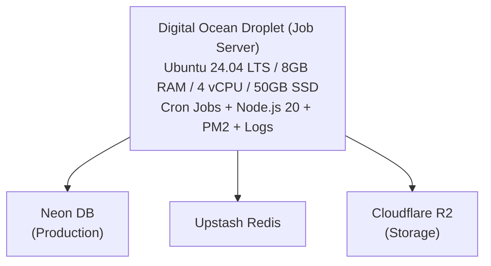

# Readmigo 自动化任务服务器配置指南

> Digital Ocean Droplet 配置文档 - 专用于长时间运行的批处理任务和定时任务

**配置完成日期**: 2025-12-26
**当前状态**: 已完成并运行中

---

## 1. 方案选择

### 为什么选择 Digital Ocean Droplet

| 方案 | 基础成本 | 时间限制 | 推荐度 |
|------|---------|----------|--------|
| GitHub Actions | $0 | 6小时超时 | 不适合 |
| Fly.io Workers | $5-15 | 按使用量 | 有限 |
| **DO Droplet** | **$48** | **无限制** | **推荐** |

### 推荐架构

---

## 2. 服务器配置摘要

### 基础环境

| 步骤 | 内容 |
|------|------|
| 系统更新 | apt update && upgrade |
| 基础工具 | curl, wget, git, vim, htop, build-essential |
| 防火墙 | UFW (仅开放 SSH 22) |
| 安全 | Fail2ban + 自动安全更新 |

### 开发环境

| 组件 | 版本 | 安装方式 |
|------|------|----------|
| Node.js | 20.x LTS | NodeSource |
| pnpm | 9.x | npm install -g |
| PM2 | latest | npm install -g |
| PostgreSQL Client | 16.x | apt install |

### 用户配置

| 用户 | 用途 |
|------|------|
| root | 系统管理 |
| readmigo | 运行导入任务 (推荐) |

---

## 3. 项目部署

### 目录结构

| 路径 | 说明 |
|------|------|
| `/home/readmigo/projects/readmigo/` | 主项目代码 |
| `/home/readmigo/projects/readmigo/.env.debug` | 环境变量配置 |
| `/home/readmigo/scripts/jobs/` | 任务脚本 |
| `/home/readmigo/scripts/utils/` | 工具脚本 |
| `/var/log/readmigo/imports/` | 导入任务日志 |

### 环境变量

环境变量文件位于项目根目录的 `.env.debug`，包含:
- DATABASE_URL (Neon PostgreSQL)
- R2 凭证 (Cloudflare R2)
- AI 服务 API Key (可选)

---

## 4. 导入任务配置

### 脚本清单

| 脚本 | 路径 | 功能 |
|------|------|------|
| 完整导入 | `~/scripts/jobs/import-standard-ebooks-debug.sh` | 导入全部 Standard Ebooks |
| 测试导入 | `~/scripts/jobs/test-import-standard-ebooks.sh` | 导入前 10 本 (验证用) |
| 状态检查 | `~/scripts/utils/check-imports.sh` | 查看导入状态和日志 |

### 定时任务

| 任务 | Cron 表达式 | 时间 (UTC) |
|------|------------|-----------|
| Standard Ebooks 导入 | `0 0 * * 0` | 每周日 00:00 |
| 日志清理 | `0 4 * * *` | 每天 04:00 |

---

## 5. 监控与维护

### PM2 进程管理

长时间运行任务建议使用 PM2:

| 命令 | 说明 |
|------|------|
| `pm2 list` | 查看所有进程 |
| `pm2 logs <name>` | 查看日志 |
| `pm2 stop <name>` | 停止进程 |
| `pm2 delete <name>` | 删除进程 |

### 日志管理

- 导入日志: `/var/log/readmigo/imports/`
- 日志保留: 30 天 (自动清理)
- 日志轮转: logrotate 配置

---

## 6. 实施记录 (2025-12-26)

### 完成状态

| 项目 | 状态 |
|------|------|
| Droplet 创建和基础配置 | 完成 |
| 测试导入 (10本) | 成功 |
| 完整导入脚本 | 已配置 |
| Cron 定时任务 | 已配置 |

### 首次测试结果

| 指标 | 值 |
|------|-----|
| 导入书籍 | 10 本 |
| 运行时间 | 约 2 分钟 |
| 成功率 | 100% (10/10) |

验证结果:
- 所有书籍成功保存到 Neon 数据库
- EPUB 文件成功上传到 Cloudflare R2
- 封面和缩略图成功上传到 R2
- 章节内容正确解析和保存
- 难度分析正常运行

### 已知问题

| 问题 | 状态 | 说明 |
|------|------|------|
| SMTP 端口被封 | 已知 | Digital Ocean 封禁 25/465/587 端口，邮件通知不可用 |
| zipfile 编译失败 | 已知 | 可选依赖，不影响导入功能 |

---

## 7. 相关文档

| 文档 | 说明 |
|------|------|
| [droplet.md](./droplet.md) | 服务器概览 |
| [droplet-usage-guide.md](./droplet-usage-guide.md) | 日常使用指南 |

---

*最后更新: 2026-02-07*
