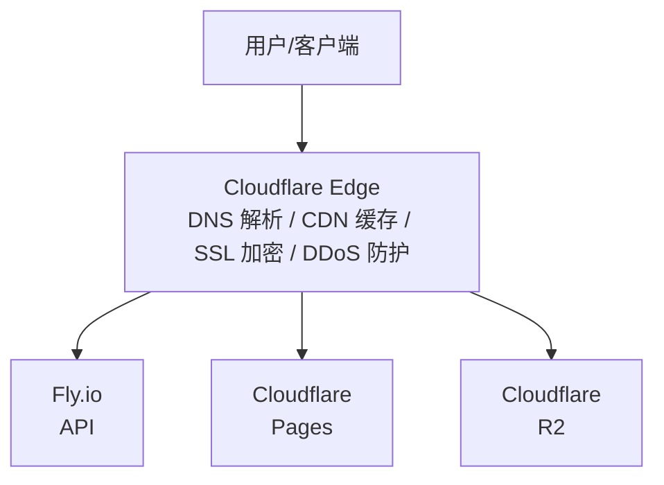
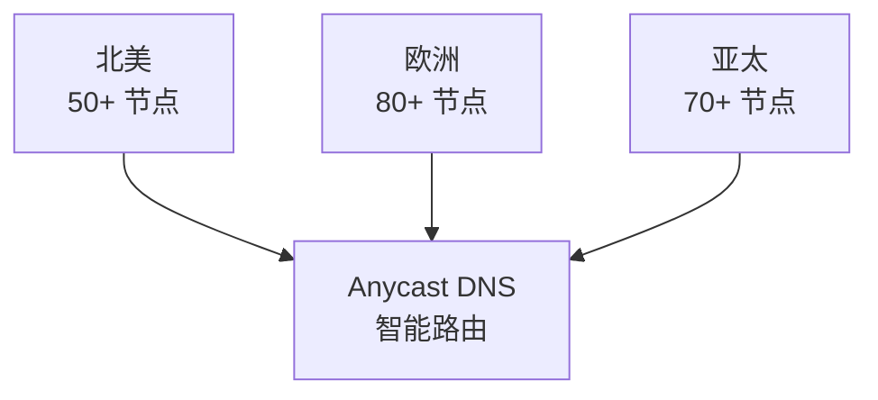
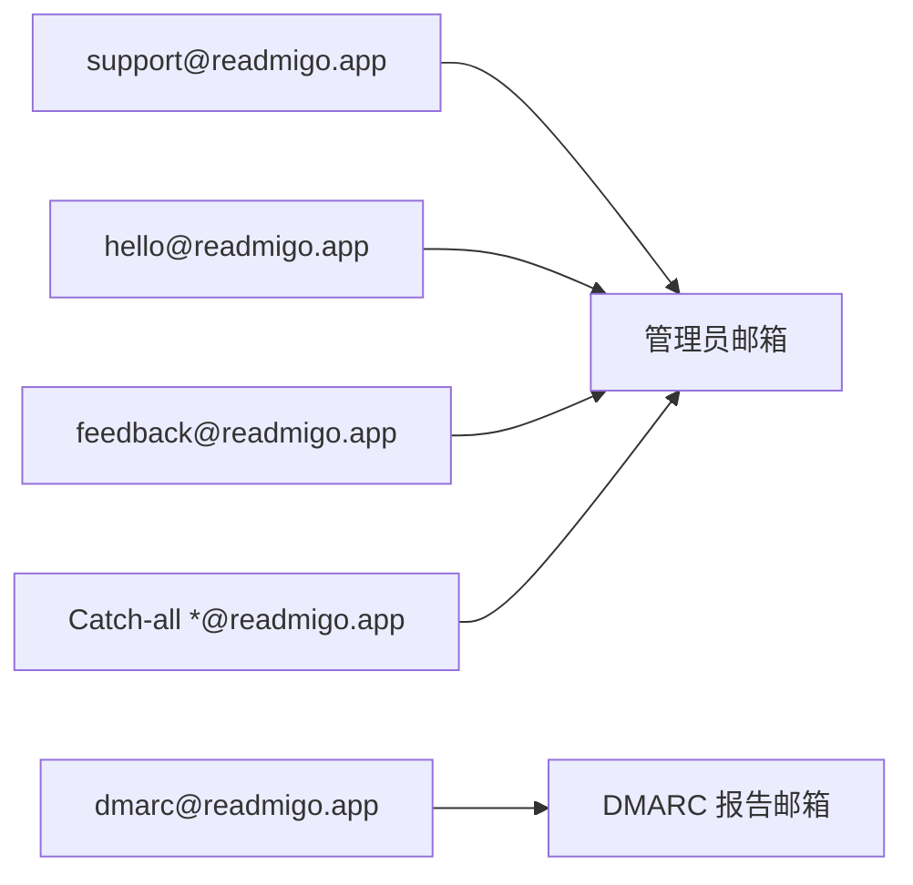
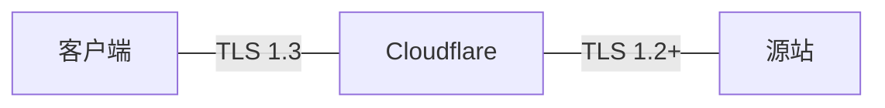

# Cloudflare 服务

> 全栈云服务平台 - Readmigo 基础设施核心

---

## 1. 服务概览

| 项目 | 值 |
|------|-----|
| 服务类型 | 全栈云平台 (CDN + 存储 + DNS + 边缘计算) |
| 官网 | https://cloudflare.com |
| 定价模式 | 免费套餐 + 按需付费 |

使用的服务:
- DNS (域名解析)
- CDN (全球内容分发)
- R2 (对象存储, S3 兼容)
- Pages (静态网站托管)
- Email Routing (邮件路由)

核心优势:
- 全球 300+ 边缘节点
- 零出站流量费用 (R2)
- 免费 DDoS 防护
- 自动 SSL/TLS

---

## 2. 服务架构

---

## 3. DNS 服务

### 3.1 域名配置

| 项目 | 值 |
|------|-----|
| 域名 | readmigo.app |
| 顶级域 | .app (Google Registry) |
| 注册商 | Cloudflare Registrar |
| DNS 托管 | Cloudflare |
| 自动续费 | 已启用 |

### 3.2 子域名对照表

| 子域名 | 用途 | 托管平台 | 代理状态 |
|--------|------|----------|----------|
| @ (根域名) | 官网主页 | Cloudflare Pages | 代理 |
| cdn | CDN 资源分发 | R2 | 代理 |
| dashboard | 管理后台 | Pages | 代理 |

> 注: API 使用 Fly.io 默认域名 `readmigo-api.fly.dev`，不通过 Cloudflare 代理。

---

## 4. CDN 服务

### 缓存规则

| 资源类型 | 缓存 TTL | 说明 |
|----------|----------|------|
| 图片 (jpg/png/webp) | 1年 | 通过 URL 版本化失效 |
| CSS/JavaScript | 1年 | 构建时生成 hash |
| HTML 页面 | 1小时 | 动态内容 |
| EPUB 文件 | 1天 | 较少更新 |
| API 响应 | 不缓存 | 动态数据 |

---

## 5. R2 对象存储

### 5.1 R2 概览

| 项目 | 值 |
|------|-----|
| 存储类型 | S3 兼容对象存储 |
| 存储费用 | $0.015/GB/月 |
| Class A 操作 (写) | $4.50/百万次 |
| Class B 操作 (读) | $0.36/百万次 |
| 出站流量 | 免费 |

### 5.2 Readmigo Buckets

| Bucket | 用途 |
|--------|------|
| readmigo-production | 生产环境 |
| readmigo-dev | 本地开发 |

### 5.3 访问配置

| 访问域名 | 用途 |
|----------|------|
| cdn.readmigo.app | 公开资源 CDN |

---

## 6. Pages 静态托管

| 项目 | 域名 | 框架 | 内容 |
|------|------|------|------|
| readmigo | readmigo.app | Next.js / Static | 首页、隐私政策、服务条款 |
| readmigo-dashboard | dashboard.readmigo.app | React / Vite | 数据管理、用户管理、统计分析 |

---

## 7. Email Routing 邮件服务

---

## 8. 安全配置

### 8.1 SSL/TLS

### 8.2 DDoS 防护

| 防护类型 | 状态 |
|----------|------|
| L3/L4 DDoS | 自动启用 |
| L7 DDoS | 自动启用 |
| Rate Limiting | 可配置 |
| Bot Management | 基础版 |

---

## 9. 成本估算

| 服务 | 费用/月 |
|------|---------|
| DNS | $0 (免费) |
| CDN | $0 (免费) |
| DDoS 防护 | $0 (免费) |
| SSL/TLS | $0 (免费) |
| Pages | $0 (免费) |
| Email Routing | $0 (免费) |
| R2 存储 (~10GB) | ~$0.15 |
| R2 操作 (~550K) | ~$0.41 |
| 域名续费 | ~$1 (年付均摊) |
| **总计** | **~$1.56** |

---

## 10. 故障排查

| 问题 | 可能原因 | 解决方案 |
|------|----------|----------|
| 520 错误 | 源站返回空响应 | 检查源站服务状态 |
| 521 错误 | 源站拒绝连接 | 检查源站防火墙 |
| 522 错误 | 连接超时 | 检查源站响应时间 |
| 524 错误 | 源站响应超时 | 优化源站性能 |
| SSL 错误 | 证书配置问题 | 检查加密模式设置 |

---

## 11. 相关文档

| 文档 | 说明 |
|------|------|
| [fly-io.md](./fly-io.md) | Fly.io 部署服务 |

---

*最后更新: 2026-02-07*
