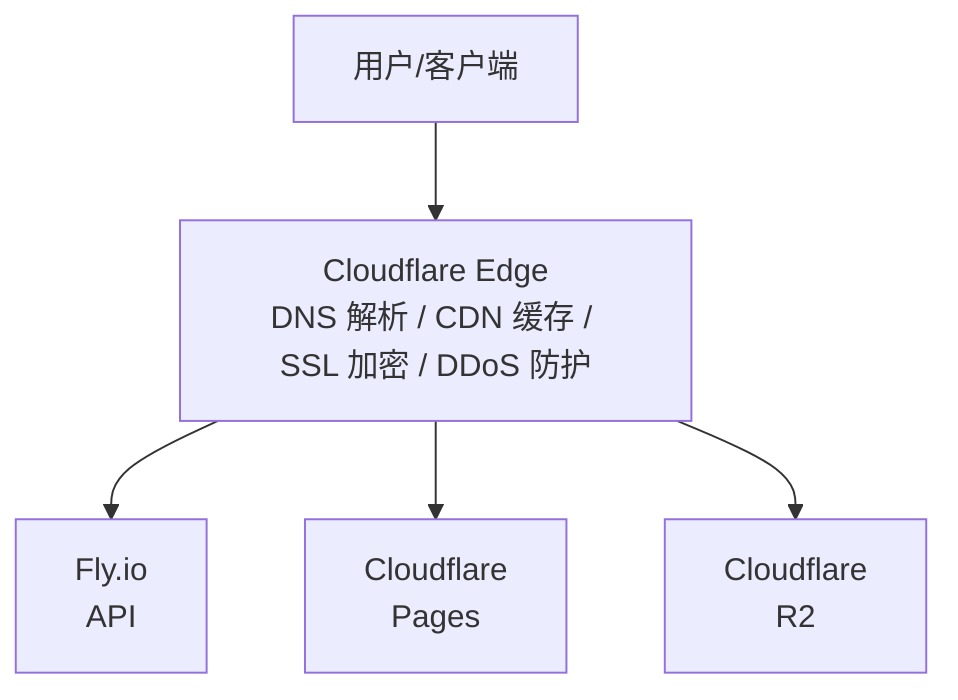
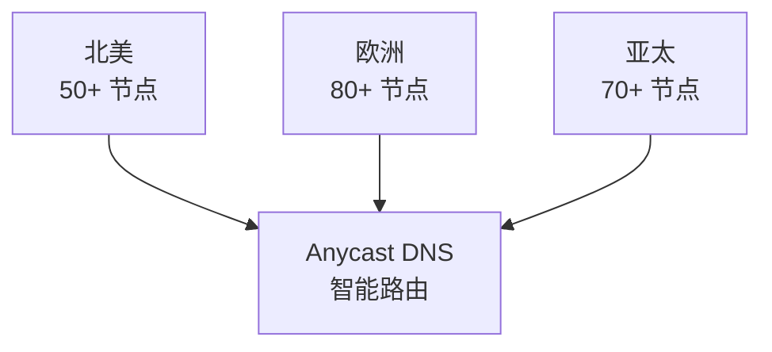
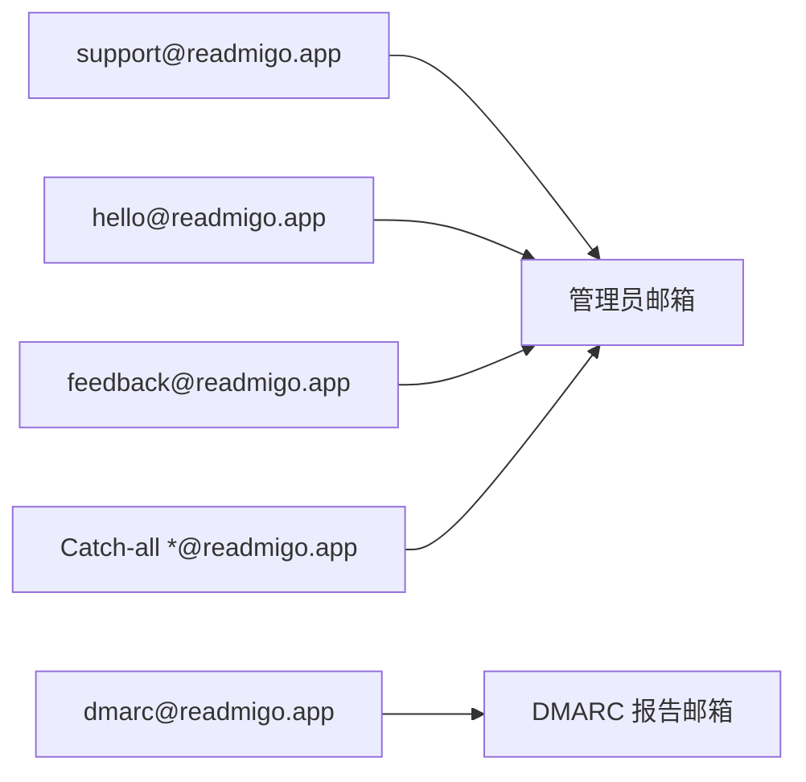
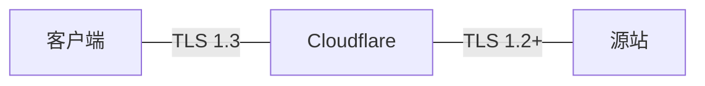

# Cloudflare 服务

> 全栈云服务平台 - Readmigo 基础设施核心

---

## 1. 服务概览

```
┌─────────────────────────────────────────────────────────────────┐
│                    Cloudflare Platform                           │
├─────────────────────────────────────────────────────────────────┤
│                                                                  │
│  服务类型      全栈云平台 (CDN + 存储 + DNS + 边缘计算)         │
│  官网          https://cloudflare.com                           │
│  定价模式      免费套餐 + 按需付费                               │
│                                                                  │
│  使用的服务                                                      │
│  ├── DNS - 域名解析                                             │
│  ├── CDN - 全球内容分发                                         │
│  ├── R2 - 对象存储 (S3 兼容)                                    │
│  ├── Pages - 静态网站托管                                       │
│  ├── Email Routing - 邮件路由                                   │
│  └── Workers - 边缘计算 (可选)                                  │
│                                                                  │
│  核心优势                                                        │
│  ├── 全球 300+ 边缘节点                                         │
│  ├── 零出站流量费用 (R2)                                        │
│  ├── 免费 DDoS 防护                                             │
│  └── 自动 SSL/TLS                                               │
│                                                                  │
└─────────────────────────────────────────────────────────────────┘
```

---

## 2. 服务架构



---

## 3. DNS 服务

### 3.1 域名配置

| 项目 | 值 |
|------|-----|
| 域名 | readmigo.app |
| 顶级域 | .app (Google Registry) |
| 注册商 | Cloudflare Registrar |
| DNS 托管 | Cloudflare |
| 自动续费 | 已启用 |

### 3.2 DNS 记录架构

```
┌─────────────────────────────────────────────────────────────────┐
│                    readmigo.app DNS 记录                         │
├─────────────────────────────────────────────────────────────────┤
│                                                                  │
│  A/CNAME 记录 (Web 服务)                                        │
│  ├── @           → Cloudflare Pages (官网)                      │
│  ├── www         → readmigo.app (重定向)                        │
│  ├── api         → Fly.io (生产 API)                            │
│  ├── staging-api → Fly.io (预发布 API)                          │
│  ├── debug-api   → Fly.io (调试 API)                            │
│  ├── cdn         → R2 Custom Domain                             │
│  ├── assets      → R2 Custom Domain                             │
│  └── dashboard   → Cloudflare Pages                             │
│                                                                  │
│  MX 记录 (邮件)                                                 │
│  └── @           → Cloudflare Email Routing                     │
│                                                                  │
│  TXT 记录 (验证)                                                │
│  ├── @           → SPF 记录                                     │
│  └── _dmarc      → DMARC 策略                                   │
│                                                                  │
└─────────────────────────────────────────────────────────────────┘
```

### 3.3 子域名对照表

| 子域名 | 用途 | 托管平台 | 代理状态 |
|--------|------|----------|----------|
| @ (根域名) | 官网主页 | Cloudflare Pages | 代理 |
| api | 生产环境 API | Fly.io | 直连 |
| staging-api | 预发布 API | Fly.io | 直连 |
| debug-api | 调试 API | Fly.io | 直连 |
| cdn | CDN 资源分发 | R2 | 代理 |
| assets | 静态资源 | R2 | 代理 |
| dashboard | 管理后台 | Pages | 代理 |

---

## 4. CDN 服务

### 4.1 CDN 配置



### 4.2 缓存规则

| 资源类型 | 缓存 TTL | Edge TTL | 说明 |
|----------|----------|----------|------|
| 图片 (jpg/png/webp) | 1年 | 1年 | 通过 URL 版本化失效 |
| CSS/JavaScript | 1年 | 1年 | 构建时生成 hash |
| HTML 页面 | 1小时 | 1小时 | 动态内容 |
| EPUB 文件 | 1天 | 1天 | 较少更新 |
| API 响应 | 不缓存 | 不缓存 | 动态数据 |

---

## 5. R2 对象存储

### 5.1 R2 概览

```
┌─────────────────────────────────────────────────────────────────┐
│                    Cloudflare R2                                 │
├─────────────────────────────────────────────────────────────────┤
│                                                                  │
│  存储类型      S3 兼容对象存储                                  │
│                                                                  │
│  定价 (月度)                                                    │
│  ├── 存储: $0.015/GB                                           │
│  ├── Class A 操作 (写): $4.50/百万次                           │
│  ├── Class B 操作 (读): $0.36/百万次                           │
│  └── 出站流量: 免费                                             │
│                                                                  │
│  Readmigo Bucket                                                │
│  ├── readmigo (生产)                                            │
│  ├── readmigo-staging (预发布)                                  │
│  └── readmigo-debug (调试)                                      │
│                                                                  │
└─────────────────────────────────────────────────────────────────┘
```

### 5.2 存储目录结构

```
┌─────────────────────────────────────────────────────────────────┐
│                    R2 Bucket 目录                                │
├─────────────────────────────────────────────────────────────────┤
│                                                                  │
│  readmigo/                                                       │
│  ├── books/                     书籍资源                        │
│  │   └── {bookId}/                                              │
│  │       ├── book.epub          EPUB 原文件                     │
│  │       ├── cover.jpg          封面原图                        │
│  │       └── cover-thumb.jpg    封面缩略图                      │
│  │                                                               │
│  ├── audiobooks/                有声书资源                      │
│  │   └── {audiobookId}/                                         │
│  │       └── chapters/          音频章节                        │
│  │                                                               │
│  ├── authors/                   作者资源                        │
│  │   └── {authorId}/                                            │
│  │       └── portrait.jpg       作者肖像                        │
│  │                                                               │
│  ├── users/                     用户资源                        │
│  │   └── {userId}/                                              │
│  │       ├── avatar.jpg         用户头像                        │
│  │       └── postcards/         用户明信片                      │
│  │                                                               │
│  └── assets/                    公共资源                        │
│      ├── templates/             模板资源                        │
│      └── icons/                 图标资源                        │
│                                                                  │
└─────────────────────────────────────────────────────────────────┘
```

### 5.3 访问配置

| 访问域名 | 用途 | 配置 |
|----------|------|------|
| cdn.readmigo.app | 公开资源 CDN | 自定义域名 + 代理 |
| {bucket}.r2.dev | 直接访问 | R2 默认域名 |

---

## 6. Pages 静态托管

### 6.1 Pages 项目

```
┌─────────────────────────────────────────────────────────────────┐
│                    Cloudflare Pages 项目                         │
├─────────────────────────────────────────────────────────────────┤
│                                                                  │
│  readmigo (官网)                                                │
│  ├── 域名: readmigo.app                                         │
│  ├── 框架: Next.js / Static                                     │
│  ├── 构建: GitHub Actions → Pages Deploy                        │
│  └── 内容: 首页、隐私政策、服务条款                             │
│                                                                  │
│  readmigo-dashboard (管理后台)                                  │
│  ├── 域名: dashboard.readmigo.app                               │
│  ├── 框架: React / Vite                                         │
│  ├── 构建: GitHub Actions → Pages Deploy                        │
│  └── 内容: 数据管理、用户管理、统计分析                         │
│                                                                  │
└─────────────────────────────────────────────────────────────────┘
```

### 6.2 Pages 优势

| 特性 | 说明 |
|------|------|
| 全球部署 | 部署到所有边缘节点 |
| 预览部署 | PR 自动生成预览 URL |
| 自动 HTTPS | 免费 SSL 证书 |
| 无限带宽 | 免费套餐无限带宽 |

---

## 7. Email Routing 邮件服务

### 7.1 邮件配置



### 7.2 MX 记录

| 优先级 | 服务器 |
|--------|--------|
| 12 | route2.mx.cloudflare.net |
| 69 | route1.mx.cloudflare.net |
| 99 | route3.mx.cloudflare.net |

---

## 8. 安全配置

### 8.1 SSL/TLS



### 8.2 DDoS 防护

| 防护类型 | 状态 | 说明 |
|----------|------|------|
| L3/L4 DDoS | 自动启用 | 网络层防护 |
| L7 DDoS | 自动启用 | 应用层防护 |
| Rate Limiting | 可配置 | 请求限流 |
| Bot Management | 基础版 | 机器人检测 |

---

## 9. Workers (边缘计算)

### 9.1 Workers 概览

```
┌─────────────────────────────────────────────────────────────────┐
│                    Cloudflare Workers (可选)                     │
├─────────────────────────────────────────────────────────────────┤
│                                                                  │
│  当前状态: 未使用 (备选方案)                                    │
│                                                                  │
│  潜在用途:                                                      │
│  ├── 图片优化 - 边缘动态调整尺寸                                │
│  ├── A/B 测试 - 边缘流量分发                                    │
│  ├── 重定向规则 - 复杂 URL 重写                                 │
│  └── API 网关 - 边缘认证和限流                                  │
│                                                                  │
│  定价:                                                          │
│  ├── 免费层: 10万请求/天                                        │
│  └── 付费: $5/月 + $0.50/百万请求                              │
│                                                                  │
└─────────────────────────────────────────────────────────────────┘
```

---

## 10. 成本估算

### 10.1 当前月度成本

| 服务 | 用量 | 单价 | 费用/月 |
|------|------|------|---------|
| DNS | 无限 | 免费 | $0 |
| CDN | 无限带宽 | 免费 | $0 |
| DDoS 防护 | 无限 | 免费 | $0 |
| SSL/TLS | 无限 | 免费 | $0 |
| Pages | 无限构建 | 免费 | $0 |
| Email Routing | 无限 | 免费 | $0 |
| R2 存储 | ~10GB | $0.015/GB | ~$0.15 |
| R2 操作 | ~550K | $4.50/M | ~$0.41 |
| 域名续费 | 年付 | ~$12/年 | ~$1 |
| **总计** | - | - | **~$1.56** |

### 10.2 规模化成本预估

| 规模 | R2 存储 | R2 操作 | 额外服务 | 总计/月 |
|------|---------|---------|----------|---------|
| 1K DAU | 10GB | 500K | - | ~$2 |
| 10K DAU | 50GB | 5M | - | ~$5 |
| 100K DAU | 500GB | 50M | Workers | ~$50 |

---

## 11. 监控与告警

### 11.1 Cloudflare Analytics

```
┌─────────────────────────────────────────────────────────────────┐
│                    监控指标                                      │
├─────────────────────────────────────────────────────────────────┤
│                                                                  │
│  流量指标                                                       │
│  ├── Total Requests - 总请求数                                  │
│  ├── Cached Requests - 缓存命中数                               │
│  ├── Bandwidth - 带宽使用                                       │
│  └── Unique Visitors - 独立访客                                 │
│                                                                  │
│  安全指标                                                       │
│  ├── Threats Blocked - 威胁拦截数                               │
│  ├── DDoS Events - DDoS 攻击事件                                │
│  └── Bot Traffic - 机器人流量                                   │
│                                                                  │
│  性能指标                                                       │
│  ├── Origin Response Time - 源站响应时间                        │
│  ├── Cache Hit Ratio - 缓存命中率                               │
│  └── Edge Latency - 边缘延迟                                    │
│                                                                  │
└─────────────────────────────────────────────────────────────────┘
```

### 11.2 告警配置

| 告警类型 | 触发条件 | 通知方式 |
|----------|----------|----------|
| DDoS 攻击 | 检测到攻击 | Email |
| SSL 证书过期 | 30天内过期 | Email |
| 源站不可用 | 5xx 错误激增 | Email |

---

## 12. 故障排查

### 12.1 常见问题

| 问题 | 可能原因 | 解决方案 |
|------|----------|----------|
| 520 错误 | 源站返回空响应 | 检查源站服务状态 |
| 521 错误 | 源站拒绝连接 | 检查源站防火墙 |
| 522 错误 | 连接超时 | 检查源站响应时间 |
| 524 错误 | 源站响应超时 | 优化源站性能 |
| SSL 错误 | 证书配置问题 | 检查加密模式设置 |

### 12.2 调试工具

| 工具 | 用途 |
|------|------|
| Cloudflare Dashboard | 查看流量、安全、性能 |
| dig/nslookup | DNS 解析测试 |
| curl -I | 检查响应头 |
| Cloudflare Trace | 路由追踪 |

---

## 13. 相关文档

| 文档 | 说明 |
|------|------|
| [cloudflare-r2.md](../../infrastructure/cloudflare-r2.md) | R2 存储详解 |
| [fly-io.md](./fly-io.md) | Fly.io 部署服务 |
| [domain-management.md](../../infrastructure/domain-management.md) | 域名管理指南 |
| [storage-setup.md](../../infrastructure/storage-setup.md) | R2 初始配置 |

---

*最后更新: 2025-12-31*
