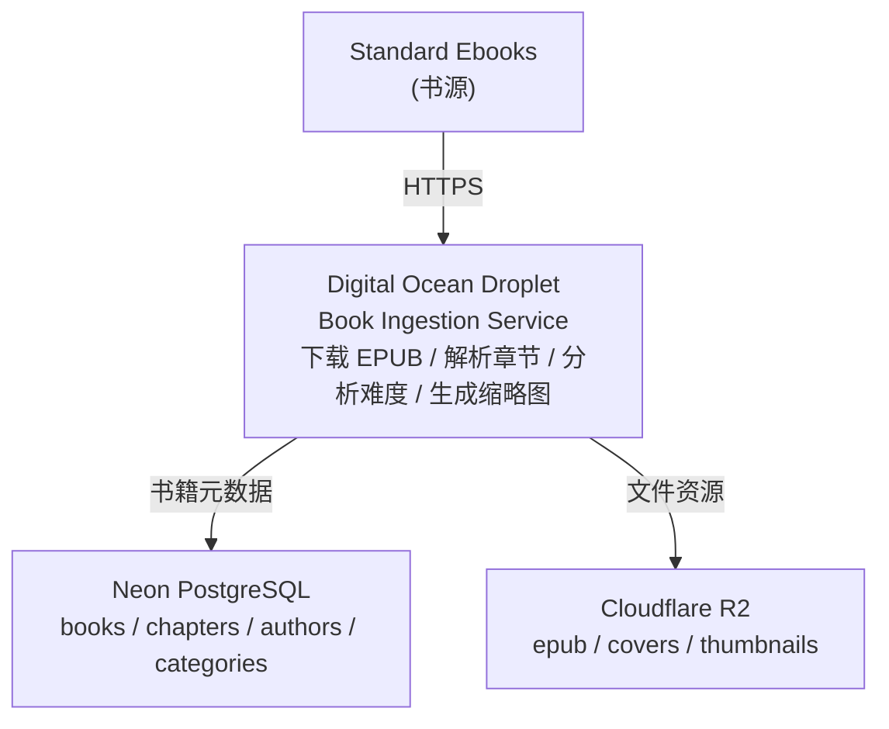

# Digital Ocean Droplet 主机信息

> Readmigo Job Server - 自动化任务专用服务器

---

## 1. 服务器概览

```
┌─────────────────────────────────────────────────────────────────┐
│                    Digital Ocean Droplet                         │
├─────────────────────────────────────────────────────────────────┤
│                                                                  │
│  服务器名称    Readmigo Job Server                              │
│  域名          mcloud88.com                                      │
│  IP 地址       159.65.143.131                                   │
│  数据中心      新加坡 (Singapore / SGP1)                        │
│                                                                  │
│  配置规格                                                        │
│  ├── CPU:      4 vCPU                                           │
│  ├── 内存:     8 GB RAM                                         │
│  ├── 存储:     50 GB SSD                                        │
│  └── 带宽:     5 TB/月                                          │
│                                                                  │
│  费用          $48/月                                            │
│  操作系统      Ubuntu 24.04 LTS                                 │
│                                                                  │
└─────────────────────────────────────────────────────────────────┘
```

---

## 2. 运行服务详解

### 2.1 服务架构图

```
┌─────────────────────────────────────────────────────────────────┐
│                    Droplet 服务架构                              │
├─────────────────────────────────────────────────────────────────┤
│                                                                  │
│  ┌───────────────────────────────────────────────────────────┐ │
│  │                    Readmigo 相关服务                       │ │
│  │  (readmigo 用户 | /home/readmigo/)                        │ │
│  ├───────────────────────────────────────────────────────────┤ │
│  │                                                            │ │
│  │  ┌─────────────┐  ┌─────────────┐  ┌─────────────┐       │ │
│  │  │   Cron      │  │   Node.js   │  │   pnpm      │       │ │
│  │  │   定时任务   │──│   20.x LTS  │──│   9.x       │       │ │
│  │  │             │  │   运行环境   │  │   包管理    │       │ │
│  │  └──────┬──────┘  └─────────────┘  └─────────────┘       │ │
│  │         │                                                  │ │
│  │         ▼                                                  │ │
│  │  ┌─────────────────────────────────────────────────────┐ │ │
│  │  │              Book Ingestion Tasks                    │ │ │
│  │  │  ├── Standard Ebooks 导入 (每周日 00:00 UTC)        │ │ │
│  │  │  ├── 测试导入 (手动触发)                            │ │ │
│  │  │  └── 未来: Gutenberg, LibriVox 等                   │ │ │
│  │  └─────────────────────────────────────────────────────┘ │ │
│  │                                                            │ │
│  └───────────────────────────────────────────────────────────┘ │
│                                                                  │
│  ┌───────────────────────────────────────────────────────────┐ │
│  │                    系统级服务 (root)                       │ │
│  ├───────────────────────────────────────────────────────────┤ │
│  │                                                            │ │
│  │  ┌─────────────┐  ┌─────────────┐  ┌─────────────┐       │ │
│  │  │   SSH       │  │   Nginx     │  │   Fail2ban  │       │ │
│  │  │   端口 22   │  │   端口 80   │  │   安全防护   │       │ │
│  │  └─────────────┘  └─────────────┘  └─────────────┘       │ │
│  │                                                            │ │
│  │  ┌─────────────┐  ┌─────────────┐  ┌─────────────┐       │ │
│  │  │   rsyslog   │  │   UFW       │  │   DO Agent  │       │ │
│  │  │   系统日志   │  │   防火墙    │  │   监控代理   │       │ │
│  │  └─────────────┘  └─────────────┘  └─────────────┘       │ │
│  │                                                            │ │
│  └───────────────────────────────────────────────────────────┘ │
│                                                                  │
│  ┌───────────────────────────────────────────────────────────┐ │
│  │               其他服务 (与 Readmigo 无关)                  │ │
│  ├───────────────────────────────────────────────────────────┤ │
│  │                                                            │ │
│  │  ┌─────────────┐  ┌─────────────┐                        │ │
│  │  │   x-ui      │  │   Xray      │                        │ │
│  │  │  端口 2053  │  │   端口 443  │                        │ │
│  │  │     2096    │  │   代理核心   │                        │ │
│  │  └─────────────┘  └─────────────┘                        │ │
│  │                                                            │ │
│  │  ⚠️  请勿修改上述服务配置                                  │ │
│  │                                                            │ │
│  └───────────────────────────────────────────────────────────┘ │
│                                                                  │
└─────────────────────────────────────────────────────────────────┘
```

### 2.2 服务清单

| 服务 | 端口 | 用途 | 负责用户 | 状态 |
|------|------|------|----------|------|
| **SSH** | 22 | 远程登录 | root/readmigo | 运行中 |
| **Cron** | - | 定时任务调度 | readmigo | 运行中 |
| **Nginx** | 80 | Web 服务器 | root | 运行中 |
| **Fail2ban** | - | 防止暴力破解 | root | 运行中 |
| **UFW** | - | 防火墙 | root | 启用 |
| **rsyslog** | - | 系统日志收集 | root | 运行中 |
| **DO Agent** | - | DigitalOcean 监控 | root | 运行中 |
| x-ui | 2053, 2096 | VPN 管理面板 | root | 运行中 |
| Xray | 443 | 代理服务核心 | root | 运行中 |

---

## 3. Readmigo 服务详解

### 3.1 书籍导入服务


### 3.2 定时任务配置

| 任务 | Cron 表达式 | 执行时间 (UTC) | 执行时间 (北京) | 状态 |
|------|------------|---------------|----------------|------|
| Standard Ebooks 导入 | `0 0 * * 0` | 周日 00:00 | 周日 08:00 | 启用 |
| 日志清理 | `0 4 * * *` | 每天 04:00 | 每天 12:00 | 计划中 |
| Gutenberg 导入 | `0 3 * * 1` | 周一 03:00 | 周一 11:00 | 预留 |
| LibriVox 导入 | `0 3 * * 2` | 周二 03:00 | 周二 11:00 | 预留 |

### 3.3 脚本文件

| 脚本 | 路径 | 功能 |
|------|------|------|
| 完整导入 | `~/scripts/jobs/import-standard-ebooks-debug.sh` | 导入所有 Standard Ebooks 书籍 |
| 测试导入 | `~/scripts/jobs/test-import-standard-ebooks.sh` | 导入前 10 本书用于测试 |
| 状态检查 | `~/scripts/utils/check-imports.sh` | 检查最近导入状态和日志 |

---

## 4. 数据流架构



---

## 5. 目录结构

```
/home/readmigo/
├── projects/
│   └── readmigo/                    # 主项目代码
│       ├── apps/                    # 应用代码
│       ├── packages/                # 共享包
│       ├── scripts/                 # 书籍导入脚本
│       │   └── book-ingestion/      # 导入逻辑
│       └── .env.debug               # 环境变量配置
│
└── scripts/
    ├── jobs/                        # 定时任务脚本
    │   ├── import-standard-ebooks-debug.sh
    │   └── test-import-standard-ebooks.sh
    │
    └── utils/                       # 工具脚本
        └── check-imports.sh

/var/log/readmigo/
└── imports/                         # 导入任务日志
    ├── import-standard-ebooks-YYYYMMDD-HHMMSS.log
    └── test-import-YYYYMMDD-HHMMSS.log
```

---

## 6. 账户与访问

### 6.1 用户账户

| 账户 | 用途 | 权限 | SSH 访问 |
|------|------|------|----------|
| **root** | 系统管理 | 完全权限 | 允许 |
| **readmigo** | 运行导入任务 | 有限权限 | 允许 (推荐) |

### 6.2 SSH 连接

```
# 使用 readmigo 用户 (推荐)
ssh readmigo@mcloud88.com

# 使用 IP 地址
ssh readmigo@159.65.143.131

# 使用 root 用户 (管理任务)
ssh root@mcloud88.com
```

---

## 7. 环境配置

### 7.1 运行时环境

| 组件 | 版本 | 说明 |
|------|------|------|
| 操作系统 | Ubuntu 24.04 LTS | 长期支持版 |
| Node.js | 20.x LTS | JavaScript 运行时 |
| pnpm | 9.x | 包管理器 |
| PM2 | latest | 进程管理 (可选) |
| PostgreSQL Client | 16.x | 数据库客户端 |

### 7.2 外部服务连接

| 服务 | 用途 | 协议 |
|------|------|------|
| Neon PostgreSQL | 数据库 | PostgreSQL over TLS |
| Cloudflare R2 | 文件存储 | S3 兼容 API |
| Standard Ebooks | 书源 | HTTPS |

---

## 8. 监控与日志

### 8.1 监控渠道

| 监控方式 | 说明 |
|----------|------|
| DigitalOcean Dashboard | CPU/内存/磁盘/网络图表 |
| 系统日志 | `/var/log/syslog` |
| 导入日志 | `/var/log/readmigo/imports/` |
| Cron 日志 | `grep CRON /var/log/syslog` |

### 8.2 常用监控命令

| 命令 | 功能 |
|------|------|
| `htop` | 实时进程和资源监控 |
| `df -h` | 磁盘使用情况 |
| `free -h` | 内存使用情况 |
| `tail -f /var/log/readmigo/imports/*.log` | 实时查看导入日志 |
| `bash ~/scripts/utils/check-imports.sh` | 检查导入状态 |

---

## 9. 安全配置

### 9.1 已启用的安全措施

| 措施 | 状态 | 说明 |
|------|------|------|
| SSH 密钥认证 | 启用 | 禁用密码登录 |
| UFW 防火墙 | 启用 | 仅开放必要端口 |
| Fail2ban | 启用 | 防止暴力破解 |
| 自动安全更新 | 启用 | unattended-upgrades |

### 9.2 防火墙规则

| 端口 | 协议 | 用途 | 状态 |
|------|------|------|------|
| 22 | TCP | SSH | 允许 |
| 80 | TCP | HTTP | 允许 |
| 443 | TCP | HTTPS/Xray | 允许 |
| 2053 | TCP | x-ui 管理 | 允许 |
| 2096 | TCP | x-ui 面板 | 允许 |

---

## 10. 注意事项

### 10.1 重要提醒

```
⚠️  操作隔离
├── Readmigo 任务仅使用 readmigo 用户
├── 仅操作 /home/readmigo/ 目录下的文件
└── 不要修改其他服务 (x-ui, Xray, Nginx) 的配置

⚠️  SMTP 限制
├── Digital Ocean 封禁所有 SMTP 端口 (25/465/587)
├── 邮件通知功能暂不可用
└── 使用日志文件监控任务状态

⚠️  资源管理
├── 8GB 内存支持多任务并行运行
├── 4 vCPU 可同时处理多个导入任务
└── 定期清理旧日志释放磁盘空间
```

### 10.2 定期维护

| 维护项 | 频率 | 命令/操作 |
|--------|------|----------|
| 清理旧日志 | 每月 | `find /var/log/readmigo/imports/ -name "*.log" -mtime +30 -delete` |
| 系统更新 | 每月 | `apt update && apt upgrade` |
| 检查磁盘空间 | 每周 | `df -h` |
| 拉取最新代码 | 按需 | `cd ~/projects/readmigo && git pull` |

---

## 11. 相关文档

| 文档 | 说明 |
|------|------|
| [droplet-usage-guide.md](./droplet-usage-guide.md) | 日常使用指南 |
| [automation-server-setup.md](./automation-server-setup.md) | 完整配置指南 |
| [book-import-system.md](../../../04-development/pipeline/book-import-system.md) | 书籍导入系统 |
| [be-environment-overview.md](../be-environment-overview.md) | 后端环境总览 |

---

*最后更新: 2025-12-31*
