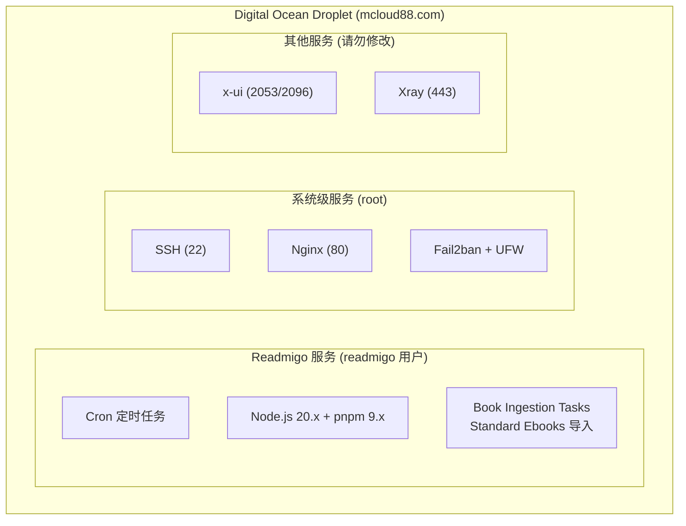
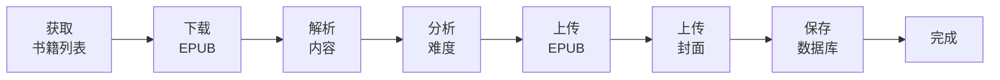
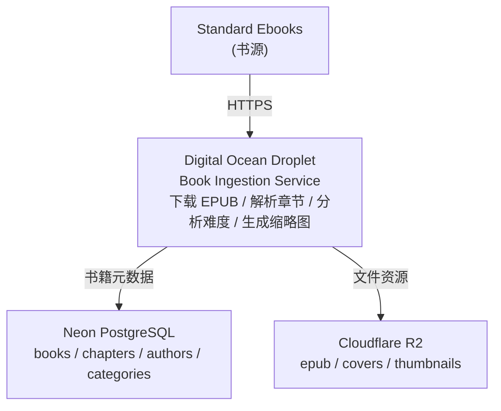

# Digital Ocean Droplet 主机信息

> Readmigo Job Server - 自动化任务专用服务器

---

## 1. 服务器概览

| 配置项 | 值 |
|--------|-----|
| 服务器名称 | Readmigo Job Server |
| 域名 | mcloud88.com |
| IP 地址 | 159.65.143.131 |
| 数据中心 | 新加坡 (Singapore / SGP1) |
| CPU | 4 vCPU |
| 内存 | 8 GB RAM |
| 存储 | 50 GB SSD |
| 带宽 | 5 TB/月 |
| 费用 | $48/月 |
| 操作系统 | Ubuntu 24.04 LTS |

---

## 2. 运行服务

### 2.1 服务架构图

### 2.2 服务清单

| 服务 | 端口 | 用途 | 负责用户 | 状态 |
|------|------|------|----------|------|
| SSH | 22 | 远程登录 | root/readmigo | 运行中 |
| Cron | - | 定时任务调度 | readmigo | 运行中 |
| Nginx | 80 | Web 服务器 | root | 运行中 |
| Fail2ban | - | 防止暴力破解 | root | 运行中 |
| UFW | - | 防火墙 | root | 启用 |
| rsyslog | - | 系统日志收集 | root | 运行中 |
| DO Agent | - | DigitalOcean 监控 | root | 运行中 |
| x-ui | 2053, 2096 | VPN 管理面板 | root | 运行中 |
| Xray | 443 | 代理服务核心 | root | 运行中 |

---

## 3. Readmigo 服务详解

### 3.1 书籍导入流程

### 3.2 定时任务配置

| 任务 | Cron 表达式 | 执行时间 (UTC) | 执行时间 (北京) | 状态 |
|------|------------|---------------|----------------|------|
| Standard Ebooks 导入 | `0 0 * * 0` | 周日 00:00 | 周日 08:00 | 启用 |

### 3.3 脚本文件

| 脚本 | 路径 | 功能 |
|------|------|------|
| 完整导入 | `~/scripts/jobs/import-standard-ebooks-debug.sh` | 导入所有 Standard Ebooks 书籍 |
| 测试导入 | `~/scripts/jobs/test-import-standard-ebooks.sh` | 导入前 10 本书用于测试 |
| 状态检查 | `~/scripts/utils/check-imports.sh` | 检查最近导入状态和日志 |

---

## 4. 数据流架构

---

## 5. 账户与访问

| 账户 | 用途 | 权限 | SSH 访问 |
|------|------|------|----------|
| root | 系统管理 | 完全权限 | 允许 |
| readmigo | 运行导入任务 | 有限权限 | 允许 (推荐) |

连接方式:
- 使用 readmigo 用户 (推荐): `ssh readmigo@mcloud88.com`
- 使用 IP 地址: `ssh readmigo@159.65.143.131`
- 使用 root 用户 (管理任务): `ssh root@mcloud88.com`

---

## 6. 环境配置

### 6.1 运行时环境

| 组件 | 版本 |
|------|------|
| 操作系统 | Ubuntu 24.04 LTS |
| Node.js | 20.x LTS |
| pnpm | 9.x |
| PM2 | latest |
| PostgreSQL Client | 16.x |

### 6.2 外部服务连接

| 服务 | 用途 | 协议 |
|------|------|------|
| Neon PostgreSQL | 数据库 | PostgreSQL over TLS |
| Cloudflare R2 | 文件存储 | S3 兼容 API |
| Standard Ebooks | 书源 | HTTPS |

---

## 7. 安全配置

| 措施 | 状态 |
|------|------|
| SSH 密钥认证 | 启用 (禁用密码登录) |
| UFW 防火墙 | 启用 (仅开放必要端口) |
| Fail2ban | 启用 (防止暴力破解) |
| 自动安全更新 | 启用 (unattended-upgrades) |

### 防火墙规则

| 端口 | 协议 | 用途 |
|------|------|------|
| 22 | TCP | SSH |
| 80 | TCP | HTTP |
| 443 | TCP | HTTPS/Xray |
| 2053 | TCP | x-ui 管理 |
| 2096 | TCP | x-ui 面板 |

---

## 8. 注意事项

- Readmigo 任务仅使用 readmigo 用户，仅操作 `/home/readmigo/` 目录
- 不要修改其他服务 (x-ui, Xray, Nginx) 的配置
- Digital Ocean 封禁所有 SMTP 端口 (25/465/587)，邮件通知不可用
- 长时间运行任务建议使用 PM2 管理

---

## 9. 相关文档

| 文档 | 说明 |
|------|------|
| [droplet-usage-guide.md](./droplet-usage-guide.md) | 日常使用指南 |
| [automation-server-setup.md](./automation-server-setup.md) | 完整配置指南 |

---

*最后更新: 2026-02-07*
