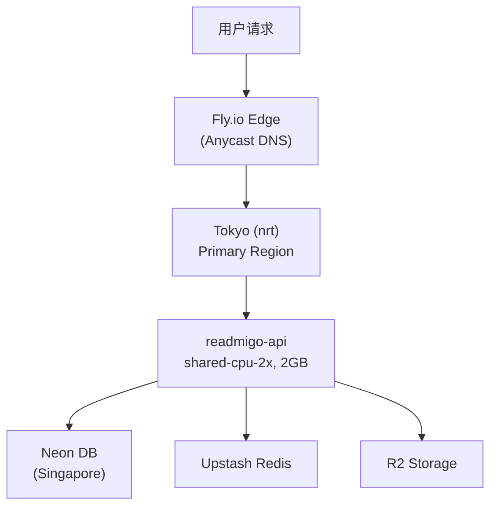
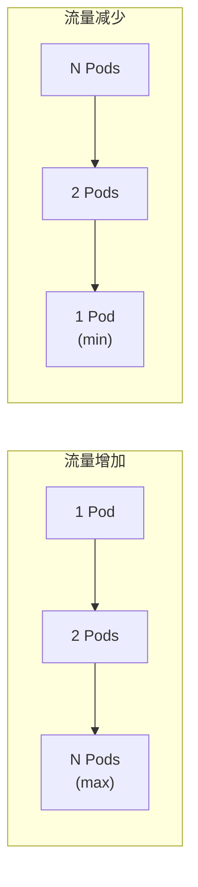
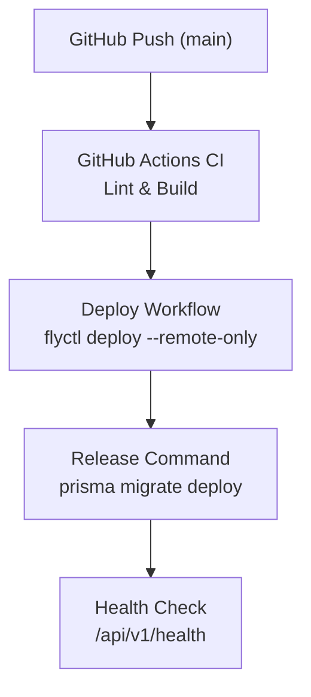

# Fly.io 部署服务

> 全球边缘部署平台 - Readmigo 后端托管

---

## 1. 服务概览

| 项目 | 值 |
|------|-----|
| 服务类型 | 边缘计算 / 容器托管平台 |
| 官网 | https://fly.io |
| 定价模式 | 按使用量计费 + 免费套餐 |

核心特性:
- 全球边缘部署 (30+ 数据中心)
- 自动扩缩容
- 内置负载均衡 (Anycast 路由)
- 零停机滚动部署
- 私有网络 (6PN)

---

## 2. 部署架构

---

## 3. 应用配置

### 3.1 Readmigo 应用

| 配置项 | 值 |
|--------|-----|
| 应用名称 | readmigo-api |
| 区域 | nrt (Tokyo) |
| VM | shared-cpu-2x, 2GB |
| 部署策略 | rolling |
| 内部端口 | 8080 |
| 健康检查 | /api/v1/health |
| 最小实例 | 1 (auto start/stop) |
| 并发限制 | hard: 250, soft: 200 |

> 注: 项目仅有一个 `fly.toml` 配置文件。不存在 `fly.workers.toml`、`fly.staging.toml`、`fly.debugging.toml` 等。

### 3.2 环境变量

| 变量 | 值 |
|------|-----|
| ENVIRONMENT | production |
| LOG_LEVEL | warn |
| PORT | 8080 |

其余敏感变量通过 Fly.io Secrets 管理。

### 3.3 Release Command

部署时自动执行数据库迁移:

| 步骤 | 命令 |
|------|------|
| Release | `npx prisma migrate deploy --schema ./packages/database/prisma/schema.prisma` |

---

## 4. 网络配置

### 4.1 域名

| 域名 | 说明 |
|------|------|
| readmigo-api.fly.dev | Production API (Fly.io 默认域名) |

### 4.2 自动扩缩容

---

## 5. 部署流程

---

## 6. 监控与日志

### 6.1 内置监控指标

| 类别 | 指标 |
|------|------|
| 系统 | CPU 使用率、内存使用率、网络 I/O、磁盘 I/O |
| 应用 | HTTP 请求数、响应时间 (P50/P90/P99)、错误率、连接数 |

### 6.2 常用命令

| 命令 | 说明 |
|------|------|
| `flyctl status` | 查看应用状态 |
| `flyctl logs` | 查看应用日志 |
| `flyctl ssh console` | SSH 连接到实例 |
| `flyctl scale count N` | 调整实例数量 |
| `flyctl secrets set KEY=value` | 设置环境变量 |
| `flyctl machines list` | 查看机器列表 |
| `flyctl apps restart readmigo-api` | 重启应用 |

---

## 7. 成本估算

| 资源 | 配置 | 费用/月 |
|------|------|---------|
| API 实例 | shared-cpu-2x, 2GB | ~$15-20 |
| 带宽 | 出站流量 | ~$1 |
| **总计** | - | **~$20** |

---

## 8. 故障排查

| 问题 | 可能原因 | 解决方案 |
|------|----------|----------|
| 部署失败 | Dockerfile 错误 | 检查构建日志 |
| 启动超时 | 应用启动慢 | 增加启动超时配置 |
| OOM 错误 | 内存不足 | 增加实例内存 |
| 连接超时 | 网络问题 | 检查健康检查配置 |

---

## 9. 相关文档

| 文档 | 说明 |
|------|------|
| [neon.md](./neon.md) | Neon 数据库服务 |
| [upstash.md](./upstash.md) | Upstash Redis 服务 |
| [environments.md](../environments.md) | 环境配置 |
| [cicd-configuration-plan.md](../cicd-configuration-plan.md) | CI/CD 配置 |

---

*最后更新: 2026-02-07*
