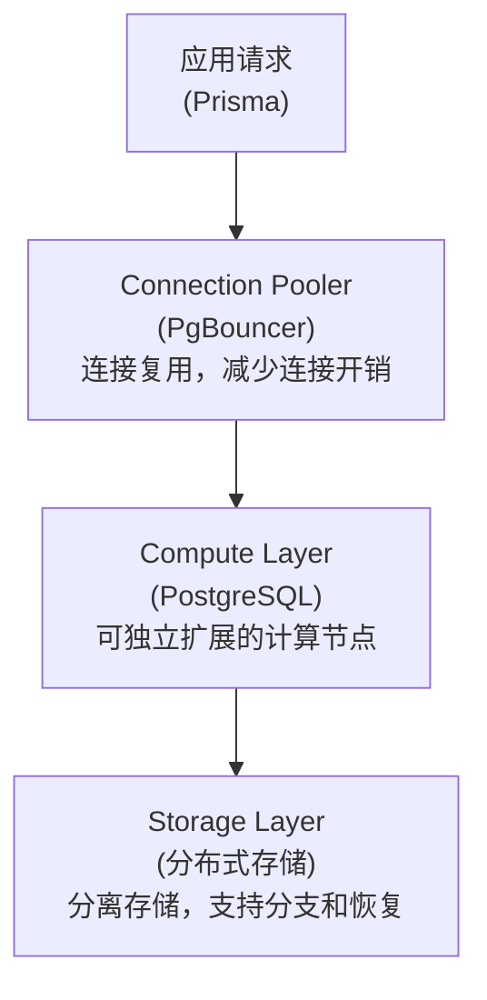
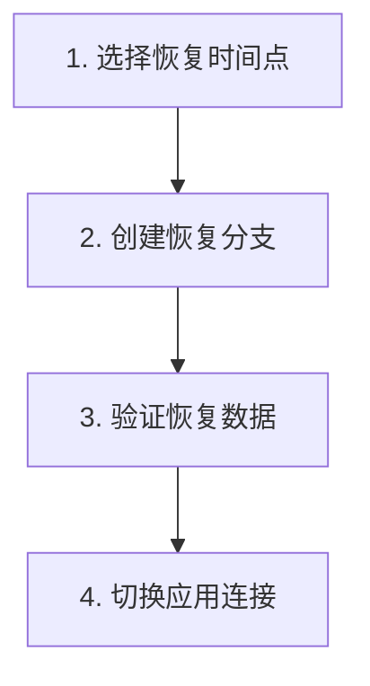

# Neon PostgreSQL 服务

> Serverless PostgreSQL - Readmigo 核心数据存储

---

## 1. 服务概览

| 项目 | 值 |
|------|-----|
| 服务类型 | Serverless PostgreSQL 数据库 |
| 官网 | https://neon.tech |
| 定价模式 | 按使用量计费 + 免费套餐 |

核心特性:
- Serverless 架构 (按需自动扩缩容)
- 数据库分支 (类似 Git 的版本管理)
- 时间点恢复 (Point-in-Time Recovery)
- 内置连接池 (PgBouncer)
- 冷启动 < 500ms

---

## 2. 架构设计

---

## 3. 项目配置

### 3.1 Readmigo Neon 项目

| 项目 | 区域 | 用途 |
|------|------|------|
| readmigo-production | ap-southeast-1 (新加坡) | 生产环境 |

> 项目曾有 3 个 Neon 项目 (production/staging/debug)，已简化为仅 production。

### 3.2 连接类型

| 连接类型 | 特点 | 用途 |
|----------|------|------|
| Pooled Connection (推荐) | 连接池化，适合高并发 | 应用运行时连接 |
| Direct Connection | 直连数据库，无连接池 | 数据库迁移、管理操作 |

### 3.3 Prisma 连接配置

| 环境 | 连接类型 | 连接池大小 | 超时时间 |
|------|----------|------------|----------|
| Production | Pooled | 20 | 10s |
| Local (迁移) | Direct | 5 | 30s |

---

## 4. 数据库规模

### 4.1 数据统计

Prisma Models: 87+

| 数据域 | 模型数 |
|--------|--------|
| 用户域 | 6 |
| 书籍域 | 12 |
| 阅读域 | 6 |
| 词汇域 | 4 |
| AI 域 | 3 |
| 作者域 | 9 |
| 角色域 | 4 |
| 时间线域 | 3 |
| 社区域 | 9 |
| 有声书域 | 3 |
| 年报域 | 5 |
| 徽章域 | 4 |
| 客服域 | 8 |
| 日志域 | 4 |
| 任务域 | 2 |

### 4.2 主要数据表

| 数据域 | 核心表 | 说明 |
|--------|--------|------|
| 用户 | User, Device, Subscription | 用户账号与订阅 |
| 书籍 | Book, Chapter, BookScore | 书籍内容与评分 |
| 阅读 | ReadingSession, Highlight, Annotation | 阅读记录与标注 |
| 词汇 | Vocabulary, UserVocabulary | 全局词库与生词本 |
| 作者 | Author, AuthorChatSession | 作者信息与 AI 对话 |
| 社区 | Quote, AgoraPost | 金句与城邦内容 |

---

## 5. 自动扩展

| 环境 | 最小 CU | 最大 CU | 空闲超时 |
|------|---------|---------|----------|
| Production | 0.25 | 4 | 5 分钟 |

> 1 CU = 1 vCPU + 4GB RAM

### 冷启动时间

| 场景 | 启动时间 |
|------|----------|
| 热实例 | < 50ms |
| 冷启动 | < 500ms |
| 分支创建 | < 1s |

---

## 6. 备份与恢复

| 指标 | 目标值 | 说明 |
|------|--------|------|
| RTO (恢复时间目标) | < 1 小时 | 从分支创建到切换 |
| RPO (恢复点目标) | < 5 分钟 | 最大数据丢失窗口 |

---

## 7. 安全配置

| 安全措施 | 说明 |
|----------|------|
| SSL/TLS | 强制开启 |
| 静态加密 | AES-256 |
| 传输加密 | TLS 1.3 |
| 角色分离 | Admin/Developer/Viewer |

---

## 8. 故障排查

| 问题 | 可能原因 | 解决方案 |
|------|----------|----------|
| 连接超时 | 数据库暂停中 | 等待冷启动完成或增加超时 |
| 连接数满 | 连接池耗尽 | 增加连接池大小或优化连接复用 |
| 查询慢 | 缺少索引 | 使用 EXPLAIN 分析并添加索引 |
| 迁移失败 | 使用 Pooled 连接 | 切换到 Direct 连接执行迁移 |

---

## 9. 相关文档

| 文档 | 说明 |
|------|------|
| [fly-io.md](./fly-io.md) | Fly.io 部署服务 |
| [upstash.md](./upstash.md) | Upstash Redis 服务 |
| [environments.md](../environments.md) | 环境配置 |

---

*最后更新: 2026-02-07*
