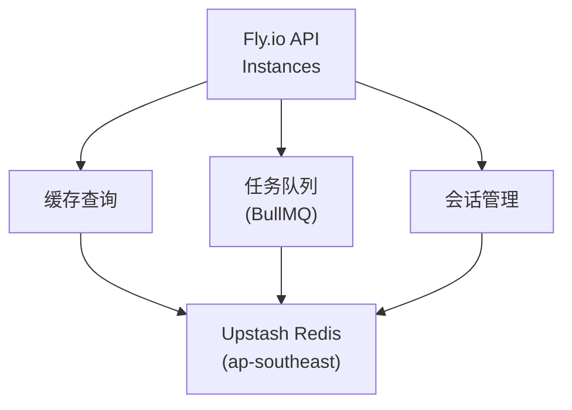
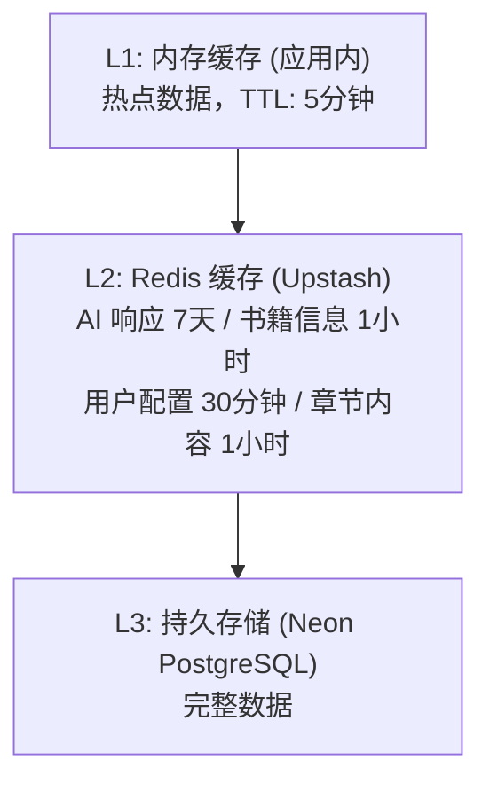
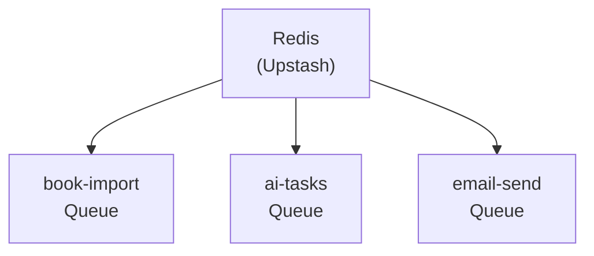

# Upstash Redis 服务

> Serverless Redis - Readmigo 缓存与任务队列

---

## 1. 服务概览

| 项目 | 值 |
|------|-----|
| 服务类型 | Serverless Redis |
| 官网 | https://upstash.com |
| 定价模式 | 按请求量计费 + 免费套餐 |

核心特性:
- Serverless 架构 (无需运维)
- 全球边缘 (多区域低延迟)
- Pay-per-request
- REST API / TLS 加密
- 持久存储

Readmigo 用途:
- 缓存层 (AI 响应、书籍数据)
- 任务队列 (BullMQ)
- 会话管理 (阅读会话状态)
- 限流控制 (API 请求限制)

---

## 2. 架构设计

---

## 3. 项目配置

### 3.1 Redis 实例

| 实例名称 | 区域 | 用途 |
|----------|------|------|
| readmigo-redis-production | ap-southeast-1 | 生产环境 |

> 项目曾有 3 个 Redis 实例 (production/staging/debugging)，已简化为仅 production。

---

## 4. 使用场景

### 4.1 缓存层

### 4.2 缓存 Key 设计

| 数据类型 | Key 格式 | TTL | 说明 |
|----------|----------|-----|------|
| AI 响应 | `ai:{taskType}:{hash}` | 7天 | 词义、翻译等 |
| 书籍信息 | `book:{bookId}` | 1小时 | 书籍元数据 |
| 章节内容 | `chapter:{chapterId}` | 1小时 | 章节正文 |
| 用户配置 | `user:config:{userId}` | 30分钟 | 阅读偏好 |
| 热门搜索 | `search:hot:{date}` | 24小时 | 搜索统计 |
| 阅读会话 | `reading:session:active:{id}` | 1小时 | 实时会话 |

### 4.3 BullMQ 任务队列

---

## 5. 数据结构

| 类型 | 用途 | 示例 |
|------|------|------|
| String | 简单缓存 | 书籍信息、用户配置 |
| Hash | 结构化数据 | 阅读会话、用户状态 |
| Sorted Set | 排行榜 | 热门搜索、阅读排名 |
| List | 队列数据 | BullMQ 任务队列 |
| Set | 去重集合 | 用户已读书籍 |

---

## 6. 限流控制

### 6.1 API 限流策略

| API 类型 | 限制 | 窗口 |
|----------|------|------|
| AI 请求 | 100次/分钟 | 滑动窗口 |
| 搜索请求 | 60次/分钟 | 滑动窗口 |
| 书籍请求 | 200次/分钟 | 滑动窗口 |
| 认证请求 | 10次/分钟 | 滑动窗口 |

### 6.2 免费用户配额

| 功能 | 免费限额 | 重置周期 |
|------|----------|----------|
| AI 查词 | 50次/天 | 每日 |
| AI 翻译 | 30次/天 | 每日 |
| 书籍下载 | 5本/天 | 每日 |

---

## 7. 性能优化

| 优化点 | 建议 |
|--------|------|
| Pipeline | 批量命令合并，减少网络往返 |
| 合理 TTL | 按数据特性设置，避免内存浪费 |
| Key 命名 | 短且有意义，节省内存 |
| 序列化 | JSON/MessagePack，平衡大小与性能 |

---

## 8. 成本估算

| 实例 | 命令数/月 | 存储 | 费用/月 |
|------|-----------|------|---------|
| Production | ~50M | ~500MB | ~$15 |

---

## 9. 故障排查

| 问题 | 可能原因 | 解决方案 |
|------|----------|----------|
| 连接超时 | TLS 配置错误 | 使用 `rediss://` 协议 |
| 命令执行慢 | 网络延迟 | 检查区域配置 |
| 内存不足 | Key 过多/TTL 过长 | 清理过期数据 |
| 限流触发 | 请求突增 | 升级套餐或优化代码 |

---

## 10. 相关文档

| 文档 | 说明 |
|------|------|
| [fly-io.md](./fly-io.md) | Fly.io 部署服务 |
| [neon.md](./neon.md) | Neon 数据库服务 |

---

*最后更新: 2026-02-07*
