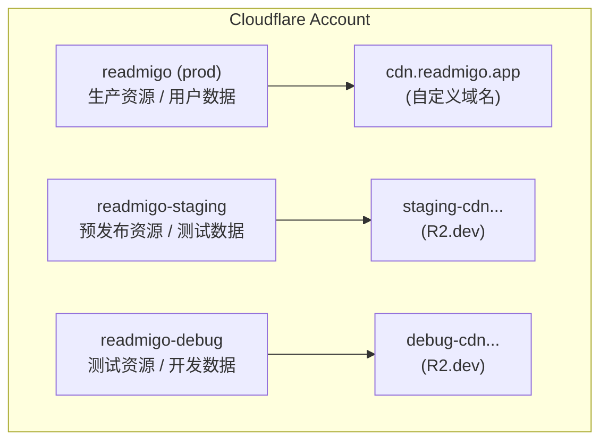
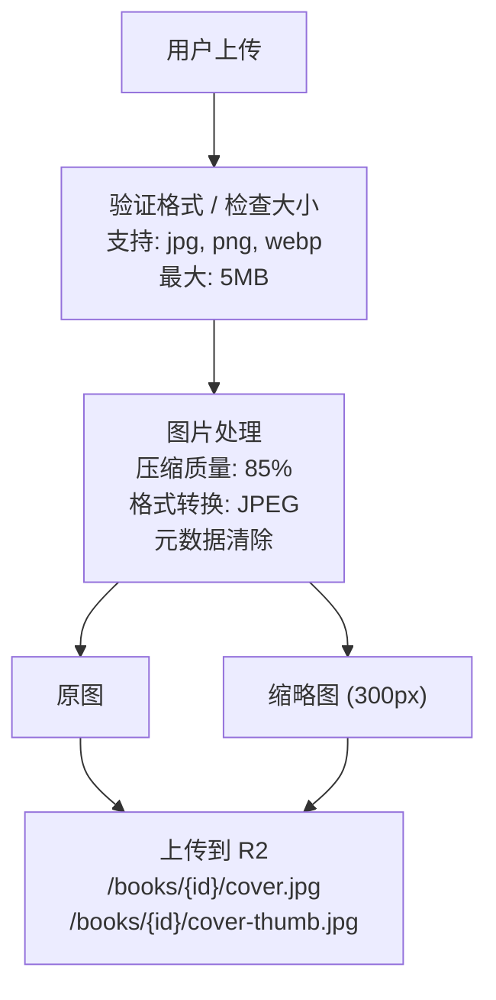
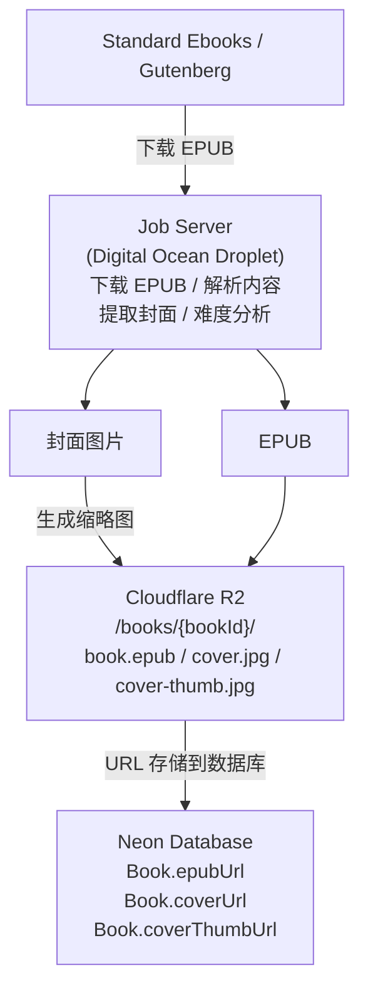
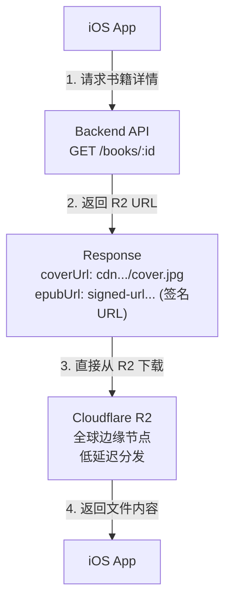

# Cloudflare R2 存储详解

> 对象存储服务 - Readmigo 文件资源管理

---

## 1. 服务概览

```
┌─────────────────────────────────────────────────────────────────┐
│                    Cloudflare R2                                 │
├─────────────────────────────────────────────────────────────────┤
│                                                                  │
│  服务商        Cloudflare R2 (S3 兼容)                          │
│  协议          S3 API                                           │
│  定价          存储: $0.015/GB/月                               │
│                Class A 操作: $4.50/百万次                       │
│                Class B 操作: $0.36/百万次                       │
│                出站流量: 免费                                    │
│                                                                  │
│  特性                                                            │
│  ├── S3 兼容 API                                                │
│  ├── 零出站费用                                                  │
│  ├── 全球边缘分发                                                │
│  └── 自定义域名支持                                              │
│                                                                  │
└─────────────────────────────────────────────────────────────────┘
```

---

## 2. 多环境存储架构



### 2.1 环境配置

| 环境 | Bucket 名称 | 公开访问 | CDN 域名 |
|------|-------------|----------|----------|
| Production | readmigo | cdn.readmigo.app | 自定义域名 |
| Staging | readmigo-staging | R2.dev | staging-cdn.r2.dev |
| Debug | readmigo-debug | R2.dev | debug-cdn.r2.dev |
| Local | MinIO (Docker) | localhost:9000 | 本地访问 |

---

## 3. 目录结构设计

```
┌─────────────────────────────────────────────────────────────────┐
│                    R2 Bucket 目录结构                            │
├─────────────────────────────────────────────────────────────────┤
│                                                                  │
│  readmigo/                                                       │
│  │                                                              │
│  ├── books/                        # 书籍资源                   │
│  │   └── {bookId}/                                              │
│  │       ├── book.epub             # EPUB 原文件                │
│  │       ├── cover.jpg             # 封面原图                   │
│  │       ├── cover-thumb.jpg       # 封面缩略图 (300x450)       │
│  │       └── chapters/             # 章节内容 (可选)            │
│  │           ├── {chapterId}.html                               │
│  │           └── ...                                            │
│  │                                                              │
│  ├── audiobooks/                   # 有声书资源                 │
│  │   └── {audiobookId}/                                         │
│  │       ├── cover.jpg             # 有声书封面                 │
│  │       └── chapters/                                          │
│  │           ├── {chapterId}.mp3   # 音频文件                   │
│  │           └── ...                                            │
│  │                                                              │
│  ├── authors/                      # 作者资源                   │
│  │   └── {authorId}/                                            │
│  │       ├── portrait.jpg          # 作者肖像                   │
│  │       └── portrait-thumb.jpg    # 肖像缩略图                 │
│  │                                                              │
│  ├── users/                        # 用户资源                   │
│  │   └── {userId}/                                              │
│  │       ├── avatar.jpg            # 用户头像                   │
│  │       ├── avatar-thumb.jpg      # 头像缩略图                 │
│  │       └── postcards/            # 用户明信片                 │
│  │           └── {postcardId}.png                               │
│  │                                                              │
│  ├── assets/                       # 公共资源                   │
│  │   ├── templates/                # 模板资源                   │
│  │   │   ├── postcards/            # 明信片模板                 │
│  │   │   └── annual-reports/       # 年报模板                   │
│  │   └── icons/                    # 图标资源                   │
│  │                                                              │
│  └── temp/                         # 临时文件                   │
│      └── uploads/                  # 上传缓存                   │
│          └── {uploadId}/                                        │
│                                                                  │
└─────────────────────────────────────────────────────────────────┘
```

---

## 4. 文件类型与处理

### 4.1 文件类型清单

| 类型 | 格式 | 最大大小 | 处理方式 |
|------|------|----------|----------|
| EPUB 电子书 | .epub | 50MB | 直接存储 |
| 书籍封面 | .jpg/.png | 5MB | 压缩 + 缩略图 |
| 章节 HTML | .html | 1MB | Gzip 压缩 |
| 音频文件 | .mp3 | 100MB | 直接存储 |
| 用户头像 | .jpg/.png | 2MB | 裁剪 + 压缩 |
| 明信片 | .png | 5MB | 直接存储 |

### 4.2 图片处理流程



---

## 5. 访问控制

### 5.1 访问策略

```
┌─────────────────────────────────────────────────────────────────┐
│                    访问控制策略                                  │
├─────────────────────────────────────────────────────────────────┤
│                                                                  │
│  公开读取 (Public Read)                                         │
│  ├── /books/*/cover*.jpg       书籍封面                         │
│  ├── /authors/*/portrait*.jpg  作者肖像                         │
│  ├── /assets/**                公共资源                         │
│  └── /audiobooks/*/cover.jpg   有声书封面                       │
│                                                                  │
│  认证读取 (Authenticated Read)                                  │
│  ├── /books/*/book.epub        EPUB 文件 (需登录)               │
│  ├── /audiobooks/*/chapters/*  音频文件 (需订阅)                │
│  └── /users/*/postcards/*      用户明信片                       │
│                                                                  │
│  私有 (Private)                                                 │
│  ├── /users/*/avatar*.jpg      用户头像 (自己可见)              │
│  └── /temp/**                  临时文件                         │
│                                                                  │
└─────────────────────────────────────────────────────────────────┘
```

### 5.2 签名 URL 生成

| 资源类型 | 过期时间 | 使用场景 |
|----------|----------|----------|
| EPUB 下载 | 1 小时 | 阅读器加载 |
| 音频文件 | 4 小时 | 有声书播放 |
| 用户上传 | 15 分钟 | 预签名上传 |
| 临时文件 | 24 小时 | 处理中文件 |

---

## 6. 数据流向

### 6.1 书籍导入流程



### 6.2 客户端读取流程



---

## 7. 缓存策略

### 7.1 缓存配置

| 资源类型 | Cache-Control | CDN 缓存 | 说明 |
|----------|---------------|----------|------|
| 书籍封面 | max-age=31536000 | 1 年 | 不变资源 |
| EPUB 文件 | max-age=86400 | 1 天 | 较少更新 |
| 用户头像 | max-age=3600 | 1 小时 | 可能更新 |
| 音频文件 | max-age=31536000 | 1 年 | 不变资源 |

### 7.2 缓存失效

```
┌─────────────────────────────────────────────────────────────────┐
│                    缓存失效策略                                  │
├─────────────────────────────────────────────────────────────────┤
│                                                                  │
│  URL 版本化                                                     │
│  ├── 文件更新时使用新 UUID                                      │
│  ├── 旧文件保留一段时间后清理                                   │
│  └── 避免缓存污染                                               │
│                                                                  │
│  示例:                                                          │
│  旧: /books/abc123/cover.jpg                                    │
│  新: /books/abc123/cover-v2.jpg                                 │
│                                                                  │
└─────────────────────────────────────────────────────────────────┘
```

---

## 8. 存储统计

### 8.1 当前用量估算

| 资源类型 | 数量 | 平均大小 | 总大小 |
|----------|------|----------|--------|
| EPUB 文件 | ~2,000 | 500KB | ~1GB |
| 封面原图 | ~2,000 | 200KB | ~400MB |
| 封面缩略图 | ~2,000 | 30KB | ~60MB |
| 音频文件 | ~100 | 50MB | ~5GB |
| 用户资源 | ~1,000 | 100KB | ~100MB |
| **总计** | - | - | **~6.5GB** |

### 8.2 成本估算 (月度)

| 项目 | 用量 | 单价 | 费用 |
|------|------|------|------|
| 存储 | 10GB | $0.015/GB | $0.15 |
| Class A 操作 | 50,000 | $4.50/M | $0.23 |
| Class B 操作 | 500,000 | $0.36/M | $0.18 |
| 出站流量 | 100GB | $0 | $0 |
| **总计** | - | - | **~$0.56** |

---

## 9. 环境变量配置

### 9.1 必需配置

| 变量 | 说明 | 示例 |
|------|------|------|
| R2_ACCOUNT_ID | Cloudflare 账号 ID | 32位字符串 |
| R2_ACCESS_KEY_ID | API 访问密钥 | 32位字符串 |
| R2_SECRET_ACCESS_KEY | API 密钥 | 64位字符串 |
| R2_BUCKET_NAME | Bucket 名称 | readmigo |
| R2_ENDPOINT | S3 API 端点 | https://{account}.r2.cloudflarestorage.com |
| R2_PUBLIC_URL | 公开访问 URL | https://cdn.readmigo.app |

### 9.2 环境配置示例

```
┌─────────────────────────────────────────────────────────────────┐
│                    各环境配置                                    │
├─────────────────────────────────────────────────────────────────┤
│                                                                  │
│  Production                                                     │
│  R2_BUCKET_NAME=readmigo                                        │
│  R2_PUBLIC_URL=https://cdn.readmigo.app                         │
│                                                                  │
│  Staging                                                        │
│  R2_BUCKET_NAME=readmigo-staging                                │
│  R2_PUBLIC_URL=https://staging.xxx.r2.dev                       │
│                                                                  │
│  Debug                                                          │
│  R2_BUCKET_NAME=readmigo-debug                                  │
│  R2_PUBLIC_URL=https://debug.xxx.r2.dev                         │
│                                                                  │
│  Local (MinIO)                                                  │
│  R2_ENDPOINT=http://localhost:9000                              │
│  R2_BUCKET_NAME=readmigo-local                                  │
│  R2_PUBLIC_URL=http://localhost:9000/readmigo-local             │
│                                                                  │
└─────────────────────────────────────────────────────────────────┘
```

---

## 10. CORS 配置

### 10.1 生产环境 CORS

```json
[
  {
    "AllowedOrigins": [
      "https://readmigo.app",
      "https://www.readmigo.app"
    ],
    "AllowedMethods": ["GET", "HEAD"],
    "AllowedHeaders": ["*"],
    "MaxAgeSeconds": 86400
  }
]
```

### 10.2 开发环境 CORS

```json
[
  {
    "AllowedOrigins": ["*"],
    "AllowedMethods": ["GET", "PUT", "POST", "DELETE", "HEAD"],
    "AllowedHeaders": ["*"],
    "ExposeHeaders": ["ETag"],
    "MaxAgeSeconds": 3600
  }
]
```

---

## 11. 故障排查

### 11.1 常见问题

| 问题 | 可能原因 | 解决方案 |
|------|----------|----------|
| Access Denied | API 密钥权限不足 | 检查 Token 权限设置 |
| File Not Found | 路径错误或文件未上传 | 验证文件路径和上传状态 |
| 签名 URL 失效 | URL 已过期 | 重新生成签名 URL |
| 上传失败 | 文件大小超限 | 检查文件大小限制 |
| 图片加载慢 | CDN 缓存未命中 | 检查 Cache-Control 设置 |

### 11.2 调试命令

```bash
# 列出 Bucket 内容
aws s3 ls s3://readmigo/ --endpoint-url=$R2_ENDPOINT

# 上传测试文件
aws s3 cp test.txt s3://readmigo/test.txt --endpoint-url=$R2_ENDPOINT

# 下载文件
aws s3 cp s3://readmigo/test.txt ./test.txt --endpoint-url=$R2_ENDPOINT

# 删除文件
aws s3 rm s3://readmigo/test.txt --endpoint-url=$R2_ENDPOINT
```

---

## 12. 相关文档

| 文档 | 说明 |
|------|------|
| [storage-setup.md](./storage-setup.md) | R2 初始配置指南 |
| [database.md](./database.md) | 数据库架构详解 |
| [data-flow.md](../../04-development/backend/data-flow.md) | 后端数据流详解 |
| [book-import-system.md](../../04-development/pipeline/book-import-system.md) | 书籍导入系统 |

---

*最后更新: 2025-12-31*
