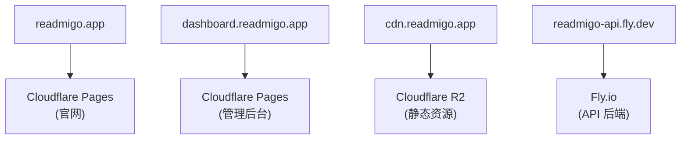
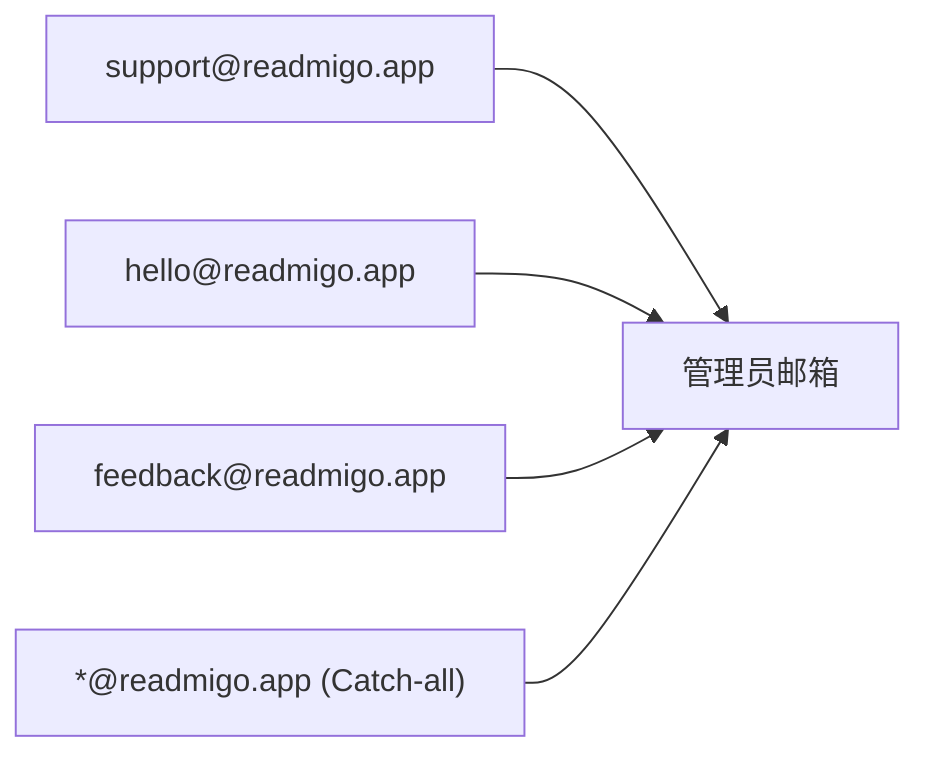

# Readmigo 域名管理文档

> 域名 readmigo.app 的配置与维护指南

---

## 1. 域名概览

| 项目 | 值 |
|------|-----|
| 域名 | readmigo.app |
| 顶级域名 | .app (Google Registry) |
| 注册商 | Cloudflare Registrar |
| DNS 托管 | Cloudflare |
| 自动续费 | 已启用 |

---

## 2. 子域名架构

| 子域名 | 用途 | 托管平台 | DNS 类型 | 代理状态 |
|--------|------|----------|----------|----------|
| @ (根域) | 官网主页 | Cloudflare Pages | CNAME | Proxied |
| dashboard | 管理后台 | Cloudflare Pages | CNAME | Proxied |
| cdn | CDN 资源分发 | Cloudflare R2 | R2 | Proxied |

> API 使用 Fly.io 默认域名 readmigo-api.fly.dev，无需自定义 DNS。

---

## 3. 邮件服务

| 配置 | 说明 |
|------|------|
| 服务 | Cloudflare Email Routing |
| 路由规则 | 所有邮箱转发到管理员邮箱 |

---

## 4. SSL 证书

| 服务 | 证书管理 | 说明 |
|------|----------|------|
| Cloudflare (Pages/R2) | 自动管理 | Cloudflare 边缘证书 |
| Fly.io (API) | 自动管理 | Let's Encrypt |

---

## 5. 维护指南

| 操作 | 说明 |
|------|------|
| 添加子域名 | Cloudflare Dashboard > DNS > Add Record |
| 修改 DNS 记录 | Cloudflare Dashboard > DNS > Edit |
| 检查证书状态 | Cloudflare Dashboard > SSL/TLS |
| 域名续费 | Cloudflare Registrar (自动续费) |

---

## 6. 故障排查

| 问题 | 可能原因 | 解决方案 |
|------|----------|----------|
| 域名无法解析 | DNS 记录错误 | 检查 Cloudflare DNS 配置 |
| SSL 证书错误 | 证书未绑定 | 检查 SSL/TLS 设置 |
| CDN 资源 404 | R2 路径错误 | 检查 R2 对象路径 |
| 邮件无法接收 | 路由配置错误 | 检查 Email Routing 规则 |

---

## 7. 相关文档

| 文档 | 说明 |
|------|------|
| [cloudflare.md](../deployment/services/cloudflare.md) | Cloudflare 服务详情 |
| [network-services.md](./network-services.md) | 网络服务配置 |

---

*最后更新: 2026-02-07*
