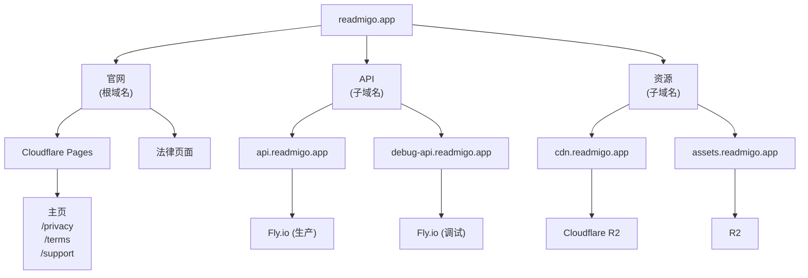
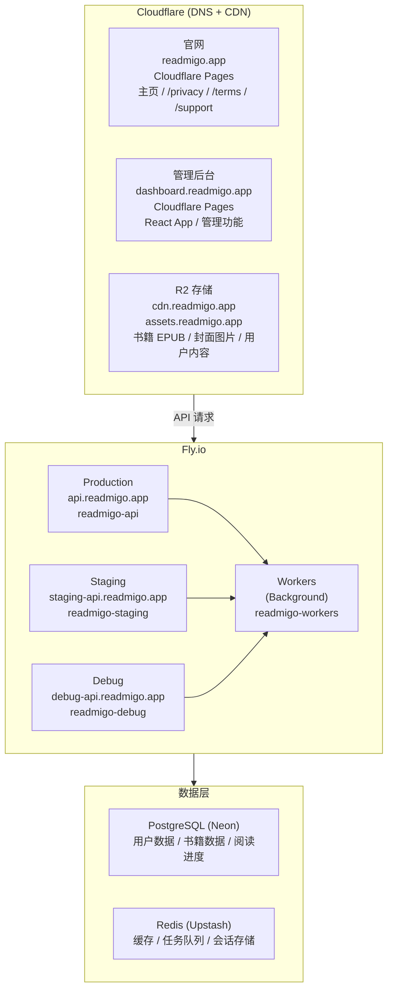

# Readmigo 域名管理文档

> 域名 readmigo.app 的完整配置、架构及维护指南

---

## 目录

1. [域名概览](#1-域名概览)
2. [DNS 配置](#2-dns-配置)
3. [子域名架构](#3-子域名架构)
4. [邮件服务](#4-邮件服务)
5. [SSL 证书](#5-ssl-证书)
6. [服务托管映射](#6-服务托管映射)
7. [维护指南](#7-维护指南)
8. [故障排查](#8-故障排查)

---

## 1. 域名概览

### 1.1 基本信息

| 项目 | 值 |
|------|-----|
| **域名** | `readmigo.app` |
| **顶级域名** | `.app` (Google Registry) |
| **注册商** | Cloudflare Registrar |
| **DNS 托管** | Cloudflare |
| **注册日期** | 2024年 |
| **到期日期** | 查看 Cloudflare Dashboard |
| **自动续费** | 已启用 |

### 1.2 账户信息

| 服务 | 登录方式 | 备注 |
|------|---------|------|
| Cloudflare | [登录邮箱] | 域名 DNS、R2、Pages、Email |
| Fly.io | [登录邮箱] | API 服务托管 |

### 1.3 公司信息

| 项目 | 值 |
|------|-----|
| **公司地址** | 42 Church Ave, Mascot, NSW 2020, Sydney, Australia |
| **管辖法律** | New South Wales, Australia |
| **联系邮箱** | support@readmigo.app |

---

## 2. DNS 配置

### 2.1 DNS 记录总览

```
readmigo.app DNS Records (Cloudflare)
├── A/AAAA Records
│   ├── @          → Cloudflare Pages (官网)
│   ├── api        → Fly.io (API 服务)
│   ├── debug-api  → Fly.io (调试环境)
│   └── staging-api → Fly.io (预发布环境)
├── CNAME Records
│   ├── cdn        → R2 Custom Domain
│   ├── assets     → R2 Custom Domain
│   └── dashboard  → Cloudflare Pages / Vercel
├── MX Records
│   └── @          → Cloudflare Email Routing
└── TXT Records
    ├── @          → SPF, DKIM
    └── _dmarc     → DMARC Policy
```

### 2.2 详细 DNS 记录

#### A/CNAME 记录 (Web 服务)

| 类型 | 名称 | 值 | 代理 | TTL | 用途 |
|------|------|-----|------|-----|------|
| CNAME | `@` | `readmigo.pages.dev` | ✅ | Auto | 官网主页 |
| CNAME | `www` | `readmigo.app` | ✅ | Auto | www 重定向 |
| CNAME | `api` | `readmigo-api.fly.dev` | ❌ | Auto | 生产 API |
| CNAME | `debug-api` | `readmigo-debug.fly.dev` | ❌ | Auto | 调试 API |
| CNAME | `staging-api` | `readmigo-staging.fly.dev` | ❌ | Auto | 预发布 API |
| CNAME | `cdn` | R2 Public URL | ✅ | Auto | CDN 资源 |
| CNAME | `assets` | R2 Public URL | ✅ | Auto | 静态资源 |
| CNAME | `dashboard` | `readmigo-dashboard.pages.dev` | ✅ | Auto | 管理后台 |

> **注意**: Fly.io 的 CNAME 记录不能开启 Cloudflare 代理 (橙色云朵)，否则 SSL 握手会失败。

#### MX 记录 (邮件)

| 类型 | 名称 | 值 | 优先级 | TTL |
|------|------|-----|--------|-----|
| MX | `@` | `route1.mx.cloudflare.net` | 69 | Auto |
| MX | `@` | `route2.mx.cloudflare.net` | 12 | Auto |
| MX | `@` | `route3.mx.cloudflare.net` | 99 | Auto |

#### TXT 记录 (邮件验证)

| 类型 | 名称 | 值 | 用途 |
|------|------|-----|------|
| TXT | `@` | `v=spf1 include:_spf.mx.cloudflare.net ~all` | SPF |
| TXT | `_dmarc` | `v=DMARC1; p=quarantine; rua=mailto:dmarc@readmigo.app` | DMARC |

---

## 3. 子域名架构

### 3.1 架构图



### 3.2 子域名详细说明

| 子域名 | 完整域名 | 用途 | 托管平台 | 状态 |
|--------|---------|------|---------|------|
| `@` (根) | `readmigo.app` | 官网、法律页面 | Cloudflare Pages | 待配置 |
| `www` | `www.readmigo.app` | 重定向到根域名 | Cloudflare | 待配置 |
| `api` | `api.readmigo.app` | 生产环境 API | Fly.io | ✅ 已配置 |
| `debug-api` | `debug-api.readmigo.app` | 调试环境 API | Fly.io | 待配置 |
| `staging-api` | `staging-api.readmigo.app` | 预发布环境 API | Fly.io | 待配置 |
| `cdn` | `cdn.readmigo.app` | CDN 资源分发 | Cloudflare R2 | ✅ 已配置 |
| `assets` | `assets.readmigo.app` | 静态资源 | Cloudflare R2 | ✅ 已配置 |
| `dashboard` | `dashboard.readmigo.app` | 管理后台 | Cloudflare Pages | 待配置 |
| `admin` | `admin.readmigo.app` | 管理后台 (备用) | - | 保留 |

### 3.3 环境与域名对应

| 环境 | API 域名 | 资源域名 | 用途 |
|------|---------|---------|------|
| **Production** | `api.readmigo.app` | `assets.readmigo.app` | 正式用户服务 |
| **Staging** | `staging-api.readmigo.app` | `staging-assets.readmigo.app` | 上线前验证 |
| **Debug** | `debug-api.readmigo.app` | `debug-assets.readmigo.app` | 功能调试 |
| **Local** | `localhost:3000` | - | 本地开发 |

---

## 4. 邮件服务

### 4.1 邮箱列表

| 邮箱地址 | 用途 | 转发目标 | 状态 |
|---------|------|---------|------|
| `support@readmigo.app` | 用户支持 | [个人邮箱] | 待配置 |
| `privacy@readmigo.app` | 隐私咨询 | [个人邮箱] | 待配置 |
| `legal@readmigo.app` | 法务相关 | [个人邮箱] | 待配置 |
| `feedback@readmigo.app` | 用户反馈 | [个人邮箱] | 可选 |
| `dev@readmigo.app` | 开发者通知 | [个人邮箱] | 可选 |
| `alerts@readmigo.app` | 系统告警 | [个人邮箱] | 可选 |

### 4.2 Cloudflare Email Routing 配置

1. 登录 Cloudflare Dashboard
2. 选择 `readmigo.app` 域名
3. 进入 **Email** → **Email Routing**
4. 启用 Email Routing
5. 添加转发规则

### 4.3 发送邮件 (可选)

如需从 `@readmigo.app` 发送邮件，可选方案：

| 方案 | 成本 | 优点 | 缺点 |
|------|------|------|------|
| Gmail "发送为" | 免费 | 简单 | 需要配置 SMTP |
| Resend | 免费 100封/天 | 开发者友好 | 需要集成 |
| Mailgun | 付费 | 功能强大 | 成本 |
| Google Workspace | $6/用户/月 | 专业 | 成本较高 |

---

## 5. SSL 证书

### 5.1 证书来源

| 域名 | 证书提供方 | 类型 | 自动续期 |
|------|-----------|------|---------|
| `readmigo.app` | Cloudflare | Universal SSL | ✅ |
| `*.readmigo.app` | Cloudflare | Universal SSL | ✅ |
| `api.readmigo.app` | Fly.io | Let's Encrypt | ✅ |
| `*.fly.dev` | Fly.io | 内置 | ✅ |

### 5.2 SSL 设置

Cloudflare SSL/TLS 设置：

| 设置项 | 值 | 说明 |
|--------|-----|------|
| SSL Mode | **Full (Strict)** | 端到端加密 |
| Always Use HTTPS | ✅ 启用 | 强制 HTTPS |
| Automatic HTTPS Rewrites | ✅ 启用 | 自动重写 |
| Minimum TLS Version | 1.2 | 安全标准 |
| TLS 1.3 | ✅ 启用 | 最新协议 |

---

## 6. 服务托管映射

### 6.1 完整服务架构



### 6.2 服务清单

| 服务 | 提供商 | 域名 | 费用 |
|------|--------|------|------|
| DNS + CDN | Cloudflare | - | 免费 |
| 官网 | Cloudflare Pages | readmigo.app | 免费 |
| 管理后台 | Cloudflare Pages | dashboard.readmigo.app | 免费 |
| 对象存储 | Cloudflare R2 | cdn/assets.readmigo.app | 免费 (10GB) |
| API 服务 | Fly.io | api.readmigo.app | ~$5/月起 |
| 数据库 | Neon | - | 免费 (小规模) |
| Redis | Upstash | - | 免费 (10K 请求/天) |
| 邮件转发 | Cloudflare Email | - | 免费 |

---

## 7. 维护指南

### 7.1 日常检查

| 检查项 | 频率 | 方法 |
|--------|------|------|
| 域名到期时间 | 每月 | Cloudflare Dashboard |
| SSL 证书状态 | 每月 | 自动续期，无需手动 |
| DNS 解析正常 | 每周 | `dig readmigo.app` |
| 邮件转发正常 | 每周 | 发送测试邮件 |
| 各服务可访问 | 每日 | 自动监控 |

### 7.2 常用命令

```bash
# 检查 DNS 解析
dig readmigo.app
dig api.readmigo.app
dig cdn.readmigo.app

# 检查 SSL 证书
openssl s_client -connect readmigo.app:443 -servername readmigo.app

# 检查 API 健康状态
curl https://api.readmigo.app/api/v1/health

# Fly.io 状态
fly status --app readmigo-api
fly logs --app readmigo-api
```

### 7.3 更新 DNS 记录

1. 登录 Cloudflare Dashboard
2. 选择 `readmigo.app`
3. 进入 **DNS** → **Records**
4. 添加/编辑/删除记录
5. 记录变更会立即生效 (TTL: Auto)

### 7.4 添加新子域名

**步骤:**
1. 在 Cloudflare 添加 DNS 记录
2. 配置目标服务的自定义域名
3. 等待 SSL 证书生成 (通常 < 5 分钟)
4. 验证访问

**示例: 添加 blog.readmigo.app**
```
Type: CNAME
Name: blog
Target: readmigo-blog.pages.dev
Proxy: ✅ (开启)
```

---

## 8. 故障排查

### 8.1 常见问题

#### 域名无法访问

1. 检查 DNS 记录是否正确
2. 检查 Cloudflare 代理状态
3. 检查目标服务是否在线
4. 清除本地 DNS 缓存: `sudo dscacheutil -flushcache`

#### SSL 证书错误

1. Cloudflare 服务:
   - 确认 SSL Mode 为 "Full (Strict)"
   - 等待证书自动颁发 (最多 24 小时)

2. Fly.io 服务:
   - 运行 `fly certs check api.readmigo.app`
   - 确保 DNS 记录未开启 Cloudflare 代理

#### 邮件收不到

1. 检查 Email Routing 是否启用
2. 检查转发规则是否正确
3. 检查垃圾邮件文件夹
4. 验证 MX 记录: `dig MX readmigo.app`

#### API 502/504 错误

1. 检查 Fly.io 服务状态: `fly status`
2. 查看日志: `fly logs`
3. 检查数据库连接
4. 检查资源使用情况

### 8.2 联系支持

| 服务 | 支持渠道 |
|------|---------|
| Cloudflare | https://dash.cloudflare.com → Support |
| Fly.io | https://community.fly.io |
| Neon | https://neon.tech/docs |
| Upstash | https://upstash.com/docs |

---

## 附录

### A. 相关文档

| 文档 | 路径 |
|------|------|
| 环境隔离设计 | `docs/05-operations/deployment/environment-operations/isolation-design.md` |
| R2 存储配置 | `docs/05-operations/infrastructure/storage-setup.md` |
| Worker 部署 | `docs/05-operations/deployment/platforms/workers-deployment.md` |
| App Store 上架 URL | `docs/05-operations/deployment/app-store-urls-design.md` |
| iOS 提交指南 | `docs/04-development/platforms/ios/app-store-submission.md` |
| Android 提交指南 | `docs/04-development/platforms/android/play-store-submission.md` |

### B. 变更记录

| 日期 | 变更内容 | 操作人 |
|------|---------|--------|
| 2024-12 | 初始文档创建 | - |

---

*文档版本: 1.0*
*最后更新: 2024年12月*
