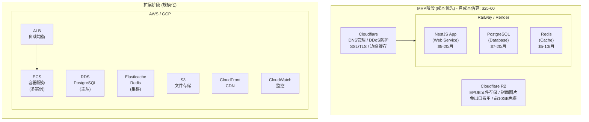
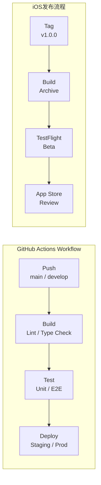

# 基础设施

### 8.1 部署架构



### 8.2 CI/CD流程



**分支策略：**
- main: 生产环境
- develop: 开发环境
- feature/*: 功能分支
- hotfix/*: 紧急修复

### 8.3 监控告警

```
┌─────────────────────────────────────────────────────────────────────────┐
│                        Monitoring & Alerting                            │
├─────────────────────────────────────────────────────────────────────────┤
│                                                                         │
│  监控指标                                                                │
│  ══════════                                                              │
│                                                                         │
│  应用层：                                                                │
│  • API响应时间 (P50, P95, P99)                                          │
│  • 请求成功率                                                           │
│  • 错误率和错误类型分布                                                 │
│  • 活跃用户数 (DAU, MAU)                                                │
│                                                                         │
│  AI服务：                                                                │
│  • AI调用量和成功率                                                     │
│  • AI响应延迟                                                           │
│  • 每小时/每日成本                                                      │
│  • 缓存命中率                                                           │
│                                                                         │
│  基础设施：                                                              │
│  • CPU/内存使用率                                                       │
│  • 数据库连接数                                                         │
│  • Redis内存使用                                                        │
│  • 磁盘使用率                                                           │
│                                                                         │
│  告警规则                                                                │
│  ══════════                                                              │
│                                                                         │
│  ┌─────────────────────────────────────────────────────────────────┐    │
│  │  级别    触发条件                        通知方式               │    │
│  ├─────────────────────────────────────────────────────────────────┤    │
│  │  P0     服务不可用 > 1分钟              电话 + Slack + Email    │    │
│  │  P1     错误率 > 5% 持续5分钟           Slack + Email           │    │
│  │  P2     API延迟P95 > 3s                 Slack                   │    │
│  │  P3     AI成本超日预算                   Slack                   │    │
│  │  P4     磁盘使用 > 80%                   Email                   │    │
│  └─────────────────────────────────────────────────────────────────┘    │
│                                                                         │
│  工具选择                                                                │
│  ══════════                                                              │
│  • MVP: Sentry (错误追踪) + Uptime Robot (可用性)                       │
│  • 扩展: Datadog / Grafana + Prometheus                                 │
│                                                                         │
└─────────────────────────────────────────────────────────────────────────┘
```

---

