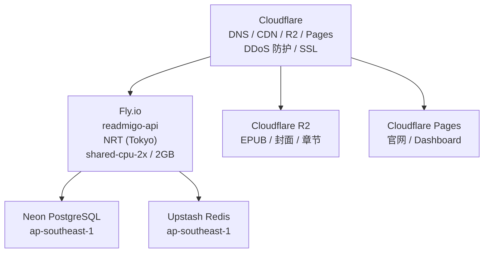

# 基础设施

> Readmigo 基础设施架构与 CI/CD 流程

---

## 部署架构

---

## CI/CD 流程

| Workflow | 触发条件 | 说明 |
|----------|----------|------|
| ci.yml | Push / PR | Lint & Build |
| deploy.yml | Push to main | flyctl deploy --remote-only |
| codeql.yml | 定期 | 代码安全扫描 |

---

## 监控告警

| 工具 | 用途 |
|------|------|
| Sentry | 错误追踪、性能监控 |
| Axiom | 日志收集 |
| Fly.io Dashboard | 资源监控 (CPU/内存) |

| 级别 | 触发条件 | 通知方式 |
|------|----------|----------|
| P0 | 服务不可用 > 1 分钟 | 立即通知 |
| P1 | 错误率 > 5% 持续 5 分钟 | 通知 |
| P2 | API 延迟 P95 > 3s | 告警 |

---

*最后更新: 2026-02-07*
