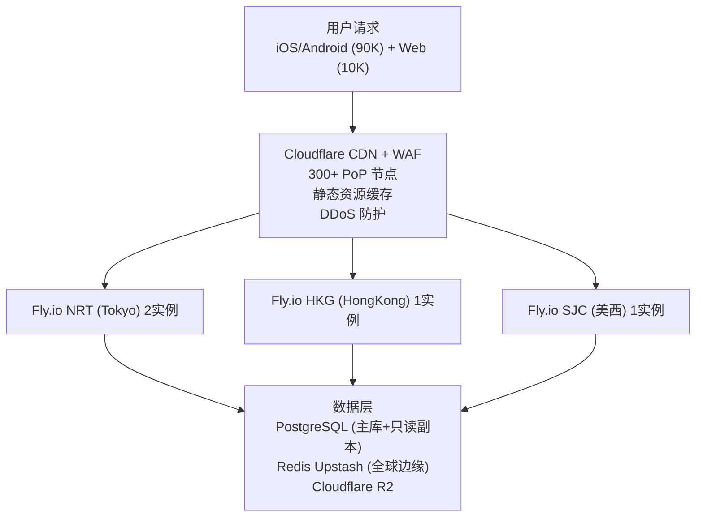
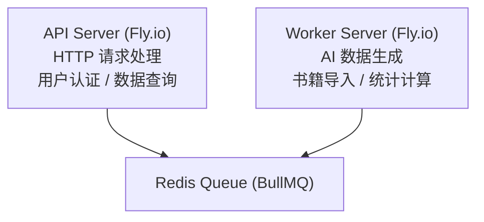
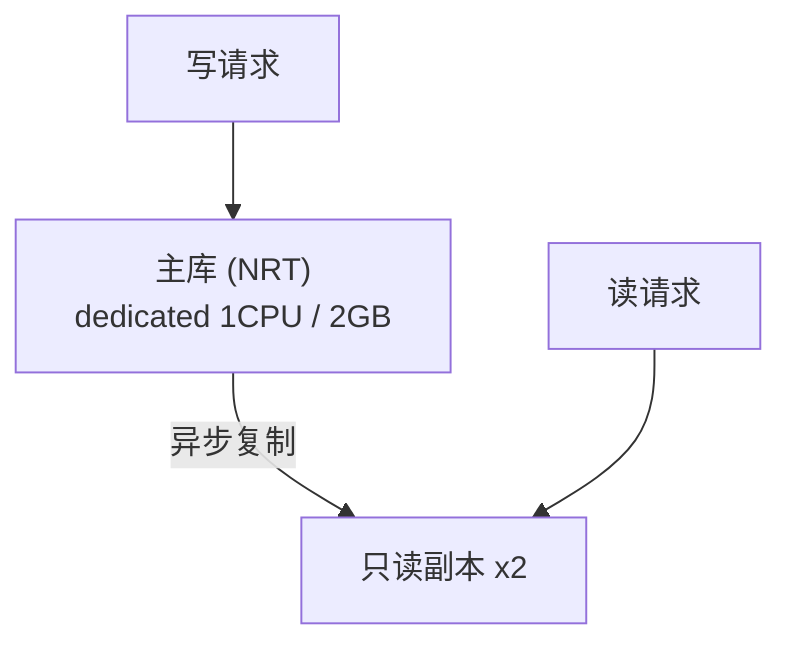
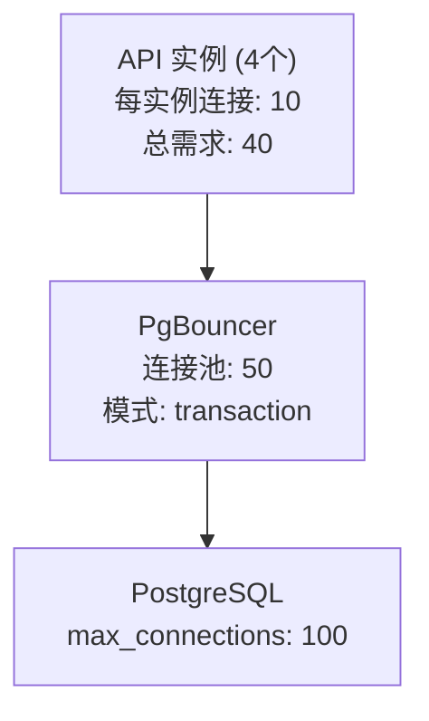
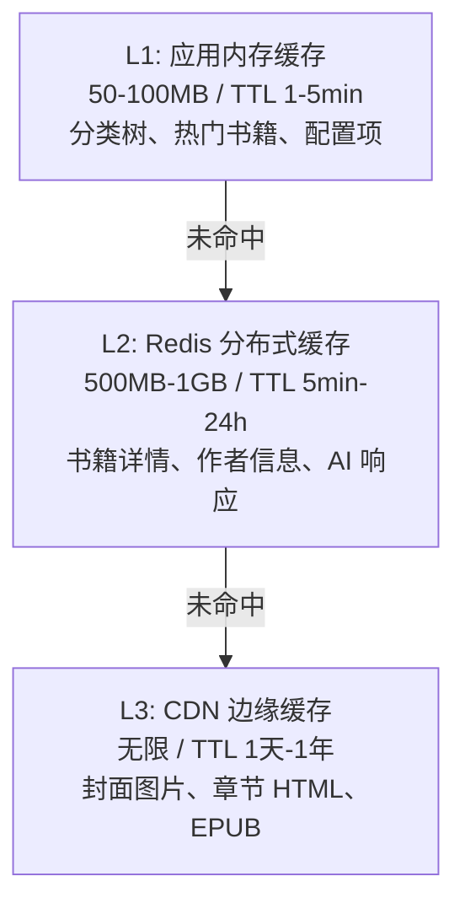
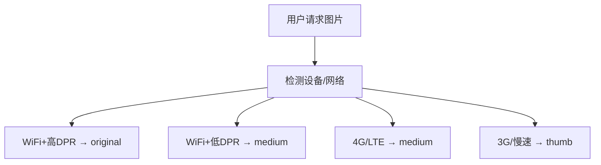

# 10万日活用户性能优化技术方案

> 100K DAU 场景下的架构扩展与性能优化规划 (规划文档)

---

## 1. 流量分析与容量规划

### 用户分布

| 指标 | 值 |
|------|-----|
| 总日活用户 | 100,000 |
| 客户端 (iOS/Android) | 90,000 |
| Web App | 10,000 |
| 峰值系数 | 3x (晚间 19:00-22:00) |
| 峰值同时在线 | ~15,000 |

### API 请求量估算

| 指标 | 计算 | 结果 |
|------|------|------|
| 日均 API 请求总量 | 100K x 30min x 3req/min | 9,000,000 |
| 日均 QPS | 9M / 86400 | ~104 QPS |
| 峰值 QPS (3x) | 104 x 3 | ~312 QPS |
| 设计容量 (2x 余量) | 312 x 2 | ~625 QPS |

### 主要流量入口

| 入口 | 流量占比 | 特点 |
|------|----------|------|
| 发现 Tab | 35% | 高频浏览、列表查询多 |
| 城邦 Tab | 25% | UGC 内容、需要实时性 |
| 书籍详情页 | 20% | 详情查询、可缓存 |
| 作者详情页 | 10% | 详情查询、可缓存 |
| 阅读器文件下载 | 10% | 大文件、带宽密集 |

---

## 2. 系统架构

### 目标架构

### 实例规格规划

| 区域 | 实例数 | 规格 | 用途 |
|------|--------|------|------|
| NRT (Tokyo) | 2 | shared-cpu-2x, 1GB RAM | 主区域、亚太用户 |
| HKG (HongKong) | 1 | shared-cpu-1x, 512MB RAM | 中国优化 |
| SJC (San Jose) | 1 | shared-cpu-1x, 512MB RAM | 美洲用户 |

### Worker 进程分离

---

## 3. 数据库优化

### PostgreSQL 读写分离

### 连接池配置

### 关键索引优化

| 表名 | 索引字段 | 类型 |
|------|----------|------|
| books | (language, is_active) | 复合索引 |
| books | (category_id, created_at) | 复合索引 |
| chapters | (book_id, order) | 复合索引 |
| agora_posts | (author_id, created_at) | 复合索引 |
| user_books | (user_id, status) | 复合索引 |
| authors | (name) | 全文索引 |

---

## 4. 缓存策略

### 多级缓存架构

### 各入口缓存策略

| 入口 | 数据类型 | 缓存层 | TTL | 策略 |
|------|----------|--------|-----|------|
| 发现 Tab | 分类树 | L1+L2 | 1 小时 | 预热 |
| 发现 Tab | 书籍列表 | L2 | 10 分钟 | 惰性 |
| 发现 Tab | 封面图片 | L3 | 7 天 | 永久 |
| 城邦 Tab | 帖子列表 | L2 | 2 分钟 | 惰性 |
| 书籍详情 | 元数据 | L2 | 1 小时 | 惰性 |
| 书籍详情 | 封面大图 | L3 | 30 天 | 永久 |
| 阅读器 | 章节 HTML | L3 | 7 天 | 预取 |
| 阅读器 | EPUB 文件 | L3 | 30 天 | 永久 |

---

## 5. CDN 与静态资源优化

### R2 CDN 缓存配置

| 资源类型 | Cache-Control | 有效期 |
|----------|---------------|--------|
| 封面图片 | public, max-age=2592000, immutable | 30 天 |
| 章节 HTML | public, max-age=604800, stale-while-revalidate=86400 | 7+1 天 |
| EPUB 文件 | public, max-age=604800 | 7 天 |
| 字体文件 | public, max-age=31536000, immutable | 1 年 |
| 用户媒体 | public, max-age=86400 | 1 天 |

### 图片优化

### 阅读器文件下载优化

| 阶段 | 下载内容 | 触发时机 |
|------|----------|----------|
| 即时加载 | 当前章节 + 前后 1 章 | 打开书籍 |
| 预加载 | 前后各 2 章 | 阅读时后台加载 |
| 离线下载 | 全部章节 | 用户主动触发 |

---

## 6. API 性能优化

### 发现 Tab

| 优化措施 | 说明 |
|----------|------|
| 分类树预热缓存 | 启动时加载到 L1，TTL 1h/6h |
| Cursor 分页 | 基于 created_at + id |
| 响应压缩 | Brotli (优先) + Gzip |
| 条件请求 | ETag + If-None-Match → 304 |

### 城邦 Tab

| 优化措施 | 说明 |
|----------|------|
| 短时间缓存 | 帖子列表缓存 2 分钟 |
| 点赞异步更新 | Redis INCR + 定期同步 |
| 媒体 CDN 直加载 | API 只返回 URL |
| 时间戳 Cursor 分页 | 首屏 10 条 |

### 响应格式优化

| 场景 | 当前大小 | 优化后 | 减少 |
|------|----------|--------|------|
| 书籍列表 (20 条) | ~50KB | ~15KB | 70% |
| 帖子列表 (10 条) | ~30KB | ~12KB | 60% |
| 书籍详情 | ~20KB | ~8KB | 60% |

### 速率限制

| 层级 | 限制 | 窗口 |
|------|------|------|
| 全局 | 10000 req/min | 滑动窗口 |
| IP | 100 req/min | 滑动窗口 |
| 用户 | 300 req/min | 令牌桶 |
| AI 接口 | 30 req/min/user | 令牌桶 |
| 登录/注册 | 5 req/min/IP | 固定窗口 |

---

## 7. 监控与告警

### 核心监控指标

| 类别 | 指标 | 阈值 | 优先级 |
|------|------|------|--------|
| 可用性 | API 成功率 | > 99.5% | P0 |
| 延迟 | API P95 | < 500ms | P1 |
| 延迟 | API P99 | < 1000ms | P1 |
| 资源 | CPU 使用率 | < 80% | P2 |
| 资源 | 内存使用率 | < 85% | P2 |
| 数据库 | 连接池使用率 | < 80% | P1 |
| 缓存 | Redis 命中率 | > 90% | P2 |

---

## 8. 成本估算

### 月度成本 (100K DAU)

| 服务 | 配置 | 月费用 (USD) |
|------|------|-------------|
| Fly.io API | 4 实例 x shared-cpu (多区域) | ~$80 |
| Fly.io Worker | 2 实例 x shared-cpu-2x | ~$40 |
| PostgreSQL | dedicated-1x (2GB) + 只读副本 | ~$80 |
| Upstash Redis | Pro (3GB, 全球边缘) | ~$120 |
| Cloudflare R2 | 50GB 存储 + 带宽 | ~$20 |
| Cloudflare CDN | Pro 计划 | ~$20 |
| Sentry | Team 计划 | ~$26 |
| 域名+SSL | - | ~$5 |
| **合计** | | **~$391** |
| 预留 buffer (20%) | | ~$78 |
| **总预算** | | **~$470/月** |

单用户成本：~$0.0047/DAU/月

### 成本随规模变化

| DAU | 月成本 | 单用户成本 |
|-----|--------|-----------|
| 10K | ~$150 | $0.015 |
| 50K | ~$300 | $0.006 |
| 100K | ~$470 | $0.0047 |
| 200K | ~$800 | $0.004 |

---

## 9. 实施路线图

| 阶段 | 触发条件 | 关键任务 |
|------|----------|----------|
| Phase 1 | 立即 | 数据库索引 + API 响应精简 + CDN 规则 + 三级缓存 |
| Phase 2 | DAU > 30K | 多区域部署 + PostgreSQL 只读副本 + 读写分离 + Worker 分离 |
| Phase 3 | DAU > 70K | 章节 HTML CDN 直取 + Cursor 分页 + PgBouncer + 图片多尺寸 |
| Phase 4 | DAU ~100K | 自动扩缩容精调 + 故障转移 + 备份验证 + 压测 |

### 关键里程碑

| 里程碑 | 目标 |
|--------|------|
| M1 | 缓存命中率 > 80%，API P95 < 300ms |
| M2 | 3 区域稳定，全球延迟 < 200ms |
| M3 | 缓存命中率 > 95%，API P95 < 200ms |
| M4 | 可用性 > 99.9%，成本在预算内 |

---

## 10. 风险与应对

| 风险 | 影响 | 概率 | 应对 |
|------|------|------|------|
| 流量突增 | 高 | 中 | 自动扩缩容 + 限流 + CDN 吸收 |
| 数据库瓶颈 | 高 | 中 | 读写分离 + 查询优化 + 缓存兜底 |
| Redis 故障 | 中 | 低 | Upstash 高可用 + L1 缓存降级 |
| CDN 故障 | 中 | 低 | Cloudflare SLA + 源站直访 |
| Fly.io 区域故障 | 中 | 低 | 多区域部署 + 自动故障转移 |
| 成本超支 | 低 | 中 | 成本监控告警 + 自动缩容 |

---

*最后更新: 2026-02-07*
