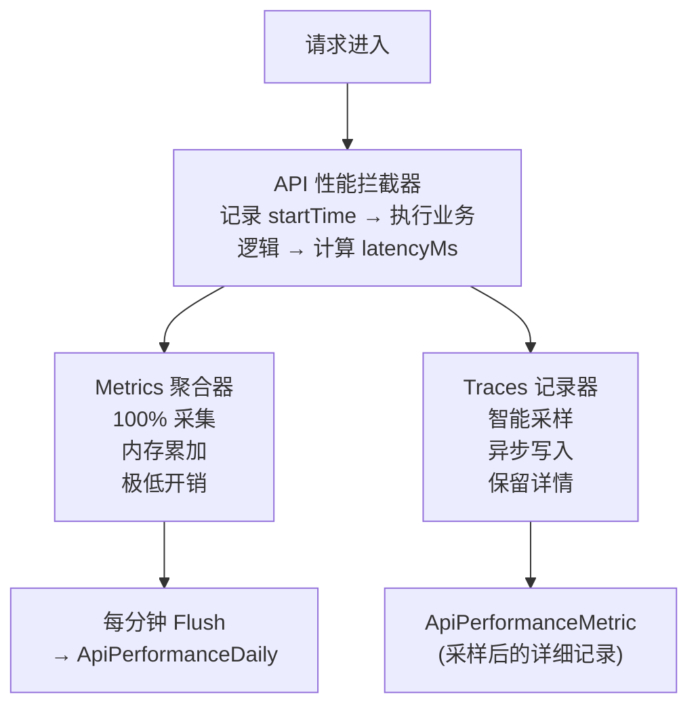
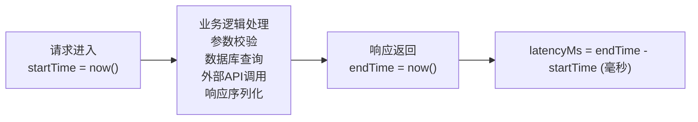
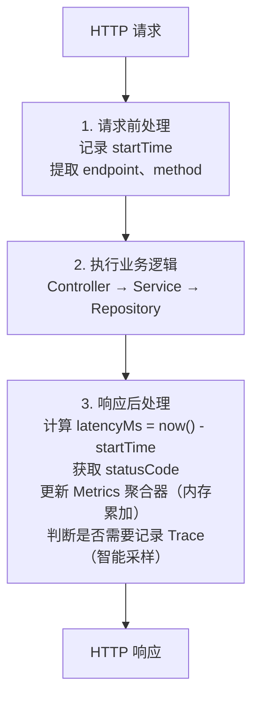
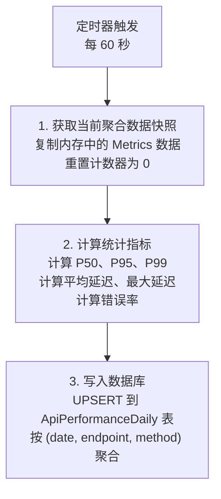
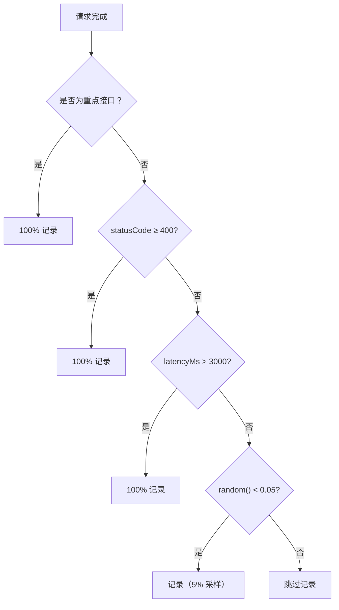
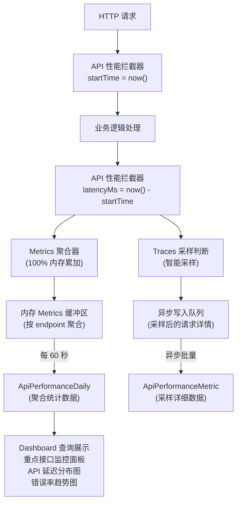

# API 性能监控数据采集原理

## 1. 概述

本文档描述 API 性能监控数据的采集原理、架构设计和实现机制，基于业界最佳实践（Google SRE 四大黄金信号、RED 方法、OpenTelemetry）。

---

## 2. 设计原则

### 2.1 业界最佳实践

| 方法论 | 来源 | 核心指标 |
|-------|------|---------|
| **四大黄金信号** | Google SRE | Latency、Traffic、Errors、Saturation |
| **RED 方法** | Tom Wilkie | Rate、Errors、Duration |
| **OpenTelemetry** | CNCF | Metrics + Traces 分离 |

### 2.2 设计目标

| 目标 | 说明 |
|-----|-----|
| 零采样统计 | 聚合指标（请求数、错误率、延迟分布）100% 采集 |
| 极低开销 | 请求延迟增加 < 0.1ms |
| 异常全捕获 | 错误和慢请求 100% 记录详情 |
| 实时可查 | 数据延迟 < 1 分钟 |

---

## 3. 核心架构

### 3.1 Metrics + Traces 分离架构



### 3.2 两层数据结构

| 层级 | 数据类型 | 采样率 | 存储位置 | 用途 |
|-----|---------|-------|---------|-----|
| **Metrics 层** | 聚合统计 | 100% | 内存 → ApiPerformanceDaily | 统计分析、仪表盘 |
| **Traces 层** | 请求详情 | 智能采样 | ApiPerformanceMetric | 问题排查、异常分析 |

---

## 4. 响应时间追踪原理

### 4.1 计时机制



### 4.2 拦截器工作流程



---

## 5. 成功率计算原理

### 5.1 状态码判定规则

| HTTP 状态码范围 | 判定结果 | 说明 |
|---------------|---------|-----|
| 200-299 | 成功 | 请求正常处理 |
| 300-399 | 成功 | 重定向（不计入错误） |
| 400-499 | 失败 | 客户端错误 |
| 500-599 | 失败 | 服务端错误 |

### 5.2 计算公式

```
┌─────────────────────────────────────────────────────────────────────────────┐
│                         成功率计算                                           │
├─────────────────────────────────────────────────────────────────────────────┤
│                                                                             │
│   成功率 = (1 - 错误数 / 总请求数) × 100%                                    │
│                                                                             │
│   错误率 = 错误数 / 总请求数 × 100%                                          │
│                                                                             │
│   ─────────────────────────────────────────────────────────────────────     │
│                                                                             │
│   示例：                                                                     │
│   ┌─────────────────────────────────────────────────────────────────────┐   │
│   │  总请求数: 10,000                                                    │   │
│   │  成功请求: 9,850 (2xx + 3xx)                                         │   │
│   │  错误请求: 150 (4xx + 5xx)                                           │   │
│   │                                                                      │   │
│   │  成功率 = (1 - 150/10000) × 100% = 98.5%                             │   │
│   │  错误率 = 150/10000 × 100% = 1.5%                                    │   │
│   └─────────────────────────────────────────────────────────────────────┘   │
│                                                                             │
└─────────────────────────────────────────────────────────────────────────────┘
```

---

## 6. Metrics 聚合机制

### 6.1 内存聚合器数据结构

```
┌─────────────────────────────────────────────────────────────────────────────┐
│                         Metrics 聚合器                                       │
├─────────────────────────────────────────────────────────────────────────────┤
│                                                                             │
│   聚合维度：(endpoint, method)                                               │
│                                                                             │
│   ┌─────────────────────────────────────────────────────────────────────┐   │
│   │  Map<string, EndpointMetrics>                                        │   │
│   │                                                                      │   │
│   │  Key: "GET:/api/v1/books"                                            │   │
│   │  Value:                                                              │   │
│   │    ├── requestCount: number       // 请求计数器                      │   │
│   │    ├── errorCount: number         // 错误计数器                      │   │
│   │    ├── totalLatency: number       // 延迟累加（用于计算平均值）       │   │
│   │    ├── latencies: number[]        // 延迟采样数组（用于计算分位数）   │   │
│   │    └── statusCounts: Map          // 状态码分布                      │   │
│   │         ├── 200: 9500                                                │   │
│   │         ├── 400: 30                                                  │   │
│   │         └── 500: 20                                                  │   │
│   └─────────────────────────────────────────────────────────────────────┘   │
│                                                                             │
└─────────────────────────────────────────────────────────────────────────────┘
```

### 6.2 延迟分位数计算（P50/P95/P99）

```
┌─────────────────────────────────────────────────────────────────────────────┐
│                         分位数计算原理                                       │
├─────────────────────────────────────────────────────────────────────────────┤
│                                                                             │
│   采样数组（已排序）:                                                        │
│   [10, 15, 20, 25, 30, 35, 40, 50, 80, 100, 150, 200, 500, 1000, 3000]     │
│    ↑                           ↑                    ↑              ↑        │
│   最小                        P50                  P95            P99       │
│                                                                             │
│   ─────────────────────────────────────────────────────────────────────     │
│                                                                             │
│   计算方法：                                                                 │
│                                                                             │
│   ┌─────────────────────────────────────────────────────────────────────┐   │
│   │  假设有 N 个样本：                                                    │   │
│   │                                                                      │   │
│   │  P50 = sorted[floor(N × 0.50)]  // 50% 的请求在此时间内完成          │   │
│   │  P95 = sorted[floor(N × 0.95)]  // 95% 的请求在此时间内完成          │   │
│   │  P99 = sorted[floor(N × 0.99)]  // 99% 的请求在此时间内完成          │   │
│   │                                                                      │   │
│   │  示例（100 个样本）：                                                 │   │
│   │  P50 = 第 50 个值                                                    │   │
│   │  P95 = 第 95 个值                                                    │   │
│   │  P99 = 第 99 个值                                                    │   │
│   └─────────────────────────────────────────────────────────────────────┘   │
│                                                                             │
└─────────────────────────────────────────────────────────────────────────────┘
```

### 6.3 Flush 机制



---

## 7. 智能采样策略

### 7.1 采样规则



### 7.2 采样率配置

| 请求类型 | 采样率 | 理由 |
|---------|-------|-----|
| 重点接口 | 100% | 核心业务必须全量监控 |
| 错误响应 (4xx/5xx) | 100% | 异常必须 100% 捕获用于排查 |
| 慢请求 (>3000ms) | 100% | 性能问题必须捕获 |
| 普通成功请求 | 5% | 统计意义上足够，降低存储成本 |

---

## 8. 重点接口监控

### 8.1 重点接口清单

| 分类 | 接口 | 响应阈值 | 成功率目标 |
|-----|-----|---------|----------|
| **认证** | POST /auth/login | < 2000ms | ≥ 99.5% |
| **认证** | POST /auth/register | < 3000ms | ≥ 99.5% |
| **认证** | POST /auth/refresh | < 1000ms | ≥ 99.9% |
| **用户** | GET /users/me | < 1500ms | ≥ 99.5% |
| **书籍** | GET /books | < 2000ms | ≥ 99.5% |
| **书籍** | GET /books/:id | < 1500ms | ≥ 99.5% |
| **书籍** | GET /books/:id/content/:chapterId | < 2000ms | ≥ 99.5% |
| **阅读** | GET /reading/library | < 1500ms | ≥ 99.5% |
| **阅读** | PATCH /reading/progress/:bookId | < 1500ms | ≥ 99.5% |
| **阅读** | POST /reading/sessions | < 1500ms | ≥ 99.0% |
| **AI** | POST /ai/explain | < 5000ms | ≥ 98.0% |
| **AI** | POST /ai/translate | < 5000ms | ≥ 98.0% |
| **词汇** | GET /vocabulary | < 2000ms | ≥ 99.5% |
| **词汇** | POST /vocabulary | < 1500ms | ≥ 99.5% |
| **订阅** | GET /subscriptions/status | < 1500ms | ≥ 99.9% |
| **订阅** | POST /subscriptions/verify | < 3000ms | ≥ 99.5% |
| **订阅** | POST /subscriptions/trial/start | < 2000ms | ≥ 99.5% |
| **推荐** | GET /recommendation/home | < 3000ms | ≥ 99.0% |
| **搜索** | GET /search | < 2000ms | ≥ 99.5% |
| **标注** | POST /highlights | < 1500ms | ≥ 99.5% |
| **同步** | POST /sync/progress | < 1500ms | ≥ 99.5% |
| **追踪** | POST /tracking/reading | < 1500ms | ≥ 99.0% |
| **健康** | GET /health | < 1000ms | ≥ 99.9% |

### 8.2 告警阈值

| 指标 | 警告阈值 | 严重阈值 |
|-----|---------|---------|
| 错误率 | > 1% | > 5% |
| P95 延迟 | > 目标值 × 1.5 | > 目标值 × 2 |
| P99 延迟 | > 目标值 × 2 | > 目标值 × 3 |

---

## 9. 性能开销分析

### 9.1 开销对比

| 方案 | 请求延迟增加 | 内存占用 | 数据库写入频率 |
|-----|------------|---------|--------------|
| 全量同步写入 | +10-20ms | 低 | 每请求 1 次 |
| 全量异步写入 | +2-5ms | 中 | 每请求 1 次 |
| **Metrics 聚合（采用）** | **< 0.1ms** | **~10MB** | **每分钟 1 次** |
| Traces 智能采样 | < 0.5ms | 低 | 约 10% 请求 |

### 9.2 内存使用估算

```
┌─────────────────────────────────────────────────────────────────────────────┐
│                         内存使用估算                                         │
├─────────────────────────────────────────────────────────────────────────────┤
│                                                                             │
│   假设：                                                                     │
│   · 100 个不同的 API 端点                                                    │
│   · 每个端点存储 1000 个延迟采样                                             │
│   · 每个采样 8 bytes (number)                                               │
│                                                                             │
│   计算：                                                                     │
│   · 延迟采样：100 × 1000 × 8 = 800 KB                                       │
│   · 计数器和元数据：100 × 200 bytes = 20 KB                                 │
│   · 缓冲区和开销：~180 KB                                                   │
│                                                                             │
│   总计：约 1 MB（远小于预估的 10MB 上限）                                    │
│                                                                             │
└─────────────────────────────────────────────────────────────────────────────┘
```

---

## 10. 数据流完整链路



---

## 11. 相关文件

| 文件 | 说明 |
|-----|-----|
| `apps/backend/src/common/interceptors/api-performance.interceptor.ts` | API 性能拦截器 |
| `apps/backend/src/common/services/metrics-aggregator.service.ts` | Metrics 聚合器 |
| `apps/backend/src/modules/admin/performance/performance.service.ts` | 性能查询服务 |
| `apps/backend/src/modules/admin/performance/critical-endpoints.config.ts` | 重点接口配置 |
| `packages/database/prisma/schema.prisma` | 数据库表定义 |

---

## 12. 参考资料

| 来源 | 链接 |
|-----|-----|
| Google SRE Book | https://sre.google/sre-book/monitoring-distributed-systems/ |
| RED Method | https://last9.io/blog/monitoring-with-red-method/ |
| OpenTelemetry Sampling | https://opentelemetry.io/docs/concepts/sampling/ |
| OpenTelemetry Best Practices | https://betterstack.com/community/guides/observability/opentelemetry-best-practices/ |
