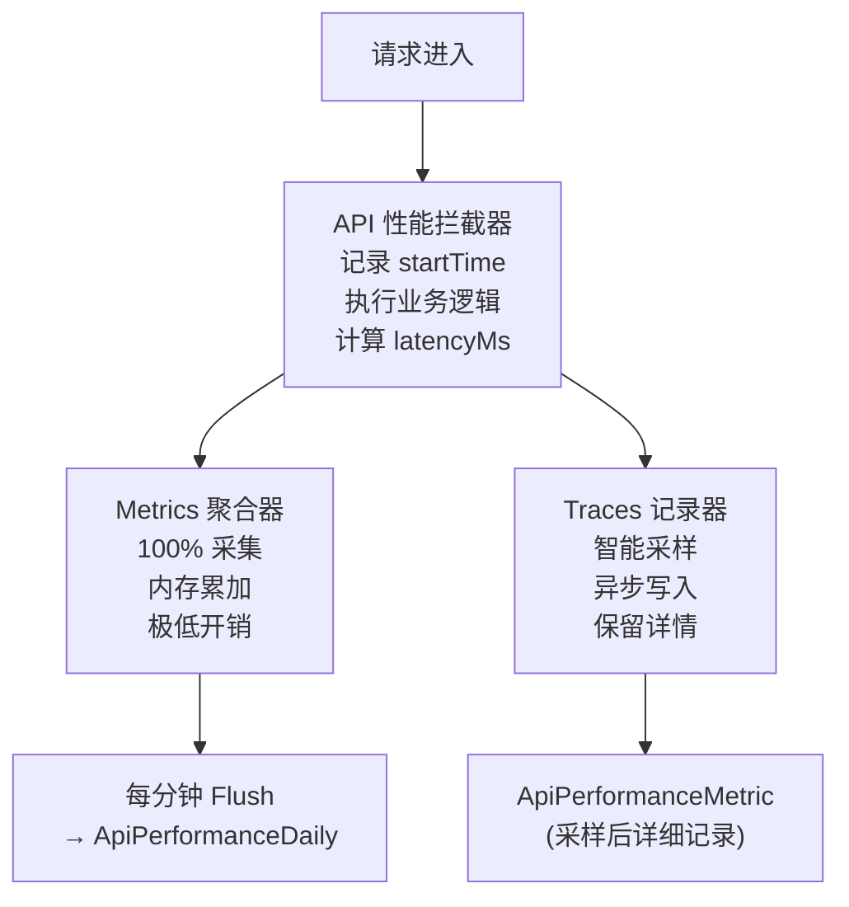
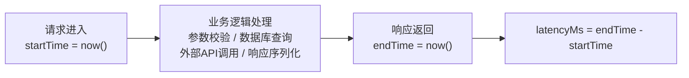
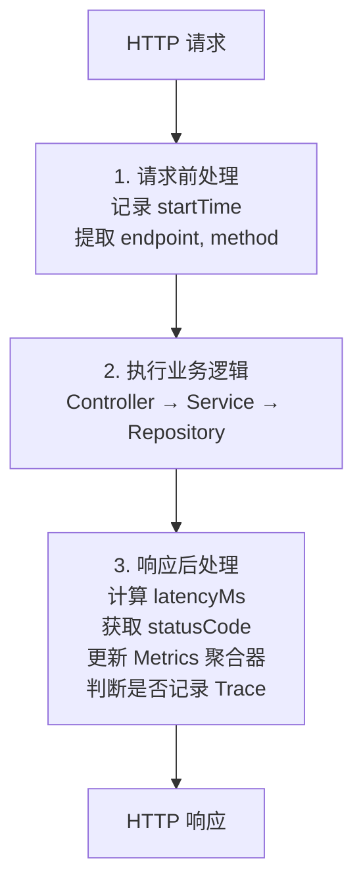
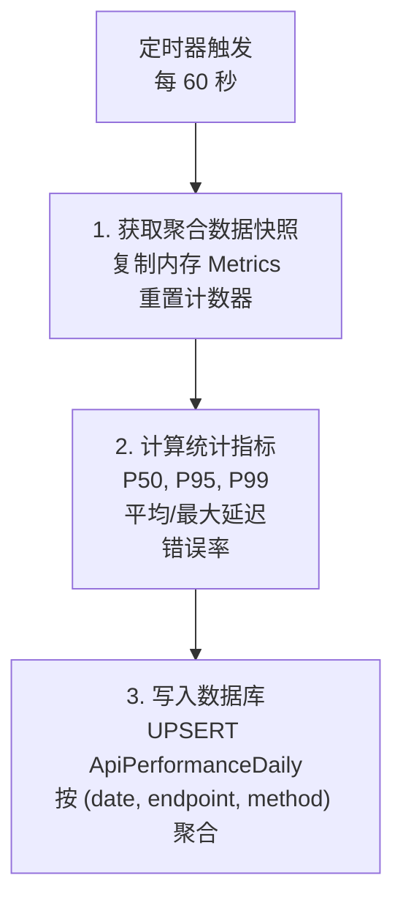
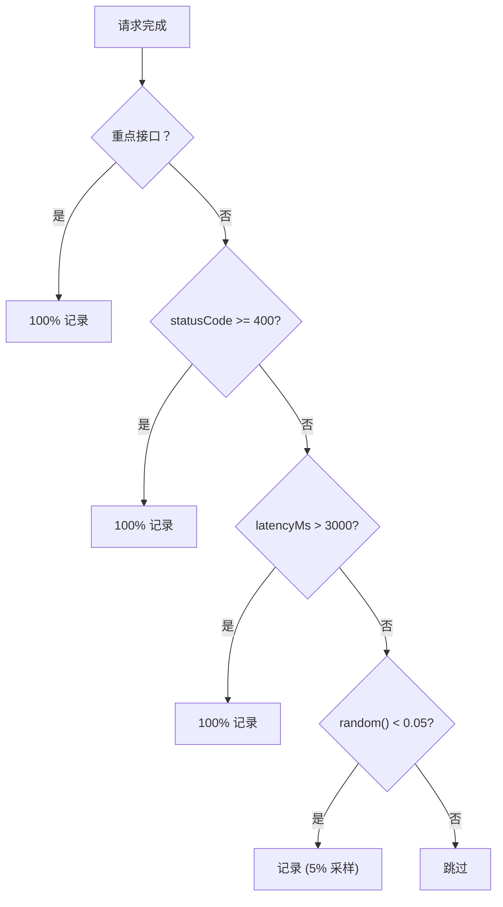
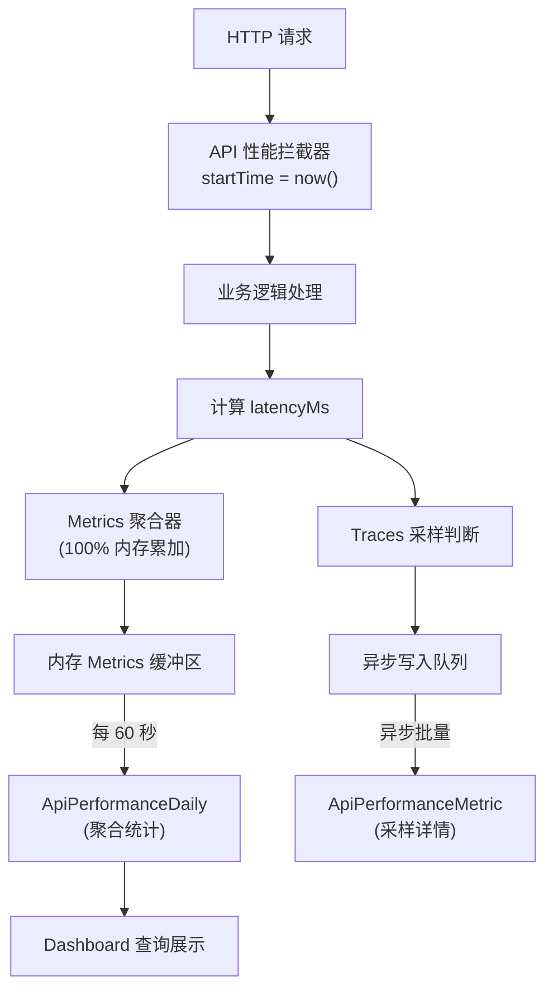

# API 性能监控数据采集原理

> Metrics + Traces 分离架构，基于 Google SRE 四大黄金信号

---

## 1. 设计原则

| 方法论 | 来源 | 核心指标 |
|--------|------|----------|
| 四大黄金信号 | Google SRE | Latency, Traffic, Errors, Saturation |
| RED 方法 | Tom Wilkie | Rate, Errors, Duration |
| OpenTelemetry | CNCF | Metrics + Traces 分离 |

### 设计目标

| 目标 | 说明 |
|------|------|
| 零采样统计 | 聚合指标 100% 采集 |
| 极低开销 | 请求延迟增加 < 0.1ms |
| 异常全捕获 | 错误和慢请求 100% 记录详情 |
| 实时可查 | 数据延迟 < 1 分钟 |

---

## 2. 核心架构

### Metrics + Traces 分离

### 两层数据结构

| 层级 | 数据类型 | 采样率 | 存储位置 | 用途 |
|------|----------|--------|----------|------|
| Metrics 层 | 聚合统计 | 100% | 内存 → ApiPerformanceDaily | 统计分析、仪表盘 |
| Traces 层 | 请求详情 | 智能采样 | ApiPerformanceMetric | 问题排查、异常分析 |

---

## 3. 响应时间追踪

### 计时机制

### 拦截器工作流程

---

## 4. 成功率计算

### 状态码判定规则

| HTTP 状态码范围 | 判定结果 |
|----------------|----------|
| 200-299 | 成功 |
| 300-399 | 成功 (重定向) |
| 400-499 | 失败 (客户端错误) |
| 500-599 | 失败 (服务端错误) |

### 计算公式

| 指标 | 公式 |
|------|------|
| 成功率 | (1 - 错误数 / 总请求数) x 100% |
| 错误率 | 错误数 / 总请求数 x 100% |

---

## 5. Metrics 聚合机制

### 内存聚合器

| 属性 | 说明 |
|------|------|
| 聚合维度 | (endpoint, method) |
| requestCount | 请求计数器 |
| errorCount | 错误计数器 |
| totalLatency | 延迟累加 (计算平均值) |
| latencies[] | 延迟采样数组 (计算分位数) |
| statusCounts | 状态码分布 Map |

### 延迟分位数计算 (P50/P95/P99)

| 分位数 | 含义 | 计算方法 |
|--------|------|----------|
| P50 | 50% 请求在此时间内完成 | sorted[floor(N x 0.50)] |
| P95 | 95% 请求在此时间内完成 | sorted[floor(N x 0.95)] |
| P99 | 99% 请求在此时间内完成 | sorted[floor(N x 0.99)] |

### Flush 机制

---

## 6. 智能采样策略

### 采样率配置

| 请求类型 | 采样率 | 理由 |
|----------|--------|------|
| 重点接口 | 100% | 核心业务必须全量监控 |
| 错误响应 (4xx/5xx) | 100% | 异常必须捕获 |
| 慢请求 (>3000ms) | 100% | 性能问题必须捕获 |
| 普通成功请求 | 5% | 统计足够，降低存储成本 |

---

## 7. 重点接口监控

| 分类 | 接口 | 响应阈值 | 成功率目标 |
|------|------|----------|-----------|
| 认证 | POST /auth/login | < 2000ms | >= 99.5% |
| 认证 | POST /auth/refresh | < 1000ms | >= 99.9% |
| 书籍 | GET /books | < 2000ms | >= 99.5% |
| 书籍 | GET /books/:id | < 1500ms | >= 99.5% |
| 阅读 | GET /reading/library | < 1500ms | >= 99.5% |
| AI | POST /ai/explain | < 5000ms | >= 98.0% |
| 词汇 | GET /vocabulary | < 2000ms | >= 99.5% |
| 订阅 | GET /subscriptions/status | < 1500ms | >= 99.9% |
| 推荐 | GET /recommendation/home | < 3000ms | >= 99.0% |
| 搜索 | GET /search | < 2000ms | >= 99.5% |
| 健康 | GET /health | < 1000ms | >= 99.9% |

---

## 8. 性能开销分析

| 方案 | 请求延迟增加 | 内存占用 | 数据库写入频率 |
|------|-------------|----------|---------------|
| 全量同步写入 | +10-20ms | 低 | 每请求 1 次 |
| 全量异步写入 | +2-5ms | 中 | 每请求 1 次 |
| **Metrics 聚合 (采用)** | **< 0.1ms** | **~1MB** | **每分钟 1 次** |
| Traces 智能采样 | < 0.5ms | 低 | 约 10% 请求 |

---

## 9. 完整数据流链路

---

## 10. 相关文件

| 文件 | 说明 |
|------|------|
| `src/common/interceptors/api-performance.interceptor.ts` | API 性能拦截器 |
| `src/common/services/metrics-aggregator.service.ts` | Metrics 聚合器 |
| `src/modules/admin/performance/performance.service.ts` | 性能查询服务 |
| `src/modules/admin/performance/critical-endpoints.config.ts` | 重点接口配置 |
| `packages/database/prisma/schema.prisma` | 数据库表定义 |

---

## 11. 参考资料

| 来源 | 链接 |
|------|------|
| Google SRE Book | https://sre.google/sre-book/monitoring-distributed-systems/ |
| RED Method | https://last9.io/blog/monitoring-with-red-method/ |
| OpenTelemetry Sampling | https://opentelemetry.io/docs/concepts/sampling/ |

---

*最后更新: 2026-02-07*
