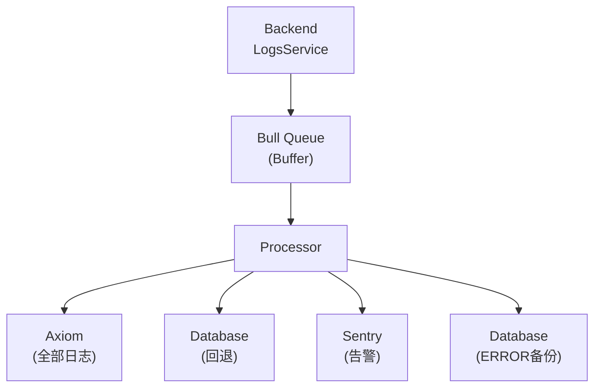
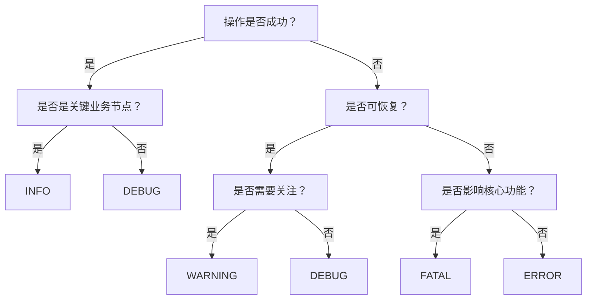
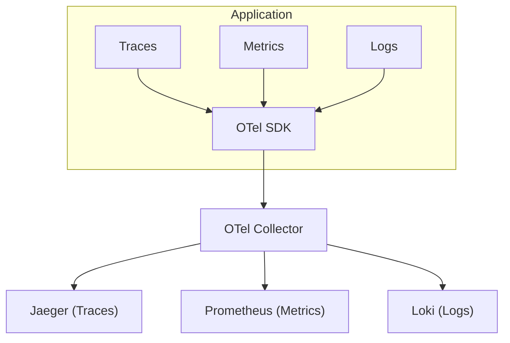

# 后端运行日志规范

> 后端日志级别、采集架构与模块覆盖

---

## 1. 概述

| 项目 | 说明 |
|------|------|
| 目标 | 关键功能点添加详细运行日志，方便本地调试和线上问题定位 |
| 日志工具 | NestJS Logger + LogsService |
| 云端收集 | Axiom (全部日志) + Sentry (错误告警) |
| 数据库存储 | RuntimeLog 表 (ERROR/FATAL 备份) |
| 异步队列 | Bull Queue (批量写入) |

---

## 2. 日志级别定义

| 级别 | 用途 | 示例 |
|------|------|------|
| DEBUG | 详细诊断，仅本地开发 | 缓存命中/未命中 |
| INFO | 关键业务流程节点 | 用户登录成功、完成章节 |
| WARNING | 非致命异常，需关注 | 网络重试、降级处理 |
| ERROR | 错误但可恢复 | API 调用失败 |
| FATAL | 严重错误，影响核心功能 | 数据库连接断开 |

### 收集策略

| 环境 | 收集级别 | 说明 |
|------|----------|------|
| Development | DEBUG 及以上 | 全量收集 |
| Production | INFO 及以上 | 默认策略 |
| Production (调试) | DEBUG 及以上 | 临时开启，限时 1 小时 |

- 日志保留：10 天自动清理
- DEBUG 采样：生产可配 1-10%

---

## 3. 关键模块日志要求

### 认证模块 (Auth)

| 操作 | 级别 | 格式 |
|------|------|------|
| 用户登录 | INFO | `[Auth] User login: userId={id}, method={apple/email}` |
| Token 刷新 | DEBUG | `[Auth] Token refresh: userId={id}` |
| 登录失败 | WARNING | `[Auth] Login failed: email={email}, reason={reason}` |

### 书籍模块 (Books)

| 操作 | 级别 | 格式 |
|------|------|------|
| 获取详情 | INFO | `[Books] Get book detail: bookId={id}` |
| 获取章节 | INFO | `[Books] Get chapter: bookId={id}, chapterNum={num}` |

### AI 模块 (AI)

| 操作 | 级别 | 格式 |
|------|------|------|
| 单词解释 | INFO | `[AI] Word explain: word={word}, provider={provider}` |
| Provider 切换 | WARNING | `[AI] Provider fallback: from={p1} to={p2}` |
| 请求失败 | ERROR | `[AI] Request failed: type={type}, error={msg}` |

### 订阅模块 (Subscriptions)

| 操作 | 级别 | 格式 |
|------|------|------|
| 验证收据 | INFO | `[Subscription] Verify receipt: userId={id}` |
| 订阅激活 | INFO | `[Subscription] Activated: userId={id}, plan={plan}` |
| 验证失败 | ERROR | `[Subscription] Verification failed: userId={id}` |

---

## 4. 云端日志架构

**说明：**
- 正常情况：日志发送到 Axiom (500GB/月免费，30 天保留)
- Axiom 故障时：回退到数据库存储
- ERROR/FATAL：始终备份到数据库

---

## 5. 日志级别决策流程

---

## 6. 已实现 API 端点

| 端点 | 方法 | 说明 |
|------|------|------|
| `/logs/runtime/batch` | POST | 批量提交运行日志 (需认证) |
| `/logs/runtime/batch/anonymous` | POST | 批量提交运行日志 (无需认证) |
| `/logs/runtime` | GET | 查询运行日志 (支持过滤) |
| `/logs/runtime/stats` | GET | 运行日志统计 |
| `/logs/runtime/cleanup` | DELETE | 手动触发日志清理 |

---

## 7. 实现状态

### Phase 1: 后端日志基础设施 (已完成)

- [x] RuntimeLog 数据库表
- [x] LogsService 方法 (submitRuntimeLogBatch, logRuntime, queryRuntimeLogs, getRuntimeLogStats)
- [x] 批量日志上报 API
- [x] 日志查询 API
- [x] 日志统计 API
- [x] 10 天自动清理 cron job

### Phase 2: 追踪与分析 (已完成)

- [x] 请求链路追踪 (Correlation ID middleware)
- [x] 日志查询 Admin API
- [x] 日志保留策略 (10 天自动清理)

### Phase 3: Axiom 外部日志服务 (已完成 2026-01-17)

- [x] AxiomService + AxiomModule
- [x] LogsProcessor 发送日志到 Axiom
- [x] Axiom 故障回退到数据库
- [x] ERROR/FATAL 备份到数据库
- [x] 生产环境 Axiom Token 配置

---

## 8. 模块日志审计 (2026-01-16)

### 审计概览

| 统计项 | 数值 |
|--------|------|
| 后端模块总数 | 41 个 |
| 服务文件总数 | 78 个 |
| 使用 LogsService | 21 个 (26.9%) |
| 仅使用 Logger | 34 个 (43.6%) |
| 无日志的服务 | 23 个 (29.5%) |

### 已实现 LogsService 的核心模块

| 模块 | 覆盖程度 |
|------|----------|
| auth | 完整 (含详细步骤日志) |
| ai | 完整 |
| subscriptions | 完整 |
| reading | 完整 |
| books | 完整 |
| vocabulary | 完整 |
| author-chat | 完整 |
| audiobooks | 完整 |
| agora | 完整 |
| recommendation | 完整 |
| sync | 完整 |
| tracking | 完整 |
| messages | 完整 |

### 缺少 LogsService 的模块

| 模块 | 优先级 |
|------|--------|
| analytics | P2 |
| search | P2 |
| annotations | P3 |
| authors | P3 |
| badges | P3 |
| bilingual | P3 |
| booklists | P3 |
| browsing-history | P3 |
| categories | P3 |
| devices | P3 |
| favorites | P3 |
| health | P3 |
| postcards | P3 |
| quotes | P3 |

---

## 9. Axiom 日志服务

| 项目 | 值 |
|------|-----|
| 服务商 | Axiom |
| Dataset | readmigo-logs |
| 免费额度 | 500GB/月 |
| 保留时间 | 30 天 |
| Dashboard | https://app.axiom.co/datasets/readmigo-logs |

### 环境变量

| 变量 | 说明 |
|------|------|
| AXIOM_ENABLED | 启用开关 |
| AXIOM_TOKEN | API Token (fly secrets) |
| AXIOM_DATASET | Dataset 名称 |

### 日志数据结构

| 字段 | 类型 | 说明 |
|------|------|------|
| _time | datetime | 日志时间 |
| level | string | DEBUG/INFO/WARNING/ERROR/FATAL |
| category | string | 模块名称 |
| message | string | 日志消息 |
| userId | string | 用户 ID |
| correlationId | string | 请求链路 ID |
| source | string | 来源 (backend/ios) |
| component | string | 组件名称 |
| metadata | object | 额外数据 |

### 故障回退策略

| 场景 | 处理 |
|------|------|
| Axiom 正常 | 全部日志发送到 Axiom |
| Axiom 故障 | 自动回退到数据库存储 |
| ERROR/FATAL | 始终备份到数据库 |

---

## 10. 确认决策

| 决策项 | 结果 |
|--------|------|
| 日志级别策略 | 生产默认 INFO，DEBUG 可临时开启或采样 |
| 日志保留时间 | Axiom 30 天，数据库 10 天 |
| 外部日志服务 | Axiom (500GB/月免费) |
| Admin 查询 UI | Axiom Dashboard (无需自建) |
| 日志格式 | `[Category] Message` 结构化 |
| 告警机制 | ERROR 频率告警 |

---

## 11. 日志安全

### 访问控制

| 角色 | 可访问范围 |
|------|-----------|
| Developer | Development 环境全部 |
| Admin | 所有环境 (完整) |

### 传输安全

| 层级 | 措施 |
|------|------|
| 客户端 -> 服务端 | HTTPS/TLS 1.3 |
| 服务端 -> 数据库 | SSL 加密连接 |
| 数据库存储 | 静态加密 (AES-256) |

### 数据脱敏

| 字段类型 | 脱敏规则 |
|----------|----------|
| Token | 仅记录长度 |
| IP 地址 | 去除最后一段 |
| Email | 保留首尾 |

---

## 12. 未来规划：OpenTelemetry

| 阶段 | 内容 | 状态 |
|------|------|------|
| Phase 1 | 基础日志设施 (RuntimeLog) | 已完成 |
| Phase 2 | 链路追踪 (Correlation ID) | 已完成 |
| Phase 3 | Axiom 日志收集 | 已完成 |
| Phase 4 | OpenTelemetry SDK 集成 | 规划中 |
| Phase 5 | Grafana 统一可观测性 | 规划中 |

---

*最后更新: 2026-02-07*
