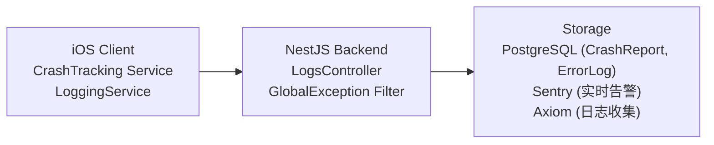

# Full-Stack Logging & Crash Collection System

> 日志与崩溃收集全栈方案

---

## 1. 当前实现状态

| 组件 | 状态 | 说明 |
|------|------|------|
| iOS CrashTrackingService | 已实现 | 崩溃捕获与上报 |
| iOS LoggingService | 已实现 | 客户端日志 |
| Backend LogsModule | 已实现 | 日志服务模块 |
| Backend TrackingModule | 已实现 | 事件追踪 |
| Database Models | 已实现 | CrashReport, ErrorLog, RuntimeLog |
| Global Exception Filter | 已实现 | 全局异常捕获 |
| Correlation ID Middleware | 已实现 | 请求链路追踪 |
| Sentry Integration | 已实现 | 错误监控告警 |

### 待实施 (可选)

| 组件 | 状态 |
|------|------|
| Prometheus metrics | 规划中 |
| Grafana dashboards | 规划中 |

---

## 2. 架构设计

---

## 3. 数据库模型

| 模型 | 用途 | 关键字段 |
|------|------|----------|
| CrashReport | 崩溃报告 | errorType, message, stackTrace, platform, appVersion, deviceModel |
| ErrorLog | 错误日志 | level, message, correlationId, endpoint, source |
| ApplicationLog | 应用日志 | level, message, correlationId, source, action |

---

## 4. 核心组件

### 4.1 Global Exception Filter

| 功能 | 说明 |
|------|------|
| 捕获范围 | 所有未处理异常 |
| 日志记录 | 4xx/5xx 错误写入 ErrorLog |
| 数据脱敏 | 自动过滤 password, token, secret, apiKey |
| 响应格式 | 包含 statusCode, message, correlationId, timestamp, path |

### 4.2 Correlation ID Middleware

| 功能 | 说明 |
|------|------|
| 来源 | 从 `X-Correlation-ID` header 读取或自动生成 |
| 传播 | 请求和响应都携带 correlationId |
| 用途 | 串联前后端日志，支持全链路追踪 |

---

## 5. 实现进度

### Phase 1 - Foundation (已完成)

- [x] Prisma models (CrashReport, ErrorLog, RuntimeLog)
- [x] Database migration
- [x] GlobalExceptionFilter
- [x] CorrelationIdMiddleware
- [x] LogsService database persistence
- [x] Crash stats endpoint
- [x] Error stats endpoint
- [x] 10-day cleanup cron job

### Phase 2 - Sentry Integration (已完成)

- [x] Sentry SDK (iOS + Backend)
- [x] Sentry in CrashTrackingService
- [x] Release tracking
- [x] GlobalExceptionFilter integration

### Phase 3 - Monitoring (规划中)

- [ ] Prometheus metrics
- [ ] Grafana dashboards

---

## 6. 告警规则

| 告警 | 条件 | 严重级别 |
|------|------|----------|
| 高崩溃率 | > 10 crashes/hour | Critical |
| 错误飙升 | 5x 正常错误率 | High |
| 新错误类型 | 首次出现 | Medium |
| API 延迟 | P99 > 2s | High |
| 数据库慢查询 | 查询 > 1s | Medium |

---

## 7. 日志保留策略

| 日志类型 | 保留时间 | 存储位置 |
|----------|----------|----------|
| Crash Reports | 180 天 | PostgreSQL |
| Error Logs | 30 天 | PostgreSQL |
| Application Logs | 7 天 | Axiom |
| Runtime Logs | 10 天 | PostgreSQL + Axiom |

---

## 8. 决策记录

### 日志策略：Sentry + Custom 双轨制

| 方面 | Sentry | Custom Backend |
|------|--------|----------------|
| 崩溃聚合 | 主要 | 备份 |
| 错误告警 | 主要 | - |
| 完整数据 | 有限 | 完整存储 |
| 历史分析 | 90 天 | 无限 |

### PII 策略

| 数据 | 是否采集 | 理由 |
|------|----------|------|
| User ID | 是 | 关联崩溃与用户 |
| Email | 否 | 非调试必需 |
| Device Model | 是 | 硬件相关 bug |
| OS Version | 是 | 系统相关 bug |
| App Version | 是 | 版本回归追踪 |

### 成本：$0/月

| 组件 | 方案 | 费用 |
|------|------|------|
| Crash Reporting | Sentry Free (5K errors/mo) | $0 |
| Log Storage | PostgreSQL (existing) + Axiom Free | $0 |
| Alerts | Sentry Email | $0 |

---

## 9. 关键追踪项

### Critical (必须记录)

| 类型 | 说明 |
|------|------|
| App crashes | 应用崩溃 |
| API errors (4xx, 5xx) | 接口错误 |
| Authentication failures | 认证失败 |
| Payment/subscription errors | 支付错误 |
| Book download failures | 下载失败 |

### 禁止记录

| 类型 | 说明 |
|------|------|
| Full book content | 书籍内容 |
| User reading speed | 阅读速度详情 |
| AI conversation history | AI 对话历史 |
| Payment card details | 支付卡信息 |

---

## 10. 相关文档

| 文档 | 说明 |
|------|------|
| [backend-logging.md](./backend-logging.md) | 后端运行日志规范 |
| [sentry.md](./sentry.md) | Sentry 配置 |
| [monitoring.md](./monitoring.md) | 监控总览 |

---

*最后更新: 2026-02-07*
