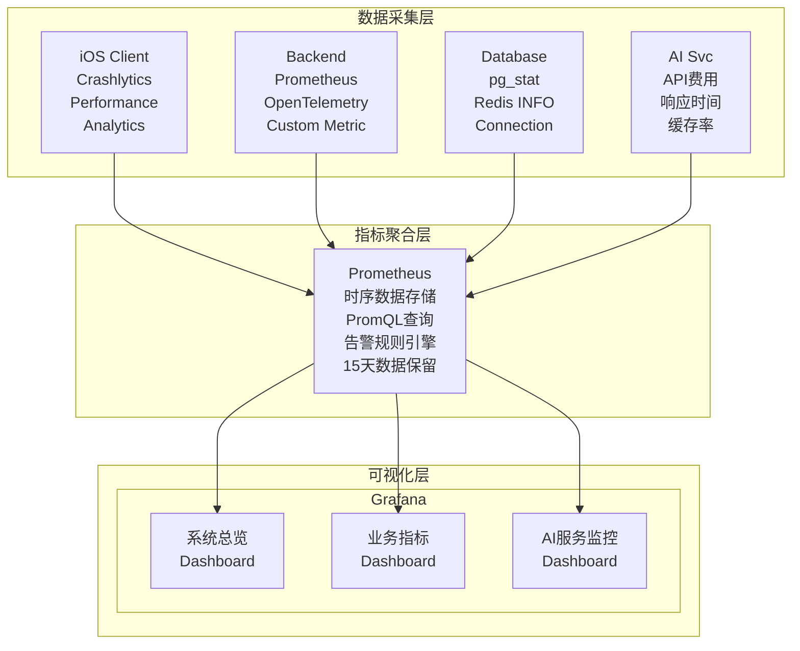

# 监控系统

### 20.1 监控架构



### 20.2 关键指标定义

```yaml
# Prometheus指标定义

# ==================== 系统指标 ====================

# API请求指标
- name: http_requests_total
  type: counter
  labels: [method, path, status_code]
  description: "HTTP请求总数"

- name: http_request_duration_seconds
  type: histogram
  labels: [method, path]
  buckets: [0.01, 0.05, 0.1, 0.25, 0.5, 1, 2.5, 5, 10]
  description: "HTTP请求延迟分布"

- name: http_request_size_bytes
  type: histogram
  labels: [method, path]
  description: "请求体大小分布"

# 数据库指标
- name: db_connections_active
  type: gauge
  description: "活跃数据库连接数"

- name: db_connections_idle
  type: gauge
  description: "空闲数据库连接数"

- name: db_query_duration_seconds
  type: histogram
  labels: [query_type, table]
  buckets: [0.001, 0.005, 0.01, 0.05, 0.1, 0.5, 1]
  description: "数据库查询延迟"

# Redis指标
- name: redis_operations_total
  type: counter
  labels: [operation, status]
  description: "Redis操作总数"

- name: redis_cache_hit_ratio
  type: gauge
  description: "缓存命中率"

# ==================== 业务指标 ====================

# 用户指标
- name: user_daily_active
  type: gauge
  description: "日活跃用户数"

- name: user_reading_duration_seconds
  type: histogram
  labels: [platform]
  buckets: [60, 300, 600, 1800, 3600, 7200]
  description: "用户阅读时长分布"

- name: user_pages_read_total
  type: counter
  labels: [platform, book_id]
  description: "阅读页数总计"

# 学习指标
- name: vocab_lookups_total
  type: counter
  labels: [source]  # ai, dictionary, cache
  description: "查词总次数"

- name: vocab_saved_total
  type: counter
  description: "保存生词总数"

- name: learning_sessions_total
  type: counter
  labels: [type]  # flashcard, quiz
  description: "学习会话总数"

# ==================== AI服务指标 ====================

- name: ai_requests_total
  type: counter
  labels: [model, feature, status]
  description: "AI请求总数"

- name: ai_request_duration_seconds
  type: histogram
  labels: [model, feature]
  buckets: [0.1, 0.5, 1, 2, 5, 10, 30]
  description: "AI请求延迟"

- name: ai_tokens_used_total
  type: counter
  labels: [model, type]  # type: prompt, completion
  description: "Token使用量"

- name: ai_cache_hit_ratio
  type: gauge
  labels: [feature]
  description: "AI响应缓存命中率"

- name: ai_fallback_total
  type: counter
  labels: [from_model, to_model, reason]
  description: "AI服务降级次数"

- name: ai_cost_usd
  type: counter
  labels: [model]
  description: "AI服务费用(美元)"

# ==================== 订阅指标 ====================

- name: subscription_active_total
  type: gauge
  labels: [plan_type]
  description: "活跃订阅数"

- name: subscription_new_total
  type: counter
  labels: [plan_type, source]
  description: "新订阅数"

- name: subscription_cancelled_total
  type: counter
  labels: [plan_type, reason]
  description: "取消订阅数"

- name: revenue_usd
  type: counter
  labels: [plan_type]
  description: "收入(美元)"
```

### 20.3 Dashboard设计

```
┌─────────────────────────────────────────────────────────────────────────┐
│                       System Overview Dashboard                          │
├─────────────────────────────────────────────────────────────────────────┤
│                                                                         │
│  ┌────────────────┐ ┌────────────────┐ ┌────────────────┐ ┌───────────┐ │
│  │ 请求/秒        │ │ 错误率         │ │ P99延迟       │ │ 活跃用户   │ │
│  │    1,234       │ │    0.12%       │ │   156ms       │ │   8,432    │ │
│  │    ↑ 12%       │ │    ↓ 0.02%    │ │   ↓ 12ms     │ │   ↑ 234    │ │
│  └────────────────┘ └────────────────┘ └────────────────┘ └───────────┘ │
│                                                                         │
│  请求量趋势 (24h)                               错误分布                │
│  ┌────────────────────────────────────┐  ┌─────────────────────────┐   │
│  │     ╱╲      ╱╲                     │  │  ■ 4xx: 45%            │   │
│  │    ╱  ╲    ╱  ╲    ╱╲             │  │  ■ 5xx: 12%            │   │
│  │ ──╱────╲──╱────╲──╱──╲─────────── │  │  ■ Timeout: 8%         │   │
│  │  ╱      ╲╱      ╲╱    ╲            │  │  ■ Network: 35%        │   │
│  │ ╱                      ╲           │  │                        │   │
│  │0h      6h      12h     18h    24h  │  └─────────────────────────┘   │
│  └────────────────────────────────────┘                                │
│                                                                         │
│  API延迟分布                          数据库连接池                      │
│  ┌────────────────────────────────────┐  ┌─────────────────────────┐   │
│  │        ████                        │  │  Active: 23/100        │   │
│  │       ██████                       │  │  ████████░░░░░░░░░░░░  │   │
│  │      ████████                      │  │                        │   │
│  │     ██████████                     │  │  Idle: 45              │   │
│  │   ████████████                     │  │  Waiting: 0            │   │
│  │ ████████████████                   │  │                        │   │
│  │  50ms 100ms 200ms 500ms 1s 2s     │  └─────────────────────────┘   │
│  └────────────────────────────────────┘                                │
│                                                                         │
└─────────────────────────────────────────────────────────────────────────┘

┌─────────────────────────────────────────────────────────────────────────┐
│                       AI Service Dashboard                               │
├─────────────────────────────────────────────────────────────────────────┤
│                                                                         │
│  ┌────────────────┐ ┌────────────────┐ ┌────────────────┐ ┌───────────┐ │
│  │ AI请求/分      │ │ 缓存命中率     │ │ 平均延迟       │ │ 今日费用   │ │
│  │     456        │ │    78.5%       │ │   1.2s        │ │  $12.34    │ │
│  │    ↑ 23       │ │    ↑ 2.3%     │ │   ↓ 0.3s     │ │  ↓ $1.20   │ │
│  └────────────────┘ └────────────────┘ └────────────────┘ └───────────┘ │
│                                                                         │
│  模型使用分布                          Token消耗趋势                    │
│  ┌────────────────────────────────────┐  ┌─────────────────────────┐   │
│  │                                    │  │     ╱──────            │   │
│  │  ■ DeepSeek: 65%                  │  │    ╱                    │   │
│  │  ■ GPT-4o-mini: 25%               │  │   ╱                     │   │
│  │  ■ Claude: 8%                     │  │  ╱                      │   │
│  │  ■ Local Dict: 2%                 │  │ ╱                       │   │
│  │                                    │  │╱________________________│   │
│  └────────────────────────────────────┘  └─────────────────────────┘   │
│                                                                         │
│  功能使用热力图                                                         │
│  ┌──────────────────────────────────────────────────────────────────┐  │
│  │        查词    翻译    语法    发音    摘要    对话                │  │
│  │  00:00  ██     █      █      █      █      █                     │  │
│  │  06:00  ███    ██     █      █      █      █                     │  │
│  │  12:00  █████  ████   ███    ██     ██     ██                    │  │
│  │  18:00  ██████ █████  ████   ███    ███    ████                  │  │
│  │  23:00  ████   ███    ██     ██     ██     ███                   │  │
│  │                                                                   │  │
│  │  ░ 低   ▒ 中等   ▓ 高   █ 非常高                                  │  │
│  └──────────────────────────────────────────────────────────────────┘  │
│                                                                         │
└─────────────────────────────────────────────────────────────────────────┘
```

### 20.4 告警配置

```yaml
# Prometheus告警规则
groups:
  - name: readmigo-critical
    rules:
      # 高错误率告警
      - alert: HighErrorRate
        expr: |
          sum(rate(http_requests_total{status_code=~"5.."}[5m]))
          / sum(rate(http_requests_total[5m])) > 0.05
        for: 2m
        labels:
          severity: critical
        annotations:
          summary: "API错误率过高"
          description: "错误率 {{ $value | humanizePercentage }} 超过5%阈值"
          runbook: "https://wiki.readmigo.app/runbooks/high-error-rate"

      # API响应慢
      - alert: HighLatency
        expr: |
          histogram_quantile(0.99, sum(rate(http_request_duration_seconds_bucket[5m])) by (le)) > 3
        for: 5m
        labels:
          severity: critical
        annotations:
          summary: "API延迟过高"
          description: "P99延迟 {{ $value | humanizeDuration }} 超过3秒"

      # 数据库连接池耗尽
      - alert: DatabaseConnectionPoolExhausted
        expr: db_connections_active / db_connections_max > 0.9
        for: 1m
        labels:
          severity: critical
        annotations:
          summary: "数据库连接池即将耗尽"
          description: "连接池使用率 {{ $value | humanizePercentage }}"

  - name: readmigo-ai-service
    rules:
      # AI服务降级
      - alert: AIServiceDegraded
        expr: sum(rate(ai_fallback_total[5m])) > 0.5
        for: 2m
        labels:
          severity: warning
        annotations:
          summary: "AI服务频繁降级"
          description: "降级频率 {{ $value }}/秒"

      # AI费用异常
      - alert: AIServiceCostSpike
        expr: |
          sum(increase(ai_cost_usd[1h])) >
          avg_over_time(sum(increase(ai_cost_usd[1h]))[7d:1h]) * 3
        for: 30m
        labels:
          severity: warning
        annotations:
          summary: "AI服务费用异常飙升"
          description: "当前小时费用是过去7天平均的3倍以上"

      # AI响应慢
      - alert: AISlowResponse
        expr: |
          histogram_quantile(0.95, sum(rate(ai_request_duration_seconds_bucket[5m])) by (le, model)) > 10
        for: 5m
        labels:
          severity: warning
        annotations:
          summary: "AI响应延迟过高"
          description: "模型 {{ $labels.model }} P95延迟超过10秒"

  - name: readmigo-business
    rules:
      # 用户活跃度下降
      - alert: UserActivityDrop
        expr: |
          user_daily_active <
          avg_over_time(user_daily_active[7d]) * 0.7
        for: 1h
        labels:
          severity: warning
        annotations:
          summary: "用户活跃度显著下降"
          description: "当前DAU比过去7天平均下降超过30%"

      # 订阅转化率下降
      - alert: SubscriptionConversionDrop
        expr: |
          rate(subscription_new_total[1d]) / rate(user_registration_total[1d]) < 0.01
        for: 24h
        labels:
          severity: info
        annotations:
          summary: "订阅转化率偏低"
          description: "24小时转化率低于1%"

# 告警通知配置
alertmanager_config:
  route:
    receiver: 'default-receiver'
    routes:
      - match:
          severity: critical
        receiver: 'pagerduty-critical'
        continue: true
      - match:
          severity: warning
        receiver: 'slack-warnings'
      - match:
          severity: info
        receiver: 'email-digest'

  receivers:
    - name: 'pagerduty-critical'
      pagerduty_configs:
        - service_key: '<pagerduty-key>'
          send_resolved: true

    - name: 'slack-warnings'
      slack_configs:
        - api_url: '<slack-webhook-url>'
          channel: '#readmigo-alerts'
          send_resolved: true
          title: '{{ .Status | toUpper }}: {{ .CommonLabels.alertname }}'
          text: '{{ .CommonAnnotations.description }}'

    - name: 'email-digest'
      email_configs:
        - to: 'alerts@readmigo.app'
          send_resolved: true
```

---

