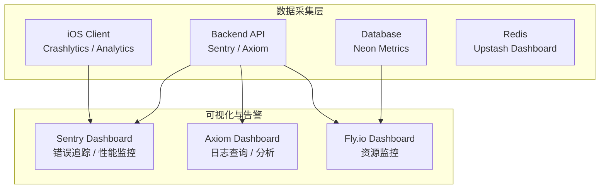

# 监控系统

> Readmigo 监控架构与告警设计

---

## 监控架构

---

## 核心监控指标

| 类别 | 指标 | 工具 |
|------|------|------|
| 错误追踪 | 错误率、错误分布、影响用户数 | Sentry |
| 性能监控 | API 响应时间 (P50/P95/P99) | Sentry / 内置性能拦截器 |
| 日志 | 结构化日志、请求日志 | Axiom |
| 资源 | CPU、内存、网络 | Fly.io Dashboard |
| 数据库 | 连接数、查询延迟 | Neon Dashboard |
| 缓存 | 命中率、内存使用 | Upstash Dashboard |

---

## 告警规则

| 级别 | 触发条件 | 通知方式 |
|------|----------|----------|
| P0 | 服务不可用 > 1 分钟 | 立即通知 |
| P1 | 错误率 > 5% 持续 5 分钟 | 通知 |
| P2 | API P95 延迟 > 3s | 告警 |
| P3 | AI 成本超日预算 | 告警 |

---

## 当前实现状态

| 组件 | 状态 | 说明 |
|------|------|------|
| Sentry 错误追踪 | 已集成 | 后端 + iOS |
| Axiom 日志收集 | 已集成 | 后端结构化日志 |
| API 性能拦截器 | 已实现 | 内置 Metrics 聚合 + 智能采样 |
| Fly.io 资源监控 | 已启用 | 自带 Dashboard |
| Prometheus/Grafana | 未实施 | 规划中 |

---

*最后更新: 2026-02-07*
